162. Find Peak Element

A peak element is an element that is greater than its neighbors.

Given an input array `nums`, where `nums[i] ≠ nums[i+1]`, find a peak element and return its index.

The array may contain multiple peaks, in that case return the index to any one of the peaks is fine.

You may imagine that `nums[-1] = nums[n] = -∞`.

**Example 1:**
```
Input: nums = [1,2,3,1]
Output: 2
Explanation: 3 is a peak element and your function should return the index number 2.
```

**Example 2:**
```
Input: nums = [1,2,1,3,5,6,4]
Output: 1 or 5 
Explanation: Your function can return either index number 1 where the peak element is 2, 
             or index number 5 where the peak element is 6.
```
**Note:**

Your solution should be in logarithmic complexity.

# Solution
---
## Approach 1: Linear Scan
In this approach, we make use of the fact that two consecutive numbers $nums[j]$ and $nums[j + 1]$ are never equal. Thus, we can traverse over the $nums$ array starting from the beginning. Whenever, we find a number $nums[i]$, we only need to check if it is larger than the next number $nums[i+1]$ for determining if $nums[i]$ is the peak element. The reasoning behind this can be understood by taking the following three cases which cover every case into which any problem can be divided.

Case 1. All the numbers appear in a descending order. In this case, the first element corresponds to the peak element. We start off by checking if the current element is larger than the next one. The first element satisfies this criteria, and is hence identified as the peak correctly. In this case, we didn't reach a point where we needed to compare $nums[i]$ with $nums[i-1]$ also, to determine if it is the peak element or not.


Case 2. All the elements appear in ascending order. In this case, we keep on comparing $nums[i]$ with $nums[i+1]$ to determine if $nums[i]$ is the peak element or not. None of the elements satisfy this criteria, indicating that we are currently on a rising slope and not on a peak. Thus, at the end, we need to return the last element as the peak element, which turns out to be correct. In this case also, we need not compare $nums[i]$ with $nums[i-1]$, since being on the rising slope is a sufficient condition to ensure that $nums[i]$ isn't the peak element.


Case 3. The peak appears somewhere in the middle. In this case, when we are traversing on the rising edge, as in Case 2, none of the elements will satisfy $nums[i] > nums[i + 1]$. We need not compare $nums[i]$ with $nums[i-1]$ on the rising slope as discussed above. When we finally reach the peak element, the condition $nums[i] > nums[i + 1]$ is satisfied. We again, need not compare $nums[i]$ with $nums[i-1]$. This is because, we could reach $nums[i]$ as the current element only when the check $nums[i] > nums[i + 1]$ failed for the $previous((i-1)^{th}$ element, indicating that $nums[i-1] < nums[i]$. Thus, we are able to identify the peak element correctly in this case as well.


```java
public class Solution {
    public int findPeakElement(int[] nums) {
        for (int i = 0; i < nums.length - 1; i++) {
            if (nums[i] > nums[i + 1])
                return i;
        }
        return nums.length - 1;
    }
}
```

**Complexity Analysis**

* Time complexity : $O(n)$. We traverse the $nums$ array of size $n$ once only.

* Space complexity : $O(1)$. Constant extra space is used.

## Approach 2: Recursive Binary Search
**Algorithm**

We can view any given sequence in $nums$ array as alternating ascending and descending sequences. By making use of this, and the fact that we can return any peak as the result, we can make use of Binary Search to find the required peak element.

In case of simple Binary Search, we work on a sorted sequence of numbers and try to find out the required number by reducing the search space at every step. In this case, we use a modification of this simple Binary Search to our advantage. We start off by finding the middle element, $mid$ from the given $nums$ array. If this element happens to be lying in a descending sequence of numbers. or a local falling slope(found by comparing $nums[i]$ to its right neighbour), it means that the peak will always lie towards the left of this element. Thus, we reduce the search space to the left of midmid(including itself) and perform the same process on left subarray.

If the middle element, $mid$ lies in an ascending sequence of numbers, or a rising slope(found by comparing $nums[i]$ to its right neighbour), it obviously implies that the peak lies towards the right of this element. Thus, we reduce the search space to the right of $mid$ and perform the same process on the right subarray.

In this way, we keep on reducing the search space till we eventually reach a state where only one element is remaining in the search space. This single element is the peak element.

To see how it works, let's consider the three cases discussed above again.

Case 1. In this case, we firstly find $3$ as the middle element. Since it lies on a falling slope, we reduce the search space to [1, 2, 3]. For this subarray, $2$ happens to be the middle element, which again lies on a falling slope, reducing the search space to [1, 2]. Now, $1$ acts as the middle element and it lies on a falling slope, reducing the search space to [1] only. Thus, $1$ is returned as the peak correctly.

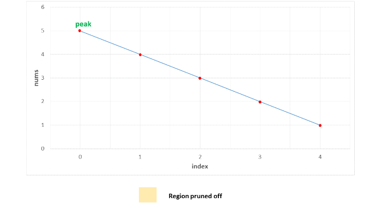
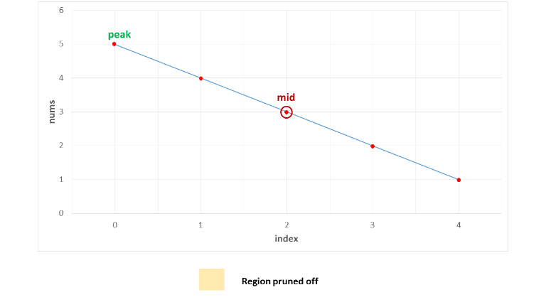
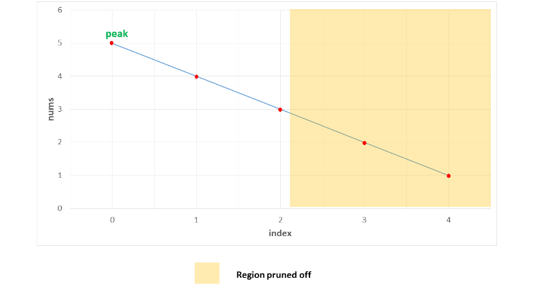
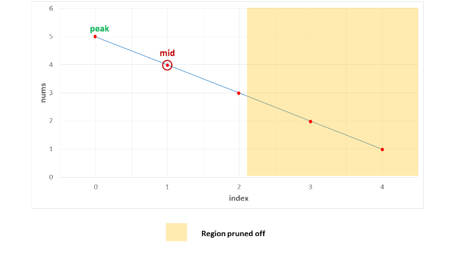
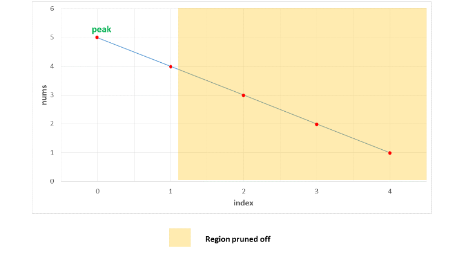
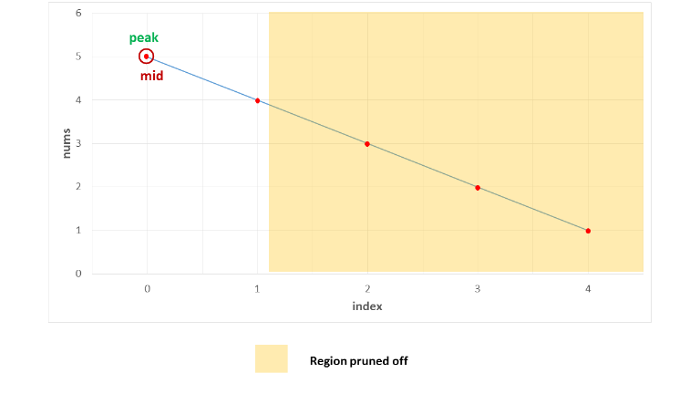
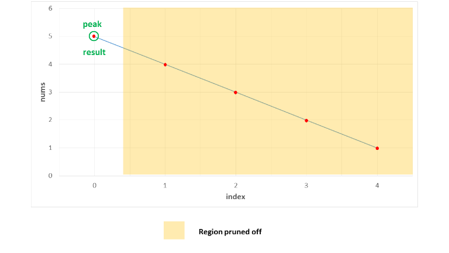

Case 2. In this case, we firstly find $3$ as the middle element. Since it lies on a rising slope, we reduce the search space to [4, 5]. Now, $4$ acts as the middle element for this subarray and it lies on a rising slope, reducing the search space to [5] only. Thus, $5$ is returned as the peak correctly.

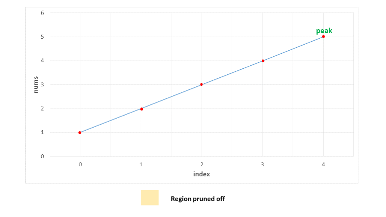
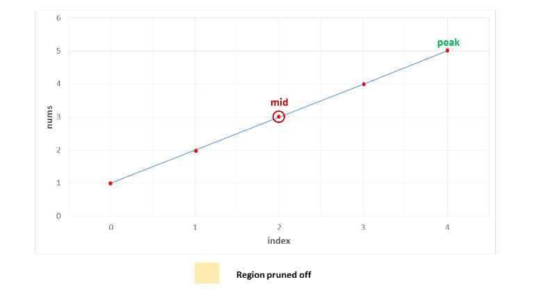
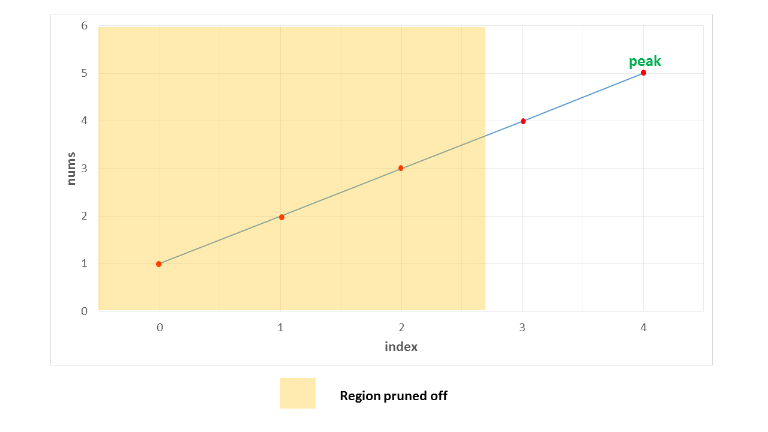

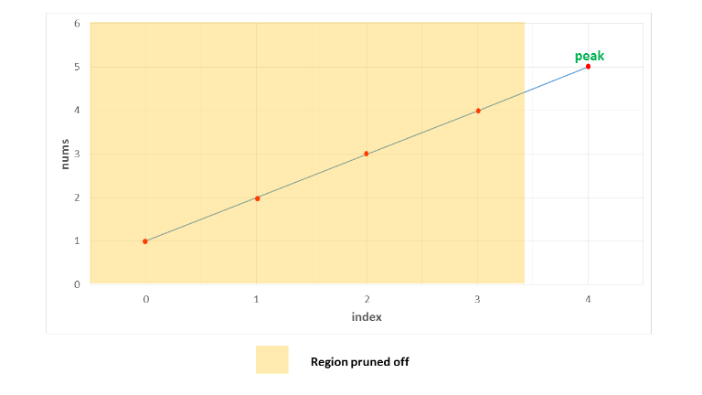
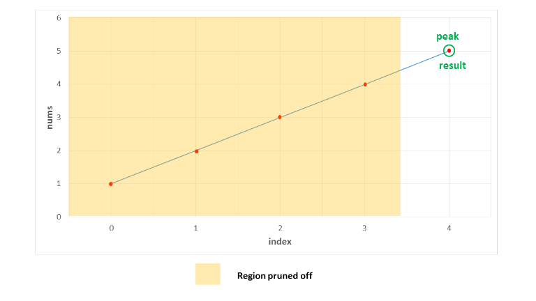

Case 3. In this case, the peak lies somewhere in the middle. The first middle element is $4$. It lies on a rising slope, indicating that the peak lies towards its right. Thus, the search space is reduced to [5, 1]. Now, $5$ happens to be the on a falling slope(relative to its right neighbour), reducing the search space to [5] only. Thus, $5$ is identified as the peak element correctly.

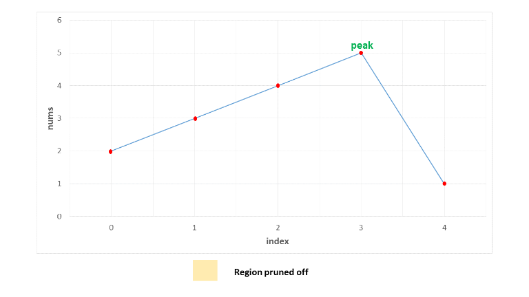
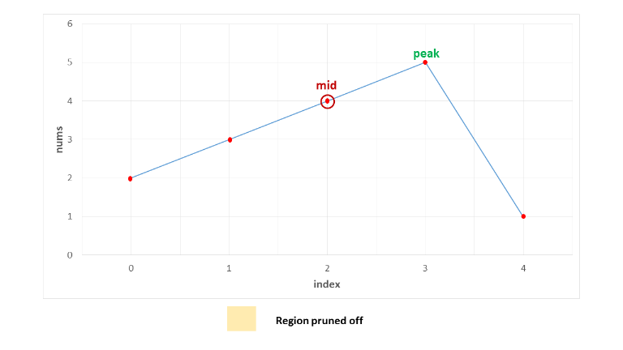
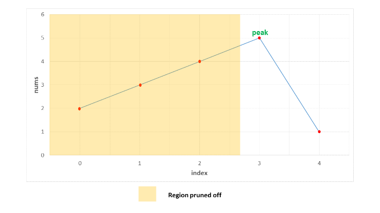
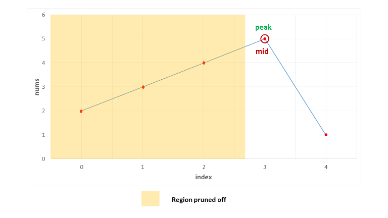
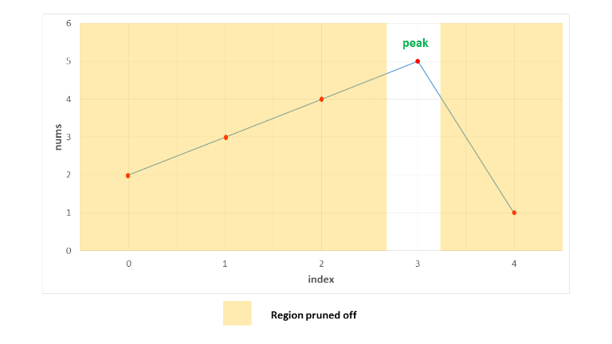
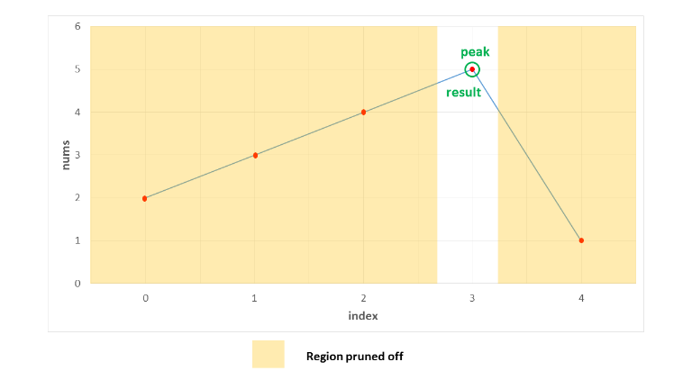

```java
public class Solution {
    public int findPeakElement(int[] nums) {
        return search(nums, 0, nums.length - 1);
    }
    public int search(int[] nums, int l, int r) {
        if (l == r)
            return l;
        int mid = (l + r) / 2;
        if (nums[mid] > nums[mid + 1])
            return search(nums, l, mid);
        return search(nums, mid + 1, r);
    }
}
```

**Complexity Analysis**

* Time complexity : $O\big(log_2(n)\big)$. We reduce the search space in half at every step. Thus, the total search space will be consumed in $log_2(n)$ steps. Here, $n$ refers to the size of $nums$ array.

* Space complexity : $O\big(log_2(n)\big)$. We reduce the search space in half at every step. Thus, the total search space will be consumed in $log_2(n)$ steps. Thus, the depth of recursion tree will go upto $log_2(n)$.

## Approach 3: Iterative Binary Search
**Algorithm**

The binary search discussed in the previous approach used a recursive method. We can do the same process in an iterative fashion also. This is done in the current approach.

```java
public class Solution {
    public int findPeakElement(int[] nums) {
        int l = 0, r = nums.length - 1;
        while (l < r) {
            int mid = (l + r) / 2;
            if (nums[mid] > nums[mid + 1])
                r = mid;
            else
                l = mid + 1;
        }
        return l;
    }
}
```

**Complexity Analysis**

* Time complexity : $O\big(log_2(n)\big). We reduce the search space in half at every step. Thus, the total search space will be consumed in $log_2(n) steps. Here, $n$ refers to the size of $nums$ array.

* Space complexity : $O(1)$. Constant extra space is used.

# Submissions
---
**Solution 1: (recursive)**
```
Runtime: 40 ms
Memory Usage: 13.1 MB
```
```python
class Solution:
    def findPeakElement(self, nums: List[int]) -> int:
        def search(l, r):
            if l == r:
                return l;
            mid = l + (r - l) // 2
            if nums[mid] > nums[mid+1]:
                return search(l, mid)
            return search(mid+1, r)

        return search(0, len(nums)-1)
```

**Solution 1: (iterative)**
```
Runtime: 44 ms
Memory Usage: 12.7 MB
```
```python
class Solution:
    def findPeakElement(self, nums: List[int]) -> int:
        l = 0
        r = len(nums) - 1
        
        while l < r:
            mid = l + (r - l) // 2
            if nums[mid] > nums[mid + 1]:
                r = mid
            else:
                l = mid + 1
    
        return l
```

**Solution 2: (Binary Search, search increasing upper bound)**
```
Runtime: 4 ms
Memory Usage: 5.8 MB
```
```c
int findPeakElement(int* nums, int numsSize){
    int left = 0, right = numsSize-1, mid;
    while (left < right) {
        mid = (left + right) / 2;
        if (nums[mid] > nums[mid+1])
            right = mid;
        else
            left = mid+1;
    }
    return left;
}
```

**Solution 3: (Binary Search)**

            0 1 2 3
    nums = [1,2,3,1]
            l m   r
                lm^r

            0 1 2 3 4 5 6
    nums = [1,2,1,3,5,6,4]
            l     m     r
                    l m r

```
Runtime: 0 ms, Beats 100.00%
Memory: 12.60 MB, Beats 4.38%
```
```c++
class Solution {
public:
    int findPeakElement(vector<int>& nums) {
        int n = nums.size(), left = 0, right = n-1, mid;
        while (left <= right) {
            mid = left + (right - left)/2;
            if ((mid == 0 || nums[mid-1] < nums[mid]) && (mid == n-1 || nums[mid+1] < nums[mid])) {
                return mid;
            } else if (mid && nums[mid-1] > nums[mid]) {
                right = mid - 1;
            } else {
                left = mid + 1;
            }
        }
        return -1;
    }
};
```
