17. Letter Combinations of a Phone Number

Given a string containing digits from 2-9 inclusive, return all possible letter combinations that the number could represent.

A mapping of digit to letters (just like on the telephone buttons) is given below. Note that 1 does not map to any letters.


**Example:**
```
Input: "23"
Output: ["ad", "ae", "af", "bd", "be", "bf", "cd", "ce", "cf"].
```

**Note:**

* Although the above answer is in lexicographical order, your answer could be in any order you want.

# Solution
---
## Approach 1: Backtracking
Backtracking is an algorithm for finding all solutions by exploring all potential candidates. If the solution candidate turns to be not a solution (or at least not the last one), backtracking algorithm discards it by making some changes on the previous step, i.e. backtracks and then try again.

Here is a backtrack function `backtrack(combination, next_digits)` which takes as arguments an ongoing letter combination and the next digits to check.

* If there is no more digits to check that means that the current combination is done.
* If there are still digits to check :
    * Iterate over the letters mapping the next available digit.
        * Append the current letter to the current combination `combination = combination + letter`.
        * Proceed to check next digits : `backtrack(combination + letter, next_digits[1:])`.

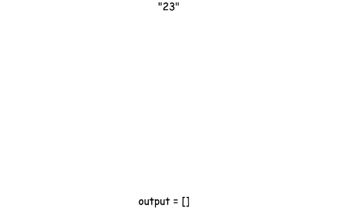
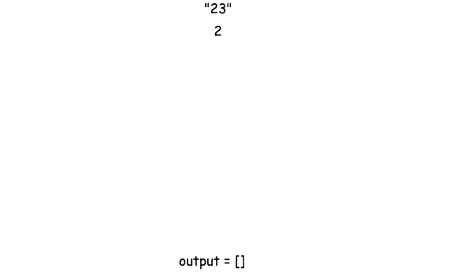
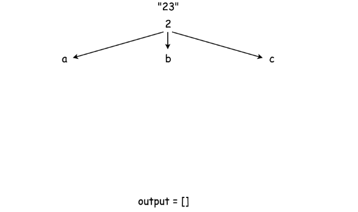
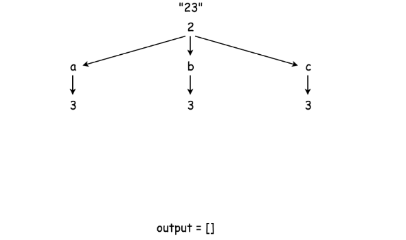
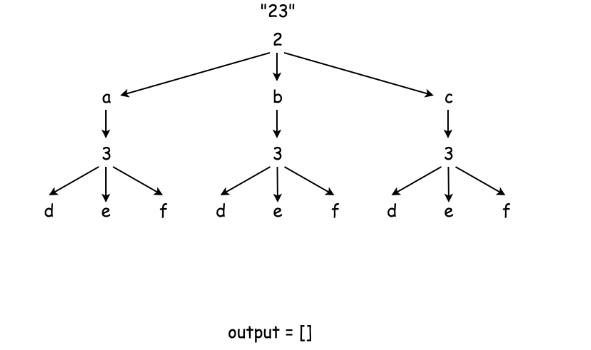
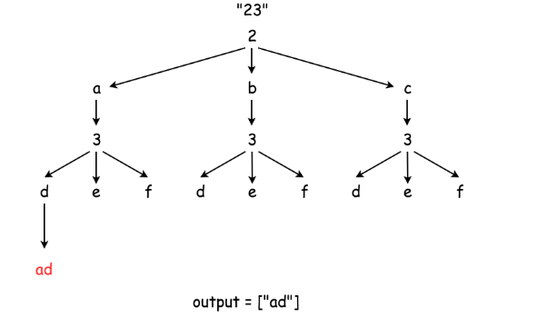
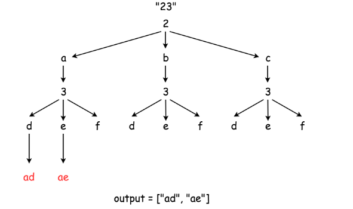
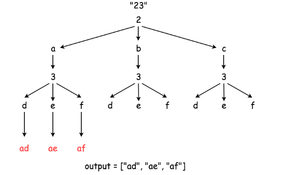
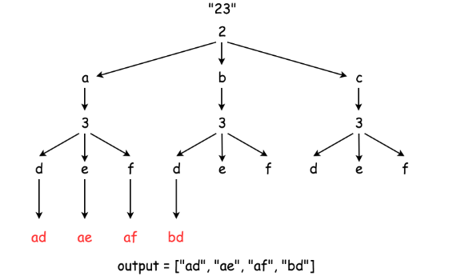
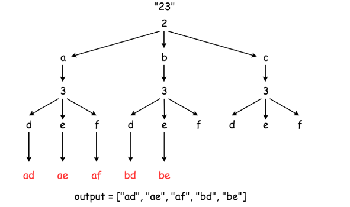
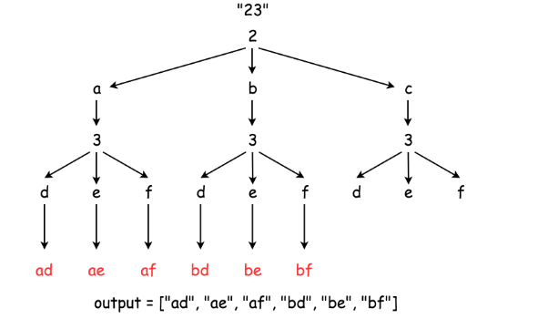
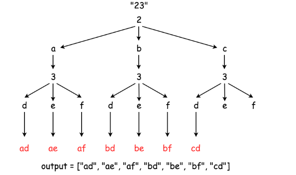
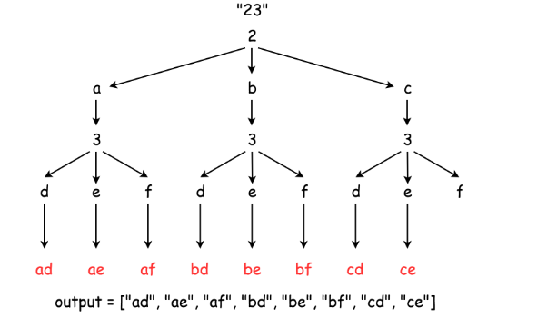
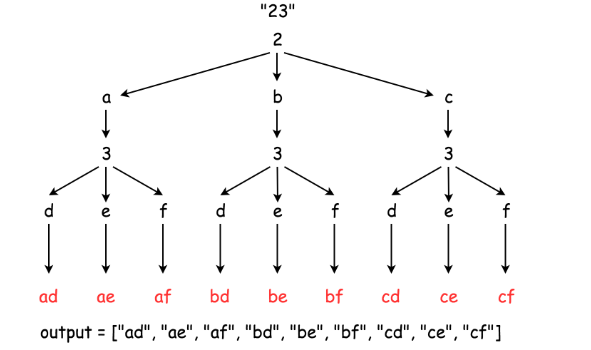

```python
class Solution:
    def letterCombinations(self, digits):
        """
        :type digits: str
        :rtype: List[str]
        """
        phone = {'2': ['a', 'b', 'c'],
                 '3': ['d', 'e', 'f'],
                 '4': ['g', 'h', 'i'],
                 '5': ['j', 'k', 'l'],
                 '6': ['m', 'n', 'o'],
                 '7': ['p', 'q', 'r', 's'],
                 '8': ['t', 'u', 'v'],
                 '9': ['w', 'x', 'y', 'z']}
                
        def backtrack(combination, next_digits):
            # if there is no more digits to check
            if len(next_digits) == 0:
                # the combination is done
                output.append(combination)
            # if there are still digits to check
            else:
                # iterate over all letters which map 
                # the next available digit
                for letter in phone[next_digits[0]]:
                    # append the current letter to the combination
                    # and proceed to the next digits
                    backtrack(combination + letter, next_digits[1:])
                    
        output = []
        if digits:
            backtrack("", digits)
        return output
```

**Complexity Analysis**

* Time complexity : $\mathcal{O}(3^N \times 4^M)$ where `N` is the number of digits in the input that maps to 3 letters (e.g. `2, 3, 4, 5, 6, 8`) and `M` is the number of digits in the input that maps to 4 letters (e.g. `7, 9`), and `N+M` is the total number digits in the input.

* Space complexity : $\mathcal{O}(3^N \times 4^M)$ since one has to keep $3^N \times 4^M$ solutions.

# Submissions
---
**Solution 1:**
```
Runtime: 28 ms
Memory Usage: 12.8 MB
```
```python
class Solution:
    def letterCombinations(self, digits):
        """
        :type digits: str
        :rtype: List[str]
        """
class Solution:
    def letterCombinations(self, digits: str) -> List[str]:
        phone = {'2': ['a', 'b', 'c'],
                 '3': ['d', 'e', 'f'],
                 '4': ['g', 'h', 'i'],
                 '5': ['j', 'k', 'l'],
                 '6': ['m', 'n', 'o'],
                 '7': ['p', 'q', 'r', 's'],
                 '8': ['t', 'u', 'v'],
                 '9': ['w', 'x', 'y', 'z']}

        def backtrack(combination, next_digits):
            # if there is no more digits to check
            if len(next_digits) == 0:
                # the combination is done
                output.append(combination)
            # if there are still digits to check
            else:
                # iterate over all letters which map 
                # the next available digit
                for letter in phone[next_digits[0]]:
                    # append the current letter to the combination
                    # and proceed to the next digits
                    backtrack(combination + letter, next_digits[1:])

        output = []
        if digits:
            backtrack("", digits)
        return output
```