173. Binary Search Tree Iterator

Implement an iterator over a binary search tree (BST). Your iterator will be initialized with the root node of a BST.

Calling `next()` will return the next smallest number in the BST.

 

**Example:**


```
BSTIterator iterator = new BSTIterator(root);
iterator.next();    // return 3
iterator.next();    // return 7
iterator.hasNext(); // return true
iterator.next();    // return 9
iterator.hasNext(); // return true
iterator.next();    // return 15
iterator.hasNext(); // return true
iterator.next();    // return 20
iterator.hasNext(); // return false
```

**Note:**

* `next()` and `hasNext()` should run in average O(1) time and uses O(h) memory, where `h` is the height of the tree.
* You may assume that `next()` call will always be valid, that is, there will be at least a next smallest number in the BST when `next()` is called.

# Solution
---
Before looking at the solutions for this problem, let's try and boil down what the problem statement essentially asks us to do. So, we need to implement an iterator class with two functions namely `next()` and `hasNext()`. The `hasNext()` function returns a boolean value indicating whether there are any more elements left in the binary search tree or not. The `next()` function returns the next smallest element in the BST. Therefore, the first time we call the `next()` function, it should return the smallest element in the BST and likewise, when we call `next()` for the very last time, it should return the largest element in the BST.

You might be wondering as to what could be the use case for an iterator. Essentially, an iterator can be used to iterate over any container object. For our purpose, the container object is a binary search tree. If such an iterator is defined, then the traversal logic can be abstracted out and we can simply make use of the iterator to process the elements in a certain order.
```
1. new_iterator = BSTIterator(root);
2. while (new_iterator.hasNext())
3.     process(new_iterator.next());
```
Now that we know the motivation behind designing a good iterator class for a data structure, let's take a look at another interesting aspect about the iterator that we have to build for this problem. Usually, an iterator simply goes over each of the elements of the container one by one. For the BST, we want the iterator to return elements in an ascending order.

>An important property of the binary search tree is that the inorder traversal of a BST gives us the elements in a sorted order. Thus, the inorder traversal will be the core of the solutions that we will look ahead.

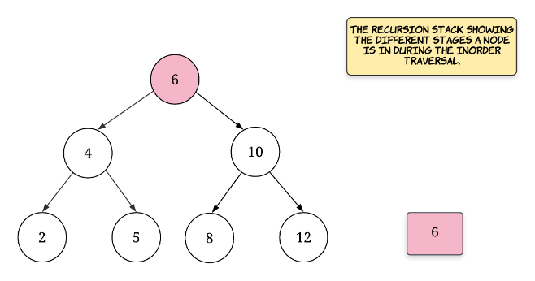
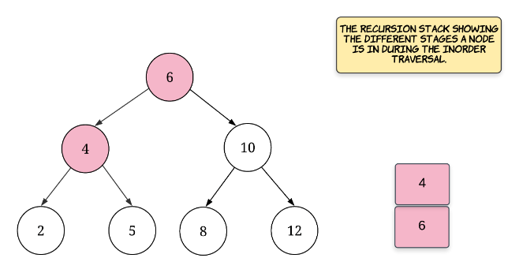

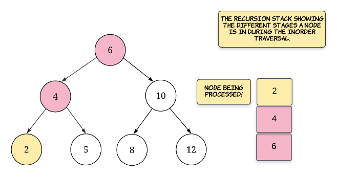
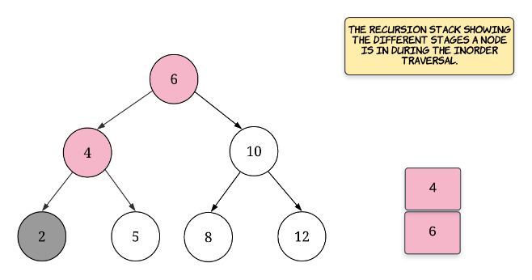
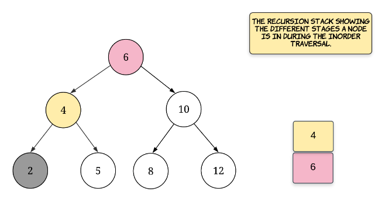
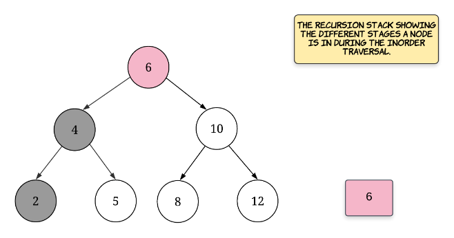
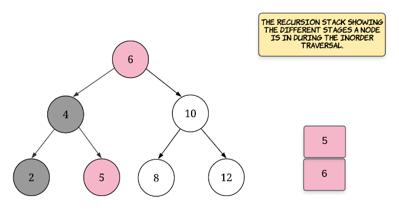
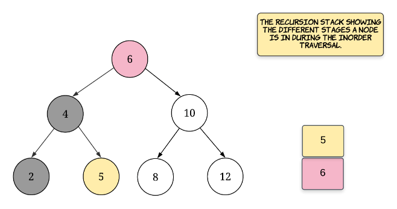
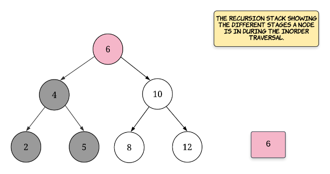
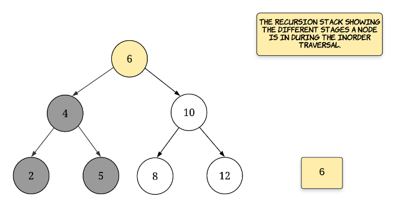
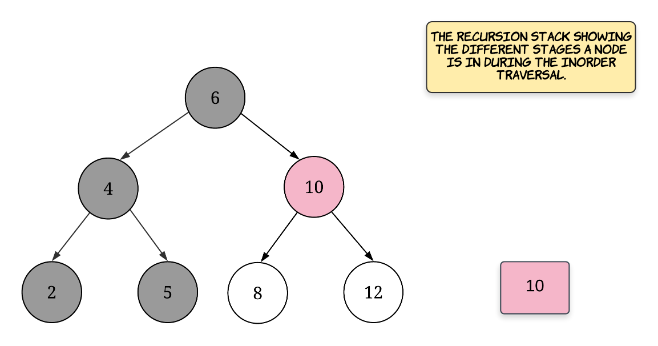

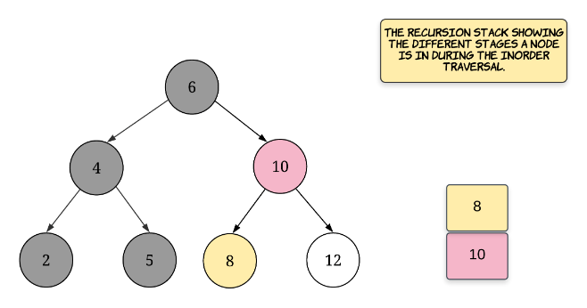
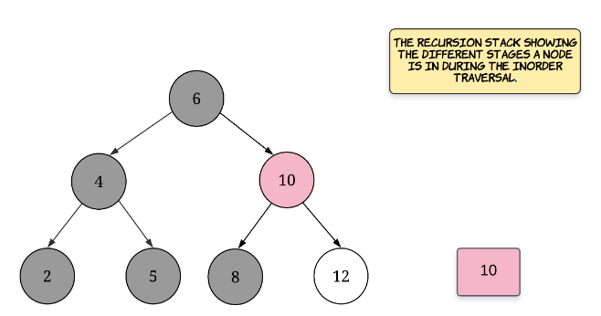
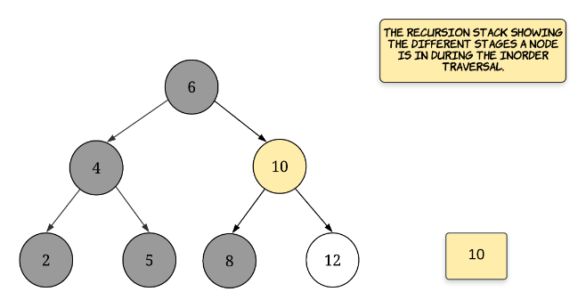
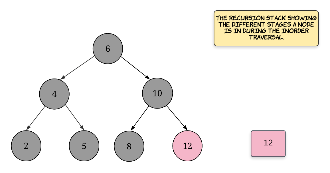

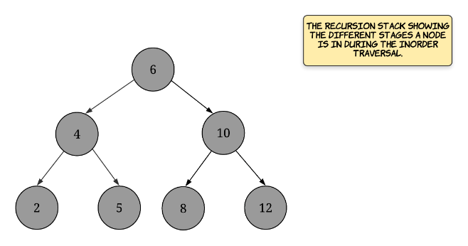

## Approach 1: Flattening the BST
**Intuition**

In computer programming, an iterator is an object that enables a programmer to traverse a container, particularly lists. This is the Wikipedia definition of an iterator. Naturally, the easiest way to implement an iterator would be on an array like container interface. So, if we had an array, all we would need is a pointer or an index and we could easily implement the two required functions `next()` and `hasNext()`.

Hence, the first approach that we will look at is based on this idea. We will be using additional memory and we will flatten the binary search tree into an array. Since we need the elements to be in a sorted order, we will do an inorder traversal over the tree and store the elements in a new array and then build the iterator functions using this new array.

**Algorithm**

1. Initialize an empty array that will contain the nodes of the binary search tree in the sorted order.
1. We traverse the binary search tree in the inorder fashion and for each node that we process, we add it to our array `nodes`. Note that before processing a node, its left subtree has to be processed (or recursed upon) and after processing a node, its right subtree has to be recursed upon.
1. Once we have all the nodes in an array, we simply need a pointer or an index in that array to implement the two functions `next` and `hasNext`. Whenever there's a call to `hasNext`, we simply check if the index has reached the end of the array or not. For the call to next function, we simply return the element pointed by the index. Also, after a the `next` function call is made, we have to move the index one step forward to simulate the progress of our iterator.

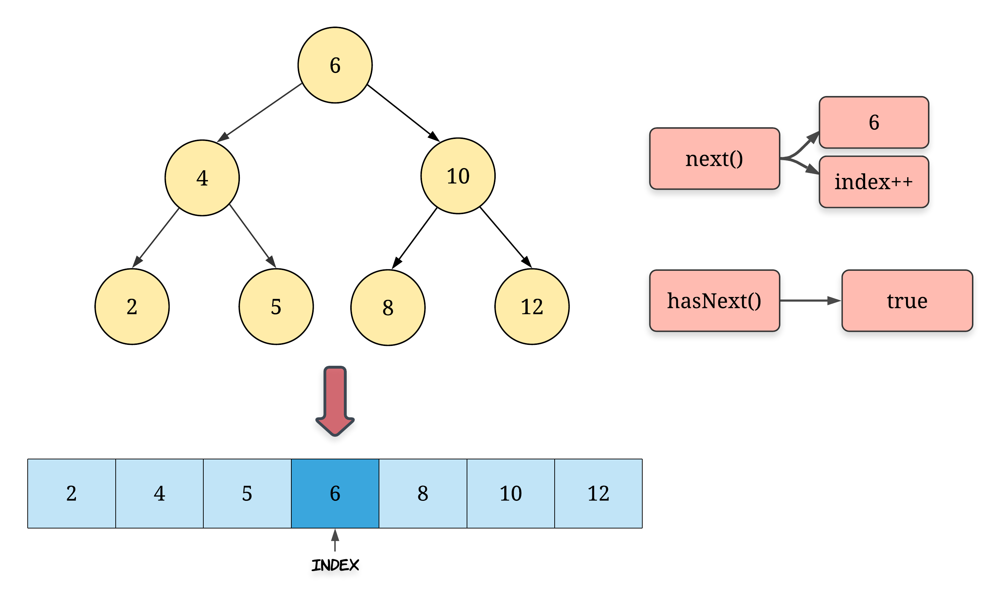

```python
# Definition for a binary tree node.
# class TreeNode:
#     def __init__(self, x):
#         self.val = x
#         self.left = None
#         self.right = None

class BSTIterator:

    def __init__(self, root: TreeNode):
        
        # Array containing all the nodes in the sorted order
        self.nodes_sorted = []
        
        # Pointer to the next smallest element in the BST
        self.index = -1
        
        # Call to flatten the input binary search tree
        self._inorder(root)
        
    def _inorder(self, root):
        if not root:
            return
        self._inorder(root.left)
        self.nodes_sorted.append(root.val)
        self._inorder(root.right)

    def next(self) -> int:
        """
        @return the next smallest number
        """
        self.index += 1
        return self.nodes_sorted[self.index]

    def hasNext(self) -> bool:
        """
        @return whether we have a next smallest number
        """
        return self.index + 1 < len(self.nodes_sorted)
```

**Complexity analysis**

* Time complexity : $O(N)$ is the time taken by the constructor for the iterator. The problem statement only asks us to analyze the complexity of the two functions, however, when implementing a class, it's important to also note the time it takes to initialize a new object of the class and in this case it would be linear in terms of the number of nodes in the BST. In addition to the space occupied by the new array we initialized, the recursion stack for the inorder traversal also occupies space but that is limited to $O(h)$ where $h$ is the height of the tree.

    * `next()` would take $O(1)$
    * `hasNext()` would take $O(1)$

* Space complexity : $O(N)$ since we create a new array to contain all the nodes of the BST. This doesn't comply with the requirement specified in the problem statement that the maximum space complexity of either of the functions should be $O(h)$ where $h$ is the height of the tree and for a well balanced BST, the height is usually $logN$. So, we get great time complexities but we had to compromise on the space. Note that the new array is used for both the function calls and hence the space complexity for both the calls is $O(N)$.

## Approach 2: Controlled Recursion
**Intuition**

The approach we saw earlier uses space which is linear in the number of nodes in the binary search tree. However, the reason we had to resort to such an approach was because we can control the iteration over the array. We can't really pause a recursion in between and then start it off sometime later.

>However, if we could simulate a controlled recursion for an inorder traversal, we wouldn't really need to use any additional space other than the space used by the stack for our recursion simulation.

So, this approach essentially uses a custom stack to simulate the inorder traversal i.e. we will be taking an iterative approach to inorder traversal rather than going with the recursive approach and in doing so, we will be able to easily implement the two function calls without any other additional space.

Things however, do get a bit complicated as far as the time complexity of the two operations is concerned and that is where we will spend a little bit of time to understand if this approach complies with all the asymptotic complexity requirements of the question. Let's move on to the algorithm for now to look at this idea more concretely.

**Algorithm**

1. Initialize an empty stack `S` which will be used to simulate the inorder traversal for our binary search tree. Note that we will be following the same approach for inorder traversal as before except that now we will be using our own stack rather than the system stack. Since we are using a custom data structure, we can pause and resume the recursion at will.

1. Let's also consider a helper function that we will be calling again and again in the implementation. This function, called `_inorder_left` will essentially add all the nodes in the leftmost branch of the tree rooted at the given node root to the stack and it will keep on doing so until there is no left child of the root node. Something like the following code:

```python
def inorder_left(root):
    while (root):
        S.append(root)
        root = root.left
```

1. For a given node `root`, the next smallest element will always be the leftmost element in its tree. So, for a given `root` node, we keep on following the leftmost branch until we reach a node which doesn't have a left child and that will be the next smallest element. For the root of our BST, this leftmost node would be the smallest node in the tree. Rest of the nodes are added to the stack because they are pending processing. Try and relate this with a dry run of a simple recursive inorder traversal and things will make a bit more sense.

1. The first time `next()` function call is made, the smallest element of the BST has to be returned and then our simulated recursion has to move one step forward i.e. move onto the next smallest element in the BST. The invariant that will be maintained in this algorithm is that the stack top always contains the element to be returned for the `next()` function call. However, there is additional work that needs to be done to maintain that invariant. It's very easy to implement the `hasNext()` function since all we need to check is if the stack is empty or not. So, we will only focus on the `next()` call from now.

1. Initially, given the root node of the BST, we call the function `_inorder_left` and that ensures our invariant holds. Let's see this first step with an example.

    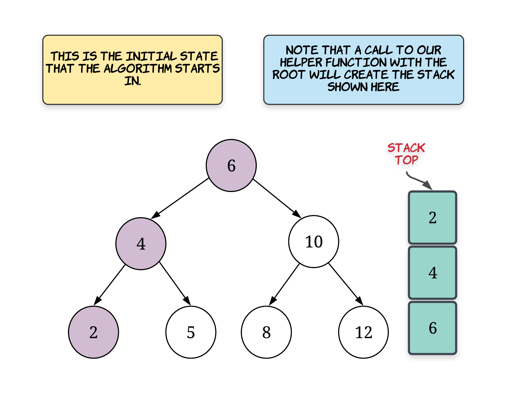

1. Suppose we get a call to the `next()` function. The node which we have to return i.e. the next smallest element in the binary search tree iterator is the one sitting at the top of our stack. So, for the example above, that node would be 2 which is the correct value. Now, there are two possibilities that we have to deal with:

    * One is where the node at the top of the stack is actually a leaf node. This is the best case and here we don't have to do anything. Simply pop the node off the stack and return its value. So, this would be a constant time operation.

    * Second is where the node has a `right` child. We don't need to check for the `left` child because of the way we have added nodes onto the stack. The topmost node either won't have a `left` child or would already have the `left` subtree processed. If it has a `right` child, then we call our helper function on the node's `right` child. This would comparatively be a costly operation depending upon the structure of the tree.
    
    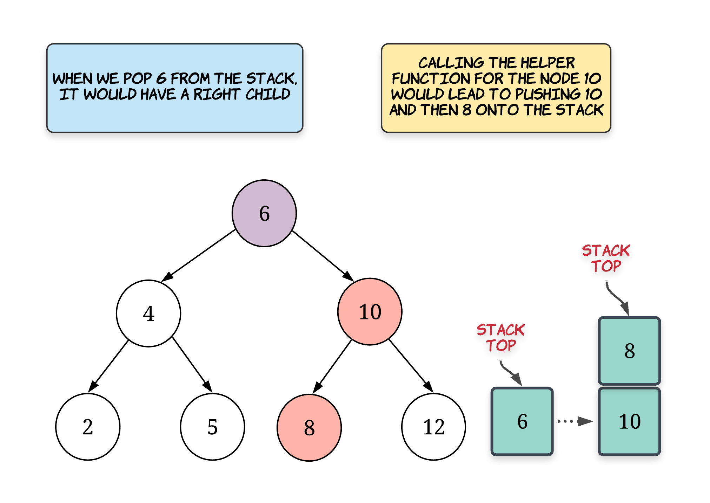

1. We keep on maintaining the invariant this way in the function call for `next` and this way we will always be able to return the next smallest element in the BST from the top of the stack. Again, it's important to understand that obtaining the next smallest element doesn't take much time. However, some time is spent in maintaining the invariant that the stack top will always have the node we are looking for.

```python
# Definition for a binary tree node.
# class TreeNode:
#     def __init__(self, x):
#         self.val = x
#         self.left = None
#         self.right = None

class BSTIterator:

    def __init__(self, root: TreeNode):
        
        # Stack for the recursion simulation
        self.stack = []
        
        # Remember that the algorithm starts with a call to the helper function
        # with the root node as the input
        self._leftmost_inorder(root)
        
    def _leftmost_inorder(self, root):
        
        # For a given node, add all the elements in the leftmost branch of the tree
        # under it to the stack.
        while root:
            self.stack.append(root)
            root = root.left

    def next(self) -> int:
        """
        @return the next smallest number
        """
        
        # Node at the top of the stack is the next smallest element
        topmost_node = self.stack.pop()
        
        # Need to maintain the invariant. If the node has a right child, call the 
        # helper function for the right child
        if topmost_node.right:
            self._leftmost_inorder(topmost_node.right)
        return topmost_node.val

    def hasNext(self) -> bool:
        """
        @return whether we have a next smallest number
        """
        return len(self.stack) > 0
```

**Complexity analysis**

* Time complexity : The time complexity for this approach is very interesting to analyze. Let's look at the complexities for both the functions in the class:

    * `hasNext` is the easier of the lot since all we do in this is to return `true` if there are any elements left in the stack. Otherwise, we return `false`. So clearly, this is an $O(1)$ operation every time. Let's look at the more complicated function now to see if we satisfy all the requirements in the problem statement

    * `next` involves two major operations. One is where we pop an element from the stack which becomes the next smallest element to return. This is a $O(1)$ operation. However, we then make a call to our helper function `_inorder_left` which iterates over a bunch of nodes. This is clearly a linear time operation i.e. $O(N)$ in the worst case. This is true.

    >However, the important thing to note here is that we only make such a call for nodes which have a right child. Otherwise, we simply return. Also, even if we end up calling the helper function, it won't always process N nodes. They will be much lesser. Only if we have a skewed tree would there be N nodes for the root. But that is the only node for which we would call the helper function.

    Thus, the amortized (average) time complexity for this function would still be $O(1)$ which is what the question asks for. We don't need to have a solution which gives constant time operations for every call. We need that complexity on average and that is what we get.

* Space complexity: The space complexity is $O(h)$ which is occupied by our custom stack for simulating the inorder traversal. Again, we satisfy the space requirements as well as specified in the problem statement.

# Submissions
---
**Solution 1: (Flattening the BST)**
```
Runtime: 72 ms
Memory Usage: 20.2 MB
```
```python
# Definition for a binary tree node.
# class TreeNode:
#     def __init__(self, val=0, left=None, right=None):
#         self.val = val
#         self.left = left
#         self.right = right
class BSTIterator:

    def __init__(self, root: TreeNode):
        
        # Array containing all the nodes in the sorted order
        self.nodes_sorted = []

        # Pointer to the next smallest element in the BST
        self.index = -1

        # Call to flatten the input binary search tree
        self._inorder(root)
        
    def _inorder(self, root):
        if not root:
            return
        self._inorder(root.left)
        self.nodes_sorted.append(root.val)
        self._inorder(root.right)

    def next(self) -> int:
        self.index += 1
        return self.nodes_sorted[self.index]

    def hasNext(self) -> bool:
        return self.index + 1 < len(self.nodes_sorted)


# Your BSTIterator object will be instantiated and called as such:
# obj = BSTIterator(root)
# param_1 = obj.next()
# param_2 = obj.hasNext()
```

**Solution 2: (Controlled Recursion)**
```
Runtime: 64 ms
Memory Usage: 20.8 MB
```
```python
# Definition for a binary tree node.
# class TreeNode:
#     def __init__(self, val=0, left=None, right=None):
#         self.val = val
#         self.left = left
#         self.right = right
class BSTIterator:

    def __init__(self, root: TreeNode):
        
        # Stack for the recursion simulation
        self.stack = []

        # Remember that the algorithm starts with a call to the helper function
        # with the root node as the input
        self._leftmost_inorder(root)

    def _leftmost_inorder(self, root):

        # For a given node, add all the elements in the leftmost branch of the tree
        # under it to the stack.
        while root:
            self.stack.append(root)
            root = root.left

    def next(self) -> int:
        
        # Node at the top of the stack is the next smallest element
        topmost_node = self.stack.pop()

        # Need to maintain the invariant. If the node has a right child, call the
        # helper function for the right child
        if topmost_node.right:
            self._leftmost_inorder(topmost_node.right)
        return topmost_node.val

    def hasNext(self) -> bool:
        return len(self.stack) > 0


# Your BSTIterator object will be instantiated and called as such:
# obj = BSTIterator(root)
# param_1 = obj.next()
# param_2 = obj.hasNext()
```

**Solution 3: (Controlled Recursion)**
```
Runtime: 60 ms
Memory Usage: 24.2 MB
```
```c
/**
 * Definition for a binary tree node.
 * struct TreeNode {
 *     int val;
 *     struct TreeNode *left;
 *     struct TreeNode *right;
 * };
 */


typedef struct {
    struct TreeNode *stack[100000];
    int top;
} BSTIterator;

void _leftmost_inorder(struct TreeNode *node, BSTIterator *iter) {
    while (node) {
        iter->stack[++iter->top] = node;
        node = node->left;
    }
}

BSTIterator* bSTIteratorCreate(struct TreeNode* root) {
    BSTIterator *bstIterator = malloc(sizeof(BSTIterator));
    bstIterator->top = -1;
    _leftmost_inorder(root, bstIterator);
    return bstIterator;
}

int bSTIteratorNext(BSTIterator* obj) {
    struct TreeNode *node = obj->stack[obj->top--];
    if (node->right)
        _leftmost_inorder(node->right, obj);
    return node->val;
}

bool bSTIteratorHasNext(BSTIterator* obj) {
    return obj->top != -1;
}

void bSTIteratorFree(BSTIterator* obj) {
    free(obj);
}

/**
 * Your BSTIterator struct will be instantiated and called as such:
 * BSTIterator* obj = bSTIteratorCreate(root);
 * int param_1 = bSTIteratorNext(obj);
 
 * bool param_2 = bSTIteratorHasNext(obj);
 
 * bSTIteratorFree(obj);
*/
```

**Solution 4: (Tree)**
```
Runtime: 42 ms
Memory Usage: 24.3 MB
```
```c++
/**
 * Definition for a binary tree node.
 * struct TreeNode {
 *     int val;
 *     TreeNode *left;
 *     TreeNode *right;
 *     TreeNode() : val(0), left(nullptr), right(nullptr) {}
 *     TreeNode(int x) : val(x), left(nullptr), right(nullptr) {}
 *     TreeNode(int x, TreeNode *left, TreeNode *right) : val(x), left(left), right(right) {}
 * };
 */
class BSTIterator {
    vector<int> v;
    int i=-1; //The pointer should be initialized to a non-existent number smaller than any element in the BST.
    int n;
    void inorder(TreeNode* root, vector<int> &v)
    {
        if(!root)
            return;
        inorder(root->left,v);
        v.push_back(root->val);
        inorder(root->right,v);
    }
public:
    BSTIterator(TreeNode* root) {
        inorder(root,v);
        n=v.size();
    }
    
    int next() {
        i++;  //Moves the pointer to the right, then returns the number at the pointer.
        return v[i];
    }
    
    bool hasNext() {
        if(i+1<n) //if there exits even next element
            return 1;
        return 0;
    }
};

/**
 * Your BSTIterator object will be instantiated and called as such:
 * BSTIterator* obj = new BSTIterator(root);
 * int param_1 = obj->next();
 * bool param_2 = obj->hasNext();
 */
```
