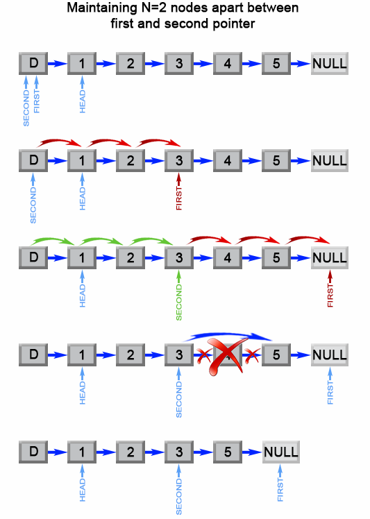

19. Remove Nth Node From End of List

Given a linked list, remove the n-th node from the end of list and return its head.

**Example:**
```
Given linked list: 1->2->3->4->5, and n = 2.

After removing the second node from the end, the linked list becomes 1->2->3->5.
```

**Note:**

Given n will always be valid.

**Follow up:**

Could you do this in one pass?

# Solution
---
## Summary
This article is for beginners. It introduces the following idea: Linked List traversal and removal of nth element from the end.

## Approach 1: Two pass algorithm
**Intuition**

We notice that the problem could be simply reduced to another one : Remove the $(L - n + 1)$ th node from the beginning in the list , where $L$ is the list length. This problem is easy to solve once we found list length $L$.

**Algorithm**

First we will add an auxiliary "dummy" node, which points to the list head. The "dummy" node is used to simplify some corner cases such as a list with only one node, or removing the head of the list. On the first pass, we find the list length $L$. Then we set a pointer to the dummy node and start to move it through the list till it comes to the $(L - n)$ th node. We relink next pointer of the $(L - n)$ th node to the $(L - n + 2)$ th node and we are done.


Figure 1. Remove the L - n + 1 th element from a list.

```java
public ListNode removeNthFromEnd(ListNode head, int n) {
    ListNode dummy = new ListNode(0);
    dummy.next = head;
    int length  = 0;
    ListNode first = head;
    while (first != null) {
        length++;
        first = first.next;
    }
    length -= n;
    first = dummy;
    while (length > 0) {
        length--;
        first = first.next;
    }
    first.next = first.next.next;
    return dummy.next;
}
```

**Complexity Analysis**

* Time complexity : $O(L)$.

The algorithm makes two traversal of the list, first to calculate list length $L$ and second to find the $(L - n)$ th node. There are $2L-n$ operations and time complexity is $O(L)$.

* Space complexity : $O(1)$.

We only used constant extra space.

## Approach 2: One pass algorithm
**Algorithm**

The above algorithm could be optimized to one pass. Instead of one pointer, we could use two pointers. The first pointer advances the list by $n+1$ steps from the beginning, while the second pointer starts from the beginning of the list. Now, both pointers are exactly separated by $n$ nodes apart. We maintain this constant gap by advancing both pointers together until the first pointer arrives past the last node. The second pointer will be pointing at the $n$th node counting from the last. We relink the next pointer of the node referenced by the second pointer to point to the node's next next node.


Figure 2. Remove the nth element from end of a list.

```java
public ListNode removeNthFromEnd(ListNode head, int n) {
    ListNode dummy = new ListNode(0);
    dummy.next = head;
    ListNode first = dummy;
    ListNode second = dummy;
    // Advances first pointer so that the gap between first and second is n nodes apart
    for (int i = 1; i <= n + 1; i++) {
        first = first.next;
    }
    // Move first to the end, maintaining the gap
    while (first != null) {
        first = first.next;
        second = second.next;
    }
    second.next = second.next.next;
    return dummy.next;
}
```

**Complexity Analysis**

* Time complexity : $O(L)$.

The algorithm makes one traversal of the list of $L$ nodes. Therefore time complexity is $O(L)$.

* Space complexity : $O(1)$.

We only used constant extra space.

# Submissions
---
**Solution 1: (Two Pointers)**
```
Runtime: 32 ms
Memory Usage: 12.7 MB
```
```python
# Definition for singly-linked list.
# class ListNode:
#     def __init__(self, x):
#         self.val = x
#         self.next = None

class Solution:
    def removeNthFromEnd(self, head: ListNode, n: int) -> ListNode:
        dummy = ListNode(0)
        dummy.next = head
        first = second = dummy
        # Advances first pointer so that the gap between first and second is n nodes apart
        for i in range(1, n+2):
            first = first.next
        # Move first to the end, maintaining the gap
        while first:
            first = first.next
            second = second.next
    
        second.next = second.next.next
        return dummy.next
```

**Solution 2: (Two Pointers)**
```
Runtime: 0 ms
Memory Usage: 5.9 MB
```
```c
/**
 * Definition for singly-linked list.
 * struct ListNode {
 *     int val;
 *     struct ListNode *next;
 * };
 */


struct ListNode* removeNthFromEnd(struct ListNode* head, int n){
    struct ListNode *dummy, *first, *second, *tmp;
    dummy = malloc(sizeof(struct ListNode));
    dummy->next = head;
    first = second = dummy;
    while (n >= 0) {
        first = first->next;
        n -= 1;
    }
    while (first) {
        first = first->next;
        second = second->next;
    }
    tmp = second->next->next;
    free(second->next);
    second->next = tmp;
    return dummy->next;
}
```
