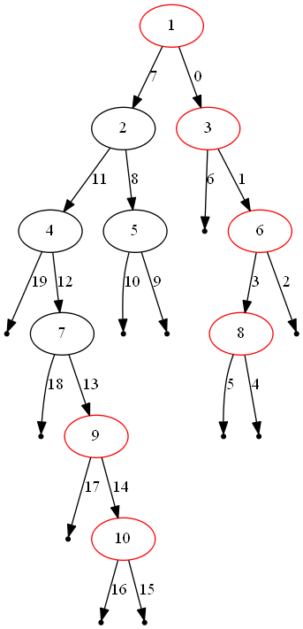
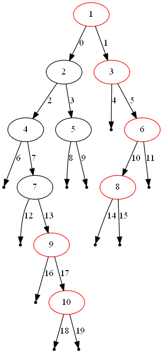

199. Binary Tree Right Side View

Given a binary tree, imagine yourself standing on the right side of it, return the values of the nodes you can see ordered from top to bottom.

**Example:**
```
Input: [1,2,3,null,5,null,4]
Output: [1, 3, 4]
Explanation:

   1            <---
 /   \
2     3         <---
 \     \
  5     4       <---
```

# Solution
---
## Initial Thoughts
Because the tree topography is unknown ahead of time, it is not possible to design an algorithm that visits asymptotically fewer than $n$ nodes. Therefore, we should try to aim for a linear time solution. With that in mind, let's consider a few equally-efficient solutions.

## Approach #1 Depth-First Search [Accepted]
**Intuition**

We can efficiently obtain the right-hand view of the binary tree if we visit each node in the proper order.

**Algorithm**

One of the aforementioned orderings is defined by a depth-first search in which we always visit the right subtree first. This guarantees that the first time we visit a particular depth of the tree, the node that we are visiting is the rightmost node at that depth. Therefore, we can store the value of the first node that we visit at each depth, ultimately generating a final array of values once we know exactly how many layers are in the tree.



The figure above illustrates one instance of the problem. The red nodes compose the solution from top to bottom, and the edges are labelled in order of visitation.

```python
class Solution(object):
    def rightSideView(self, root):
        rightmost_value_at_depth = dict() # depth -> node.val
        max_depth = -1

        stack = [(root, 0)]
        while stack:
            node, depth = stack.pop()

            if node is not None:
                # maintain knowledge of the number of levels in the tree.
                max_depth = max(max_depth, depth)

                # only insert into dict if depth is not already present.
                rightmost_value_at_depth.setdefault(depth, node.val)

                stack.append((node.left, depth+1))
                stack.append((node.right, depth+1))

        return [rightmost_value_at_depth[depth] for depth in range(max_depth+1)]
```

**Complexity Analysis**

* Time complexity : $O(n)$.

Because a binary tree with only child pointers is directed acyclic graph with only one source node, a traversal of the tree from the root will visit each node exactly once (plus a sublinear amount of leaves, represented as None). Each visitation requires only $O(1)$ work, so the while loop runs in linear time. Finally, building the array of rightmost values is O(height of the tree) = $O(n)$ because it is not possible for a right-hand view of the tree to contain more nodes than the tree itself.

* Space complexity : $O(n)$.

At worst, our stack will contain a number of nodes close to the height of the tree. Because we are exploring the tree in a depth-first order, there are never two nodes from different subtrees of the same parent node on the stack at once. Said another way, the entire right subtree of a node will be visited before any nodes of the left subtree are pushed onto the stack. If this logic is applied recursively down the tree, it follows that the stack will be largest when we have reached the end of the tree's longest path (the height of the tree). However, because we know nothing about the tree's topography, the height of the tree may be equivalent to $n$, causing the space complexity to degrade to $O(n)$.

## Approach #2 Breadth-First Search [Accepted]
**Intuition**

Much like depth-first search can guarantee that we visit a depth's rightmost node first, breadth-first search can guarantee that we visit it last.

**Algorithm**

By performing a breadth-first search that enqueues the left child before the right child, we visit each node in each layer from left to right. Therefore, by retaining only the most recently visited node per depth, we will have the rightmost node for each depth once we finish the tree traversal. The algorithm is unchanged, other than swapping out the stack for a `deque[1]` and removing the containment check before assigning into `rightmost_value_at_depth`.



The figure above illustrates the same instance as before, but solved via breadth-first search. The red nodes compose the solution from top to bottom, and the edges are labelled in order of visitation.

```python
from collections import deque

class Solution(object):
    def rightSideView(self, root):
        rightmost_value_at_depth = dict() # depth -> node.val
        max_depth = -1

        queue = deque([(root, 0)])
        while queue:
            node, depth = queue.popleft()

            if node is not None:
                # maintain knowledge of the number of levels in the tree.
                max_depth = max(max_depth, depth)

                # overwrite rightmost value at current depth. the correct value
                # will never be overwritten, as it is always visited last.
                rightmost_value_at_depth[depth] = node.val

                queue.append((node.left, depth+1))
                queue.append((node.right, depth+1))

        return [rightmost_value_at_depth[depth] for depth in range(max_depth+1)]
```

**Complexity Analysis**

* Time complexity : $O(n)$.

The differences itemized in the Algorithm section do not admit differences in the time complexity analysis between the bread-first and depth-first search approaches.

* Space complexity : $O(n)$.

Because breadth-first search visits the tree layer-by-layer, the queue will be at its largest immediately before visiting the largest layer. The size of this layer is $0.5n = O(n)$ in the worst case (a complete binary tree).

# Submissions
---
**Solution:**
```
Runtime: 32 ms
Memory Usage: 12.7 MB
```
```python
# Definition for a binary tree node.
# class TreeNode:
#     def __init__(self, x):
#         self.val = x
#         self.left = None
#         self.right = None

class Solution:
    def rightSideView(self, root: TreeNode) -> List[int]:
        ans = []
        level = root and [root]
        while level:
            ans.append([node for node in level][-1].val)
            level = [c for node in level for c in [node.left, node.right] if c]
        return ans
            
```