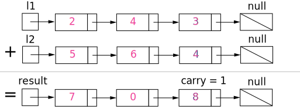

2. Add Two Numbers

You are given two **non-empty** linked lists representing two non-negative integers. The digits are stored in **reverse order** and each of their nodes contain a single digit. Add the two numbers and return it as a linked list.

You may assume the two numbers do not contain any leading zero, except the number 0 itself.

**Example:**

```
Input: (2 -> 4 -> 3) + (5 -> 6 -> 4)
Output: 7 -> 0 -> 8
Explanation: 342 + 465 = 807.
```

# Solution
---
## Approach 1: Elementary Math
**Intuition**

Keep track of the carry using a variable and simulate digits-by-digits sum starting from the head of list, which contains the least-significant digit.


Figure 1. Visualization of the addition of two numbers: $342 + 465 = 807$.
Each node contains a single digit and the digits are stored in reverse order.

**Algorithm**

Just like how you would sum two numbers on a piece of paper, we begin by summing the least-significant digits, which is the head of $l1$ and $l2$. Since each digit is in the range of $0 \ldots 9$, summing two digits may "overflow". For example $5 + 7 = 12$. In this case, we set the current digit to $2$ and bring over the $carry = 1$ to the next iteration. $carry$ must be either $0$ or $1$ because the largest possible sum of two digits (including the carry) is $9 + 9 + 1 = 19$.

The pseudocode is as following:

* Initialize current node to dummy head of the returning list.
* Initialize carry to $0$.
* Initialize $p$ and $q$ to head of $l1$ and $l2$ respectively.
* Loop through lists $l1$ and $l2$ until you reach both ends.
* Set $x$ to node $p$'s value. If $p$ has reached the end of $l1$, set to $0$.
* Set $y$ to node $q$'s value. If $q$ has reached the end of $l2$, set to $0$.
* Set $sum = x + y + carry$.
* Update $carry = sum / 10$.
* Create a new node with the digit value of $(sum \bmod 10)$ and set it to current node's next, then advance current node to next.
* Advance both $p$ and $q$.
* Check if $carry = 1$, if so append a new node with digit $1$ to the returning list.
* Return dummy head's next node.

Note that we use a dummy head to simplify the code. Without a dummy head, you would have to write extra conditional statements to initialize the head's value.

Take extra caution of the following cases:

| Test case                 | Explanation |
|---------------------------|-------------|
| $l1=[0,1]\\ l2=[0,1,2]$   | When one list is longer than the other. |
| $l1=[]\\ l2=[0,1]$        | When one list is null, which means an empty list. |
| $l1=[9,9]\\ l2=[1]$       | The sum could have an extra carry of one at the end, which is easy to forget. |

```java
public ListNode addTwoNumbers(ListNode l1, ListNode l2) {
    ListNode dummyHead = new ListNode(0);
    ListNode p = l1, q = l2, curr = dummyHead;
    int carry = 0;
    while (p != null || q != null) {
        int x = (p != null) ? p.val : 0;
        int y = (q != null) ? q.val : 0;
        int sum = carry + x + y;
        carry = sum / 10;
        curr.next = new ListNode(sum % 10);
        curr = curr.next;
        if (p != null) p = p.next;
        if (q != null) q = q.next;
    }
    if (carry > 0) {
        curr.next = new ListNode(carry);
    }
    return dummyHead.next;
}
```

**Complexity Analysis**

* Time complexity : $O(\max(m, n))$. Assume that $m$ and $n$ represents the length of $l1$ and $l2$ respectively, the algorithm above iterates at most $\max(m, n)$ times.

* Space complexity : $O(\max(m, n))$. The length of the new list is at most $\max(m,n) + 1$.

**Follow up**

What if the the digits in the linked list are stored in non-reversed order? For example:

$(3 \to 4 \to 2) + (4 \to 6 \to 5) = 8 \to 0 \to 7$

# Submissions
---
**Solution 1:**
```
Runtime: 120 ms
Memory Usage: N/A
```
```python
# Definition for singly-linked list.
# class ListNode:
#     def __init__(self, x):
#         self.val = x
#         self.next = None

class Solution:
    def addTwoNumbers(self, l1, l2):
        """
        :type l1: ListNode
        :type l2: ListNode
        :rtype: ListNode
        """
        dummy_head = ListNode(-1)
        current_position = dummy_head
        carry = 0
        while l1 or l2 or carry:
            l1_value = l1.val if l1 else 0
            l2_value = l2.val if l2 else 0
            carry, new_value = divmod(l1_value + l2_value + carry, 10)
            current_position.next = ListNode(new_value)
            current_position = current_position.next
            l1 = l1.next if l1 else None
            l2 = l2.next if l2 else None
        return dummy_head.next
```