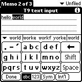
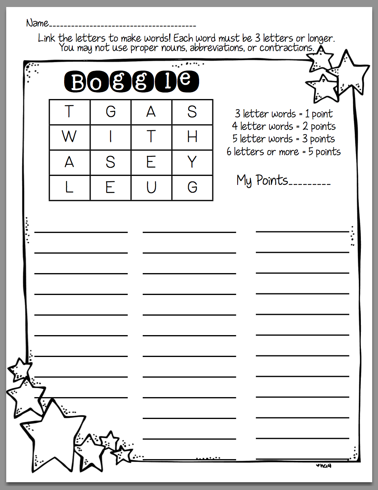
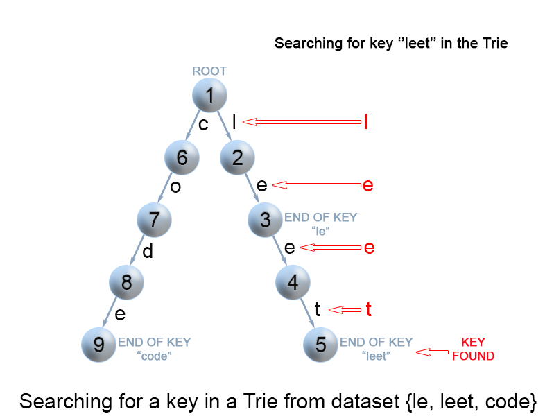
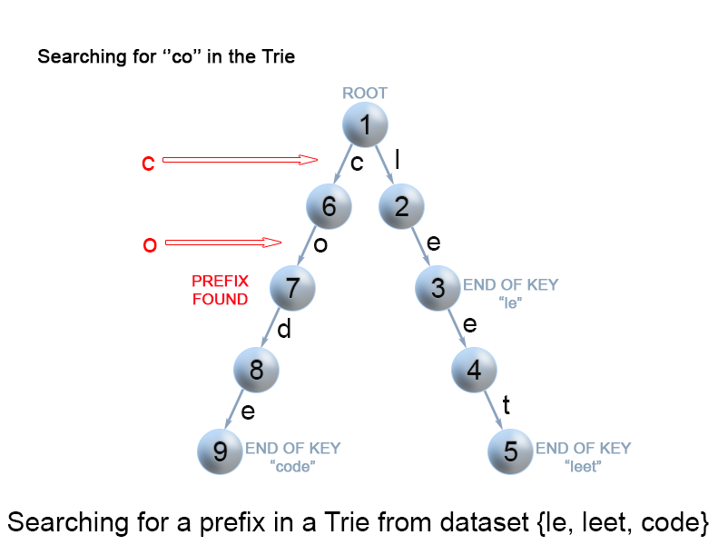

208. Implement Trie (Prefix Tree)

Implement a trie with `insert`, `search`, and `startsWith` methods.

**Example:**
```
Trie trie = new Trie();

trie.insert("apple");
trie.search("apple");   // returns true
trie.search("app");     // returns false
trie.startsWith("app"); // returns true
trie.insert("app");   
trie.search("app");     // returns true
```

**Note:**

* You may assume that all inputs are consist of lowercase letters `a-z`.
* All inputs are guaranteed to be non-empty strings.

# Solution
---
This article is for intermediate level users. It introduces the following ideas: The data structure Trie (Prefix tree) and most common operations with it.

## Solution
**Applications**
Trie (we pronounce "try") or prefix tree is a tree data structure, which is used for retrieval of a key in a dataset of strings. There are various applications of this very efficient data structure such as :

1. Autocomplete

    

1. Spell checker

    

1. IP routing (Longest prefix matching)

    
    
    Figure 3. Longest prefix matching algorithm uses Tries in Internet Protocol (IP) routing to select an entry from a forwarding table.
    
1. T9 predictive text

    
    
    Figure 4. T9 which stands for Text on 9 keys, was used on phones to input texts during the late 1990s.
    
1. Solving word games

    
    
    Figure 5. Tries is used to solve Boggle efficiently by pruning the search space.
    
There are several other data structures, like balanced trees and hash tables, which give us the possibility to search for a word in a dataset of strings. Then why do we need trie? Although hash table has $O(1)$ time complexity for looking for a key, it is not efficient in the following operations :

* Finding all keys with a common prefix.
* Enumerating a dataset of strings in lexicographical order.

Another reason why trie outperforms hash table, is that as hash table increases in size, there are lots of hash collisions and the search time complexity could deteriorate to $O(n)$, where $n$ is the number of keys inserted. Trie could use less space compared to Hash Table when storing many keys with the same prefix. In this case using trie has only $O(m)$ time complexity, where $m$ is the key length. Searching for a key in a balanced tree costs $O(m \log n)$ time complexity.

## Trie node structure
Trie is a rooted tree. Its nodes have the following fields:

* Maximum of $R$ links to its children, where each link corresponds to one of RR character values from dataset alphabet. In this article we assume that $R$ is 26, the number of lowercase latin letters.
* Boolean field which specifies whether the node corresponds to the end of the key, or is just a key prefix.


Figure 6. Representation of a key "leet" in trie.

**Java**
```java
class TrieNode {

    // R links to node children
    private TrieNode[] links;

    private final int R = 26;

    private boolean isEnd;

    public TrieNode() {
        links = new TrieNode[R];
    }

    public boolean containsKey(char ch) {
        return links[ch -'a'] != null;
    }
    public TrieNode get(char ch) {
        return links[ch -'a'];
    }
    public void put(char ch, TrieNode node) {
        links[ch -'a'] = node;
    }
    public void setEnd() {
        isEnd = true;
    }
    public boolean isEnd() {
        return isEnd;
    }
}
```

Two of the most common operations in a trie are insertion of a key and search for a key.

## Insertion of a key to a trie
We insert a key by searching into the trie. We start from the root and search a link, which corresponds to the first key character. There are two cases :

* A link exists. Then we move down the tree following the link to the next child level. The algorithm continues with searching for the next key character.
* A link does not exist. Then we create a new node and link it with the parent's link matching the current key character. We repeat this step until we encounter the last character of the key, then we mark the current node as an end node and the algorithm finishes.


**Java**
```java
class Trie {
    private TrieNode root;

    public Trie() {
        root = new TrieNode();
    }

    // Inserts a word into the trie.
    public void insert(String word) {
        TrieNode node = root;
        for (int i = 0; i < word.length(); i++) {
            char currentChar = word.charAt(i);
            if (!node.containsKey(currentChar)) {
                node.put(currentChar, new TrieNode());
            }
            node = node.get(currentChar);
        }
        node.setEnd();
    }
}
```

**Complexity Analysis**

* Time complexity : $O(m)$, where `m` is the key length.
In each iteration of the algorithm, we either examine or create a node in the trie till we reach the end of the key. This takes only $m$ operations.

* Space complexity : $O(m)$.
In the worst case newly inserted key doesn't share a prefix with the the keys already inserted in the trie. We have to add $m$ new nodes, which takes us $O(m)$ space.

## Search for a key in a trie
Each key is represented in the trie as a path from the root to the internal node or leaf. We start from the root with the first key character. We examine the current node for a link corresponding to the key character. There are two cases :

* A link exist. We move to the next node in the path following this link, and proceed searching for the next key character.

* A link does not exist. If there are no available key characters and current node is marked as `isEnd` we return `true`. Otherwise there are possible two cases in each of them we return `false` :

    * There are key characters left, but it is impossible to follow the key path in the trie, and the key is missing.
    * No key characters left, but current node is not marked as `isEnd`. Therefore the search key is only a prefix of another key in the trie.



**Java**
```java
class Trie {
    ...

    // search a prefix or whole key in trie and
    // returns the node where search ends
    private TrieNode searchPrefix(String word) {
        TrieNode node = root;
        for (int i = 0; i < word.length(); i++) {
           char curLetter = word.charAt(i);
           if (node.containsKey(curLetter)) {
               node = node.get(curLetter);
           } else {
               return null;
           }
        }
        return node;
    }

    // Returns if the word is in the trie.
    public boolean search(String word) {
       TrieNode node = searchPrefix(word);
       return node != null && node.isEnd();
    }
}
```

**Complexity Analysis**

* Time complexity : $O(m)$ In each step of the algorithm we search for the next key character. In the worst case the algorithm performs $m$ operations.

* Space complexity : $O(1)$

## Search for a key prefix in a trie
The approach is very similar to the one we used for searching a key in a trie. We traverse the trie from the root, till there are no characters left in key prefix or it is impossible to continue the path in the trie with the current key character. The only difference with the mentioned above `search for a key` algorithm is that when we come to an end of the key prefix, we always return `true`. We don't need to consider the `isEnd` mark of the current trie node, because we are searching for a prefix of a key, not for a whole key.



Figure 9. Search for a key prefix in a trie.

**Java**
```java
class Trie {
    ...

    // Returns if there is any word in the trie
    // that starts with the given prefix.
    public boolean startsWith(String prefix) {
        TrieNode node = searchPrefix(prefix);
        return node != null;
    }
}
```

**Complexity Analysis**

* Time complexity : $O(m)$

* Space complexity : $O(1)$

## Practice Problems
Here are some wonderful problems for you to practice which uses the Trie data structure.

Add and Search Word - Data structure design - Pretty much a direct application of Trie.
Word Search II - Similar to Boggle.

# Submissions
---
**Solution 1: (Hash table)**
```
Runtime: 116 ms
Memory Usage: 26.4 MB
```
```python
class Trie:

    def __init__(self):
        """
        Initialize your data structure here.
        """
        self.trie = {}

    def insert(self, word: str) -> None:
        """
        Inserts a word into the trie.
        """
        t = self.trie
        for c in word:
            if c not in t:
                t[c] = {}
            t = t[c]
        t['#'] = word

    def search(self, word: str) -> bool:
        """
        Returns if the word is in the trie.
        """
        t = self.trie
        for c in word:
            if c not in t:
                return False
            t = t[c]
        return '#' in t

    def startsWith(self, prefix: str) -> bool:
        """
        Returns if there is any word in the trie that starts with the given prefix.
        """
        t = self.trie
        for c in prefix:
            if c not in t:
                return False
            t = t[c]
        return True


# Your Trie object will be instantiated and called as such:
# obj = Trie()
# obj.insert(word)
# param_2 = obj.search(word)
# param_3 = obj.startsWith(prefix)
```