210. Course Schedule II

There are a total of `n` courses you have to take, labeled from `0` to `n-1`.

Some courses may have prerequisites, for example to take course 0 you have to first take course 1, which is expressed as a pair: `[0,1]`

Given the total number of courses and a list of `prerequisite` **pairs**, return the ordering of courses you should take to finish all courses.

There may be multiple correct orders, you just need to return one of them. If it is impossible to finish all courses, return an empty array.

**Example 1:**
```
Input: 2, [[1,0]] 
Output: [0,1]
Explanation: There are a total of 2 courses to take. To take course 1 you should have finished   
             course 0. So the correct course order is [0,1] .
```

**Example 2:**
```
Input: 4, [[1,0],[2,0],[3,1],[3,2]]
Output: [0,1,2,3] or [0,2,1,3]
Explanation: There are a total of 4 courses to take. To take course 3 you should have finished both     
             courses 1 and 2. Both courses 1 and 2 should be taken after you finished course 0. 
             So one correct course order is [0,1,2,3]. Another correct ordering is [0,2,1,3] .
```

**Note:**

* The input prerequisites is a graph represented by a list of edges, not adjacency matrices. Read more about how a graph is represented.
* You may assume that there are no duplicate edges in the input prerequisites.

## Solution
This is a very common problem that some of us might face during college. We might want to take up a certain set of courses that interest us. However, as we all know, most of the courses do tend to have a lot of prerequisites associated with them. Some of these would be hard requirements whereas others would be simply suggested prerequisites which you may or may not take. However, for us to be able to have an all round learning experience, we should follow the suggested set of prerequisites. How does one decide what order of courses they should follow so as not to miss out on any subjects?

As mentioned in the problem statement, such a problem is a natural fit for graph based algorithms and we can easily model the elements in the problem statement as a graph. First of all, let's look at the graphical representation of the problem and it's components and then we will move onto the solutions.

We can represent the information provided in the question in the form of a graph.

* Let $G(V, E)$ represent a directed, unweighted graph.
* Each course would represent a vertex in the graph.
* The edges are modeled after the prerequisite relationship between courses. So, we are given, that a pair such as $[a, b]$ in the question means the course `b` is a prerequisite for the course `a`. This can be represented as a `directed edge b ➔ a` in the graph.
* The graph is a cyclic graph because there is a possibility of a cycle in the graph. If the graph would be acyclic, then an ordering of subjects as required in the question would always be possible. Since it's mentioned that such an ordering may not `always` be possible, that means we have a cyclic graph.

Let's look at a sample graph representing a set of courses where such an ordering is possible and one where such an ordering is not possible. It will be easier to explain the approaches once we look at two sample graphs.

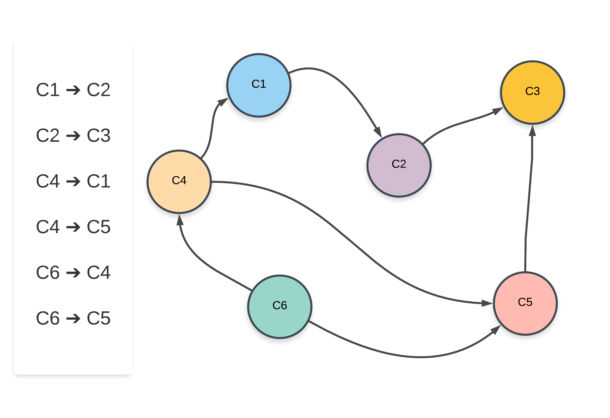

For the sample graph shown above, one of the possible ordering of courses is: `C6 ➔ C4 ➔ C1 ➔ C5 ➔ C2 ➔ C3` and another possible ordering of subjects is `C6 ➔ C4 ➔ C5 ➔ C1 ➔ C2 ➔ C3`. Now let's look at a graph where no such ordering of courses is possible.

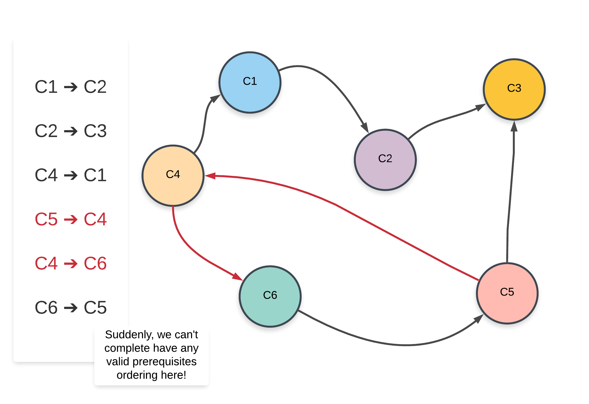

Note that the edges that have changed from the previous graph have been highlighted in red.

>Clearly, the presence of a cycle in the graph shows us that a proper ordering of prerequisites is not possible at all. Intuitively, it is not possible to have e.g. two subjects S1 and S2 prerequisites of each other. Similar ideology applies to a larger cycle in the graph like we have above.

Such an ordering of subjects is referred to as a Topological Sorted Order and this is a common algorithmic problem in the graph domain. There are two approaches that we will be looking at in this article to solve this problem.

## Approach 1: Using Depth First Search
**Intuition**

Suppose we are at a node in our graph during the depth first traversal. Let's call this node A.

>The way DFS would work is that we would consider all possible paths stemming from A before finishing up the recursion for A and moving onto other nodes. All the nodes in the paths stemming from the node A would have A as an ancestor. The way this fits in our problem is, all the courses in the paths stemming from the course A would have A as a prerequisite.

Now we know how to get all the courses that have a particular course as a prerequisite. If a valid ordering of courses is possible, the course A would come before all the other set of courses that have it as a prerequisite. This idea for solving the problem can be explored using depth first search. Let's look at the pseudo-code before looking at the formal algorithm.

```
➔ let S be a stack of courses
➔ function dfs(node)
➔     for each neighbor in adjacency list of node
➔          dfs(neighbor)
➔     add node to S
```

Let's now look at the formal algorithm based on this idea.

**Algorithm**

1. Initialize a stack `S` that will contain the topologically sorted order of the courses in our graph.
1. Construct the adjacency list using the edge pairs given in the input. An important thing to note about the input for the problem is that a pair such as `[a, b]` represents that the course `b` needs to be taken in order to do the course `a`. This implies an edge of the form `b ➔ a`. Please take note of this when implementing the algorithm.
1. For each of the nodes in our graph, we will run a depth first search in case that node was not already visited in some other node's DFS traversal.
1. Suppose we are executing the depth first search for a node `N`. We will recursively traverse all of the neighbors of node `N` which have not been processed before.
1. Once the processing of all the neighbors is done, we will add the node `N` to the stack. We are making use of a stack to simulate the ordering we need. When we add the node `N` to the stack, all the nodes that require the node `N` as a prerequisites (among others) will already be in the stack.
1. Once all the nodes have been processed, we will simply return the nodes as they are present in the stack from top to bottom.

Let's look at an animated dry run of the algorithm on a sample graph before moving onto the formal implementations.

[210_1_1.png](img/210_1_1.png)
[210_1_2.png](img/210_1_2.png)
[210_1_3.png](img/210_1_3.png)
[210_1_4.png](img/210_1_4.png)
[210_1_5.png](img/210_1_5.png)
[210_1_6.png](img/210_1_6.png)
[210_1_7.png](img/210_1_7.png)
[210_1_8.png](img/210_1_8.png)
[210_1_9.png](img/210_1_9.png)
[210_1_10.png](img/210_1_10.png)
[210_1_11.png](img/210_1_11.png)
[210_1_12.png](img/210_1_12.png)
[210_1_13.png](img/210_1_13.png)
[210_1_14.png](img/210_1_14.png)
[210_1_15.png](img/210_1_15.png)
[210_1_16.png](img/210_1_16.png)
[210_1_17.png](img/210_1_17.png)
[210_1_18.png](img/210_1_18.png)
[210_1_19.png](img/210_1_19.png)
[210_1_20.png](img/210_1_20.png)

>An important thing to note about topologically sorted order is that there won't be just one ordering of nodes (courses). There can be multiple. For e.g. in the above graph, we could have processed the node "D" before we did "B" and hence have a different ordering.

```python
from collections import defaultdict
class Solution:

    WHITE = 1
    GRAY = 2
    BLACK = 3

    def findOrder(self, numCourses, prerequisites):
        """
        :type numCourses: int
        :type prerequisites: List[List[int]]
        :rtype: List[int]
        """

        # Create the adjacency list representation of the graph
        adj_list = defaultdict(list)

        # A pair [a, b] in the input represents edge from b --> a
        for dest, src in prerequisites:
            adj_list[src].append(dest)

        topological_sorted_order = []
        is_possible = True

        # By default all vertces are WHITE
        color = {k: Solution.WHITE for k in range(numCourses)}
        def dfs(node):
            nonlocal is_possible

            # Don't recurse further if we found a cycle already
            if not is_possible:
                return

            # Start the recursion
            color[node] = Solution.GRAY

            # Traverse on neighboring vertices
            if node in adj_list:
                for neighbor in adj_list[node]:
                    if color[neighbor] == Solution.WHITE:
                        dfs(neighbor)
                    elif color[neighbor] == Solution.GRAY:
                         # An edge to a GRAY vertex represents a cycle
                        is_possible = False

            # Recursion ends. We mark it as black
            color[node] = Solution.BLACK
            topological_sorted_order.append(node)

        for vertex in range(numCourses):
            # If the node is unprocessed, then call dfs on it.
            if color[vertex] == Solution.WHITE:
                dfs(vertex)

        return topological_sorted_order[::-1] if is_possible else []
```

**Complexity Analysis**

* Time Complexity: $O(N)$ considering there are $N$ courses in all. We essentially perform a complete depth first search covering all the nodes in the forest. It's a forest and not a graph because not all nodes will be connected together. There can be disjoint components as well.
* Space Complexity: $O(N)$, the space utilized by the recursion stack (not the stack we used to maintain the topologically sorted order)

## Approach 2: Using Node Indegree
**Intuition**

This approach is much easier to think about intuitively as will be clear from the following point/fact about topological ordering.

>The first node in the topological ordering will be the node that doesn't have any incoming edges. Essentially, any node that has an in-degree of 0 can start the topologically sorted order. If there are multiple such nodes, their relative order doesn't matter and they can appear in any order.

Our current algorithm is based on this idea. We first process all the nodes/course with 0 in-degree implying no prerequisite courses required. If we remove all these courses from the graph, along with their outgoing edges, we can find out the courses/nodes that should be processed next. These would again be the nodes with 0 in-degree. We can continuously do this until all the courses have been accounted for.

**Algorithm**

1. Initialize a queue, `Q` to keep a track of all the nodes in the graph with 0 in-degree.
1. Iterate over all the edges in the input and create an adjacency list and also a map of node v/s in-degree.
1. Add all the nodes with 0 in-degree to `Q`.
1. The following steps are to be done until the `Q` becomes empty.
    1. Pop a node from the `Q`. Let's call this node, `N`.
    1. For all the neighbors of this node, `N`, reduce their in-degree by 1. If any of the nodes' in-degree reaches 0, add it to the `Q`.
    1. Add the node N to the list maintaining topologically sorted order.
    1. Continue from step 4.1.

Let us now look at an animation depicting this algorithm and then we will get to the implementations.

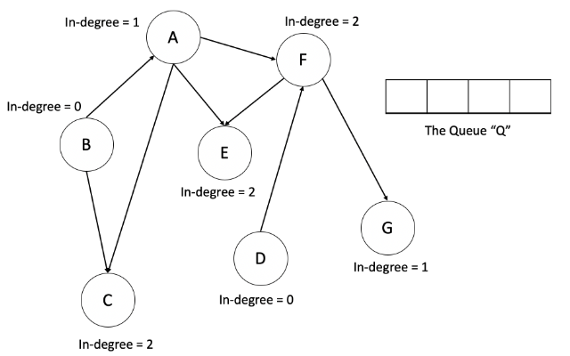
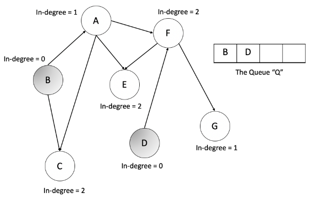
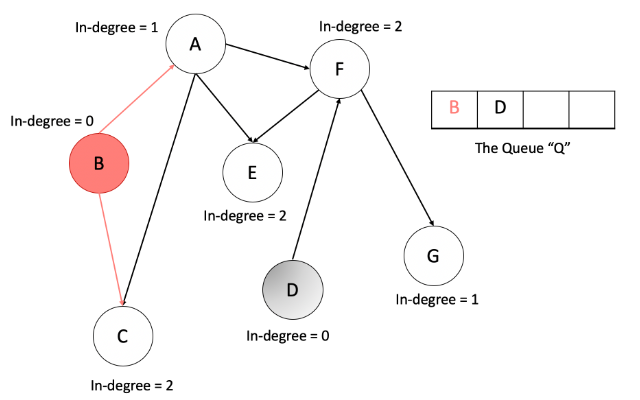
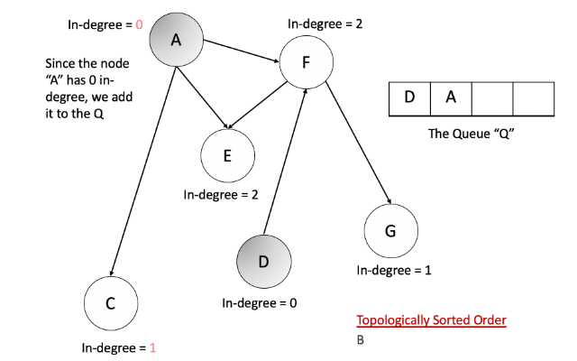
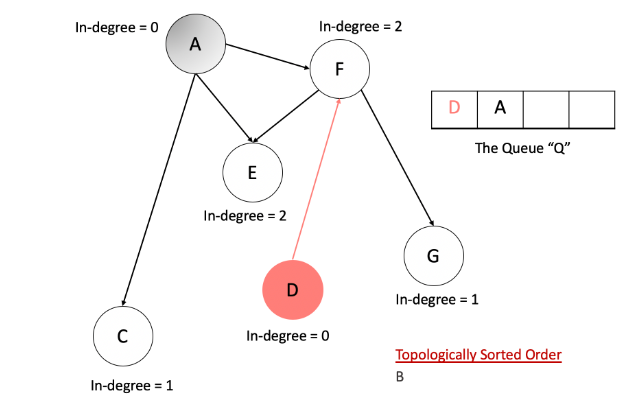
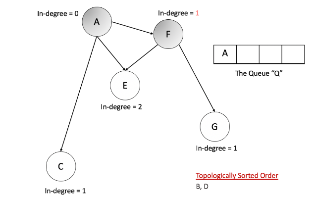
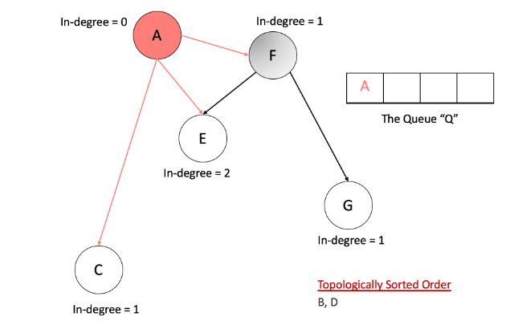
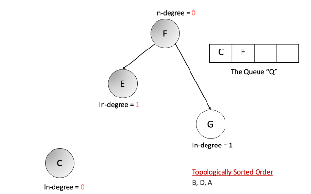
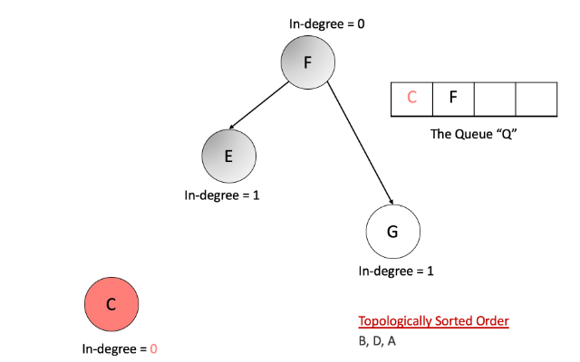
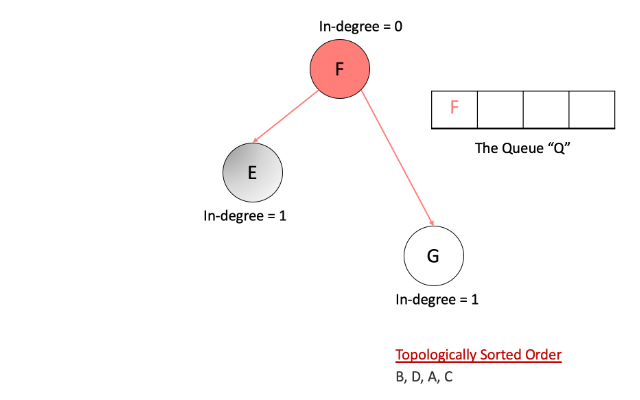
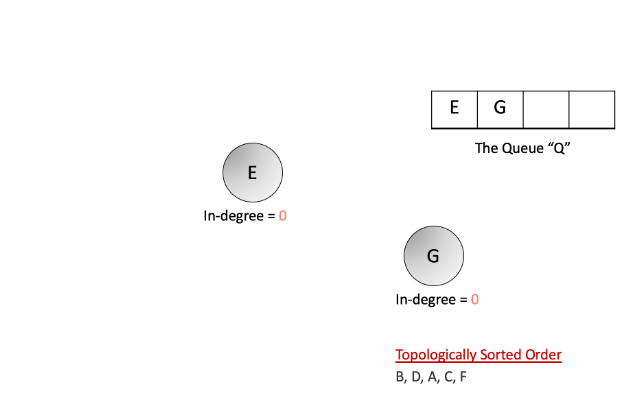
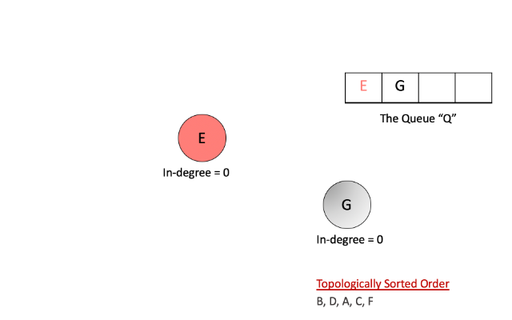
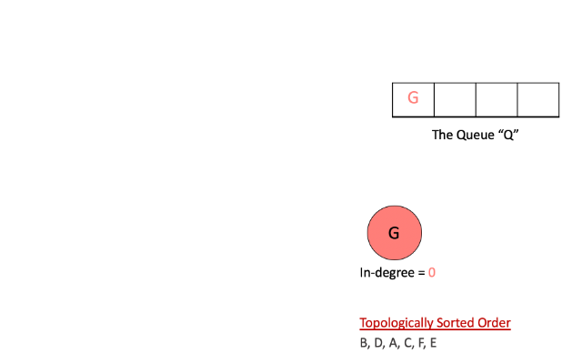


An important thing to note here is, using a queue is not a hard requirement for this algorithm. We can make use of a stack. That however, will give us a different ordering than what we might get from the queue because of the difference in access patterns between the two data-structures.

```python
from collections import defaultdict, deque
class Solution:

    def findOrder(self, numCourses, prerequisites):
        """
        :type numCourses: int
        :type prerequisites: List[List[int]]
        :rtype: List[int]
        """

        # Prepare the graph
        adj_list = defaultdict(list)
        indegree = {}
        for dest, src in prerequisites:
            adj_list[src].append(dest)

            # Record each node's in-degree
            indegree[dest] = indegree.get(dest, 0) + 1

        # Queue for maintainig list of nodes that have 0 in-degree
        zero_indegree_queue = deque([k for k in range(numCourses) if k not in indegree])

        topological_sorted_order = []

        # Until there are nodes in the Q
        while zero_indegree_queue:

            # Pop one node with 0 in-degree
            vertex = zero_indegree_queue.popleft()
            topological_sorted_order.append(vertex)

            # Reduce in-degree for all the neighbors
            if vertex in adj_list:
                for neighbor in adj_list[vertex]:
                    indegree[neighbor] -= 1

                    # Add neighbor to Q if in-degree becomes 0
                    if indegree[neighbor] == 0:
                        zero_indegree_queue.append(neighbor)

        return topological_sorted_order if len(topological_sorted_order) == numCourses else []
```

**Complexity Analysis**

* Time Complexity: $O(V + E)$ where $V$ represents the number of vertices and EE represents the number of edges. We pop each node exactly once from the zero in-degree queue and that gives us VV. Also, for each vertex, we iterate over its adjacency list and in totality, we iterate over all the edges in the graph which gives us $E$. Hence, $O(V + E)$
* Space Complexity: $O(V + E)$. We use an intermediate queue data structure to keep all the nodes with 0 in-degree. In the worst case, there won't be any prerequisite relationship and the queue will contain all the vertices initially since all of them will have 0 in-degree. That gives us $O(V)$. Additionally, we also use the adjacency list to represent our graph initially. The space occupied is defined by the number of edges because for each node as the key, we have all its adjacent nodes in the form of a list as the value. Hence, $O(E)$. So, the overall space complexity is O(V + E).

Kudos to people in the comments section and @himanshujain71](https://leetcode.com/himanshujain71) for bringing up a grave oversight on my part in the complexity analysis for the second approach!

# Submissions
---
**Solution 1: (Using Depth First Search)**
```
Runtime: 108 ms
Memory Usage: 17.2 MB
```
```python
class Solution:
    
    WHITE = 1
    GRAY = 2
    BLACK = 3
    
    def findOrder(self, numCourses: int, prerequisites: List[List[int]]) -> List[int]:
        # Create the adjacency list representation of the graph
        adj_list = defaultdict(list)

        # A pair [a, b] in the input represents edge from b --> a
        for dest, src in prerequisites:
            adj_list[src].append(dest)

        topological_sorted_order = []
        is_possible = True

        # By default all vertces are WHITE
        color = {k: Solution.WHITE for k in range(numCourses)}
        def dfs(node):
            nonlocal is_possible

            # Don't recurse further if we found a cycle already
            if not is_possible:
                return

            # Start the recursion
            color[node] = Solution.GRAY

            # Traverse on neighboring vertices
            if node in adj_list:
                for neighbor in adj_list[node]:
                    if color[neighbor] == Solution.WHITE:
                        dfs(neighbor)
                    elif color[neighbor] == Solution.GRAY:
                         # An edge to a GRAY vertex represents a cycle
                        is_possible = False

            # Recursion ends. We mark it as black
            color[node] = Solution.BLACK
            topological_sorted_order.append(node)

        for vertex in range(numCourses):
            # If the node is unprocessed, then call dfs on it.
            if color[vertex] == Solution.WHITE:
                dfs(vertex)

        return topological_sorted_order[::-1] if is_possible else []    
```

**Solution 2: (Using Node Indegree)**
```
Runtime: 108 ms
Memory Usage: 15.1 MB
```
```python
class Solution:
    
    def findOrder(self, numCourses: int, prerequisites: List[List[int]]) -> List[int]:
        # Prepare the graph
        adj_list = defaultdict(list)
        indegree = {}
        for dest, src in prerequisites:
            adj_list[src].append(dest)

            # Record each node's in-degree
            indegree[dest] = indegree.get(dest, 0) + 1

        # Queue for maintainig list of nodes that have 0 in-degree
        zero_indegree_queue = deque([k for k in range(numCourses) if k not in indegree])

        topological_sorted_order = []

        # Until there are nodes in the Q
        while zero_indegree_queue:

            # Pop one node with 0 in-degree
            vertex = zero_indegree_queue.popleft()
            topological_sorted_order.append(vertex)

            # Reduce in-degree for all the neighbors
            if vertex in adj_list:
                for neighbor in adj_list[vertex]:
                    indegree[neighbor] -= 1

                    # Add neighbor to Q if in-degree becomes 0
                    if indegree[neighbor] == 0:
                        zero_indegree_queue.append(neighbor)

        return topological_sorted_order if len(topological_sorted_order) == numCourses else []
```

**Solution 3: (BFS)**
```
Runtime: 52 ms
Memory Usage: 14.9 MB
```
```python
class Solution {
public:
    vector<int> findOrder(int numCourses, vector<vector<int>>& prerequisites) {
        map<int,vector<int>>mp;
        for(int i=0 ; i<prerequisites.size() ; i++) mp[prerequisites[i][1]].push_back(prerequisites[i][0]);    //create graph using map.
        vector<int>indegree(numCourses,0);                                             //a vector to store the indegree of nodes.
        for(auto x:mp)
            for(auto y:x.second) indegree[y]++;                              //find the indegree of nodes.
        
        queue<int>q;
        for(int i=0 ; i<numCourses ; i++) if(indegree[i]==0) q.push(i);            //push into the queue all the nodes with indegree 0.
        vector<int>res;
        while(!q.empty())
        {
            int node = q.front();
            q.pop();
            res.push_back(node);
            for(auto x:mp[node])
            {
                indegree[x]--;                                  //for nodes with indegree 0 change the indegree of adjacent nodes.
                if(indegree[x]==0) q.push(x);                   //if you find another node with indegree 0 insert it in queue.
            }
        }
        if(res.size()!=numCourses) return {};         //if result size != numCourses then there exists a cycle hence not possible to sort topologically
        return res;      
    }
};
```

**Solution 4: (DFS)**
```
Runtime: 36 ms
Memory Usage: 76.9 MB
```
```c

bool arrange(int ** courses, int courseNum, int ** graph, int * index, int cur, int * num, int ** visited, int * source){
    if ((*visited)[cur] == 1)
        return true;
    if (source[cur] == -1)
        return false;
    if (index[cur] == 0){
        (*courses)[*num] = cur;
        *num  = *num + 1;
        (*visited)[cur] = 1;
        return true;;
    }
    source[cur] = -1;
    bool result = true;;
    for (int i  = 0; i < index[cur]; i++){
        result = arrange(courses, courseNum, graph, index, graph[cur][i], num, visited, source);
        if (!result)
            return false;
    }
    (*courses)[*num] = cur;
    *num = *num + 1;
    (*visited)[cur] = 1;
    return true;
}

/**
 * Note: The returned array must be malloced, assume caller calls free().
 */
int* findOrder(int numCourses, int** prerequisites, int prerequisitesSize, int* prerequisitesColSize, int* returnSize){
    * returnSize = numCourses;
    int ** graph = malloc(sizeof(int *) * numCourses);
    for (int i = 0; i < numCourses; i++){
        graph[i] = malloc(sizeof(int) * numCourses);
        for (int j = 0; j < numCourses; j++){
            graph[i][j] = -1;
        }
    }
    int * index = calloc(1, sizeof(int) * numCourses);
    for (int i = 0; i < prerequisitesSize; i++){
        int cur = prerequisites[i][0];
        graph[cur][index[cur]] = prerequisites[i][1];
        index[cur]++;
    }
    int * visited = calloc(1, sizeof(int) * numCourses);
    int * source = calloc(1, sizeof(int) * numCourses);
    int * result = malloc(sizeof(int) * numCourses);
    int num = 0;
    for (int i = 0; i < numCourses; i++){
        if (visited[i] == 1)
            continue;
        if (!arrange(&result, numCourses, graph, index, i, &num, &visited, source)){
            * returnSize = 0;
            return NULL;
        }
    }
    return result;
    
}
```
