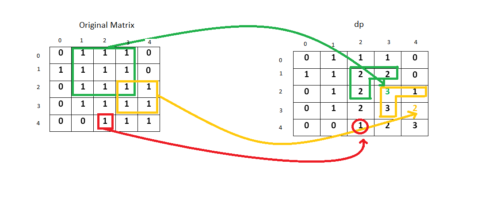

221. Maximal Square

Given a 2D binary matrix filled with 0's and 1's, find the largest square containing only 1's and return its area.

**Example:**
```
Input: 

1 0 1 0 0
1 0 1 1 1
1 1 1 1 1
1 0 0 1 0

Output: 4
```
# Summary
We need to find the largest square comprising of all ones in the given m \times nm×n matrix. In other words we need to find the largest set of connected ones in the given matrix that forms a square.

# Solution
---
## Approach #1 Brute Force [Accepted]
The simplest approach consists of trying to find out every possible square of 1’s that can be formed from within the matrix. The question now is – how to go for it?

We use a variable to contain the size of the largest square found so far and another variable to store the size of the current, both initialized to 0. Starting from the left uppermost point in the matrix, we search for a 1. No operation needs to be done for a 0. Whenever a 1 is found, we try to find out the largest square that can be formed including that 1. For this, we move diagonally (right and downwards), i.e. we increment the row index and column index temporarily and then check whether all the elements of that row and column are 1 or not. If all the elements happen to be 1, we move diagonally further as previously. If even one element turns out to be 0, we stop this diagonal movement and update the size of the largest square. Now we, continue the traversal of the matrix from the element next to the initial 1 found, till all the elements of the matrix have been traversed.

```java
public class Solution {
    public int maximalSquare(char[][] matrix) {
        int rows = matrix.length, cols = rows > 0 ? matrix[0].length : 0;
        int maxsqlen = 0;
        for (int i = 0; i < rows; i++) {
            for (int j = 0; j < cols; j++) {
                if (matrix[i][j] == '1') {
                    int sqlen = 1;
                    boolean flag = true;
                    while (sqlen + i < rows && sqlen + j < cols && flag) {
                        for (int k = j; k <= sqlen + j; k++) {
                            if (matrix[i + sqlen][k] == '0') {
                                flag = false;
                                break;
                            }
                        }
                        for (int k = i; k <= sqlen + i; k++) {
                            if (matrix[k][j + sqlen] == '0') {
                                flag = false;
                                break;
                            }
                        }
                        if (flag)
                            sqlen++;
                    }
                    if (maxsqlen < sqlen) {
                        maxsqlen = sqlen;
                    }
                }
            }
        }
        return maxsqlen * maxsqlen;
    }
}
```

**Complexity Analysis**

* Time complexity : $O\big((mn)^2\big)$. In worst case, we need to traverse the complete matrix for every 1.
* Space complexity : $O(1)$. No extra space is used.

## Approach #2 (Dynamic Programming) [Accepted]
**Algorithm**

We will explain this approach with the help of an example.

```
0 1 1 1 0
1 1 1 1 1
0 1 1 1 1
0 1 1 1 1
0 0 1 1 1
```

We initialize another matrix `(dp)` with the same dimensions as the original one initialized with all 0’s.

`dp(i,j)` represents the side length of the maximum square whose bottom right corner is the cell with index `(i,j)` in the original matrix.

Starting from index `(0,0)`, for every 1 found in the original matrix, we update the value of the current element as

$\text{dp}(i, j) = \min \big( \text{dp}(i-1, j), \text{dp}(i-1, j-1), \text{dp}(i, j-1) \big) + 1.$

We also remember the size of the largest square found so far. In this way, we traverse the original matrix once and find out the required maximum size. This gives the side length of the square (say $maxsqlen$). The required result is the area $maxsqlen^2$.

To understand how this solution works, see the figure below.



An entry 2 at $(1, 3)$ implies that we have a square of side 2 up to that index in the original matrix. Similarly, a 2 at $(1, 2)$ and $(2, 2)$ implies that a square of side 2 exists up to that index in the original matrix. Now to make a square of side 3, only a single entry of 1 is pending at $(2, 3)$. So, we enter a 3 corresponding to that position in the dp array.

Now consider the case for the index $(3, 4)$. Here, the entries at index $(3, 3)$ and $(2, 3)$ imply that a square of side 3 is possible up to their indices. But, the entry 1 at index $(2, 4)$ indicates that a square of side 1 only can be formed up to its index. Therefore, while making an entry at the index $(3, 4)$, this element obstructs the formation of a square having a side larger than 2. Thus, the maximum sized square that can be formed up to this index is of size $2\times2$.

```java
public class Solution {
    public int maximalSquare(char[][] matrix) {
        int rows = matrix.length, cols = rows > 0 ? matrix[0].length : 0;
        int[][] dp = new int[rows + 1][cols + 1];
        int maxsqlen = 0;
        for (int i = 1; i <= rows; i++) {
            for (int j = 1; j <= cols; j++) {
                if (matrix[i-1][j-1] == '1'){
                    dp[i][j] = Math.min(Math.min(dp[i][j - 1], dp[i - 1][j]), dp[i - 1][j - 1]) + 1;
                    maxsqlen = Math.max(maxsqlen, dp[i][j]);
                }
            }
        }
        return maxsqlen * maxsqlen;
    }
}
```

**Complexity Analysis**

* Time complexity : $O(mn)$. Single pass.

* Space complexity : $O(mn)$. Another matrix of same size is used for dp

## Approach #3 (Better Dynamic Programming) [Accepted]
**Algorithm**

In the previous approach for calculating dp of $i^{th}$ row we are using only the previous element and the $(i-1)^{th}$ row. Therefore, we don't need 2D dp matrix as 1D dp array will be sufficient for this.

Initially the dp array contains all 0's. As we scan the elements of the original matrix across a row, we keep on updating the dp array as per the equation $dp[j]=min(dp[j-1],dp[j],prev)$, where `prev` refers to the old $dp[j-1]$. For every row, we repeat the same process and update in the same dp array.


```java
public class Solution {
    public int maximalSquare(char[][] matrix) {
        int rows = matrix.length, cols = rows > 0 ? matrix[0].length : 0;
        int[] dp = new int[cols + 1];
        int maxsqlen = 0, prev = 0;
        for (int i = 1; i <= rows; i++) {
            for (int j = 1; j <= cols; j++) {
                int temp = dp[j];
                if (matrix[i - 1][j - 1] == '1') {
                    dp[j] = Math.min(Math.min(dp[j - 1], prev), dp[j]) + 1;
                    maxsqlen = Math.max(maxsqlen, dp[j]);
                } else {
                    dp[j] = 0;
                }
                prev = temp;
            }
        }
        return maxsqlen * maxsqlen;
    }
}
```

**Complexity Analysis**

* Time complexity : $O(mn)$. Single pass.

* Space complexity : $O(n)$. Another array which stores elements in a row is used for dp.

# Submissions
---
**Solution 1: (Dynamic Programming Bottm-Up)**
```
Runtime: 208 ms
Memory Usage: 13.8 MB
```
```python
class Solution:
    def maximalSquare(self, matrix):
        """
        :type matrix: List[List[str]]
        :rtype: int
        """
        rows, cols = len(matrix), len(matrix[0]) if matrix else 0
        dp = [[0]*(cols + 1) for _ in range(rows + 1)]
        maxsqlen = 0
        for i in range(1, rows + 1):
            for j in range(1, cols + 1):
                if matrix[i-1][j-1] == '1':
                    dp[i][j] = min(min(dp[i][j - 1], dp[i - 1][j]), dp[i - 1][j - 1]) + 1
                    maxsqlen = max(maxsqlen, dp[i][j])

        return maxsqlen **2
```

**Solution 2: (Better Dynamic Programming Bottom-Up 1D)**
```
Runtime: 200 ms
Memory Usage: 14.7 MB
```
```python
class Solution:
    def maximalSquare(self, matrix):
        """
        :type matrix: List[List[str]]
        :rtype: int
        """
        rows, cols = len(matrix), len(matrix[0]) if matrix else 0
        dp = [0]*(cols + 1)
        pre = 0
        maxsqlen = 0
        for i in range(1, rows + 1):
            for j in range(1, cols + 1):
                tmp = dp[j]
                if matrix[i-1][j-1] == '1':
                    dp[j] = min(min(dp[j - 1], dp[j]), pre) + 1
                    maxsqlen = max(maxsqlen, dp[j])
                else:
                    dp[j] = 0
                pre = tmp
        return maxsqlen **2
```

**Solution 3: (DP Bottom-Up)**
```
Runtime: 64 ms
Memory Usage: N/A
```
```python
class Solution:
    def maximalSquare(self, matrix):
        """
        :type matrix: List[List[str]]
        :rtype: int
        """
        if not matrix or len(matrix) == 0:
            return 0
        lrow = len(matrix)
        lcol = len(matrix[0])
        
        # dp array stores max length of edge of the square ends at this point
        dp_row = matrix[0] 
        for index in range(lcol): 
            dp_row[index]=int(dp_row[index])
        maxArea = max(dp_row) # to counter corner case that there is only one row
        
        for row in range(1, lrow):
            dp_row2 = [int(matrix[row][0])]+[0 for _ in range(1, lcol)]
            for col in range(1, lcol):
                if matrix[row][col] == "1":
                    dp_row2[col] = min(dp_row[col], dp_row2[col-1], dp_row[col-1]) + 1
            maxArea = max(maxArea, max(dp_row2))
            dp_row = list(dp_row2)
                    
        return maxArea**2
```

**Solution 4: (DP Top-Down)**
```
Runtime: 272 ms
Memory Usage: 28.9 MB
```
```python
class Solution:
    def maximalSquare(self, matrix):
        """
        :type matrix: List[List[str]]
        :rtype: int
        """
        R, C = len(matrix), len(matrix[0]) if matrix else 0
        
        @functools.lru_cache(None)
        def dp(i, j):
            if i < 0 or j < 0:
                return 0, 0

            up = dp(i, j-1)
            upleft = dp(i-1, j-1)
            left = dp(i-1, j)
            minimum = min(up[0], upleft[0], left[0])
            best = max(up[1], upleft[1], left[1])

            if matrix[i][j] == '1':
                return (minimum + 1, max(best, minimum + 1))
            return (0, max(best, 0))

        return dp(R-1, C-1)[1]**2
```

**Solution 5: (DP Top-Down)**
```
Runtime: 284 ms
Memory Usage: 29 MB
```
```python
class Solution:
    def maximalSquare(self, matrix):
        """
        :type matrix: List[List[str]]
        :rtype: int
        """
        
        @lru_cache(None)
        def dp(i, j):
            if i >= len(matrix) or j >= len(matrix[0]):
                return 0, 0
            
            right = dp(i, j+1)
            downright = dp(i+1, j+1)
            down = dp(i+1, j)
            minimum = min(right[0], downright[0], down[0])
            best = max(right[1], downright[1], down[1])
            
            if matrix[i][j] == '1':
                if downright:
                    return (minimum + 1, max(best, minimum + 1))
                return (1, max(best, 1))
            return (0, max(best, 0))
        
        return dp(0,0)[1]**2
```

**Solution 6: (DP Bottom-Up)**
```
Runtime: 16 ms
Memory Usage: 8.2 MB
```
```c

#define min(a, b)  (a < b ? a : b)
#define max(a, b)  (a > b ? a : b)
int maximalSquare(char** matrix, int matrixSize, int* matrixColSize){
    int max_len = 0;
    int **dp = malloc((matrixSize+1)*sizeof(int *));
    for (int i = 0; i < (matrixSize+1); i ++)
        dp[i] = calloc(1, ((*matrixColSize)+1)*sizeof(int));
    for (int i = 0; i < matrixSize; i ++) {
        for (int j = 0; j < *matrixColSize; j ++) {
            if (matrix[i][j] == '1') {
                dp[i+1][j+1] = min(min(dp[i][j], dp[i][j+1]), dp[i+1][j]) + 1;
                max_len = max(max_len, dp[i+1][j+1]);
            }
        }
    }
    return max_len*max_len;
}
```
