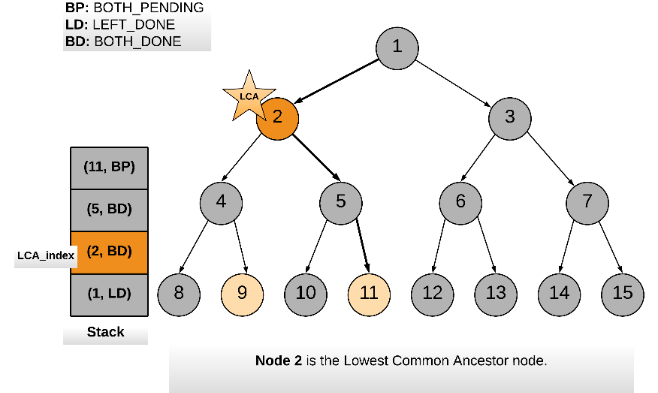

236. Lowest Common Ancestor of a Binary Tree

Given a binary tree, find the lowest common ancestor (LCA) of two given nodes in the tree.

According to the definition of LCA on Wikipedia: “The lowest common ancestor is defined between two nodes p and q as the lowest node in T that has both p and q as descendants (where we allow **a node to be a descendant of itself**).”

Given the following binary tree:  root = [3,5,1,6,2,0,8,null,null,7,4]


**Example 1:**
```
Input: root = [3,5,1,6,2,0,8,null,null,7,4], p = 5, q = 1
Output: 3
Explanation: The LCA of nodes 5 and 1 is 3.
```

**Example 2:**
```
Input: root = [3,5,1,6,2,0,8,null,null,7,4], p = 5, q = 4
Output: 5
Explanation: The LCA of nodes 5 and 4 is 5, since a node can be a descendant of itself according to the LCA definition.
```

**Note:**

* All of the nodes' values will be unique.
* `p` and `q` are different and both values will exist in the binary tree.

# Solution
---
First the given nodes `p` and `q` are to be searched in a binary tree and then their lowest common ancestor is to be found. We can resort to a normal tree traversal to search for the two nodes. Once we reach the desired nodes `p` and `q`, we can backtrack and find the lowest common ancestor.


## Approach 1: Recursive Approach
**Intuition**

The approach is pretty intuitive. Traverse the tree in a depth first manner. The moment you encounter either of the nodes `p` or `q`, return some boolean flag. The flag helps to determine if we found the required nodes in any of the paths. The least common ancestor would then be the node for which both the subtree recursions return a `True` flag. It can also be the node which itself is one of `p` or `q` and for which one of the subtree recursions returns a `True` flag.

Let us look at the formal algorithm based on this idea.

**Algorithm**

1. Start traversing the tree from the root node.
1. If the current node itself is one of `p` or `q`, we would mark a variable `mid` as `True` and continue the search for the other node in the left and right branches.
1. If either of the left or the right branch returns `True`, this means one of the two nodes was found below.
1. If at any point in the traversal, any two of the three flags `left`, `right` or `mid` become `True`, this means we have found the lowest common ancestor for the nodes `p` and `q`.

Let us look at a sample tree and we search for the lowest common ancestor of two nodes 9 and 11 in the tree.


Following is the sequence of nodes that are followed in the recursion:
```
1 --> 2 --> 4 --> 8
BACKTRACK 8 --> 4
4 --> 9 (ONE NODE FOUND, return True)
BACKTRACK 9 --> 4 --> 2
2 --> 5 --> 10
BACKTRACK 10 --> 5
5 --> 11 (ANOTHER NODE FOUND, return True)
BACKTRACK 11 --> 5 --> 2

2 is the node where we have left = True and right = True and hence it is the lowest common ancestor.
```

```python
class Solution:

    def __init__(self):
        # Variable to store LCA node.
        self.ans = None

    def lowestCommonAncestor(self, root, p, q):
        """
        :type root: TreeNode
        :type p: TreeNode
        :type q: TreeNode
        :rtype: TreeNode
        """
        def recurse_tree(current_node):

            # If reached the end of a branch, return False.
            if not current_node:
                return False

            # Left Recursion
            left = recurse_tree(current_node.left)

            # Right Recursion
            right = recurse_tree(current_node.right)

            # If the current node is one of p or q
            mid = current_node == p or current_node == q

            # If any two of the three flags left, right or mid become True.
            if mid + left + right >= 2:
                self.ans = current_node

            # Return True if either of the three bool values is True.
            return mid or left or right

        # Traverse the tree
        recurse_tree(root)
        return self.ans
```

**Complexity Analysis**

* Time Complexity: $O(N)$, where $N$ is the number of nodes in the binary tree. In the worst case we might be visiting all the nodes of the binary tree.

* Space Complexity: $O(N)$. This is because the maximum amount of space utilized by the recursion stack would be $N$ since the height of a skewed binary tree could be $N$.

## Approach 2: Iterative using parent pointers
**Intuition**

If we have parent pointers for each node we can traverse back from `p` and `q` to get their ancestors. The first common node we get during this traversal would be the LCA node. We can save the parent pointers in a dictionary as we traverse the tree.

**Algorithm**

1. Start from the root node and traverse the tree.
1. Until we find `p` and `q` both, keep storing the parent pointers in a dictionary.
1. Once we have found both `p` and `q`, we get all the ancestors for `p` using the parent dictionary and add to a set called `ancestors`.
1. Similarly, we traverse through ancestors for node `q`. If the ancestor is present in the ancestors set for `p`, this means this is the first ancestor common between `p` and `q` (while traversing upwards) and hence this is the LCA node.

```python
class Solution:

    def lowestCommonAncestor(self, root, p, q):
        """
        :type root: TreeNode
        :type p: TreeNode
        :type q: TreeNode
        :rtype: TreeNode
        """

        # Stack for tree traversal
        stack = [root]

        # Dictionary for parent pointers
        parent = {root: None}

        # Iterate until we find both the nodes p and q
        while p not in parent or q not in parent:

            node = stack.pop()

            # While traversing the tree, keep saving the parent pointers.
            if node.left:
                parent[node.left] = node
                stack.append(node.left)
            if node.right:
                parent[node.right] = node
                stack.append(node.right)

        # Ancestors set() for node p.
        ancestors = set()

        # Process all ancestors for node p using parent pointers.
        while p:
            ancestors.add(p)
            p = parent[p]

        # The first ancestor of q which appears in
        # p's ancestor set() is their lowest common ancestor.
        while q not in ancestors:
            q = parent[q]
        return q
```

**Complexity Analysis**

* Time Complexity : $O(N)$, where $N$ is the number of nodes in the binary tree. In the worst case we might be visiting all the nodes of the binary tree.

* Space Complexity : $O(N)$. In the worst case space utilized by the stack, the parent pointer dictionary and the ancestor set, would be $N$ each, since the height of a skewed binary tree could be $N$.

## Approach 3: Iterative without parent pointers
**Intuition**

In the previous approach, we come across the LCA during the backtracking process. We can get rid of the backtracking process itself. In this approach we always have a pointer to the probable LCA and the moment we find both the nodes we return the pointer as the answer.

**Algorithm**

1. Start with root node.
1. Put the `(root, root_state)` on to the stack. `root_state` defines whether one of the children or both children of root are left for traversal.
1. While the stack is not empty, peek into the top element of the stack represented as `(parent_node, parent_state)`.
1. Before traversing any of the child nodes of `parent_node` we check if the `parent_node` itself is one of `p` or `q`.
1. First time we find either of `p` or `q`, set a boolean flag called `one_node_found` to `True`. Also start keeping track of the lowest common ancestors by keeping a note of the top index of the stack in the variable `LCA_index`. Since all the current elements of the stack are ancestors of the node we just found.
1. The second time `parent_node == p` or `parent_node == q` it means we have found both the nodes and we can return the LCA node.
1. Whenever we visit a child of a `parent_node` we push the `(parent_node, updated_parent_state)` onto the stack. We update the state of the parent since a child/branch has been visited/processed and accordingly the state changes.
1. A node finally gets popped off from the stack when the state becomes `BOTH_DONE` implying both left and right subtrees have been pushed onto the stack and processed. If `one_node_found` is `True` then we need to check if the top node being popped could be one of the ancestors of the found node. In that case we need to reduce `LCA_index` by one. Since one of the ancestors was popped off.

>Whenever both `p` and `q` are found, `LCA_index` would be pointing to an index in the stack which would contain all the common ancestors between `p` and `q`. And the `LCA_index` element has the lowest ancestor common between `p` and `q`.




The animation above shows how a stack is used to traverse the binary tree and keep track of the common ancestors between nodes `p` and `q`.

```python
class Solution:

    # Three static flags to keep track of post-order traversal.

    # Both left and right traversal pending for a node.
    # Indicates the nodes children are yet to be traversed.
    BOTH_PENDING = 2
    # Left traversal done.
    LEFT_DONE = 1
    # Both left and right traversal done for a node.
    # Indicates the node can be popped off the stack.
    BOTH_DONE = 0

    def lowestCommonAncestor(self, root, p, q):
        """
        :type root: TreeNode
        :type p: TreeNode
        :type q: TreeNode
        :rtype: TreeNode
        """

        # Initialize the stack with the root node.
        stack = [(root, Solution.BOTH_PENDING)]

        # This flag is set when either one of p or q is found.
        one_node_found = False

        # This is used to keep track of LCA index.
        LCA_index = -1

        # We do a post order traversal of the binary tree using stack
        while stack:

            parent_node, parent_state = stack[-1]

            # If the parent_state is not equal to BOTH_DONE,
            # this means the parent_node can't be popped of yet.
            if parent_state != Solution.BOTH_DONE:

                # If both child traversals are pending
                if parent_state == Solution.BOTH_PENDING:

                    # Check if the current parent_node is either p or q.
                    if parent_node == p or parent_node == q:

                        # If one_node_found is set already, this means we have found both the nodes.
                        if one_node_found:
                            return stack[LCA_index][0]
                        else:
                            # Otherwise, set one_node_found to True,
                            # to mark one of p and q is found.
                            one_node_found = True

                            # Save the current top index of stack as the LCA_index.
                            LCA_index = len(stack) - 1

                    # If both pending, traverse the left child first
                    child_node = parent_node.left
                else:
                    # traverse right child
                    child_node = parent_node.right

                # Update the node state at the top of the stack
                # Since we have visited one more child.
                stack.pop()
                stack.append((parent_node, parent_state - 1))

                # Add the child node to the stack for traversal.
                if child_node:
                    stack.append((child_node, Solution.BOTH_PENDING))
            else:

                # If the parent_state of the node is both done,
                # the top node could be popped off the stack.

                # i.e. If LCA_index is equal to length of stack. Then we decrease LCA_index by 1.
                if one_node_found and LCA_index == len(stack) - 1:
                    LCA_index -= 1
                stack.pop()

        return None
```

**Complexity Analysis**

* Time Complexity : $O(N)$, where $N$ is the number of nodes in the binary tree. In the worst case we might be visiting all the nodes of the binary tree. The advantage of this approach is that we can prune backtracking. We simply return once both the nodes are found.

* Space Complexity : $O(N)$. In the worst case the space utilized by stack would be NN since the height of a skewed binary tree could be $N$.

# Submissions
---
**Solution:**
```
Runtime: 80 ms
Memory Usage: 25.8 MB
```
```python
# Definition for a binary tree node.
# class TreeNode:
#     def __init__(self, x):
#         self.val = x
#         self.left = None
#         self.right = None

class Solution:
    
    def __init__(self):
        # Variable to store LCA node.
        self.ans = None
    
    def lowestCommonAncestor(self, root: 'TreeNode', p: 'TreeNode', q: 'TreeNode') -> 'TreeNode':
        def recurse_tree(current_node):
            
            # If reached the end of a branch, return False.
            if not current_node:
                return False

            # Left Recursion
            left = recurse_tree(current_node.left)

            # Right Recursion
            right = recurse_tree(current_node.right)

            # If the current node is one of p or q
            mid = current_node == p or current_node == q

            # If any two of the three flags left, right or mid become True.
            if mid + left + right >= 2:
                self.ans = current_node

            # Return True if either of the three bool values is True.
            return mid or left or right

        # Traverse the tree
        recurse_tree(root)
        return self.ans
```

**Solution:**
```
Runtime: 72 ms
Memory Usage: 16.6 MB
```
```python
# Definition for a binary tree node.
# class TreeNode:
#     def __init__(self, x):
#         self.val = x
#         self.left = None
#         self.right = None

class Solution:
    
    def lowestCommonAncestor(self, root: 'TreeNode', p: 'TreeNode', q: 'TreeNode') -> 'TreeNode':
        
        # Stack for tree traversal
        stack = [root]

        # Dictionary for parent pointers
        parent = {root: None}

        # Iterate until we find both the nodes p and q
        while p not in parent or q not in parent:

            node = stack.pop()

            # While traversing the tree, keep saving the parent pointers.
            if node.left:
                parent[node.left] = node
                stack.append(node.left)
            if node.right:
                parent[node.right] = node
                stack.append(node.right)

        # Ancestors set() for node p.
        ancestors = set()

        # Process all ancestors for node p using parent pointers.
        while p:
            ancestors.add(p)
            p = parent[p]

        # The first ancestor of q which appears in
        # p's ancestor set() is their lowest common ancestor.
        while q not in ancestors:
            q = parent[q]
        return q
```