238. Product of Array Except Self

Given an array `nums` of n integers where n > 1,  return an array `output` such that `output[i]` is equal to the product of all the elements of `nums` except `nums[i]`.

**Example:**
```
Input:  [1,2,3,4]
Output: [24,12,8,6]
```
**Note:** Please solve it **without division** and in $O(n)$.

**Follow up:**
Could you solve it with constant space complexity? (The output array **does not** count as extra space for the purpose of space complexity analysis.)

# Solution
---
From the looks of it, this seems like a simple enough problem to solve in linear time and space. We can simply take the product of all the elements in the given array and then, for each of the elements $x$ of the array, we can simply `find product of array except self` value by dividing the product by $x$.

Doing this for each of the elements would solve the problem. However, there's a note in the problem which says that we are not allowed to use division operation. That makes solving this problem a bit harder.

## Approach 1: Left and Right product lists
It's much easier to build an intuition for solving this problem without division once you visualize how the different products except self look like for each of the elements. So, let's take a look at an example array and the different products.


Looking at the figure about we can figure another way of computing those different product values.

> Instead of dividing the product of all the numbers in the array by the number at a given index to get the corresponding product, we can make use of the product of all the numbers to the left and all the numbers to the right of the index. Multiplying these two individual products would give us the desired result as well.

For every given index, $i$, we will make use of the product of all the numbers to the left of it and multiply it by the product of all the numbers to the right. This will give us the product of all the numbers except the one at the given index $i$. Let's look at a formal algorithm describing this idea more concretely.

**Algorithm**

1. Initialize two empty arrays, L and R where for a given index i, L[i] would contain the product of all the numbers to the left of i and R[i] would contain the product of all the numbers to the right of i.
1. We would need two different loops to fill in values for the two arrays. For the array L, $L[0]$ would be 1 since there are no elements to the left of the first element. For the rest of the elements, we simply use $L[i] = L[i - 1] * nums[i - 1]$. Remember that L[i] represents product of all the elements to the left of element at index i.
* For the other array, we do the same thing but in reverse i.e. we start with the initial value of 1 in $R[length - 1]$ where $length$ is the number of elements in the array, and keep updating R[i] in reverse. Essentially, $R[i] = R[i + 1] * nums[i + 1]$. Remember that R[i] represents product of all the elements to the right of element at index i.
* Once we have the two arrays set up properly, we simply iterate over the input array one element at a time, and for each element at index i, we find the product except self as $L[i] * R[i]$.

Let's go over a simple run of the algorithm that clearly depicts the construction of the two intermediate arrays and finally the answer array.

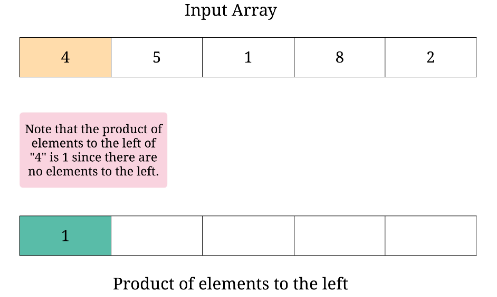
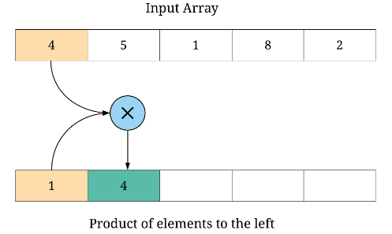
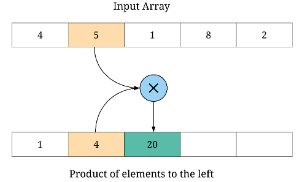
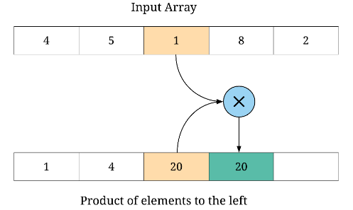
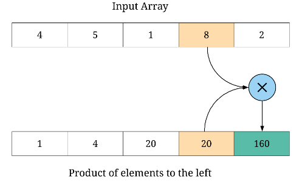
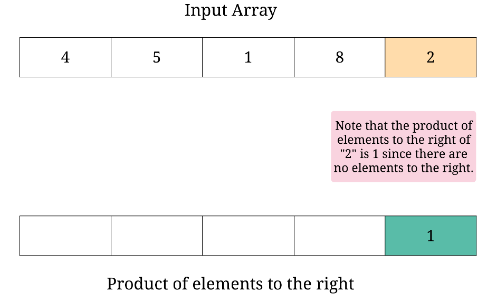
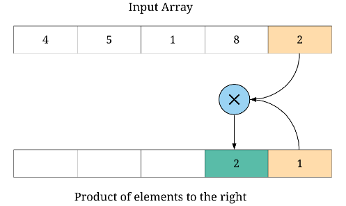
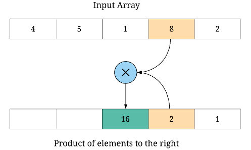
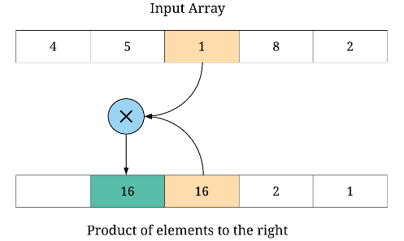
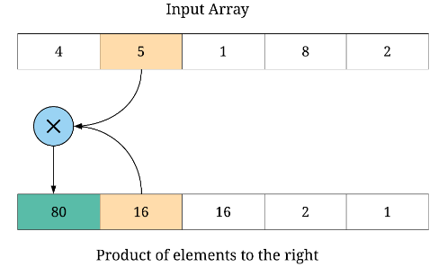

For the given array $[4,5,1,8,2]$, the `L` and `R` arrays would finally be:

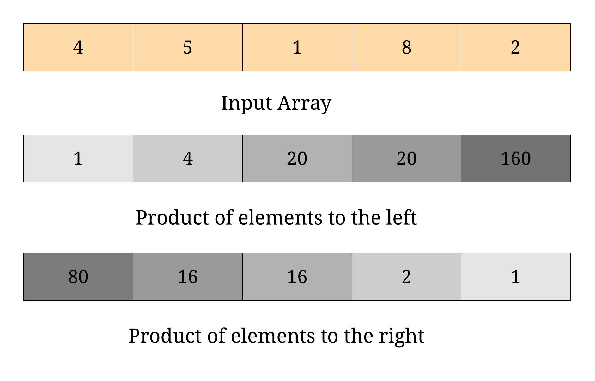

```python
class Solution:
    def productExceptSelf(self, nums: List[int]) -> List[int]:
        
        # The length of the input array 
        length = len(nums)
        
        # The left and right arrays as described in the algorithm
        L, R, answer = [0]*length, [0]*length, [0]*length
        
        # L[i] contains the product of all the elements to the left
        # Note: for the element at index '0', there are no elements to the left,
        # so the L[0] would be 1
        L[0] = 1
        for i in range(1, length):
            
            # L[i - 1] already contains the product of elements to the left of 'i - 1'
            # Simply multiplying it with nums[i - 1] would give the product of all 
            # elements to the left of index 'i'
            L[i] = nums[i - 1] * L[i - 1]
        
        # R[i] contains the product of all the elements to the right
        # Note: for the element at index 'length - 1', there are no elements to the right,
        # so the R[length - 1] would be 1
        R[length - 1] = 1
        for i in reversed(range(length - 1)):
            
            # R[i + 1] already contains the product of elements to the right of 'i + 1'
            # Simply multiplying it with nums[i + 1] would give the product of all 
            # elements to the right of index 'i'
            R[i] = nums[i + 1] * R[i + 1]
        
        # Constructing the answer array
        for i in range(length):
            # For the first element, R[i] would be product except self
            # For the last element of the array, product except self would be L[i]
            # Else, multiple product of all elements to the left and to the right
            answer[i] = L[i] * R[i]
        
        return answer
```

**Complexity analysis**

* Time complexity : $O(N)$ where NN represents the number of elements in the input array. We use one iteration to construct the array $L$, one to construct the array $R$ and one last to construct the $answer$ array using $L$ and $R$.
* Space complexity : $O(N)$ used up by the two intermediate arrays that we constructed to keep track of product of elements to the left and right.

## Approach 2: O(1) space approach
Although the above solution is good enough to solve the problem since we are not using division anymore, there's a follow-up component as well which asks us to solve this using constant space. Understandably so, the output array does not count towards the space complexity. This approach is essentially an extension of the approach above. Basically, we will be using the output array as one of `L` or `R` and we will be constructing the other one on the fly. Let's look at the algorithm based on this idea.

**Algorithm**

1. Initialize the empty `answer` array where for a given index `i`, `answer[i]` would contain the product of all the numbers to the left of `i`.
1. We construct the answer array the same way we constructed the `L` array in the previous approach. These two algorithms are exactly the same except that we are trying to save up on space.
1. The only change in this approach is that we don't explicitly build the `R` array from before. Instead, we simply use a variable to keep track of the running product of elements to the right and we keep updating the answer array by doing $answer[i] = answer[i] * R$. For a given index `i`, answer[i] contains the product of all the elements to the left and `R` would contain product of all the elements to the right. We then update `R` as $R = R * nums[i]$

```python
class Solution:
    def productExceptSelf(self, nums: List[int]) -> List[int]:
        
        # The length of the input array 
        length = len(nums)
        
        # The answer array to be returned
        answer = [0]*length
        
        # answer[i] contains the product of all the elements to the left
        # Note: for the element at index '0', there are no elements to the left,
        # so the answer[0] would be 1
        answer[0] = 1
        for i in range(1, length):
            
            # answer[i - 1] already contains the product of elements to the left of 'i - 1'
            # Simply multiplying it with nums[i - 1] would give the product of all 
            # elements to the left of index 'i'
            answer[i] = nums[i - 1] * answer[i - 1]
        
        # R contains the product of all the elements to the right
        # Note: for the element at index 'length - 1', there are no elements to the right,
        # so the R would be 1
        R = 1;
        for i in reversed(range(length)):
            
            # For the index 'i', R would contain the 
            # product of all elements to the right. We update R accordingly
            answer[i] = answer[i] * R
            R *= nums[i]
        
        return answer
```

**Complexity analysis**

* Time complexity : $O(N)$ where NN represents the number of elements in the input array. We use one iteration to construct the array LL, one to update the array answeranswer.
* Space complexity : $O(1)$ since don't use any additional array for our computations. The problem statement mentions that using the $answer$ array doesn't add to the space complexity.

# Submissions
---
**Solution**
```
Runtime: 104 ms
Memory Usage: N/A
```
```python
class Solution(object):
    def productExceptSelf(self, nums):
        """
        :type nums: List[int]
        :rtype: List[int]
        """
        ans = []
        n = len(nums)
        p = 1
        for i in range(n):
            ans.append(p)
            p *= nums[i]
        p = 1
        for i in range(n-1, -1, -1):
            ans[i] *= p
            p *= nums[i]
        return ans
```
