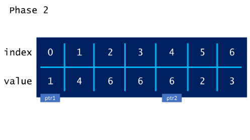
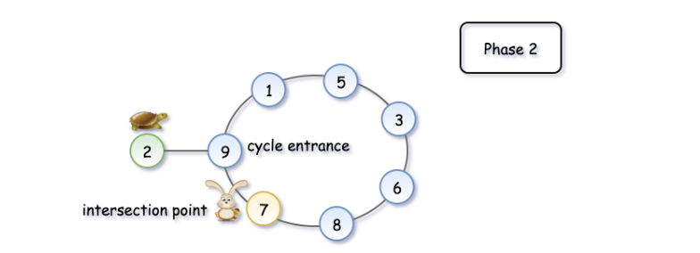
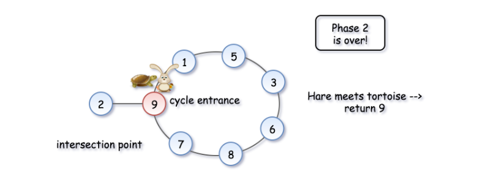

287. Find the Duplicate Number

Given an array nums containing n + 1 integers where each integer is between 1 and n (inclusive), prove that at least one duplicate number must exist. Assume that there is only one duplicate number, find the duplicate one.

**Example 1:**
```
Input: [1,3,4,2,2]
Output: 2
```
**Example 2:**
```
Input: [3,1,3,4,2]
Output: 3
```
**Note:**

* You must not modify the array (assume the array is read only).
* You must use only constant, $O(1)$ extra space.
* Your runtime complexity should be less than $O(n^2)$.
* There is only one duplicate number in the array, but it could be repeated more than once.

# Solution
---
### Note
The first two approaches mentioned do not satisfy the constraints given in the prompt, but they are solutions that you might be likely to come up with during a technical interview. As an interviewer, I personally would not expect someone to come up with the cycle detection solution unless they have heard it before.

### Proof
Proving that at least one duplicate must exist in nums is simple application of the pigeonhole principle. Here, each number in `nums` is a "pigeon" and each distinct number that can appear in `nums` is a "pigeonhole". Because there are $n+1$ numbers are $n$ distinct possible numbers, the pigeonhole principle implies that at least one of the numbers is duplicated.

## Approach #1 Sorting [Accepted]
**Intuition**

If the numbers are sorted, then any duplicate numbers will be adjacent in the sorted array.

**Algorithm**

Given the intuition, the algorithm follows fairly simply. First, we sort the array, and then we compare each element to the previous element. Because there is exactly one duplicated element in the array, we know that the array is of at least length 2, and we can return the duplicate element as soon as we find it.

```python
class Solution:
    def findDuplicate(self, nums):
        nums.sort()
        for i in range(1, len(nums)):
            if nums[i] == nums[i-1]:
                return nums[i]
```

**Complexity Analysis**

* Time complexity : $O(nlgn)$

The sort invocation costs $O(nlgn)$ time in Python and Java, so it dominates the subsequent linear scan.

* Space complexity : $O(1)$ (or $O(n)$)

Here, we sort `nums` in place, so the memory footprint is constant. If we cannot modify the input array, then we must allocate linear space for a copy of `nums` and sort that instead.

## Approach #2 Set [Accepted]
**Intuition**

If we store each element as we iterate over the array, we can simply check each element as we iterate over the array.

**Algorithm**

In order to achieve linear time complexity, we need to be able to insert elements into a data structure (and look them up) in constant time. A Set satisfies these constraints nicely, so we iterate over the array and insert each element into seen. Before inserting it, we check whether it is already there. If it is, then we found our duplicate, so we return it.

```python
class Solution:
    def findDuplicate(self, nums):
        seen = set()
        for num in nums:
            if num in seen:
                return num
            seen.add(num)
```

**Complexity Analysis**

* Time complexity : $O(n)$

Set in both Python and Java rely on underlying hash tables, so insertion and lookup have amortized constant time complexities. The algorithm is therefore linear, as it consists of a for loop that performs constant work $n$ times.

* Space complexity : $O(n)$

In the worst case, the duplicate element appears twice, with one of its appearances at array index $n-1$. In this case, seen will contain $n-1$ distinct values, and will therefore occupy $O(n)$ space.

## Approach #3 Floyd's Tortoise and Hare (Cycle Detection) [Accepted]
**Intuition**

If we interpret `nums` such that for each pair of index $i$ and value $v_i$, the "next" value $v_j$ is at index $v_i$, we can reduce this problem to cycle detection. See the solution to Linked List Cycle II for more details.

**Algorithm**

First off, we can easily show that the constraints of the problem imply that a cycle must exist. Because each number in `nums` is between $1$ and $n$, it will necessarily point to an index that exists. Therefore, the list can be traversed infinitely, which implies that there is a cycle. Additionally, because $0$ cannot appear as a value in `nums`, `nums[0]` cannot be part of the cycle. Therefore, traversing the array in this manner from `nums[0]` is equivalent to traversing a cyclic linked list. Given this, the problem can be solved just like Linked List Cycle II.

To see the algorithm in action, check out the animation below:







```python
class Solution:
    def findDuplicate(self, nums):
        # Find the intersection point of the two runners.
        tortoise = hare = nums[0]
        while True:
            tortoise = nums[tortoise]
            hare = nums[nums[hare]]
            if tortoise == hare:
                break
        
        # Find the "entrance" to the cycle.
        tortoise = nums[0]
        while tortoise != hare:
            tortoise = nums[tortoise]
            hare = nums[hare]
        
        return hare
```

**Complexity Analysis**

* Time complexity : $O(n)$

For detailed analysis, refer to Linked List Cycle II.

* Space complexity : $O(1)$

For detailed analysis, refer to Linked List Cycle II.

# Submissions
---
**Solution 1: (Two Pointers, detect cycle entry point)**
```
Runtime: 92 ms
Memory Usage: 16.4 MB
```
```python
class Solution:
    def findDuplicate(self, nums):
        """
        :type nums: List[int]
        :rtype: int
        """
        # Find the intersection point of the two runners.
        tortoise = hare = nums[0]
        while True:
            tortoise = nums[tortoise]
            hare = nums[nums[hare]]
            if tortoise == hare:
                break
        
        # Find the "entrance" to the cycle.
        tortoise = nums[0]
        while tortoise != hare:
            tortoise = nums[tortoise]
            hare = nums[hare]
        
        return hare
```

**Solution 2: (Two Pointers, detect cycle entry point)**
```
Runtime: 82 ms
Memory: 63.50 MB
```
```c++
class Solution {
public:
    int findDuplicate(vector<int>& nums) {
        int i = nums[0], j = nums[0];
        while (1) {
            i = nums[i];
            j = nums[nums[j]];
            if (i == j) {
                break;
            }
        }
        i = nums[0];
        while (i != j) {
            i = nums[i];
            j = nums[j];
        }
        return i;
    }
};
```
