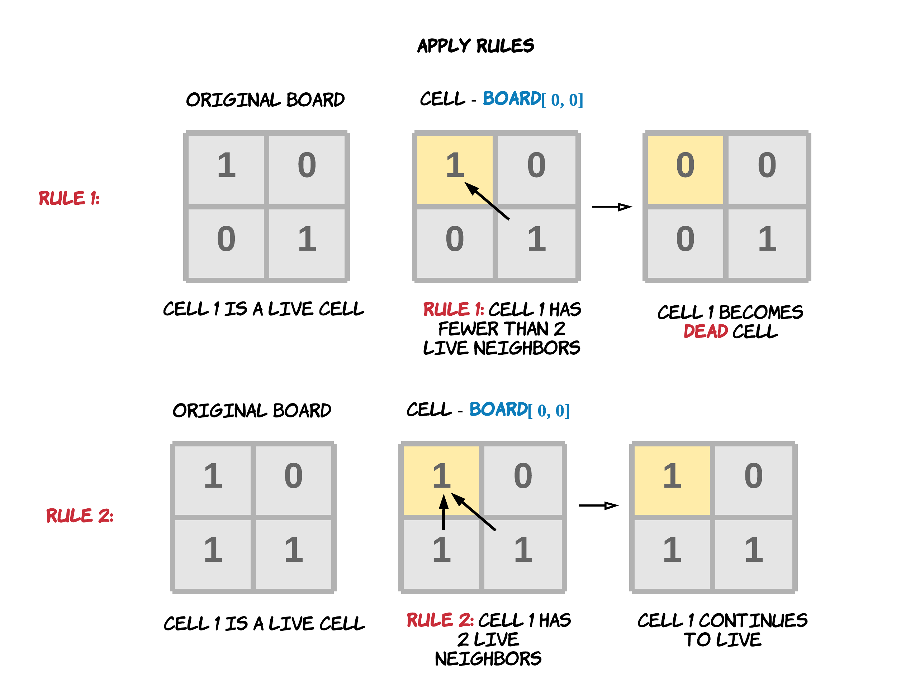

289. Game of Life

According to the Wikipedia's article: **The Game of Life**, also known simply as **Life**, is a cellular automaton devised by the British mathematician John Horton Conway in 1970."

Given a board with m by n cells, each cell has an initial state live (1) or dead (0). Each cell interacts with its eight neighbors (horizontal, vertical, diagonal) using the following four rules (taken from the above Wikipedia article):

1. Any live cell with fewer than two live neighbors dies, as if caused by under-population.
1. Any live cell with two or three live neighbors lives on to the next generation.
1. Any live cell with more than three live neighbors dies, as if by over-population..
1. Any dead cell with exactly three live neighbors becomes a live cell, as if by reproduction.

Write a function to compute the next state (after one update) of the board given its current state. The next state is created by applying the above rules simultaneously to every cell in the current state, where births and deaths occur simultaneously.

**Example:**
```
Input: 
[
  [0,1,0],
  [0,0,1],
  [1,1,1],
  [0,0,0]
]
Output: 
[
  [0,0,0],
  [1,0,1],
  [0,1,1],
  [0,1,0]
]
```

**Follow up:**

1. Could you solve it in-place? Remember that the board needs to be updated at the same time: You cannot update some cells first and then use their updated values to update other cells.
1. In this question, we represent the board using a 2D array. In principle, the board is infinite, which would cause problems when the active area encroaches the border of the array. How would you address these problems?

# Solution
---
Before moving on to the actual solution, let us visually look at the rules to be applied to the cells to get a greater clarity.




## Approach 1: O(mn) Space Solution
**Intuition**

The problem might look very easy at first, however, the most important catch in this problem is to realize that if you update the original array with the given rules, you won't be able to perform simultaneous updation as is required in the question. You might end up using the updated values for some cells to update the values of other cells. But the problem demands applying the given rules simultaneously to every cell.

Thus, you cannot update some cells first and then use their updated values to update other cells.


In the above diagram it's evident that an update to a cell can impact the other neighboring cells. If we use the updated value of a cell while updating its neighbors, then we are not applying rules to all cells simultaneously.

Here simultaneously isn't about parallelism but using the original values of the neighbors instead of the updated values while applying rules to any cell. Hence the first approach could be as easy as having a copy of the board. The copy is never mutated. So, you never lose the original value for a cell.

Whenever a rule is applied to any of the cells, we look at its neighbors in the unmodified copy of the board and change the original board accordingly. Here we keep the copy unmodified since the problem asks us to make the changes to the original array in-place.


**Algorithm**

* Make a copy of the original board which will remain unchanged throughout the process.
* Iterate the cells of the **Board** one by one.
* While computing the results of the rules, use the copy board and apply the result in the original board.

```python
class Solution:
    def gameOfLife(self, board: List[List[int]]) -> None:
        """
        Do not return anything, modify board in-place instead.
        """

        # Neighbors array to find 8 neighboring cells for a given cell
        neighbors = [(1,0), (1,-1), (0,-1), (-1,-1), (-1,0), (-1,1), (0,1), (1,1)]

        rows = len(board)
        cols = len(board[0])

        # Create a copy of the original board
        copy_board = [[board[row][col] for col in range(cols)] for row in range(rows)]

        # Iterate through board cell by cell.
        for row in range(rows):
            for col in range(cols):

                # For each cell count the number of live neighbors.
                live_neighbors = 0
                for neighbor in neighbors:

                    r = (row + neighbor[0])
                    c = (col + neighbor[1])

                    # Check the validity of the neighboring cell and if it was originally a live cell.
                    # The evaluation is done against the copy, since that is never updated.
                    if (r < rows and r >= 0) and (c < cols and c >= 0) and (copy_board[r][c] == 1):
                        live_neighbors += 1

                # Rule 1 or Rule 3        
                if copy_board[row][col] == 1 and (live_neighbors < 2 or live_neighbors > 3):
                    board[row][col] = 0
                # Rule 4
                if copy_board[row][col] == 0 and live_neighbors == 3:
                    board[row][col] = 1
```

**Complexity Analysis**

* Time Complexity: $O(M \times N)$, where $M$ is the number of rows and $N$ is the number of columns of the Board.

* Space Complexity: $O(M \times N)$, where $M$ is the number of rows and $N$ is the number of columns of the Board. This is the space occupied by the copy board we created initially.

## Approach 2: O(1) Space Solution
**Intuition**

The problem could also be solved in-place. $O(M \times N)$ space complexity could be too expensive when the board is very large. We only have two states `live(1)` or `dead(0)` for a cell. We can use some dummy cell value to signify previous state of the cell along with the new changed value.

For e.g. If the value of the cell was `1` originally but it has now become `0` after applying the rule, then we can change the value to `-1`. The negative sign signifies the cell is now dead(0) but the `magnitude` signifies the cell was a live(1) cell originally.

Also, if the value of the cell was `0` originally but it has now become `1` after applying the rule, then we can change the value to `2`. The positive `sign` signifies the cell is now live(1) but the `magnitude` of 2 signifies the cell was a dead(0) cell originally.


**Algorithm**

1. Iterate the cells of the `Board` one by one.

1. The rules are computed and applied on the original board. The updated values signify both previous and updated value.

1. The updated rules can be seen as this:
    * Rule 1: Any live cell with fewer than two live neighbors dies, as if caused by under-population. Hence, change the value of cell to `-1`. This means the cell was live before but now dead.
    * Rule 2: Any live cell with two or three live neighbors lives on to the next generation. Hence, no change in the value.
    * Rule 3: Any live cell with more than three live neighbors dies, as if by over-population. Hence, change the value of cell to `-1`. This means the cell was live before but now dead. Note that we don't need to differentiate between the rule 1 and 3. The start and end values are the same. Hence, we use the same dummy value.
    * Rule 4: Any dead cell with exactly three live neighbors becomes a live cell, as if by reproduction. Hence, change the value of cell to `2`. This means the cell was dead before but now live.

1. Apply the new rules to the board.

1. Since the new values give an indication of the old values of the cell, we accomplish the same results as approach 1 but without saving a copy.

1. To get the Board in terms of binary values i.e. live(1) and dead(0), we iterate the board again and change the value of a cell to a `1` if its value currently is greater than `0` and change the value to a `0` if its current value is lesser than or equal to `0`.

```python
class Solution:
    def gameOfLife(self, board: List[List[int]]) -> None:
        """
        Do not return anything, modify board in-place instead.
        """
        # Neighbors array to find 8 neighboring cells for a given cell
        neighbors = [(1,0), (1,-1), (0,-1), (-1,-1), (-1,0), (-1,1), (0,1), (1,1)]

        rows = len(board)
        cols = len(board[0])

        # Iterate through board cell by cell.
        for row in range(rows):
            for col in range(cols):

                # For each cell count the number of live neighbors.
                live_neighbors = 0
                for neighbor in neighbors:

                    # row and column of the neighboring cell
                    r = (row + neighbor[0])
                    c = (col + neighbor[1])

                    # Check the validity of the neighboring cell and if it was originally a live cell.
                    if (r < rows and r >= 0) and (c < cols and c >= 0) and abs(board[r][c]) == 1:
                        live_neighbors += 1

                # Rule 1 or Rule 3
                if board[row][col] == 1 and (live_neighbors < 2 or live_neighbors > 3):
                    # -1 signifies the cell is now dead but originally was live.
                    board[row][col] = -1
                # Rule 4
                if board[row][col] == 0 and live_neighbors == 3:
                    # 2 signifies the cell is now live but was originally dead.
                    board[row][col] = 2

        # Get the final representation for the newly updated board.
        for row in range(rows):
            for col in range(cols):
                if board[row][col] > 0:
                    board[row][col] = 1
                else:
                    board[row][col] = 0
```

**Complexity Analysis**

* Time Complexity: $O(M \times N)$, where $M$ is the number of rows and $N$ is the number of columns of the Board.

* Space Complexity: $O(1)$

## Follow up 2 : Infinite Board
So far we've only addressed one of the follow-up questions for this problem statement. We saw how to perform the simulation according to the four rules in-place i.e. without using any additional memory. The problem statement also mentions another follow-up statement which is a bit open ended. We will look at two possible solutions to address it. Essentially, the second follow-up asks us to address the scalability aspect of the problem. What would happen if the board is infinitely large? Can we still use the same solution that we saw earlier or is there something else we will have to do different? If the board becomes infinitely large, there are multiple problems our current solution would run into:

1. It would be computationally impossible to iterate a matrix that large.
1. It would not be possible to store that big a matrix entirely in memory. We have huge memory capacities these days i.e. of the order of hundreds of GBs. However, it still wouldn't be enough to store such a large matrix in memory.
1. We would be wasting a lot of space if such a huge board only has a few live cells and the rest of them are all dead. In such a case, we have an extremely sparse matrix and it wouldn't make sense to save the board as a "matrix".

Such open ended problems are better suited to design discussions during programming interviews and it's a good habit to take into consideration the scalability aspect of the problem since your interviewer might be interested in talking about such problems. The discussion section already does a great job at addressing this specific portion of the problem. We will briefly go over two different solutions that have been provided in the discussion sections, as they broadly cover two main scenarios of this problem.

One aspect of the problem is addressed by a great solution provided by Stefan Pochmann. So as mentioned before, it's quite possible that we have a gigantic matrix with a very few live cells. In that case it would be stupidity to save the entire board as is.

> If we have an extremely sparse matrix, it would make much more sense to actually save the location of only the live cells and then apply the 4 rules accordingly using only these live cells.

Let's look at the sample code provided by Stefan for handling this aspect of the problem.

```python
def gameOfLifeInfinite(self, live):
    ctr = collections.Counter((I, J)
                              for i, j in live
                              for I in range(i-1, i+2)
                              for J in range(j-1, j+2)
                              if I != i or J != j)
    return {ij
            for ij in ctr
            if ctr[ij] == 3 or ctr[ij] == 2 and ij in live}

def gameOfLife(self, board):
    live = {(i, j) for i, row in enumerate(board) for j, live in enumerate(row) if live}
    live = self.gameOfLifeInfinite(live)
    for i, row in enumerate(board):
        for j in range(len(row)):
            row[j] = int((i, j) in live)
```

Essentially, we obtain only the live cells from the entire board and then apply the different rules using only the live cells and finally we update the board in-place. The only problem with this solution would be when the entire board cannot fit into memory. If that is indeed the case, then we would have to approach this problem in a different way. For that scenario, we assume that the contents of the matrix are stored in a file, one row at a time.

> In order for us to update a particular cell, we only have to look at its 8 neighbors which essentially lie in the row above and below it. So, for updating the cells of a row, we just need the row above and the row below. Thus, we read one row at a time from the file and at max we will have 3 rows in memory. We will keep discarding rows that are processed and then we will keep reading new rows from the file, one at a time.

@beagle's solution revolves around this idea and you can refer to the code in the discussion section for the same. It's important to note that there is no single solution for solving this problem. Everybody might have a different viewpoint for addressing the scalability aspect of the problem and these two solutions just address the most basic problems with handling matrix based problems at scale.

# Submissions
---
**Solution: (O(1) Space Solution)**
```
Runtime: 40 ms
Memory Usage: 13.9 MB
```
```python
class Solution:
    def gameOfLife(self, board: List[List[int]]) -> None:
        """
        Do not return anything, modify board in-place instead.
        """
        # Neighbors array to find 8 neighboring cells for a given cell
        neighbors = [(1,0), (1,-1), (0,-1), (-1,-1), (-1,0), (-1,1), (0,1), (1,1)]

        rows = len(board)
        cols = len(board[0])

        # Iterate through board cell by cell.
        for row in range(rows):
            for col in range(cols):

                # For each cell count the number of live neighbors.
                live_neighbors = 0
                for neighbor in neighbors:

                    # row and column of the neighboring cell
                    r = (row + neighbor[0])
                    c = (col + neighbor[1])

                    # Check the validity of the neighboring cell and if it was originally a live cell.
                    if (r < rows and r >= 0) and (c < cols and c >= 0) and abs(board[r][c]) == 1:
                        live_neighbors += 1

                # Rule 1 or Rule 3
                if board[row][col] == 1 and (live_neighbors < 2 or live_neighbors > 3):
                    # -1 signifies the cell is now dead but originally was live.
                    board[row][col] = -1
                # Rule 4
                if board[row][col] == 0 and live_neighbors == 3:
                    # 2 signifies the cell is now live but was originally dead.
                    board[row][col] = 2

        # Get the final representation for the newly updated board.
        for row in range(rows):
            for col in range(cols):
                if board[row][col] > 0:
                    board[row][col] = 1
                else:
                    board[row][col] = 0
```
