300. Longest Increasing Subsequence

Given an unsorted array of integers, find the length of longest increasing subsequence.

**Example:**
```
Input: [10,9,2,5,3,7,101,18]
Output: 4 
Explanation: The longest increasing subsequence is [2,3,7,101], therefore the length is 4. 
```
**Note:**

There may be more than one LIS combination, it is only necessary for you to return the length.
Your algorithm should run in O(n^2) complexity.

**Follow up:** Could you improve it to O(n log n) time complexity?

# Solution
---
## Approach 1: Brute Force
**Algorithm**

The simplest approach is to try to find all increasing subsequences and then returning the maximum length of longest increasing subsequence. In order to do this, we make use of a recursive function $\text{lengthofLIS}$ which returns the length of the LIS possible from the current element(corresponding to $curpos$) onwards(including the current element). Inside each function call, we consider two cases:

1. The current element is larger than the previous element included in the LIS. In this case, we can include the current element in the LIS. Thus, we find out the length of the LIS obtained by including it. Further, we also find out the length of LIS possible by not including the current element in the LIS. The value returned by the current function call is, thus, the maximum out of the two lengths.

1. The current element is smaller than the previous element included in the LIS. In this case, we can't include the current element in the LIS. Thus, we find out only the length of the LIS possible by not including the current element in the LIS, which is returned by the current function call.

```java
public class Solution {

    public int lengthOfLIS(int[] nums) {
        return lengthofLIS(nums, Integer.MIN_VALUE, 0);
    }

    public int lengthofLIS(int[] nums, int prev, int curpos) {
        if (curpos == nums.length) {
            return 0;
        }
        int taken = 0;
        if (nums[curpos] > prev) {
            taken = 1 + lengthofLIS(nums, nums[curpos], curpos + 1);
        }
        int nottaken = lengthofLIS(nums, prev, curpos + 1);
        return Math.max(taken, nottaken);
    }
}
```

**Complexity Analysis**

* Time complexity : $O(2^n)$. Size of recursion tree will be $2^n$.

* Space complexity : $O(n^2)$. $memo$ array of size $n * n$ is used.

## Approach 2: Recursion with Memoization
**Algorithm**

In the previous approach, many recursive calls had to made again and again with the same parameters. This redundancy can be eliminated by storing the results obtained for a particular call in a 2-d memoization array memomemo. $memo[i][j]$ represents the length of the LIS possible using $nums[i]$ as the previous element considered to be included/not included in the LIS, with $nums[j]$ as the current element considered to be included/not included in the LIS. Here, $nums$ represents the given array.

```java
public class Solution {
    public int lengthOfLIS(int[] nums) {
        int memo[][] = new int[nums.length + 1][nums.length];
        for (int[] l : memo) {
            Arrays.fill(l, -1);
        }
        return lengthofLIS(nums, -1, 0, memo);
    }
    public int lengthofLIS(int[] nums, int previndex, int curpos, int[][] memo) {
        if (curpos == nums.length) {
            return 0;
        }
        if (memo[previndex + 1][curpos] >= 0) {
            return memo[previndex + 1][curpos];
        }
        int taken = 0;
        if (previndex < 0 || nums[curpos] > nums[previndex]) {
            taken = 1 + lengthofLIS(nums, curpos, curpos + 1, memo);
        }

        int nottaken = lengthofLIS(nums, previndex, curpos + 1, memo);
        memo[previndex + 1][curpos] = Math.max(taken, nottaken);
        return memo[previndex + 1][curpos];
    }
}
```

**Complexity Analysis**

* Time complexity : $O(n^2)$. Size of recursion tree can go upto $n^2$.

* Space complexity : $O(n^2)$. $memo$ array of $n*n$ is used.

## Approach 3: Dynamic Programming
**Algorithm**

This method relies on the fact that the longest increasing subsequence possible upto the $i^{th}$ index in a given array is independent of the elements coming later on in the array. Thus, if we know the length of the LIS upto $i^{th}$ index, we can figure out the length of the LIS possible by including the $(i+1)^{th}$ element based on the elements with indices $j$ such that $0 \leq j \leq (i + 1)$.

We make use of a $dp$ array to store the required data. $dp[i]$ represents the length of the longest increasing subsequence possible considering the array elements upto the $i^{th}$ index only ,by necessarily including the $i^{th}$ element. In order to find out $dp[i]$, we need to try to append the current element($nums[i]$) in every possible increasing subsequences upto the $(i-1)^{th}$ index(including the $(i-1)^{th}$ index), such that the new sequence formed by adding the current element is also an increasing subsequence. Thus, we can easily determine $dp[i]$ using:

$dp[i] = \text{max}(dp[j]) + 1, \forall 0\leq j < i$

At the end, the maximum out of all the $dp[i]$'s to determine the final result.

$LIS_{length}= \text{max}(dp[i]), \forall 0\leq i < n$

The following animation illustrates the method:

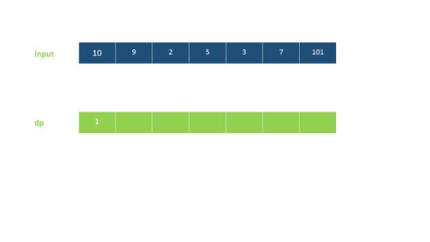
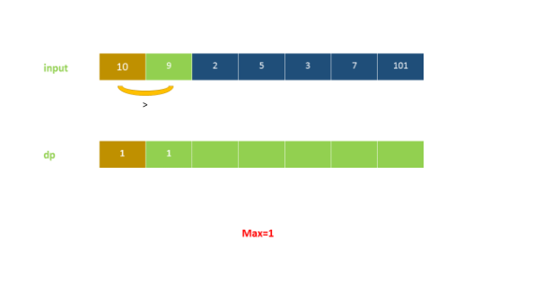
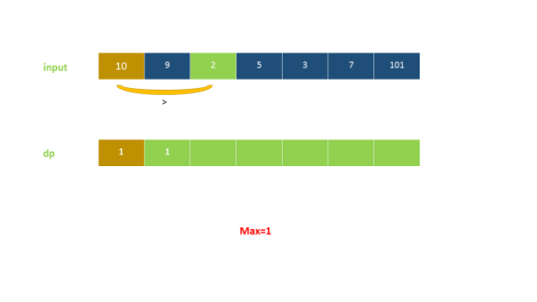
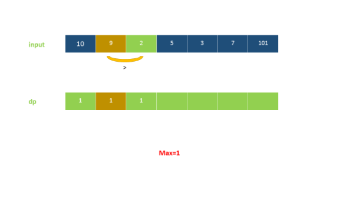
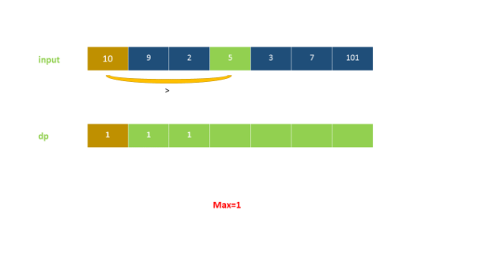
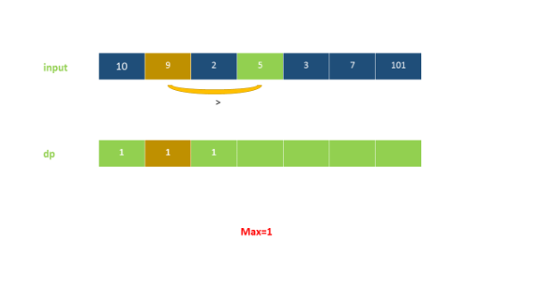
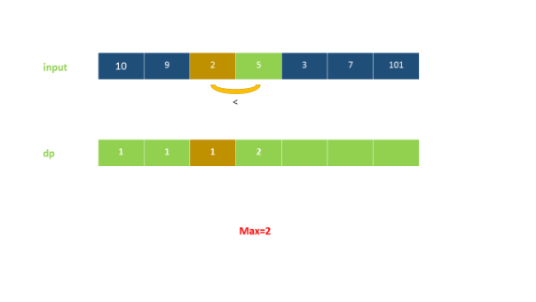
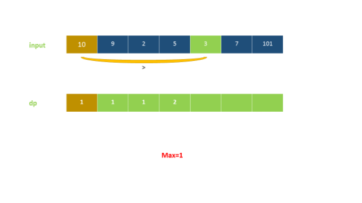
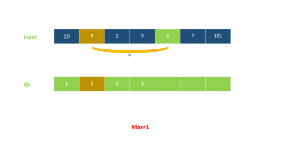
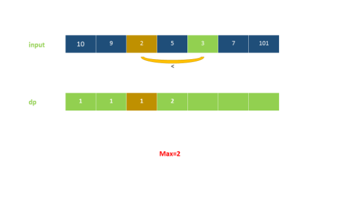
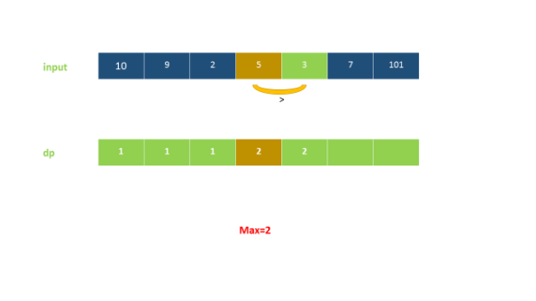
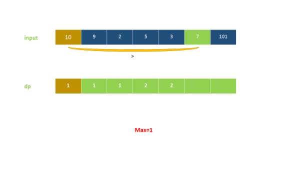
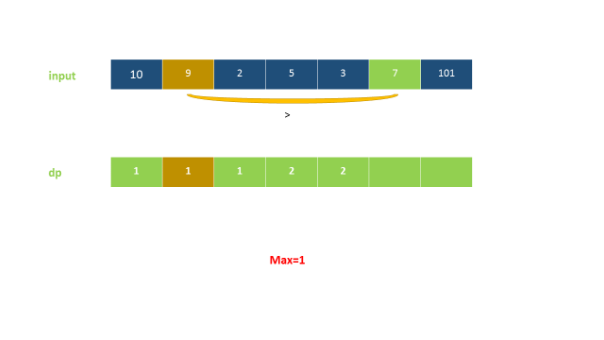
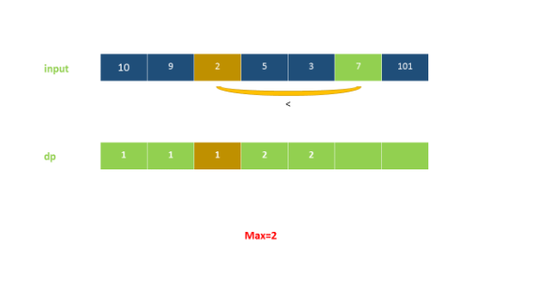
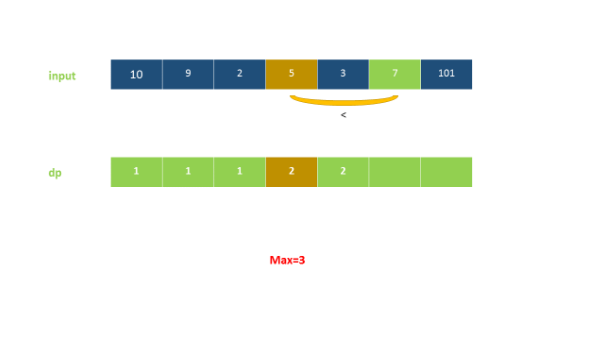
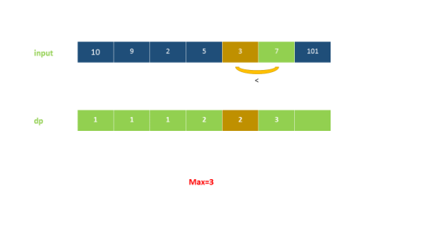
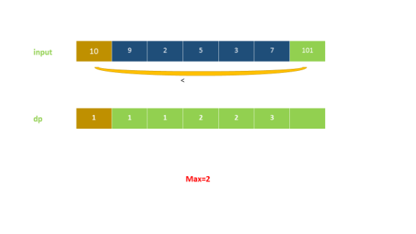
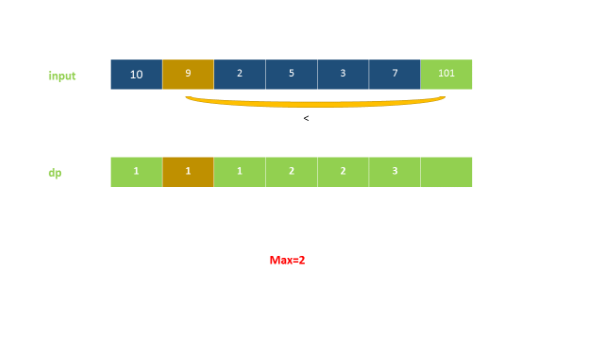
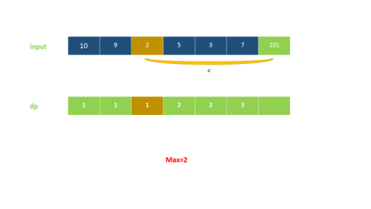
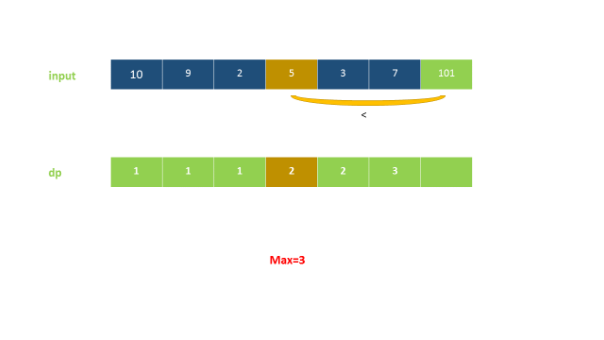
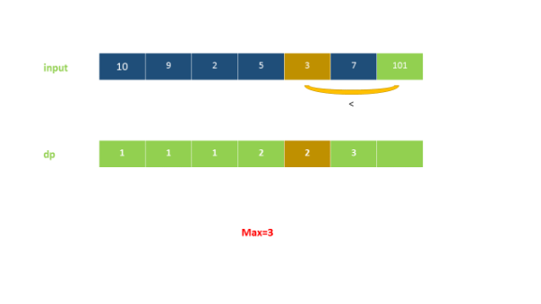
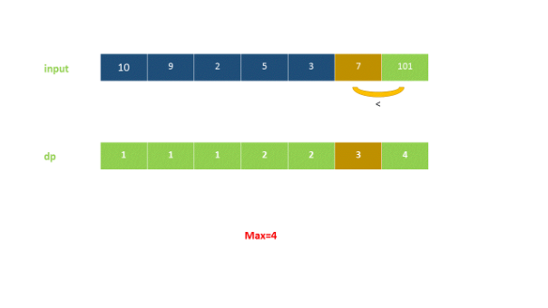
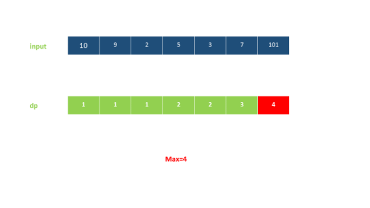

```java
public class Solution {
    public int lengthOfLIS(int[] nums) {
        if (nums.length == 0) {
            return 0;
        }
        int[] dp = new int[nums.length];
        dp[0] = 1;
        int maxans = 1;
        for (int i = 1; i < dp.length; i++) {
            int maxval = 0;
            for (int j = 0; j < i; j++) {
                if (nums[i] > nums[j]) {
                    maxval = Math.max(maxval, dp[j]);
                }
            }
            dp[i] = maxval + 1;
            maxans = Math.max(maxans, dp[i]);
        }
        return maxans;
    }
}
```

**Complexity Analysis**

* Time complexity : $O(n^2)$. Two loops of $n$ are there.

* Space complexity : $O(n)$. $dp$ array of size $n$ is used.

## Approach 4: Dynamic Programming with Binary Search
**Algorithm**

In this approach, we scan the array from left to right. We also make use of a $dp$ array initialized with all 0's. This $dp$ array is meant to store the increasing subsequence formed by including the currently encountered element. While traversing the $nums$ array, we keep on filling the $dp$ array with the elements encountered so far. For the element corresponding to the $j^{th}$ index ($nums[j]$), we determine its correct position in the $dp$ array(say $i^{th}$ index) by making use of Binary Search(which can be used since the $dp$ array is storing increasing subsequence) and also insert it at the correct position. An important point to be noted is that for Binary Search, we consider only that portion of the $dp$ array in which we have made the updates by inserting some elements at their correct positions(which remains always sorted). Thus, only the elements upto the $i^{th}$ index in the $dp$ array can determine the position of the current element in it. Since, the element enters its correct position(ii) in an ascending order in the $dp$ array, the subsequence formed so far in it is surely an increasing subsequence. Whenever this position index $i$ becomes equal to the length of the LIS formed so far($len$), it means, we need to update the $len$ as $len = len + 1$.

Note: $dp$ array does not result in longest increasing subsequence, but length of $dp$ array will give you length of LIS.

Consider the example:

input: [0, 8, 4, 12, 2]

dp: [0]

dp: [0, 8]

dp: [0, 4]

dp: [0, 4, 12]

dp: [0 , 2, 12] which is not the longest increasing subsequence, but length of $dp$ array results in length of Longest Increasing Subsequence.

```java
public class Solution {
    public int lengthOfLIS(int[] nums) {
        int[] dp = new int[nums.length];
        int len = 0;
        for (int num : nums) {
            int i = Arrays.binarySearch(dp, 0, len, num);
            if (i < 0) {
                i = -(i + 1);
            }
            dp[i] = num;
            if (i == len) {
                len++;
            }
        }
        return len;
    }
}
```

Note: Arrays.binarySearch() method returns index of the search key, if it is contained in the array, else it returns (-(insertion point) - 1). The insertion point is the point at which the key would be inserted into the array: the index of the first element greater than the key, or a.length if all elements in the array are less than the specified key.

**Complexity Analysis**

* Time complexity : $O(n\log n)$. Binary search takes $\log n$ time and it is called $n$ times.

* Space complexity : $O(n)$. $dp$ array of size $n$ is used.

# Submissions
---
**Solution 1: (DP Top-Down, Memory Limit Exceeded)**
```python
class Solution:
    def lengthOfLIS(self, nums: List[int]) -> int:
        N = len(nums)
        if N == 0: return 0

        @functools.lru_cache(None)
        def dfs(previndex, curpos):
            if curpos == N:
                return 0
            taken = 0
            if previndex < 0 or nums[curpos] > nums[previndex]:
                taken = 1 + dfs(curpos, curpos + 1)
            nottaken = dfs(previndex, curpos + 1)
            return max(taken, nottaken)

        return dfs(-1, 0)
```

**Solution 2: (DP Top-Down Memorization)**
```
Runtime: 6540 ms
Memory Usage: 242.9 MB
```
```python
class Solution:
    def lengthOfLIS(self, nums: List[int]) -> int:
        N = len(nums)
        if N == 0: return 0
        memo = [[-1]*N for _ in range(N+1)]
        
        def dfs(previndex, curpos):
            if curpos == N:
                return 0
            if memo[previndex + 1][curpos] >= 0:
                return memo[previndex + 1][curpos]
            taken = 0
            if previndex < 0 or nums[curpos] > nums[previndex]:
                taken = 1 + dfs(curpos, curpos + 1)
            nottaken = dfs(previndex, curpos + 1)
            memo[previndex + 1][curpos] = max(taken, nottaken)
            return memo[previndex + 1][curpos]
        
        return dfs(-1, 0)
```

**Solution 3: (DP Top-Down)**
```
Runtime: 1692 ms
Memory Usage: 13.4 MB
```
```python
class Solution:
    def lengthOfLIS(self, nums: List[int]) -> int:
        N = len(nums)
        if N == 0: return 0
        maxans = 1
        
        @functools.lru_cache(None)
        def dfs(i):
            nonlocal maxans
            if i == 0:
                return 1
            maxval = 0
            for j in range(i):
                if nums[i] > nums[j]:
                    maxval = max(maxval, dfs(j))
                else:
                    dfs(j)
            maxval += 1
            maxans = max(maxans, maxval)
            return maxval
            
        dfs(N-1)
        return maxans
```

**Solution 4: (DP Top-Down)**
```
Runtime: 1448 ms
Memory Usage: 14.1 MB
```
```python
class Solution:
    def lengthOfLIS(self, nums: List[int]) -> int:
        N = len(nums)
        if N == 0: return 0
        ans = 0

        @functools.lru_cache(None)
        def dfs(idx):
            rst = 0
            for j in range(idx+1, N):
                if nums[idx] < nums[j]:
                    rst = max(rst, dfs(j))
            rst += 1
            return rst
            
        for i in range(N):
            for j in range(i+1, N):
                if nums[i] < nums[j]:
                    ans = max(ans, dfs(j))
        
        return ans + 1
```

**Solution 5: (Dynamic Programming Bottom-Up)**
```
Runtime: 1020 ms
Memory Usage: 14 MB
```
```python
class Solution:
    def lengthOfLIS(self, nums: List[int]) -> int:
        if not nums:
            return 0
        
        N = len(nums)
        dp = [0 for _ in range(N)]
        dp[0] = 1
        maxans = 1
        for i in range(1, N):
            maxval = 0
            for j in range(i):
                if nums[i] > nums[j]:
                    maxval = max(maxval, dp[j])
            dp[i] = maxval + 1
            maxans = max(maxans, dp[i])
        return maxans
```

**Solution 6: (Dynamic Programming with Binary Search)**
```
Runtime: 40 ms
Memory Usage: 12.8 MB
```
```python
class Solution:
    def lengthOfLIS(self, nums: List[int]) -> int:
        N = len(nums)
        dp = [float('inf') for _ in range(N)]
        length = 0
        for num in nums:
            i = bisect.bisect_left(dp, num)
            dp[i] = num
            if i == length:
                length += 1
        return length
```

**Solution 7: (DP, Bottom-Up)**
```
Runtime: 686 ms
Memory Usage: 10.6 MB
```
```c++
class Solution {
public:
    int lengthOfLIS(vector<int>& nums) {
        int N = nums.size();
        vector<int> dp(N, 1);
        int ans = 1;
        for (int j = 1; j < N; j ++) {
            for (int i = 0; i < j; i ++) {
                if (nums[i] < nums[j])
                    dp[j] = max(dp[j], dp[i]+1);
            }
            ans = max(ans, dp[j]);
        }
        return ans;
    }
};
```

**Solution 8: (Binary Search)**
```
Runtime: 6 ms
Memory: 10.5 MB
```
```c++
class Solution {
public:
    int lengthOfLIS(vector<int>& nums) {
        int left, right, mid;
        vector<int> dp;
        for (int num: nums) {
            if (dp.empty() || num > dp.back()) {
                dp.push_back(num);
            } else {
                left = 0, right = dp.size()-1;
                while (left < right) {
                    mid = left + (right-left)/2;
                    if (num > dp[mid]) {
                        left = mid+1;
                    } else {
                        right = mid;
                    }
                }
                dp[left] = num;
            }
        }
        return dp.size();
    }
};
```

**Solution 9: (Binary Search)**

              4
        4   3  
      3   2  
           
    1
   -------------
    1 1 1 1 1 1
      3 3 2 2 2
        4 4 3 3
              4
```
Runtime: 0 ms, Beats 100.00%
Memory: 14.14 MB, Beats 78.71%
```
```c++
class Solution {
public:
    int lengthOfLIS(vector<int>& nums) {
        int n = nums.size(), i, j;
        vector<int> dp;
        for (i = 0; i < n; i ++) {
            if (!dp.size() || dp.back() < nums[i]) {
                dp.push_back(nums[i]);
            } else {
                j = lower_bound(dp.begin(), dp.end(), nums[i]) - dp.begin();
                dp[j] = nums[i];
            }
        }
        return dp.size();
    }
};
```
