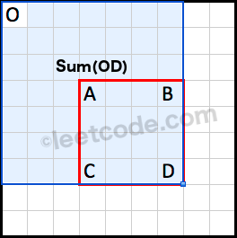
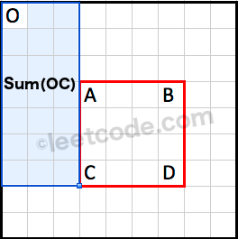
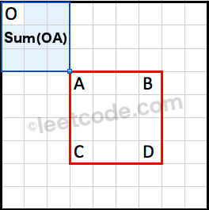

304. Range Sum Query 2D - Immutable

Given a 2D matrix matrix, find the sum of the elements inside the rectangle defined by its upper left corner `(row1, col1)` and lower right corner `(row2, col2)`.


Range Sum Query 2D
The above rectangle (with the red border) is defined by (row1, col1) = (2, 1) and (row2, col2) = (4, 3), which contains sum = 8.

**Example:**
```
Given matrix = [
  [3, 0, 1, 4, 2],
  [5, 6, 3, 2, 1],
  [1, 2, 0, 1, 5],
  [4, 1, 0, 1, 7],
  [1, 0, 3, 0, 5]
]

sumRegion(2, 1, 4, 3) -> 8
sumRegion(1, 1, 2, 2) -> 11
sumRegion(1, 2, 2, 4) -> 12
```

**Note:**
1. You may assume that the matrix does not change.
1. There are many calls to sumRegion function.
1. You may assume that row1 ≤ row2 and col1 ≤ col2.

# Solution
---
## Approach #1 (Brute Force) [Time Limit Exceeded]
**Algorithm**

Each time sumRegion is called, we use a double for loop to sum all elements from $(row1, col1) \rightarrow (row2, col2)$.

```
private int[][] data;

public NumMatrix(int[][] matrix) {
    data = matrix;
}

public int sumRegion(int row1, int col1, int row2, int col2) {
    int sum = 0;
    for (int r = row1; r <= row2; r++) {
        for (int c = col1; c <= col2; c++) {
            sum += data[r][c];
        }
    }
    return sum;
}
```

**Complexity analysis**

* Time complexity : $O(mn)$ time per query. Assume that $m$ and $n$ represents the number of rows and columns respectively, each sumRegion query can go through at most $m \times n$ elements.

* Space complexity : $O(1)$. Note that data is a reference to matrix and is not a copy of it.

## Approach #2 (Caching) [Memory Limit Exceeded]
**Intuition**

Since sumRegion could be called many times, we definitely need to do some pre-processing.

**Algorithm**

We could trade in extra space for speed by pre-calculating all possible rectangular region sum and store them in a hash table. Each sumRegion query now takes only constant time complexity.

**Complexity analysis**

* Time complexity : $O(1)$ time per query, $O(m^2n^2)$ time pre-computation. Each sumRegion query takes $O(1)$ time as the hash table lookup's time complexity is constant. The pre-computation will take $O(m^2n^2)$ time as there are a total of $m^2 \times n^2$ possibilities need to be cached.

* Space complexity : $O(m^2n^2)$. Since there are $mn$ different possibilities for both top left and bottom right points of the rectangular region, the extra space required is $O(m^2n^2)$.

## Approach #3 (Caching Rows) [Accepted]
**Intuition**

Remember from the 1D version where we used a cumulative sum array? Could we apply that directly to solve this 2D version?

**Algorithm**

Try to see the 2D matrix as $m$ rows of 1D arrays. To find the region sum, we just accumulate the sum in the region row by row.

```
private int[][] dp;

public NumMatrix(int[][] matrix) {
    if (matrix.length == 0 || matrix[0].length == 0) return;
    dp = new int[matrix.length][matrix[0].length + 1];
    for (int r = 0; r < matrix.length; r++) {
        for (int c = 0; c < matrix[0].length; c++) {
            dp[r][c + 1] = dp[r][c] + matrix[r][c];
        }
    }
}

public int sumRegion(int row1, int col1, int row2, int col2) {
    int sum = 0;
    for (int row = row1; row <= row2; row++) {
        sum += dp[row][col2 + 1] - dp[row][col1];
    }
    return sum;
}
```

**Complexity analysis**

* Time complexity : $O(m)$ time per query, $O(mn)$ time pre-computation. The pre-computation in the constructor takes $O(mn)$ time. The sumRegion query takes $O(m)$ time.

* Space complexity : $O(mn)$. The algorithm uses $O(mn)$ space to store the cumulative sum of all rows.

## Approach #4 (Caching Smarter) [Accepted]
**Algorithm**

We used a cumulative sum array in the 1D version. We notice that the cumulative sum is computed with respect to the origin at index 0. Extending this analogy to the 2D case, we could pre-compute a cumulative region sum with respect to the origin at $(0, 0)$.



Sum(OD) is the cumulative region sum with respect to the origin at (0, 0).

How do we derive $Sum(ABCD)$using the pre-computed cumulative region sum?


Sum(OB) is the cumulative region sum on top of the rectangle.



Sum(OC) is the cumulative region sum to the left of the rectangle.



Sum(OA) is the cumulative region sum to the top left corner of the rectangle.

Note that the region $Sum(OA)$ is covered twice by both $Sum(OB)$ and $Sum(OC)$. We could use the principle of inclusion-exclusion to calculate $Sum(ABCD)$ as following:

$Sum(ABCD) = Sum(OD) - Sum(OB) - Sum(OC) + Sum(OA)$

```
private int[][] dp;

public NumMatrix(int[][] matrix) {
    if (matrix.length == 0 || matrix[0].length == 0) return;
    dp = new int[matrix.length + 1][matrix[0].length + 1];
    for (int r = 0; r < matrix.length; r++) {
        for (int c = 0; c < matrix[0].length; c++) {
            dp[r + 1][c + 1] = dp[r + 1][c] + dp[r][c + 1] + matrix[r][c] - dp[r][c];
        }
    }
}

public int sumRegion(int row1, int col1, int row2, int col2) {
    return dp[row2 + 1][col2 + 1] - dp[row1][col2 + 1] - dp[row2 + 1][col1] + dp[row1][col1];
}
```

**Complexity analysis**

* Time complexity : $O(1)$ time per query, $O(mn)$ time pre-computation. The pre-computation in the constructor takes $O(mn)$ time. Each sumRegion query takes $O(1)$ time.

* Space complexity : $O(mn)$. The algorithm uses $O(mn)$ space to store the cumulative region sum.

# Submissions
---
**Solution 1:**
```
Runtime: 128 ms
Memory Usage: 16.7 MB
```
```python
class NumMatrix:

    def __init__(self, matrix: List[List[int]]):
        if len(matrix) == 0 or len(matrix[0]) == 0:
            return
        
        R = len(matrix)
        C = len(matrix[0])
        self.dp = [[0 for _ in range(C+1)] for _ in range(R+1)]
        for r in range(R):
            for c in range(C):
                self.dp[r + 1][c + 1] = self.dp[r + 1][c] + self.dp[r][c + 1] + matrix[r][c] - self.dp[r][c];

    def sumRegion(self, row1: int, col1: int, row2: int, col2: int) -> int:
        return self.dp[row2 + 1][col2 + 1] - self.dp[row1][col2 + 1] - self.dp[row2 + 1][col1] + self.dp[row1][col1]


# Your NumMatrix object will be instantiated and called as such:
# obj = NumMatrix(matrix)
# param_1 = obj.sumRegion(row1,col1,row2,col2)
```