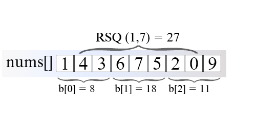
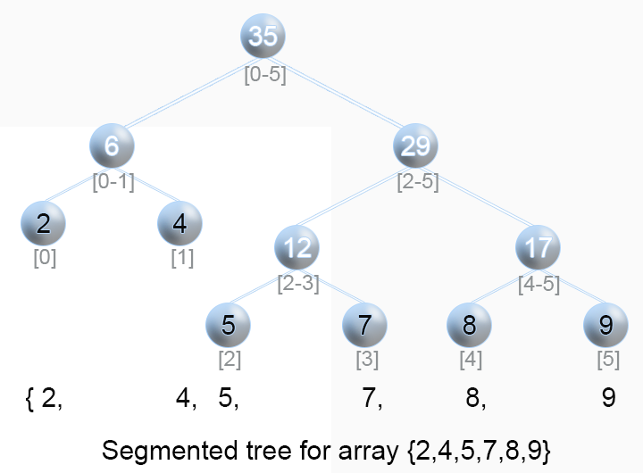

307. Range Sum Query - Mutable

Given an integer array nums, find the sum of the elements between indices i and j (i ≤ j), inclusive.

The update(i, val) function modifies nums by updating the element at index i to val.

**Example:**
```
Given nums = [1, 3, 5]

sumRange(0, 2) -> 9
update(1, 2)
sumRange(0, 2) -> 8
```

**Note:**

* The array is only modifiable by the update function.
* You may assume the number of calls to update and sumRange function is distributed evenly.

# Summary
---
This article is for intermediate level readers. It introduces the following concepts: Range sum query, Sqrt decomposition, Segment tree.

# Solution
---
## Approach 1: Naive
**Algorithm**

A trivial solution for Range Sum Query - `RSQ(i, j)` is to iterate the array from index $i$ to $j$ and sum each element.

**Java**
```java
private int[] nums;
public int sumRange(int i, int j) {
    int sum = 0;
    for (int l = i; l <= j; l++) {
        sum += data[l];
    }
    return sum;
}

public int update(int i, int val) {
    nums[i] = val;
}
// Time Limit Exceeded
```

**Complexity Analysis**

* Time complexity : $O(n)$ - range sum query, $O(1)$ - update query

    For range sum query we access each element from the array for constant time and in the worst case we access nn elements. Therefore time complexity is $O(n)$. Time complexity of update query is $O(1)$.

* Space complexity : $O(1)$.

## Approach 2: Sqrt Decomposition
**Intuition**

The idea is to split the array in blocks with length of $\sqrt{n}$. Then we calculate the sum of each block and store it in auxiliary memory b. To query `RSQ(i, j)`, we will add the sums of all the blocks lying inside and those that partially overlap with range $[i \ldots j]$.

**Algorithm**



Figure 1. Range sum query using SQRT decomposition.

In the example above, the array nums's length is `9`, which is split into blocks of size $\sqrt{9}$. To get `RSQ(1, 7)` we add `b[1]`. It stores the sum of range `[3, 5]` and partially sums from block `0` and block `2`, which are overlapping boundary blocks.

**Java**
```java
private int[] b;
private int len;
private int[] nums;

public NumArray(int[] nums) {
    this.nums = nums;
    double l = Math.sqrt(nums.length);
    len = (int) Math.ceil(nums.length/l);
    b = new int [len];
    for (int i = 0; i < nums.length; i++)
        b[i / len] += nums[i];
}

public int sumRange(int i, int j) {
    int sum = 0;
    int startBlock = i / len;
    int endBlock = j / len;
    if (startBlock == endBlock) {
        for (int k = i; k <= j; k++)
            sum += nums[k];
    } else {
        for (int k = i; k <= (startBlock + 1) * len - 1; k++)
            sum += nums[k];
        for (int k = startBlock + 1; k <= endBlock - 1; k++)
            sum += b[k];
        for (int k = endBlock * len; k <= j; k++)
            sum += nums[k];
    }
    return sum;
}

public void update(int i, int val) {
    int b_l = i / len;
    b[b_l] = b[b_l] - nums[i] + val;
    nums[i] = val;
}
// Accepted
```

**Complexity Analysis**

* Time complexity : $O(n)$ - preprocessing, $O(\sqrt{n})$ - range sum query, $O(1)$ - update query

    For range sum query in the worst-case scenario we have to sum approximately $3 \sqrt{n}$ elements. In this case the range includes $\sqrt{n} - 2$2 blocks, which total sum costs $\sqrt{n} - 2$ operations. In addition to this we have to add the sum of the two boundary blocks. This takes another $2 (\sqrt{n} - 1)$ operations. The total amount of operations is around $3 \sqrt{n}$.

* Space complexity : $O(\sqrt{n})$.

    We need additional $\sqrt{n}$ memory to store all block sums.

## Approach 3: Segment Tree
**Algorithm**

Segment tree is a very flexible data structure, because it is used to solve numerous range query problems like finding minimum, maximum, sum, greatest common divisor, least common denominator in array in logarithmic time.



Figure 2. Illustration of Segment tree.

The segment tree for array $a[0, 1, \ldots ,n-1]$ is a binary tree in which each node contains aggregate information (min, max, sum, etc.) for a subrange $[i \ldots j]$ of the array, as its left and right child hold information for range $[i \ldots \frac{i+j}{2}]$ and $[\frac{i + j}{2} + 1, j]$.

Segment tree could be implemented using either an array or a tree. For an array implementation, if the element at index $i$ is not a leaf, its left and right child are stored at index $2i$ and $2i + 1$ respectively.

In the example above (Figure 2), every leaf node contains the initial array elements `{2,4,5,7,8,9}`. The internal nodes contain the sum of the corresponding elements in range - `(11)` for the elements from index `0` to index `2`. The root `(35)` being the sum of its children `(6);(29)`, holds the total sum of the entire array.

Segment Tree can be broken down to the three following steps:

1. Pre-processing step which builds the segment tree from a given array.
1. Update the segment tree when an element is modified.
1. Calculate the Range Sum Query using the segment tree.

**1. Build segment tree**

We will use a very effective bottom-up approach to build segment tree. We already know from the above that if some node $p$ holds the sum of $[i \ldots j]$ range, its left and right children hold the sum for range $[i \ldots \frac{i + j}{2}]$ and $[\frac{i + j}{2} + 1, j]$ respectively.

Therefore to find the sum of node $p$, we need to calculate the sum of its right and left child in advance.

We begin from the leaves, initialize them with input array elements $a[0, 1, \ldots, n-1]$. Then we move upward to the higher level to calculate the parents' sum till we get to the root of the segment tree.

**Java**
```java
int[] tree;
int n;
public NumArray(int[] nums) {
    if (nums.length > 0) {
        n = nums.length;
        tree = new int[n * 2];
        buildTree(nums);
    }
}
private void buildTree(int[] nums) {
    for (int i = n, j = 0;  i < 2 * n; i++,  j++)
        tree[i] = nums[j];
    for (int i = n - 1; i > 0; --i)
        tree[i] = tree[i * 2] + tree[i * 2 + 1];
}
```

**Complexity Analysis**

* Time complexity : $O(n)$

    Time complexity is $O(n)$, because we calculate the sum of one node during each iteration of the for loop. There are approximately 2n2n nodes in a segment tree.

    This could be proved in the following way: Segmented tree for array with nn elements has $n$ leaves (the array elements itself). The number of nodes in each level is half the number in the level below.

    So if we sum the number by level we will get:

    $n + n/2 + n/4 + n/8 + \ldots + 1 \approx 2n$

* Space complexity : $O(n)$.

    We used $2n$ extra space to store the segment tree.
    
**2. Update segment tree**

When we update the array at some index ii we need to rebuild the segment tree, because there are tree nodes which contain the sum of the modified element. Again we will use a bottom-up approach. We update the leaf node that stores a[i]a[i]. From there we will follow the path up to the root updating the value of each parent as a sum of its children values.

**Java**
```java
void update(int pos, int val) {
    pos += n;
    tree[pos] = val;
    while (pos > 0) {
        int left = pos;
        int right = pos;
        if (pos % 2 == 0) {
            right = pos + 1;
        } else {
            left = pos - 1;
        }
        // parent is updated after child is updated
        tree[pos / 2] = tree[left] + tree[right];
        pos /= 2;
    }
}
```

**Complexity Analysis**

* Time complexity : $O(\log n)$.

    Algorithm has $O(\log n)$ time complexity, because there are a few tree nodes with range that include iith array element, one on each level. There are $\log(n)$ levels.

* Space complexity : $O(1)$.

**3. Range Sum Query**

We can find range sum query $[L, R]$ using segment tree in the following way:

Algorithm hold loop invariant:

$l \le r$ and sum of $[L \ldots l]$ and $[r \ldots R]$ has been calculated, where $l$ and $r$ are the left and right boundary of calculated sum. Initially we set $l$ with left leaf $L$ and $r$ with right leaf $R$. Range $[l, r]$ shrinks on each iteration till range borders meets after approximately $\log n$ iterations of the algorithm

* Loop till $l \le r$
    * Check if ll is right child of its parent $P$
        * $l$ is right child of $P$. Then $P$ contains sum of range of $l$ and another child which is outside the range $[l, r]$ and we don't need parent $P$ sum. Add $l$ to sumsum without its parent $P$ and set $l$ to point to the right of $P$ on the upper level.
        * $l$ is not right child of $P$. Then parent $P$ contains sum of range which lies in $[l, r]$. Add $P$ to $sum$ and set $l$ to point to the parent of $P$
    * Check if rr is left child of its parent $P$
        * $r$ is left child of $P$. Then $P$ contains sum of range of $r$ and another child which is outside the range $[l, r]$ and we don't need parent $P$ sum. Add $r$ to $sum$ without its parent $P$ and set $r$ to point to the left of $P$ on the upper level.
        * $r$ is not left child of $P$. Then parent $P$ contains sum of range which lies in $[l, r]$. Add $P$ to $sum$ and set $r$ to point to the parent of $P$
        
**Java**
```java
public int sumRange(int l, int r) {
    // get leaf with value 'l'
    l += n;
    // get leaf with value 'r'
    r += n;
    int sum = 0;
    while (l <= r) {
        if ((l % 2) == 1) {
           sum += tree[l];
           l++;
        }
        if ((r % 2) == 0) {
           sum += tree[r];
           r--;
        }
        l /= 2;
        r /= 2;
    }
    return sum;
}
```

**Complexity Analysis**

* Time complexity : $O(\log n)$

    Time complexity is $O(\log n)$ because on each iteration of the algorithm we move one level up, either to the parent of the current node or to the next sibling of parent to the left or right direction till the two boundaries meet. In the worst-case scenario this happens at the root after $\log n$ iterations of the algorithm.

* Space complexity : $O(1)$.

## Further Thoughts
The iterative version of Segment Trees was introduced in this article. A more intuitive, recursive version of Segment Trees to solve this problem is discussed here. The concept of Lazy Propagation is also introduced there.

There is an alternative solution of the problem using Binary Indexed Tree. It is faster and simpler to code. You can find it here.

Analysis written by: @elmirap.

# Submissions
---
**Solution 1: (Naive)**
```
Runtime: 720 ms
Memory Usage: 16.4 MB
```
```python
class NumArray:

    def __init__(self, nums: List[int]):
        self.nums = nums

    def update(self, i: int, val: int) -> None:
        self.nums[i] = val

    def sumRange(self, i: int, j: int) -> int:
        return sum(self.nums[i:j+1])


# Your NumArray object will be instantiated and called as such:
# obj = NumArray(nums)
# obj.update(i,val)
# param_2 = obj.sumRange(i,j)
```

**Solution 2: (Sqrt Decomposition)**
```
Runtime: 172 ms
Memory Usage: 16.3 MB
```
```python
class NumArray:

    def __init__(self, nums: List[int]):
        N = len(nums)
        self.nums = nums
        self.b_N = math.ceil(N / N**.5) if N else 0
        self.b = [0]*self.b_N
        for i in range(N):
            self.b[i//self.b_N] += nums[i]
        

    def update(self, i: int, val: int) -> None:
        b_l = i // self.b_N
        self.b[b_l] = self.b[b_l] - self.nums[i] + val
        self.nums[i] = val

    def sumRange(self, i: int, j: int) -> int:
        rst = 0
        startBlock = i // self.b_N
        endBlock = j // self.b_N
        if startBlock == endBlock:
            for k in range(i, j+1):
                rst += self.nums[k]
        else:
            for k in range(i, (startBlock + 1) * self.b_N):
                rst += self.nums[k];
            for k in range(startBlock + 1, endBlock):
                rst += self.b[k]
            for k in range(endBlock * self.b_N,  j+1):
                rst += self.nums[k]

        return rst


# Your NumArray object will be instantiated and called as such:
# obj = NumArray(nums)
# obj.update(i,val)
# param_2 = obj.sumRange(i,j)
```

**Solution 3: (Segment Tree)**
```
Runtime: 156 ms
Memory Usage: 16.5 MB
```
```python
class NumArray:

    def __init__(self, nums: List[int]):
        self.N = len(nums)
        if self.N > 0:
            self.tree = [0] * 2*self.N
            self.buildTree(nums)
    
    def buildTree(self, nums):
        j = 0
        for i in range(self.N, 2*self.N):
            self.tree[i] = nums[j]
            j += 1
        for i in range(self.N-1, 0, -1):
            self.tree[i] = self.tree[i*2] + self.tree[i*2 + 1]

    def update(self, index: int, val: int) -> None:
        pos = index + self.N
        self.tree[pos] = val
        while pos > 0:
            left = pos
            right = pos
            if pos % 2 == 0:
                right = pos + 1
            else:
                left = pos - 1
            # parent is updated after child is updated
            self.tree[pos // 2] = self.tree[left] + self.tree[right]
            pos //= 2

    def sumRange(self, left: int, right: int) -> int:
        # get leaf with value 'i'
        left += self.N;
        # get leaf with value 'j'
        right += self.N;
        rst = 0
        while left <= right:
            if (left % 2) == 1:
                rst += self.tree[left]
                left += 1
            if (right % 2) == 0:
                rst += self.tree[right]
                right -= 1
            left //= 2
            right //= 2
            
        return rst


# Your NumArray object will be instantiated and called as such:
# obj = NumArray(nums)
# obj.update(index,val)
# param_2 = obj.sumRange(left,right)
```

**Solution 4: (Segment Tree)**
```
Runtime: 510 ms
Memory: 216.92 MB
```
```c++
class SegmentTree {
    SegmentTree *left, *right;
    int start, end, val;
    const vector<int>& nums;
public:
    SegmentTree(const vector<int>& nums_, int a, int b) : start(a), end(b), val(0), left(nullptr), right(nullptr), nums(nums_) {
        
        if (start == end) {
            val = nums[start];
            return;
        }
        
        int mid = (a + b) / 2;
        
        left = new SegmentTree(nums, a, mid);
        right = new SegmentTree(nums, mid + 1, b);
        
        val = left->val + right->val;
    }
    
    void updateNode(int index, int n) {
        if (index < start || index > end) {
            return;
        }
        
        if (start == end) {
            val = n;
            return;
        }
        
        left->updateNode(index, n);
        right->updateNode(index, n);
        
        val = left->val + right->val;
    }
    
    int queryRange(int a, int b) {
        if (a > end || b < start) {
            return 0;
        }
        
        if (start >= a && end <= b) {
            return val;
        }
        
        return left->queryRange(a, b) + right->queryRange(a, b);
    }
};

class NumArray {
    SegmentTree* tree;
public:
    NumArray(vector<int>& nums) {
        tree = new SegmentTree(nums, 0, nums.size() - 1);
    }
    
    void update(int index, int val) {
        tree->updateNode(index, val);
    }
    
    int sumRange(int left, int right) {
        return tree->queryRange(left, right);
    }
};

/**
 * Your NumArray object will be instantiated and called as such:
 * NumArray* obj = new NumArray(nums);
 * obj->update(index,val);
 * int param_2 = obj->sumRange(left,right);
 */
```

**Solution 5: (Segment Tree)*

          0     3
         [  18   ]
          /    \
       0  1     2  3
      [ 6  ]   [ 12 ]
       /  \     / \
      0    1   2   3
     [2]  [4] [5] [7]


```
Runtime: 337 ms
Memory: 178.22 MB
```
```c++
class SegmentTree {
public:
    vector<int> dp;

    SegmentTree() {}
    
    SegmentTree(vector<int>& nums) {
        int n = nums.size();
        dp.resize(4 * n, 0);
        build(nums, 0, 0, n - 1);
    }

    // O(n)
    void build(vector<int>& nums, int pos, int left, int right) {
        if (left == right) {
            dp[pos] = nums[left];
            return;
        }
        int mid = left + (right - left) / 2;
        build(nums, 2 * pos + 1, left, mid);
        build(nums, 2 * pos + 2, mid + 1, right);
        dp[pos] = dp[2 * pos + 1] + dp[2 * pos + 2];
    }

    // O(log(n))
    void update(int pos, int left, int right, int idx, int val) {
        if (idx < left || idx > right) {
            return;
        }
        if (left == right) {
            if (left == idx) {
                dp[pos] = val;
            }
            return;
        }
        int mid = left + (right - left) / 2;
        update(2 * pos + 1, left, mid, idx, val);
        update(2 * pos + 2, mid + 1, right, idx, val);
        dp[pos] = dp[2 * pos + 1] + dp[2 * pos + 2];
    }

    // O(log(n))
    int query(int q_left, int q_right, int left, int right, int pos) {
        if (q_left <= left && q_right >= right) {
            return dp[pos];
        }
        if (q_left > right || q_right < left) {
            return 0;
        }
        int mid = left + (right - left) / 2;
        return query(q_left, q_right, left, mid, 2 * pos + 1) + 
               query(q_left, q_right, mid + 1, right, 2 * pos + 2);
    }
};

class NumArray {
    SegmentTree sgt;
    int n;
public:
    NumArray(vector<int>& nums) {
        sgt = SegmentTree(nums);
        n = nums.size();
    }
    
    void update(int index, int val) {
        sgt.update(0, 0, n - 1, index, val);
    }
    
    int sumRange(int left, int right) {
        return sgt.query(left, right, 0, n - 1, 0);
    }
};

/**
 * Your NumArray object will be instantiated and called as such:
 * NumArray* obj = new NumArray(nums);
 * obj->update(index,val);
 * int param_2 = obj->sumRange(left,right);
 */
```

**Solution 6: (BIT, Prefix Sum)**

nums: 2  4  5  7
bit
0 0000b       0
1       0001b 2
              v
2       0010b 2 + 4
              v   v
3       0011b         5
              v   v   v
4       0100b 2 + 4 + 5 + 7

nums: 1  2  3  4  5  6  7  8
bit                 1 2 3 4 5 6 7 8
0 0000b           0
1          0001b    x                 update
2        0010b      x x                  v
3          0011b        x
4      0100b        a x x x            
5          0101b            x         
6        0110b              x x          ^
7          0111b                x      query
8   1000b           x x x x x x x x

```
Runtime: 47 ms, Beats 80.34%
Memory: 180.45 MB, Beats 66.53%
```
```c++
class BIT {
    vector<int> dp;
public:
    BIT() {}
    void build(vector<int> &nums) {
        int n = nums.size(), i; 
        dp.resize(n + 1);
        for (i = 0; i < n; i ++) {
            update(i + 1, nums[i]);
        }
    }
    void update(int i, int val) {
        int j = i;
        while (j < dp.size()) {
            dp[j] += val;
            j += j & (-j);
        }
    }
    int query(int i) {
        int rst = 0;
        int j = i;
        while (j > 0) {
            rst += dp[j];
            j -= j & (-j);
        }
        return rst;
    }
};

class NumArray {
    BIT bit;
    vector<int> dp;
public:
    NumArray(vector<int>& nums) {
        bit.build(nums);
        dp = nums;
    }
    
    void update(int index, int val) {
        int diff = val - dp[index];
        dp[index] = val;
        bit.update(index + 1, diff);
    }
    
    int sumRange(int left, int right) {
        return bit.query(right + 1) - bit.query(left);
    }
};

/**
 * Your NumArray object will be instantiated and called as such:
 * NumArray* obj = new NumArray(nums);
 * obj->update(index,val);
 * int param_2 = obj->sumRange(left,right);
 */
```
