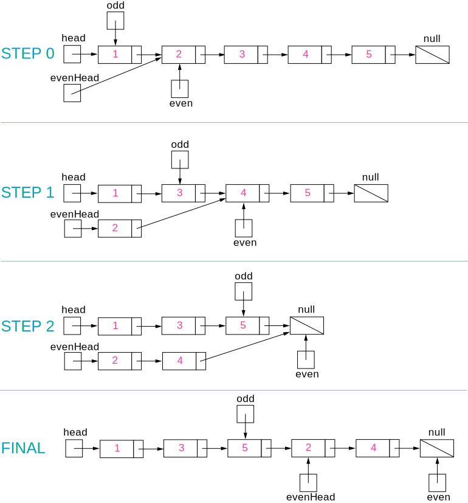

328. Odd Even Linked List

Given a singly linked list, group all odd nodes together followed by the even nodes. Please note here we are talking about the node number and not the value in the nodes.

You should try to do it in place. The program should run in O(1) space complexity and O(nodes) time complexity.

**Example 1:**
```
Input: 1->2->3->4->5->NULL
Output: 1->3->5->2->4->NULL
```

**Example 2:**
```
Input: 2->1->3->5->6->4->7->NULL
Output: 2->3->6->7->1->5->4->NULL
```

Note:

* The relative order inside both the even and odd groups should remain as it was in the input.
* The first node is considered odd, the second node even and so on ...

Solution 1: 52 ms, 15.7 MB
```python
# Definition for singly-linked list.
# class ListNode:
#     def __init__(self, x):
#         self.val = x
#         self.next = None

class Solution:
    def oddEvenList(self, head: ListNode) -> ListNode:
        dummy = ListNode(0)
        dummy.next = head
        if head and head.next:  
            is_odd = True
            odd, even, even_0 = head, head.next, head.next
            head = head.next.next
            while head:
                if is_odd:
                    odd.next = head
                    head = head.next
                    odd = odd.next
                    odd.next = even_0
                    if even == even_0 and head == None:
                        even.next = None
                else:
                    even.next = head
                    head = head.next
                    even = even.next
                    if even.next:
                        even.next = even.next.next

                is_odd = not is_odd

        return dummy.next
```

Solution 2: 44 ms, 15.6 MB
```python
# Definition for singly-linked list.
# class ListNode:
#     def __init__(self, x):
#         self.val = x
#         self.next = None

class Solution:
    def oddEvenList(self, head: ListNode) -> ListNode:
        if not head:
            return head

        even_dummy,odd_dummy=ListNode(0),ListNode(0)
        tails,turn=[even_dummy,odd_dummy], 0
        while head:
            tails[turn].next=head
            head=head.next
            tails[turn]=tails[turn].next
            turn ^=1

        tails[1].next=None
        tails[0].next=odd_dummy.next

        return even_dummy.next
```

[Solution] Solution 3:

**Intuition**

Put the odd nodes in a linked list and the even nodes in another. Then link the evenList to the tail of the oddList.

**Algorithm**

The solution is very intuitive. But it is not trivial to write a concise and bug-free code.

A well-formed LinkedList need two pointers head and tail to support operations at both ends. The variables head and odd are the head pointer and tail pointer of one LinkedList we call oddList; the variables evenHead and even are the head pointer and tail pointer of another LinkedList we call evenList. The algorithm traverses the original LinkedList and put the odd nodes into the oddList and the even nodes into the evenList. To traverse a LinkedList we need at least one pointer as an iterator for the current node. But here the pointers odd and even not only serve as the tail pointers but also act as the iterators of the original list.

The best way of solving any linked list problem is to visualize it either in your mind or on a piece of paper. An illustration of our algorithm is following:



```java
public class Solution {
    public ListNode oddEvenList(ListNode head) {
        if (head == null) return null;
        ListNode odd = head, even = head.next, evenHead = even;
        while (even != null && even.next != null) {
            odd.next = even.next;
            odd = odd.next;
            even.next = odd.next;
            even = even.next;
        }
        odd.next = evenHead;
        return head;
    }
}
```

**Complexity Analysis**

* Time complexity : $O(N)$. There are total $N$ nodes and we visit each node once.
* Space complexity : $O(1)$. All we need is the four pointers.