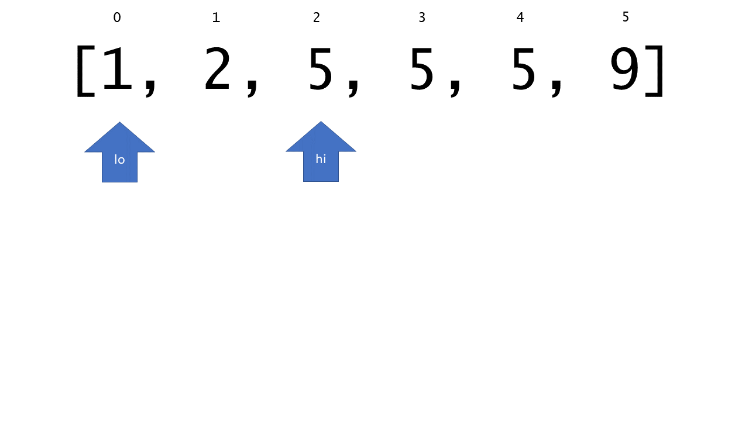
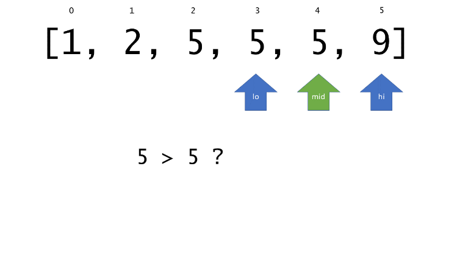

34. Find First and Last Position of Element in Sorted Array

Given an array of integers `nums` sorted in ascending order, find the starting and ending position of a given `target` value.

Your algorithm's runtime complexity must be in the order of O(log n).

If the target is not found in the array, return `[-1, -1]`.

**Example 1:**
```
Input: nums = [5,7,7,8,8,10], target = 8
Output: [3,4]
```

**Example 2:**
```
Input: nums = [5,7,7,8,8,10], target = 6
Output: [-1,-1]
```

# Solution
---
## Approach 1: Linear Scan
**Intuition**

Checking every index for `target` exhausts the search space, so it must work.

**Algorithm**

First, we do a linear scan of nums from the left, breaking when we find an instance of `target`. If we never break, then `target` is not present, so we can return the "error code" of `[-1, -1]` early. Given that we did find a valid left index, we can do a second linear scan, but this time from the right. In this case, the first instance of `target` encountered will be the rightmost one (and because a leftmost one exists, there is guaranteed to also be a rightmost one). We then simply return a list containing the two located indices.

```python
class Solution:
    def searchRange(self, nums, target):
        # find the index of the leftmost appearance of `target`. if it does not
        # appear, return [-1, -1] early.
        for i in range(len(nums)):
            if nums[i] == target:
                left_idx = i
                break
        else:
            return [-1, -1]

        # find the index of the rightmost appearance of `target` (by reverse
        # iteration). it is guaranteed to appear.
        for j in range(len(nums)-1, -1, -1):
            if nums[j] == target:
                right_idx = j
                break

        return [left_idx, right_idx]
```
**Complexity Analysis**

* Time complexity : $O(n)$

This brute-force approach examines each of the n elements of nums exactly twice, so the overall runtime is linear.

* Space complexity : $O(1)$

The linear scan method allocates a fixed-size array and a few integers, so it has a constant-size memory footprint.

## Approach 2: Binary Search
**Intuition**

Because the array is sorted, we can use binary search to locate the left and rightmost indices.

**Algorithm**

The overall algorithm works fairly similarly to the linear scan approach, except for the subroutine used to find the left and rightmost indices themselves. Here, we use a modified binary search to search a sorted array, with a few minor adjustments. First, because we are locating the leftmost (or rightmost) index containing target (rather than returning true iff we find target), the algorithm does not terminate as soon as we find a match. Instead, we continue to search until `lo == hi` and they contain some index at which target can be found.

The other change is the introduction of the left parameter, which is a boolean indicating what to do in the event that `target == nums[mid]`; if left is true, then we "recurse" on the `left` subarray on ties. Otherwise, we go `right`. To see why this is correct, consider the situation where we find `target` at index i. The leftmost target cannot occur at any index greater than i, so we never need to consider the right subarray. The same argument applies to the rightmost index.

The first animation below shows the process for finding the leftmost index, and the second shows the process for finding the index right of the rightmost index.








```python
class Solution:
    # returns leftmost (or rightmost) index at which `target` should be inserted in sorted
    # array `nums` via binary search.
    def extreme_insertion_index(self, nums, target, left):
        lo = 0
        hi = len(nums)

        while lo < hi:
            mid = (lo + hi) // 2
            if nums[mid] > target or (left and target == nums[mid]):
                hi = mid
            else:
                lo = mid+1

        return lo


    def searchRange(self, nums, target):
        left_idx = self.extreme_insertion_index(nums, target, True)

        # assert that `left_idx` is within the array bounds and that `target`
        # is actually in `nums`.
        if left_idx == len(nums) or nums[left_idx] != target:
            return [-1, -1]

        return [left_idx, self.extreme_insertion_index(nums, target, False)-1]
```

**Complexity Analysis**

* Time complexity : $O(\log_{10}(n))$

Because binary search cuts the search space roughly in half on each iteration, there can be at most $\lceil \log_{10}(n) \rceil$ iterations. Binary search is invoked twice, so the overall complexity is logarithmic.

* Space complexity : $O(1)$

All work is done in place, so the overall memory usage is constant.

# Submissions
---
**Solution 1: (Binary Search)**
```
Runtime: 36 ms
Memory Usage: N/A
```
```python
class Solution:
    def searchRange(self, nums, target):
        """
        :type nums: List[int]
        :type target: int
        :rtype: List[int]
        """
        start = bisect.bisect_left(nums, target)  # Find left index
        if start >= len(nums): return [-1, -1]
        end = bisect.bisect_right(nums, target)  # Find right index
        if (end == 0 and nums[end] != target) or target != nums[end-1]: return [-1, -1]
        return [start, end-1]  # bisect_right returns the position after the last occurrence of our target. So we return end -1
```

**Solution 2: (Binary Search)**
```
Runtime: 12 ms
Memory Usage: 7.3 MB
```
```c
int bisect_left(int *nums, int n, int target, bool *found)
{
    int lo, hi;

    *found = false;
    lo = 0;
    hi = n - 1;
    
    if (n == 0)
        return -1;
    
    if (n == 1 && nums[0] == target) {
        *found = true;
        return 0;
    }
    
    while (lo < hi) {
        int mid = (lo + hi) / 2;

        if (target <= nums[mid]) {
            hi = mid;
        } else {
            lo = mid + 1;
        }
    }
    
    assert(lo == hi);
    if (nums[lo] == target)
        *found = true;
    return lo;
}

#define DIVUP(a, b) (((a) + (b) - 1) / (b))

int bisect_right(int *nums, int n, int target, bool *found)
{
    int lo, hi;
    
    *found = false;
    lo = 0;
    hi = n - 1;
    
    if (n == 0)
        return -1;
    
    if (n == 1 && nums[0] == target) {
        *found = true;
        return 0;
    }
    
    while (lo < hi) {
        int mid = DIVUP(lo + hi, 2);

        if (nums[mid] <= target) {
            lo = mid;
        } else {
            hi = mid - 1;
        }
    }

    assert(lo == hi);
    if (nums[lo] == target)
        *found = true;
    return lo;
}
/**
 * Note: The returned array must be malloced, assume caller calls free().
 */
int* searchRange(int* nums, int numsSize, int target, int* returnSize){
    int *ret = malloc(sizeof(int) * 2);
    *returnSize = 2;
    bool found;

    ret[0] = bisect_left(nums, numsSize, target, &found);
    if (!found)
        ret[0] = -1;
    
    ret[1] = bisect_right(nums, numsSize, target, &found);
    if (!found)
        ret[1] = -1;
    
    return ret;
}
```

**Solution 3: (Binary Search)**
```
Runtime: 13 ms
Memory Usage: 13.6 MB
```
```c++
class Solution {
public:
    vector<int> searchRange(vector<int>& nums, int target) {
        if(!binary_search(nums.begin(),nums.end(),target))  return {-1,-1};
        
        int start = lower_bound(nums.begin(),nums.end(),target) - nums.begin();

        int end = upper_bound(nums.begin(),nums.end(),target) - nums.begin();

        return {start , end-1};
    }
};
```
