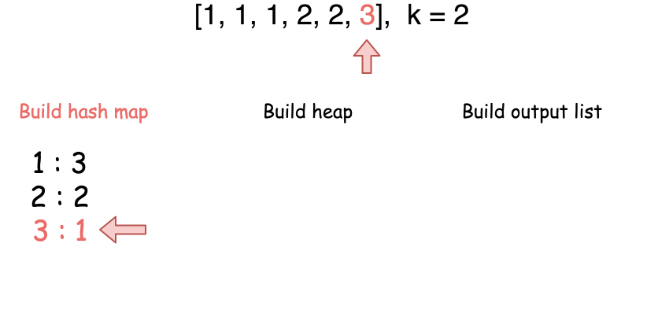
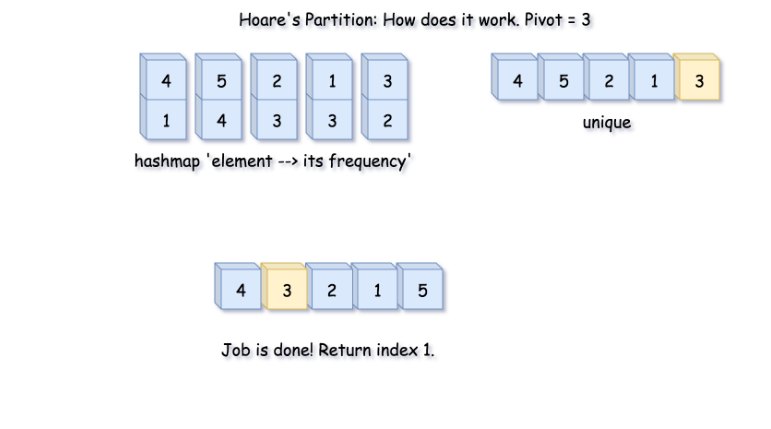

347. Top K Frequent Elements

Given a non-empty array of integers, return the **k** most frequent elements.

**Example 1:**
```
Input: nums = [1,1,1,2,2,3], k = 2
Output: [1,2]
```

**Example 2:**
```
Input: nums = [1], k = 1
Output: [1]
```

**Note:**

* You may assume `k` is always valid, `1 ≤ k ≤ number of unique elements`.
* Your algorithm's time complexity must be better than $O(n log n)$, where $n$ is the array's size.

# Solution
---
**Intuition**
If `k = 1` the linear-time solution is quite simple. One could keep the frequency of elements appearance in a hash map and update the maximum element at each step.

When `k > 1` we need a data structure that has a fast access to the elements ordered by their frequencies. The idea here is to use the heap which is also known as priority queue.


## Approach 1: Heap
The first step is to build a hash map `element -> its frequency`. In Java we could use data structure `HashMap` but have to fill it manually. Python provides us both a `dictionary` structure for the hash map and a method `Counter` in the `collections `library to build the hash map we need.
This step takes $\mathcal{O}(N)$ time where `N` is number of elements in the list.

The second step is to build a heap. The time complexity of adding an element in a heap is $\mathcal{O}(\log(k))$ and we do it `N` times that means $\mathcal{O}(N \log(k))$ time complexity for this step.

The last step to build an output list has
$\mathcal{O}(k \log(k))$ time complexity.

In Python there is a method nlargest in `heapq` library (check here the source code) which has the same $\mathcal{O}(k \log(k))$ time complexity and combines two last steps in one line.





**C++**

```c++
class Solution {
public:
    vector<int> topKFrequent(vector<int>& nums, int k) {
        // O(1) time
        if (k == nums.size()) {
            return nums;
        }

        // 1. build hash map : element and how often it appears
        // O(N) time
        map<int, int> count_map;
        for (int n : nums) {
            count_map[n] += 1;
        }

        // initialise a heap with most frequent elements at the top
        auto comp = [&count_map](int n1, int n2) { return count_map[n1] > count_map[n2]; };
        priority_queue<int, vector<int>, decltype(comp)> heap(comp);

        // 2. keep k top fequent elements in the heap
        // O(N log k) < O(N log N) time
        for (pair<int, int> p : count_map) {
            heap.push(p.first);
            if (heap.size() > k) heap.pop();
        }

        // 3. build an output array
        // O(k log k) time
        vector<int> top(k);
        for (int i = k - 1; i >= 0; i--) {
            top[i] = heap.top();
            heap.pop();
        }
        return top;
    }
};
```

**Python3**

```python
class Solution:
    def topKFrequent(self, nums, k):
        """
        :type nums: List[int]
        :type k: int
        :rtype: List[int]
        """ 
        count = collections.Counter(nums)   
        return heapq.nlargest(k, count.keys(), key=count.get) 
```

**Complexity Analysis**

* Time complexity : $\mathcal{O}(N \log(k))$. The complexity of Counter method is $\mathcal{O}(N)$. To build a heap and output list takes $\mathcal{O}(N \log(k))$. Hence the overall complexity of the algorithm is $\mathcal{O}(N + N \log(k)) = \mathcal{O}(N \log(k))$.

* Space complexity : $\mathcal{O}(N)$ to store the hash map.

## Approach 2: Quickselect
**Hoare's selection algorithm**

Quickselect is a textbook algorthm typically used to solve the problems "find kth something": kth smallest, kth largest, kth most frequent, kth less frequent, etc. Like quicksort, quickselect was developed by Tony Hoare, and also known as Hoare's selection algorithm.

It has $\mathcal{O}(N)$ average time complexity and widely used in practice. It worth to note that its worth case time complexity is $\mathcal{O}(N^2)$, although the probability of this worst-case is negligible.

The approach is the same as for quicksort.

>One chooses a pivot and defines its position in a sorted array in a linear time using so-called partition algorithm.

As an output, we have an array where the pivot is on its perfect position in the ascending sorted array, sorted by the frequency. All elements on the left of the pivot are less frequent than the pivot, and all elements on the right are more frequent or have the same frequency.

Hence the array is now split into two parts. If by chance our pivot element took `N - k`th final position, then $k$ elements on the right are these top $k$ frequent we're looking for. If not, we can choose one more pivot and place it in its perfect position.


If that were a quicksort algorithm, one would have to process both parts of the array. That would result in $\mathcal{O}(N \log N)$ time complexity. In this case, there is no need to deal with both parts since one knows in which part to search for N - kth less frequent element, and that reduces the average time complexity to $\mathcal{O}(N)$.

**Algorithm**

The algorithm is quite straightforward :

* Build a hash map element -> its frequency and convert its keys into the array unique of unique elements. Note that elements are unique, but their frequencies are not. That means we need a partition algorithm that works fine with duplicates.

* Work with `unique` array. Use a partition scheme (please check the next section) to place the pivot into its perfect position `pivot_index` in the sorted array, move less frequent elements to the left of pivot, and more frequent or of the same frequency - to the right.

* Compare `pivot_index` and `N - k`.

    * If `pivot_index == N - k`, the pivot is `N - k`th most frequent element, and all elements on the right are more frequent or of the same frequency. Return these top $k$ frequent elements.

    * Otherwise, choose the side of the array to proceed recursively.


**Hoare's Partition vs Lomuto's Partition**

There is a zoo of partition algorithms. The most simple one is Lomuto's Partition Scheme.

>The drawback of Lomuto's partition is it fails with duplicates.

Here we work with an array of unique elements, but they are compared by frequencies, which are not unique. That's why we choose Hoare's Partition here.

>Hoare's partition is more efficient than Lomuto's partition because it does three times fewer swaps on average, and creates efficient partitions even when all values are equal.

Here is how it works:

* Move pivot at the end of the array using swap.

* Set the pointer at the beginning of the array `store_index = left`.

* Iterate over the array and move all less frequent elements to the left `swap(store_index, i)`. Move `store_index` one step to the right after each swap.

* Move the pivot to its final place, and return this index.




**C++**

```c++
int partition(int left, int right, int pivot_index) {
    int pivot_frequency = count_map[unique[pivot_index]];
    // 1. move pivot to the end
    swap(unique[pivot_index], unique[right]);

    // 2. move all less frequent elements to the left
    int store_index = left;
    for (int i = left; i <= right; i++) {
        if (count_map[unique[i]] < pivot_frequency) {
            swap(unique[store_index], unique[i]);
            store_index += 1;
        }
    }

    // 3. move pivot to its final place
    swap(unique[right], unique[store_index]);

    return store_index;
}
```


**Python3**

```python
def partition(left, right, pivot_index) -> int:
    pivot_frequency = count[unique[pivot_index]]
    # 1. move pivot to the end
    unique[pivot_index], unique[right] = unique[right], unique[pivot_index]  
    
    # 2. move all less frequent elements to the left
    store_index = left
    for i in range(left, right):
        if count[unique[i]] < pivot_frequency:
            unique[store_index], unique[i] = unique[i], unique[store_index]
            store_index += 1

    # 3. move pivot to its final place
    unique[right], unique[store_index] = unique[store_index], unique[right]  
    
    return store_index
```

**Implementation**

Here is a total algorithm implementation.

**C++**

```c++
class Solution {
private:
    vector<int> unique;
    map<int, int> count_map;

public:
    int partition(int left, int right, int pivot_index) {
        int pivot_frequency = count_map[unique[pivot_index]];
        // 1. move pivot to the end
        swap(unique[pivot_index], unique[right]);

        // 2. move all less frequent elements to the left
        int store_index = left;
        for (int i = left; i <= right; i++) {
            if (count_map[unique[i]] < pivot_frequency) {
                swap(unique[store_index], unique[i]);
                store_index += 1;
            }
        }

        // 3. move pivot to its final place
        swap(unique[right], unique[store_index]);

        return store_index;
    }

    void quickselect(int left, int right, int k_smallest) {
        /*
        Sort a list within left..right till kth less frequent element
        takes its place. 
        */

        // base case: the list contains only one element
        if (left == right) return;

        int pivot_index = left + rand() % (right - left + 1);

        // find the pivot position in a sorted list
        pivot_index = partition(left, right, pivot_index);

        // if the pivot is in its final sorted position
        if (k_smallest == pivot_index) {
            return;
        } else if (k_smallest < pivot_index) {
            // go left
            quickselect(left, pivot_index - 1, k_smallest);
        } else {
            // go right
            quickselect(pivot_index + 1, right, k_smallest);
        }
    }

    vector<int> topKFrequent(vector<int>& nums, int k) {
        // build hash map : element and how often it appears
        for (int n : nums) {
            count_map[n] += 1;
        }

        // array of unique elements
        int n = count_map.size();
        for (pair<int, int> p : count_map) {
            unique.push_back(p.first);
        }

        // kth top frequent element is (n - k)th less frequent.
        // Do a partial sort: from less frequent to the most frequent, till
        // (n - k)th less frequent element takes its place (n - k) in a sorted array.
        // All element on the left are less frequent.
        // All the elements on the right are more frequent.
        quickselect(0, n - 1, n - k);
        // Return top k frequent elements
        vector<int> top_k_frequent(k);
        copy(unique.begin() + n - k, unique.end(), top_k_frequent.begin());
        return top_k_frequent;
    }
};
```

**Python3**

```python
from collections import Counter
class Solution:
    def topKFrequent(self, nums: List[int], k: int) -> List[int]:
        count = Counter(nums)
        unique = list(count.keys())
        
        def partition(left, right, pivot_index) -> int:
            pivot_frequency = count[unique[pivot_index]]
            # 1. move pivot to end
            unique[pivot_index], unique[right] = unique[right], unique[pivot_index]  
            
            # 2. move all less frequent elements to the left
            store_index = left
            for i in range(left, right):
                if count[unique[i]] < pivot_frequency:
                    unique[store_index], unique[i] = unique[i], unique[store_index]
                    store_index += 1

            # 3. move pivot to its final place
            unique[right], unique[store_index] = unique[store_index], unique[right]  
            
            return store_index
        
        def quickselect(left, right, k_smallest) -> None:
            """
            Sort a list within left..right till kth less frequent element
            takes its place. 
            """
            # base case: the list contains only one element
            if left == right: 
                return
            
            # select a random pivot_index
            pivot_index = random.randint(left, right)     
                            
            # find the pivot position in a sorted list   
            pivot_index = partition(left, right, pivot_index)
            
            # if the pivot is in its final sorted position
            if k_smallest == pivot_index:
                 return 
            # go left
            elif k_smallest < pivot_index:
                quickselect(left, pivot_index - 1, k_smallest)
            # go right
            else:
                quickselect(pivot_index + 1, right, k_smallest)
         
        n = len(unique) 
        # kth top frequent element is (n - k)th less frequent.
        # Do a partial sort: from less frequent to the most frequent, till
        # (n - k)th less frequent element takes its place (n - k) in a sorted array. 
        # All element on the left are less frequent.
        # All the elements on the right are more frequent.  
        quickselect(0, n - 1, n - k)
        # Return top k frequent elements
        return unique[n - k:]
```

**Complexity Analysis**

* Time complexity: $\mathcal{O}(N)$ in the average case, $\mathcal{O}(N^2)$ in the worst case. Please refer to this card for the good detailed explanation of Master Theorem. Master Theorem helps to get an average complexity by writing the algorithm cost as $T(N) = a T(N / b) + f(N)$. Here we have an example of Master Theorem case III: $T(N) = T \left(\frac{N}{2}\right) + N$, that results in $\mathcal{O}(N)$ time complexity. That's the case of random pivots.

In the worst-case of constantly bad chosen pivots, the problem is not divided by half at each step, it becomes just one element less, that leads to $\mathcal{O}(N^2)$ time complexity. It happens, for example, if at each step you choose the pivot not randomly, but take the rightmost element. For the random pivot choice the probability of having such a worst-case is negligibly small.

* Space complexity: up to $\mathcal{O}(N)$ to store hash map and array of unique elements.

## Further Discussion: Could We Do Worst-Case Linear Time?
In theory, we could, the algorithm is called Median of Medians.

This method is never used in practice because of two drawbacks:

* It's outperformer. Yes, it works in a linear time $\alpha N$, but the constant $\alpha$ is so large that in practice it often works even slower than $N^2$.

* It doesn't work with duplicates.

# Submissions
---
**Solution: (Heap)**
```
Runtime: 40 ms
Memory Usage: 13.8 MB
```
```c++
class Solution {
public:
    vector<int> topKFrequent(vector<int>& nums, int k) {
        // O(1) time
        if (k == nums.size()) {
            return nums;
        }

        // 1. build hash map : element and how often it appears
        // O(N) time
        map<int, int> count_map;
        for (int n : nums) {
            count_map[n] += 1;
        }

        // initialise a heap with most frequent elements at the top
        auto comp = [&count_map](int n1, int n2) { return count_map[n1] > count_map[n2]; };
        priority_queue<int, vector<int>, decltype(comp)> heap(comp);

        // 2. keep k top fequent elements in the heap
        // O(N log k) < O(N log N) time
        for (pair<int, int> p : count_map) {
            heap.push(p.first);
            if (heap.size() > k) heap.pop();
        }

        // 3. build an output array
        // O(k log k) time
        vector<int> top(k);
        for (int i = k - 1; i >= 0; i--) {
            top[i] = heap.top();
            heap.pop();
        }
        return top;
    }
};
```

**Solution: (Quickselect (Hoare's selection algorithm))**
```
Runtime: 32 ms
Memory Usage: 13.8 MB
```
```c++
class Solution {
private:
    vector<int> unique;
    map<int, int> count_map;
public:
    int partition(int left, int right, int pivot_index) {
        int pivot_frequency = count_map[unique[pivot_index]];
        // 1. move pivot to the end
        swap(unique[pivot_index], unique[right]);

        // 2. move all less frequent elements to the left
        int store_index = left;
        for (int i = left; i <= right; i++) {
            if (count_map[unique[i]] < pivot_frequency) {
                swap(unique[store_index], unique[i]);
                store_index += 1;
            }
        }

        // 3. move pivot to its final place
        swap(unique[right], unique[store_index]);

        return store_index;
    }

    void quickselect(int left, int right, int k_smallest) {
        /*
        Sort a list within left..right till kth less frequent element
        takes its place. 
        */

        // base case: the list contains only one element
        if (left == right) return;

        int pivot_index = left + rand() % (right - left + 1);

        // find the pivot position in a sorted list
        pivot_index = partition(left, right, pivot_index);

        // if the pivot is in its final sorted position
        if (k_smallest == pivot_index) {
            return;
        } else if (k_smallest < pivot_index) {
            // go left
            quickselect(left, pivot_index - 1, k_smallest);
        } else {
            // go right
            quickselect(pivot_index + 1, right, k_smallest);
        }
    }

    vector<int> topKFrequent(vector<int>& nums, int k) {
        // build hash map : element and how often it appears
        for (int n : nums) {
            count_map[n] += 1;
        }

        // array of unique elements
        int n = count_map.size();
        for (pair<int, int> p : count_map) {
            unique.push_back(p.first);
        }

        // kth top frequent element is (n - k)th less frequent.
        // Do a partial sort: from less frequent to the most frequent, till
        // (n - k)th less frequent element takes its place (n - k) in a sorted array.
        // All element on the left are less frequent.
        // All the elements on the right are more frequent.
        quickselect(0, n - 1, n - k);
        // Return top k frequent elements
        vector<int> top_k_frequent(k);
        copy(unique.begin() + n - k, unique.end(), top_k_frequent.begin());
        return top_k_frequent;
    }
};
```

**Solution: (Heap)**
```
Runtime: 108 ms
Memory Usage: 17.1 MB
```
```python
class Solution:
    def topKFrequent(self, nums, k):
        """
        :type nums: List[int]
        :type k: int
        :rtype: List[int]
        """
        count = collections.Counter(nums)   
        return heapq.nlargest(k, count.keys(), key=count.get) 
```

**Solution: (Quickselect)**
```
Runtime: 108 ms
Memory Usage: 18.5 MB
```
```python
class Solution:
    def topKFrequent(self, nums, k):
        """
        :type nums: List[int]
        :type k: int
        :rtype: List[int]
        """
        count = Counter(nums)
        unique = list(count.keys())
        
        def partition(left, right, pivot_index) -> int:
            pivot_frequency = count[unique[pivot_index]]
            # 1. move pivot to end
            unique[pivot_index], unique[right] = unique[right], unique[pivot_index]  
            
            # 2. move all less frequent elements to the left
            store_index = left
            for i in range(left, right):
                if count[unique[i]] < pivot_frequency:
                    unique[store_index], unique[i] = unique[i], unique[store_index]
                    store_index += 1

            # 3. move pivot to its final place
            unique[right], unique[store_index] = unique[store_index], unique[right]  
            
            return store_index
        
        def quickselect(left, right, k_smallest) -> None:
            """
            Sort a list within left..right till kth less frequent element
            takes its place. 
            """
            # base case: the list contains only one element
            if left == right: 
                return
            
            # select a random pivot_index
            pivot_index = random.randint(left, right)     
                            
            # find the pivot position in a sorted list   
            pivot_index = partition(left, right, pivot_index)
            
            # if the pivot is in its final sorted position
            if k_smallest == pivot_index:
                 return 
            # go left
            elif k_smallest < pivot_index:
                quickselect(left, pivot_index - 1, k_smallest)
            # go right
            else:
                quickselect(pivot_index + 1, right, k_smallest)
         
        n = len(unique) 
        # kth top frequent element is (n - k)th less frequent.
        # Do a partial sort: from less frequent to the most frequent, till
        # (n - k)th less frequent element takes its place (n - k) in a sorted array. 
        # All element on the left are less frequent.
        # All the elements on the right are more frequent.  
        quickselect(0, n - 1, n - k)
        # Return top k frequent elements
        return unique[n - k:]
```

**Solution 1: (Hash Table)**
```
Runtime: 108 ms
Memory Usage: 17.1 MB
```
```python
class Solution:
    def topKFrequent(self, nums, k):
        """
        :type nums: List[int]
        :type k: int
        :rtype: List[int]
        """
        count = collections.Counter(nums)
        return [el for el, c in count.most_common(k)]
```

**Solution 2: (Heap)**
```
Runtime: 19 ms
Memory Usage: 13.7 MB
```
```c++
class Solution {
public:
    vector<int> topKFrequent(vector<int>& nums, int k) {
        unordered_map<int, int> cnt;
        for (auto num: nums)
            cnt[num] += 1;
        priority_queue<pair<int,int>> pq;
        for (auto [el, c]: cnt)
            pq.push({c, el});
        vector<int> ans;
        while (k) {
            auto [c, cur] = pq.top();
            pq.pop();
            ans.push_back(cur);
            k -= 1;
        }
        return ans;
    }
};
```
