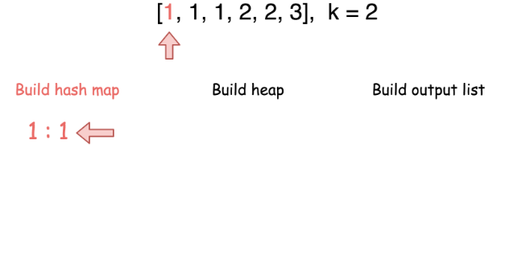

347. Top K Frequent Elements

Given a non-empty array of integers, return the **k** most frequent elements.

**Example 1:**
```
Input: nums = [1,1,1,2,2,3], k = 2
Output: [1,2]
```

**Example 2:**
```
Input: nums = [1], k = 1
Output: [1]
```

**Note:**

* You may assume `k` is always valid, `1 ≤ k ≤ number of unique elements`.
* Your algorithm's time complexity must be better than $O(n log n)$, where $n$ is the array's size.

# Solution
---
**Intuition**
If `k = 1` the linear-time solution is quite simple. One could keep the frequency of elements appearance in a hash map and update the maximum element at each step.

When `k > 1` we need a data structure that has a fast access to the elements ordered by their frequencies. The idea here is to use the heap which is also known as priority queue.


## Approach 1: Heap
The first step is to build a hash map `element -> its frequency`. In Java we could use data structure `HashMap` but have to fill it manually. Python provides us both a `dictionary` structure for the hash map and a method `Counter` in the `collections `library to build the hash map we need.
This step takes $\mathcal{O}(N)$ time where `N` is number of elements in the list.

The second step is to build a heap. The time complexity of adding an element in a heap is $\mathcal{O}(\log(k))$ and we do it `N` times that means $\mathcal{O}(N \log(k))$ time complexity for this step.

The last step to build an output list has
$\mathcal{O}(k \log(k))$ time complexity.

In Python there is a method nlargest in `heapq` library (check here the source code) which has the same $\mathcal{O}(k \log(k))$ time complexity and combines two last steps in one line.




```python
class Solution:
    def topKFrequent(self, nums, k):
        """
        :type nums: List[int]
        :type k: int
        :rtype: List[int]
        """ 
        count = collections.Counter(nums)   
        return heapq.nlargest(k, count.keys(), key=count.get) 
```

**Complexity Analysis**

* Time complexity : $\mathcal{O}(N \log(k))$. The complexity of Counter method is $\mathcal{O}(N)$. To build a heap and output list takes $\mathcal{O}(N \log(k))$. Hence the overall complexity of the algorithm is $\mathcal{O}(N + N \log(k)) = \mathcal{O}(N \log(k))$.

* Space complexity : $\mathcal{O}(N)$ to store the hash map.

**Side Notes**

Following the complexity analysis, the approach is optimal for small `k`. In the case of large k, one could revert the procedure by excluding the less frequent elements from the output.

Analysis written by @liaison and @andvary

# Submissions
---
**Solution 1: (Hash Table)**
```
Runtime: 108 ms
Memory Usage: 17.1 MB
```
```python
class Solution:
    def topKFrequent(self, nums, k):
        """
        :type nums: List[int]
        :type k: int
        :rtype: List[int]
        """
        count = collections.Counter(nums)
        return [el for el, c in count.most_common(k)]
```

**Solution 2: (Heap)**
```
Runtime: 108 ms
Memory Usage: 17.1 MB
```
```python
class Solution:
    def topKFrequent(self, nums, k):
        """
        :type nums: List[int]
        :type k: int
        :rtype: List[int]
        """
        count = collections.Counter(nums)   
        return heapq.nlargest(k, count.keys(), key=count.get) 
```