376. Wiggle Subsequence

A sequence of numbers is called a **wiggle sequence** if the differences between successive numbers strictly alternate between positive and negative. The first difference (if one exists) may be either positive or negative. A sequence with fewer than two elements is trivially a wiggle sequence.

For example, `[1,7,4,9,2,5]` is a wiggle sequence because the differences `(6,-3,5,-7,3)` are alternately positive and negative. In contrast, `[1,4,7,2,5]` and `[1,7,4,5,5]` are not wiggle sequences, the first because its first two differences are positive and the second because its last difference is zero.

Given a sequence of integers, return the length of the longest subsequence that is a wiggle sequence. A subsequence is obtained by deleting some number of elements (eventually, also zero) from the original sequence, leaving the remaining elements in their original order.

**Example 1:**
```
Input: [1,7,4,9,2,5]
Output: 6
Explanation: The entire sequence is a wiggle sequence.
```

**Example 2:**
```
Input: [1,17,5,10,13,15,10,5,16,8]
Output: 7
Explanation: There are several subsequences that achieve this length. One is [1,17,10,13,10,16,8].
```

**Example 3:**
```
Input: [1,2,3,4,5,6,7,8,9]
Output: 2
```

**Follow up:**

* Can you do it in O(n) time?

# Summary
We need to find the length of the longest wiggle subsequence. A wiggle subsequence consists of a subsequence with numbers which appears in alternating ascending / descending order.

# Solution
---
## Approach #1 Brute Force [Time Limit Exceeded]
Here, we can find the length of every possible wiggle subsequence and find the maximum length out of them. To implement this, we use a recursive function, $\text{calculate}(\text{nums}, \text{index}, \text{isUp})$ which takes the array $\text{nums}nums$, the $\text{index}index$ from which we need to find the length of the longest wiggle subsequence, boolean variable $\text{isUp}$ to tell whether we need to find an increasing wiggle or decreasing wiggle respectively. If the function $\text{calculate}$ is called after an increasing wiggle, we need to find the next decreasing wiggle with the same function. If the function $\text{calculate}$ is called after a decreasing wiggle, we need to find the next increasing wiggle with the same function.

```java
public class Solution {
    private int calculate(int[] nums, int index, boolean isUp) {
        int maxcount = 0;
        for (int i = index + 1; i < nums.length; i++) {
            if ((isUp && nums[i] > nums[index]) || (!isUp && nums[i] < nums[index]))
                maxcount = Math.max(maxcount, 1 + calculate(nums, i, !isUp));
        }
        return maxcount;
    }

    public int wiggleMaxLength(int[] nums) {
        if (nums.length < 2)
            return nums.length;
        return 1 + Math.max(calculate(nums, 0, true), calculate(nums, 0, false));
    }
}
```

**Complexity Analysis**

* Time complexity : $O(n!)$. $\text{calculate}()$ will be called maximum n!n! times.
* Space complexity : $O(n)$. Recursion of depth $n$ is used.

## Approach #2 Dynamic Programming [Accepted]
**Algorithm**

To understand this approach, take two arrays for dp named $up$ and $down$.

Whenever we pick up any element of the array to be a part of the wiggle subsequence, that element could be a part of a rising wiggle or a falling wiggle depending upon which element we have taken prior to it.

$up[i]$ refers to the length of the longest wiggle subsequence obtained so far considering $i^{th}$ element as the last element of the wiggle subsequence and ending with a rising wiggle.

Similarly, $down[i]$ refers to the length of the longest wiggle subsequence obtained so far considering $i^{th}$ element as the last element of the wiggle subsequence and ending with a falling wiggle.

$up[i]$ will be updated every time we find a rising wiggle ending with the $i^{th}$ element. Now, to find $up[i]$, we need to consider the maximum out of all the previous wiggle subsequences ending with a falling wiggle i.e. $down[j]$, for every $j < i$ and $nums[i] > nums[j]$. Similarly, $down[i]$ will be updated.

```java
public class Solution {
    public int wiggleMaxLength(int[] nums) {
        if (nums.length < 2)
            return nums.length;
        int[] up = new int[nums.length];
        int[] down = new int[nums.length];
        for (int i = 1; i < nums.length; i++) {
            for(int j = 0; j < i; j++) {
                if (nums[i] > nums[j]) {
                    up[i] = Math.max(up[i],down[j] + 1);
                } else if (nums[i] < nums[j]) {
                    down[i] = Math.max(down[i],up[j] + 1);
                }
            }
        }
        return 1 + Math.max(down[nums.length - 1], up[nums.length - 1]);
    }
}
```

**Complexity Analysis**
* Time complexity : $O(n^2)$. Loop inside a loop.
* Space complexity : $O(n)$. Two arrays of the same length are used for dp.

## Approach #3 Linear Dynamic Programming [Accepted]
**Algorithm**

Any element in the array could correspond to only one of the three possible states:

* up position, it means $nums[i] > nums[i-1]$
* down position, it means $nums[i] < nums[i-1]$
* equals to position, $nums[i] == nums[i-1]$

The updates are done as:

If $nums[i] > nums[i-1]$, that means it wiggles up. The element before it must be a down position. So $up[i] = down[i-1] + 1$, $down[i]$ remains the same as $down[i-1]$. If $nums[i] < nums[i-1]$, that means it wiggles down. The element before it must be a up position. So $down[i] = up[i-1] + 1$, $up[i]$ remains the same as $up[i-1]$. If $nums[i] == nums[i-1]$, that means it will not change anything becaue it didn't wiggle at all. So both $down[i]$ and $up[i]$ remain the same as $down[i-1]$ and $up[i-1]$.

At the end, we can find the larger out of $up[length-1]$ and $down[length-1]$ to find the max. wiggle subsequence length, where $length$ refers to the number of elements in the given array.

The process can be illustrated with the following example:

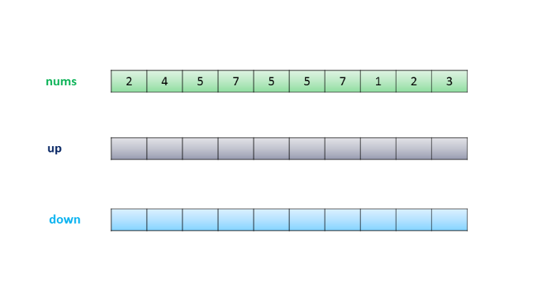
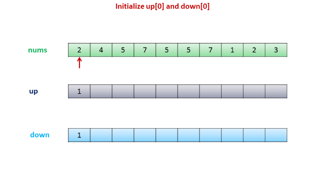
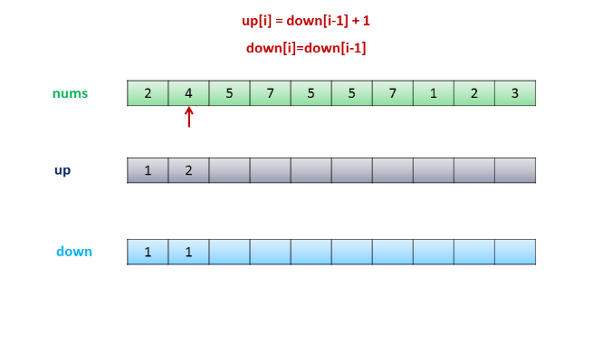
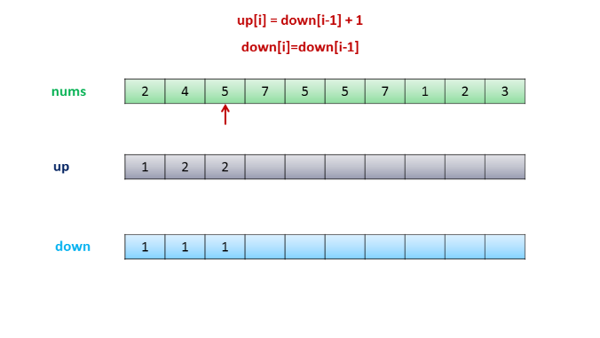
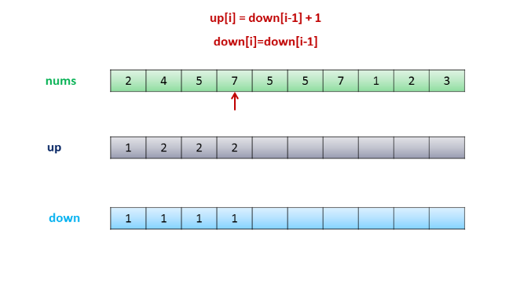
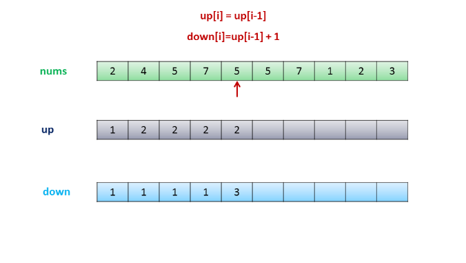
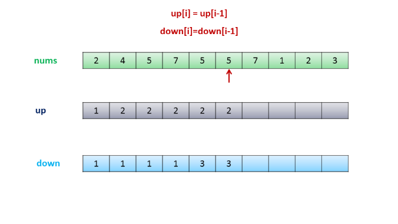
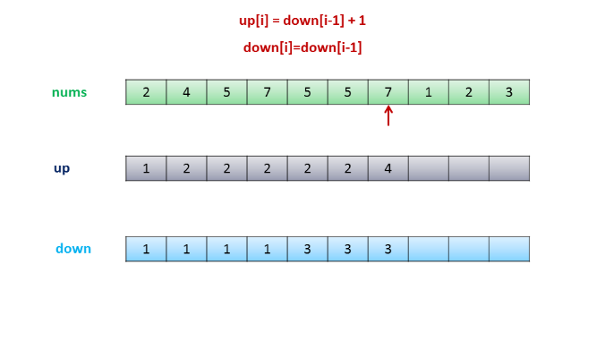
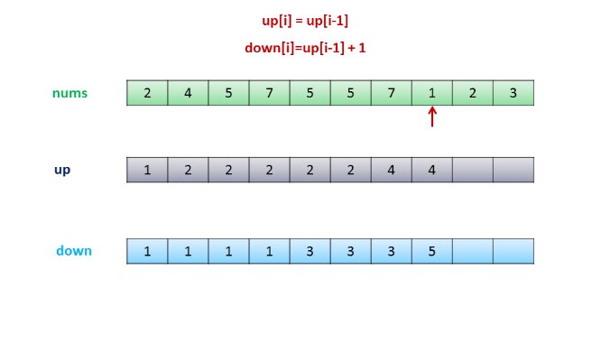
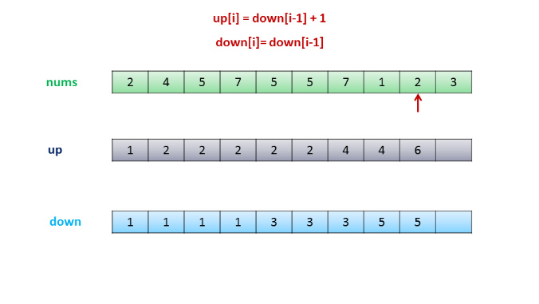
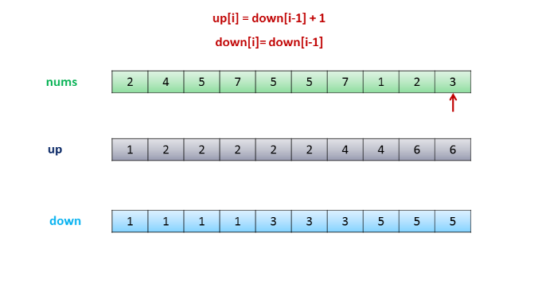
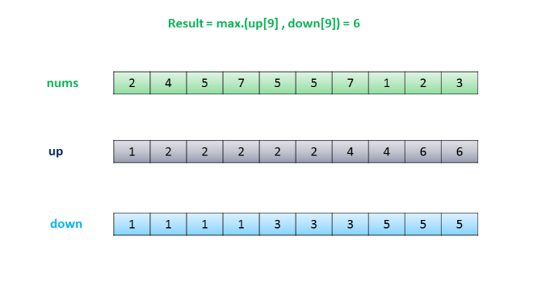

```java
public class Solution {
    public int wiggleMaxLength(int[] nums) {
        if (nums.length < 2)
            return nums.length;
        int[] up = new int[nums.length];
        int[] down = new int[nums.length];
        up[0] = down[0] = 1;
        for (int i = 1; i < nums.length; i++) {
            if (nums[i] > nums[i - 1]) {
                up[i] = down[i - 1] + 1;
                down[i] = down[i - 1];
            } else if (nums[i] < nums[i - 1]) {
                down[i] = up[i - 1] + 1;
                up[i] = up[i - 1];
            } else {
                down[i] = down[i - 1];
                up[i] = up[i - 1];
            }
        }
        return Math.max(down[nums.length - 1], up[nums.length - 1]);
    }
}
```

**Complexity Analysis**

* Time complexity : $O(n)$. Only one pass over the array length.
* Space complexity : $O(n)$. Two arrays of the same length are used for dp.

## Approach #4 Space-Optimized Dynamic Programming [Accepted]
**Algorithm**

This approach relies on the same concept as Approach #3. But we can observe that in the DP approach, for updating elements $up[i]$ and $down[i]$, we need only the elements $up[i-1]$ and $down[i-1]$. Thus, we can save space by not using the whole array, but only the last elements.

```java
public class Solution {
    public int wiggleMaxLength(int[] nums) {
        if (nums.length < 2)
            return nums.length;
        int down = 1, up = 1;
        for (int i = 1; i < nums.length; i++) {
            if (nums[i] > nums[i - 1])
                up = down + 1;
            else if (nums[i] < nums[i - 1])
                down = up + 1;
        }
        return Math.max(down, up);
    }
}
```

**Cplexity Analysis**

* me complexity : $(n)$ Only one pass over the array length.
* ace complexity : $(1)$ Constant space is used.

## roach #5 Greedy Approach [Accepted]
**gorithm**

We need not necessarily need dp to solve this problem. This problem is equivalent to finding the number of alternating max. and min. peaks in the array. Since, if we choose any other intermediate number to be a part of the current wiggle subsequence, the maximum length of that wiggle subsequence will always be less than or equal to the one obtained by choosing only the consecutive max. and min. elements.

This can be clarified by looking at the following figure:

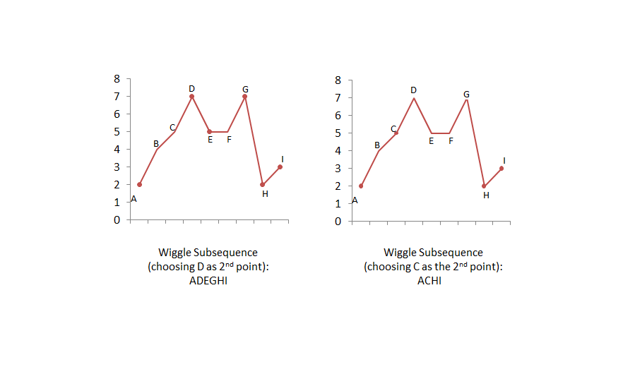

From the above figure, we can see that if we choose C instead of D as the 2nd point in the wiggle subsequence, we can't include the point E. Thus, we won't obtain the maximum length wiggle subsequence.

Thus, to solve this problem, we maintain a variable $\text{prevdiff}$ where $\text{prevdiff}$ is used to indicate whether the current subsequence of numbers lies in an increasing or decreasing wiggle. If $\text{prevdiff} > 0$ it indicates that we have found the increasing wiggle and are looking for a decreasing wiggle now. Thus, we update the length of the found subsequence when $\text{diff}$ ($nums[i]-nums[i-1]$) becomes negative. Similarly, if $\text{prevdiff} < 0$, we will update the count when $\text{diff}$ ($nums[i]-nums[i-1]$) becomes positive.

When the complete array has been traversed, we get the required count, which represents the length of the longest wiggle subsequence.

```java
public class Solution {
    public int wiggleMaxLength(int[] nums) {
        if (nums.length < 2)
            return nums.length;
        int prevdiff = nums[1] - nums[0];
        int count = prevdiff != 0 ? 2 : 1;
        for (int i = 2; i < nums.length; i++) {
            int diff = nums[i] - nums[i - 1];
            if ((diff > 0 && prevdiff <= 0) || (diff < 0 && prevdiff >= 0)) {
                count++;
                prevdiff = diff;
            }
        }
        return count;
    }
}
```

**Complexity Analysis**
* Time complexity : $O(n)$. We traverse the given array once.

* Space complexity : $O(1)$. No extra space is used.

# Submissions
---
**Solution 1: (DP Bottom-Up)**
```
Runtime: 44 ms
Memory Usage: 13.9 MB
```
```python
class Solution:
    def wiggleMaxLength(self, nums: List[int]) -> int:
        if len(nums) < 2:
            return len(nums)
        
        up = down = 1
        for i in range(1, len(nums)):
            if nums[i] > nums[i-1]:
                up = down + 1
            elif nums[i] < nums[i-1]:
                down = up + 1
                
        return max(up, down)
```

**Solution 2 (Greedy)**
```
Runtime: 40 ms
Memory Usage: 14 MB
```
```python
class Solution:
    def wiggleMaxLength(self, nums: List[int]) -> int:
        N = len(nums)
        if N < 2:
            return N
        
        prevdiff = nums[1] - nums[0];
        count = 2 if prevdiff != 0 else 1
        for i in range(2, N):
            diff = nums[i] - nums[i - 1]
            if ((diff > 0 and prevdiff <= 0) or (diff < 0 and prevdiff >= 0)):
                count += 1
                prevdiff = diff
        
        return count
```

**Solution 3: (DP Top-Down)**
```
Runtime: 28 ms
Memory Usage: 13.6 MB
```
```python
class Solution:
    def wiggleMaxLength(self, nums: List[int]) -> int:
        N = len(nums)
        if N == 0: return 0
        
        @functools.lru_cache(None)
        def dfs(i, isUp):
            if i == N-1: return 1
            if isUp:
                if nums[i+1] > nums[i]:
                    return 1 + dfs(i+1, False)
                else:
                    return dfs(i+1, True)
            else:
                if nums[i+1] < nums[i]:
                    return 1 + dfs(i+1, True)
                else:
                    return dfs(i+1, False)
                
        return max(dfs(0, True), dfs(0, False))
```

**Solution 3: (DP Bottom-Up)**
```
Runtime: 0 ms
Memory Usage: 7.1 MB
```
```c++
class Solution {
public:
    int wiggleMaxLength(vector<int>& nums) {
        int size=nums.size(), f=1, d=1;
        for(int i=1; i<size; ++i){
                 if(nums[i]>nums[i-1]) f=d+1;
            else if(nums[i]<nums[i-1]) d=f+1;
        }
        return min(size, max(f, d));
    }
};
```
