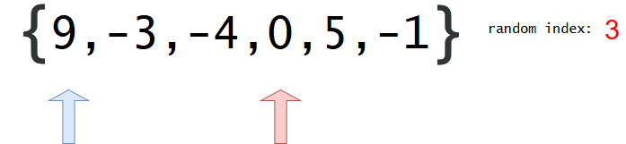
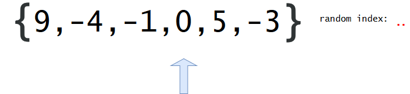

384. Shuffle an Array

Shuffle a set of numbers without duplicates.

**Example:**
```
// Init an array with set 1, 2, and 3.
int[] nums = {1,2,3};
Solution solution = new Solution(nums);

// Shuffle the array [1,2,3] and return its result. Any permutation of [1,2,3] must equally likely to be returned.
solution.shuffle();

// Resets the array back to its original configuration [1,2,3].
solution.reset();

// Returns the random shuffling of array [1,2,3].
solution.shuffle();
```

# Solution
---
## Initial Thoughts
Normally I would display more than two approaches, but shuffling is deceptively easy to do almost properly, and the Fisher-Yates algorithm is both the canonical solution and asymptotically optimal.

A few notes on randomness are necessary before beginning - both approaches displayed below assume that the languages' pseudorandom number generators (PRNGs) are sufficiently random. The sample code uses the simplest techniques available for getting pseudorandom numbers, but for each possible permutation of the array to be truly equally likely, more care must be taken. For example, an array of length nn has n!n! distinct permutations. Therefore, in order to encode all permutations in an integer space, $\lceil lg(n!)\rceil$ bits are necessary, which may not be guaranteed by the default PRNG.

## Approach #1 Brute Force [Accepted]
**Intuition**

If we put each number in a "hat" and draw them out at random, the order in which we draw them will define a random ordering.

**Algorithm**

The brute force algorithm essentially puts each number in the aforementioned "hat", and draws them at random (without replacement) until there are none left. Mechanically, this is performed by copying the contents of array into a second auxiliary array named aux before overwriting each element of array with a randomly selected one from aux. After selecting each random element, it is removed from aux to prevent duplicate draws. The implementation of reset is simple, as we just store the original state of nums on construction.

The correctness of the algorithm follows from the fact that an element (without loss of generality) is equally likely to be selected during all iterations of the for loop. To prove this, observe that the probability of a particular element ee being chosen on the kkth iteration (indexed from 0) is simply P(eP(e being chosen during the kkth iteration)\cdot P(e)⋅P(e not being chosen before the kkth iteration)). Given that the array to be shuffled has nn elements, this probability is more concretely stated as the following:

$\frac{1}{n-k} \cdot \prod_{i=1}^{k} \frac{n-i}{n-i+1}$
 

When expanded (and rearranged), it looks like this (for sufficiently large kk):

$(\frac{n-1}{n} \cdot \frac{n-2}{n-1} \cdot (\ldots) \cdot \frac{n-k+1}{n-k+2} \cdot \frac{n-k}{n-k+1}) \cdot \frac{1}{n-k}$
 

For the base case ($k = 0$), it is trivial to see that $\frac{1}{n-k} = \frac{1}{n}$. For $k > 0$, the numerator of each fraction can be cancelled with the denominator of the next, leaving the nn from the 0th draw as the only uncancelled denominator. Therefore, no matter on which draw an element is drawn, it is drawn with a $\frac{1}{n}$ chance, so each array permutation is equally likely to arise.

```python
class Solution:
    def __init__(self, nums):
        self.array = nums
        self.original = list(nums)

    def reset(self):
        self.array = self.original
        self.original = list(self.original)
        return self.array

    def shuffle(self):
        aux = list(self.array)

        for idx in range(len(self.array)):
            remove_idx = random.randrange(len(aux))
            self.array[idx] = aux.pop(remove_idx)

        return self.array
```

**Complexity Analysis**

* Time complexity : $\mathcal{O}(n^2)$

The quadratic time complexity arises from the calls to list.remove (or list.pop), which run in linear time. $n$ linear list removals occur, which results in a fairly easy quadratic analysis.

* Space complexity : $\mathcal{O}(n)$

Because the problem also asks us to implement reset, we must use linear additional space to store the original array. Otherwise, it would be lost upon the first call to shuffle.

## Approach #2 Fisher-Yates Algorithm [Accepted]
**Intuition**

We can cut down the time and space complexities of `shuffle` with a bit of cleverness - namely, by swapping elements around within the array itself, we can avoid the linear space cost of the auxiliary array and the linear time cost of list modification.

**Algorithm**

The Fisher-Yates algorithm is remarkably similar to the brute force solution. On each iteration of the algorithm, we generate a random integer between the current index and the last index of the array. Then, we swap the elements at the current index and the chosen index - this simulates drawing (and removing) the element from the hat, as the next range from which we select a random index will not include the most recently processed one. One small, yet important detail is that it is possible to swap an element with itself - otherwise, some array permutations would be more likely than others. To see this illustrated more clearly, consider the animation below:








```python
class Solution:
    def __init__(self, nums):
        self.array = nums
        self.original = list(nums)

    def reset(self):
        self.array = self.original
        self.original = list(self.original)
        return self.array

    def shuffle(self):
        for i in range(len(self.array)):
            swap_idx = random.randrange(i, len(self.array))
            self.array[i], self.array[swap_idx] = self.array[swap_idx], self.array[i]
        return self.array
```

**Complexity Analysis**

* Time complexity : $\mathcal{O}(n)$

The Fisher-Yates algorithm runs in linear time, as generating a random index and swapping two values can be done in constant time.

* Space complexity : $\mathcal{O}(n)$

Although we managed to avoid using linear space on the auxiliary array from the brute force approach, we still need it for reset, so we're stuck with linear space complexity.

# Submissions
---
**Solution 1: (Brute Force)**
```
Runtime: 328 ms
Memory Usage: 19.1 MB
```
```python
class Solution:

    def __init__(self, nums: List[int]):
        self.array = nums
        self.original = nums[:]

    def reset(self) -> List[int]:
        """
        Resets the array to its original configuration and return it.
        """
        self.array = self.original
        self.original = self.original[:]
        return self.array

    def shuffle(self) -> List[int]:
        """
        Returns a random shuffling of the array.
        """
        aux = self.array[:]

        for idx in range(len(self.array)):
            remove_idx = random.randrange(len(aux))
            self.array[idx] = aux.pop(remove_idx)

        return self.array


# Your Solution object will be instantiated and called as such:
# obj = Solution(nums)
# param_1 = obj.reset()
# param_2 = obj.shuffle()
```

**Solution 2: (Fisher-Yates Algorithm)**
```
Runtime: 348 ms
Memory Usage: 19.3 MB
```
```python
class Solution:

    def __init__(self, nums: List[int]):
        self.array = nums
        self.original = nums[:]

    def reset(self) -> List[int]:
        """
        Resets the array to its original configuration and return it.
        """
        self.array = self.original
        self.original = self.original[:]
        return self.array

    def shuffle(self) -> List[int]:
        """
        Returns a random shuffling of the array.
        """
        for i in range(len(self.array)):
            swap_idx = random.randrange(i, len(self.array))
            self.array[i], self.array[swap_idx] = self.array[swap_idx], self.array[i]
        return self.array

# Your Solution object will be instantiated and called as such:
# obj = Solution(nums)
# param_1 = obj.reset()
# param_2 = obj.shuffle()
```

**Solution 3: (Fisher-Yates Algorithm)**
```
Runtime: 152 ms
Memory Usage: 90.5 MB
```
```c++
class Solution {
public:
    std::vector<int> n;
    Solution(vector<int>& nums) {
        n = nums;
    }
    
    /** Resets the array to its original configuration and return it. */
    vector<int> reset() {
        return n;
    }
    
    /** Returns a random shuffling of the array. */
    vector<int> shuffle() {
        std::vector<int> res(n.begin(), n.end());
        for(size_t i{0}, size{res.size()}; i < size; ++i)
            std::swap(res[i], res[rand() % size]);
        return res;
    }
};

/**
 * Your Solution object will be instantiated and called as such:
 * Solution* obj = new Solution(nums);
 * vector<int> param_1 = obj->reset();
 * vector<int> param_2 = obj->shuffle();
 */
```