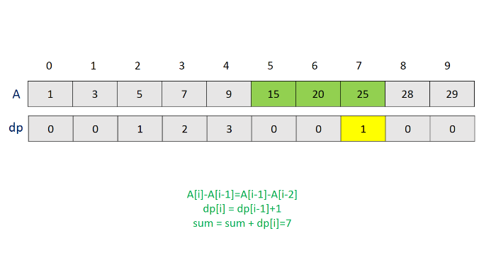

413. Arithmetic Slices

A sequence of number is called arithmetic if it consists of at least three elements and if the difference between any two consecutive elements is the same.

For example, these are arithmetic sequence:

```
1, 3, 5, 7, 9
7, 7, 7, 7
3, -1, -5, -9
```

The following sequence is not arithmetic.

```
1, 1, 2, 5, 7
```

A zero-indexed array A consisting of N numbers is given. A slice of that array is any pair of integers (P, Q) such that 0 <= P < Q < N.

A slice (P, Q) of array A is called arithmetic if the sequence:
A[P], A[p + 1], ..., A[Q - 1], A[Q] is arithmetic. In particular, this means that P + 1 < Q.

The function should return the number of arithmetic slices in the array A.


**Example:**
```
A = [1, 2, 3, 4]

return: 3, for 3 arithmetic slices in A: [1, 2, 3], [2, 3, 4] and [1, 2, 3, 4] itself.
```

# Solution
---
## Approach #1 Brute Force [Accepted]
The most naive solution is to consider every pair of elements(with atleast 1 element between them), so that the range of elements lying between these two elements acts as a slice. Then, we can iterate over every such slice(range) to check if all the consecutive elements within this range have the same difference. For every such range found, we can increment the $count$ that is used to keep a track of the required result.

```java
public class Solution {
    public int numberOfArithmeticSlices(int[] A) {
        int count = 0;
        for (int s = 0; s < A.length - 2; s++) {
            int d = A[s + 1] - A[s];
            for (int e = s + 2; e < A.length; e++) {
                int i = 0;
                for (i = s + 1; i <= e; i++)
                    if (A[i] - A[i - 1] != d)
                        break;
                if (i > e)
                    count++;
            }
        }
        return count;
    }
}
```

**Complexity Analysis**

* Time complexity : $O(n^3)$. We iterate over the range formed by every pair of elements. Here, $n$ refers to the number of elements in the given array $A$.

* Space complexity : $O(1)$. Constant extra space is used.

## Approach #2 Better Brute Force [Accepted]
**Algorithm**

In the last approach, we considered every possible range and then iterated over the range to check if the difference between every consercutive element in this range is the same. We can optimize this approach to some extent, by making a small observation.

We can see, that if we are currently considering the range bound by the elements, let's say, $A[s]$(start) and $A[e]$(end), we have checked the consecutive elements in this range to have the same difference. Now, when we move on to the next range between the indices $s$ and $e+1$, we again perform a check on all the elements in the range $s:e$, along with one additional pair $A[e+1]$ and $A[e]$. We can remove this redundant check in the range $s:e$ and just check the last pair to have the same difference as the one used for the previous range(same $s$, incremented $e$).

Note that if the last range didn't constitute an arithmetic slice, the same elements will be a part of the updated range as well. Thus, we can omit the rest of the ranges consisting of the same starting index. The rest of the process remains the same as in the last approach.

```java
public class Solution {
    public int numberOfArithmeticSlices(int[] A) {
        int count = 0;
        for (int s = 0; s < A.length - 2; s++) {
            int d = A[s + 1] - A[s];
            for (int e = s + 2; e < A.length; e++) {
                if (A[e] - A[e - 1] == d)
                    count++;
                else
                    break;
            }
        }
        return count;
    }
}
```

**Complexity Analysis**

* Time complexity : $O(n^2)$. Two for loops are used.

* Space complexity : $O(1)$. Constant extra space is used.

## Approach #3 Using Recursion [Accepted]
**Algorithm**

By making use of the observation discussed in the last approach, we know, that if a range of elements between the indices $(i,j)$ constitute an Arithmetic Slice, and another element $A[j+1]$ is included such that $A[j+1]$ and $A[j]$ have the same difference as that of the previous common difference, the ranges between $(i,j+1)$ will constitutes an arithmetic slice. Further, if the original range $(i,j)$ doesn't form an arithmetic slice, adding new elements to this range won't do us any good. Thus, no more arithmetic slices can be obtained by adding new elements to it.

By making use of this observation, we can develop a recursive solution for the given problem as well. Assume that a $sum$ variable is used to store the total number of arithmetic slices in the given array $A$. We make use of a recursive function slices(A,i) which returns the number of Arithmetic Slices in the range $(k,i)$, but which are not a part of any range $(k,j)$ such that $j<i$. It also updates $sum$ with the number of arithmetic slices(total) in the current range. Thus, $k$ refers to the minimum index such that the range $(k,i)$ constitutes a valid arithmetic slice.

Now, suppose we know the number of arithmetic slices in the range $(0,i-1)$ constituted by the elements $[a_0,a_1,a_2,...a_(i-1)]$, to be say $x$. If this range itself is an arithmetic slice, all the consecutive elements have the same difference(equal to say, $a_(i-1)-a_(i-2)$. Now, adding a new element $a_i$ to it to extend the range to $(0,i)$ will constitute an arithmetic slice only if this new element satisfies $a_i-a_(i-1)=a_(i-1)-a_(i-2)$ Thus, now, the addition of this new element, will lead to an addition of $ap$ number of arithmetic slices to the ones obtained in the range $(0,i-1)$. The new arithmetic slices will be the ones constituting the ranges $(0,i), (1,i), ... (i-2,i)$, which are a total of $x+1$ additional arithmetic slices. This is because, apart from the range (0,i)(0,i) the rest of the ranges $(1,i), (2,i),...(i-2,i)$ can be mapped to $(0,i-1), (1,i-1),...(i-3,i-1)$, with count equal to $x$.

Thus, in every call to slices, if the $i^{th}$ element has the same common difference with the last element as the previous common difference, we can find the number of new arithmetic slices added by the use of this element, $ap$ and also update the $sum$ to include this $ap$ into it, apart from the count obtained by the smaller ranges. But, if the new element doesn't have the same common difference, extra arithmetic slices can't be contributed by it and hence, no addition is done to $sum$ for the current element. But, of course $sum$ will be updated as per the count obtained from the smaller ranges.

```java
public class Solution {
    int sum = 0;
    public int numberOfArithmeticSlices(int[] A) {
        slices(A, A.length - 1);
        return sum;
    }
    public int slices(int[] A, int i) {
        if (i < 2)
            return 0;
        int ap = 0;
        if (A[i] - A[i - 1] == A[i - 1] - A[i - 2]) {
            ap = 1 + slices(A, i - 1);
            sum += ap;
        } else
            slices(A, i - 1);
        return ap;
    }
}
```

**Complexity Analysis**

* Time complexity : $O(n)$. The recursive function is called at most $n-2$ times.

* Space complexity : $O(n)$. The depth of the recursion tree goes upto $n-2$.

## Approach #5 Dynamic Programming [Accepted]:
**Algorithm**

In the last approach, we start with the full range $(0,n-1)$, where $n$ is the number of elements in the given $A$ array. We can observe that the result for the range $(0,i)$ only depends on the elements in the range $(0,i)$ and not on any element beyond this range. Thus, we can make use of Dynamic Programming to solve the given problem.

We can make use of a 1-D $dp$ with number of elements equal to $n$. $dp[i]$ is used to store the number of arithmetic slices possible in the range $(k,i)$ and not in any range $(k,j)$ such that $j<i$. Again, $k$ refers to the minimum index possible such that $(k,j)$ constitutes a valid Arithmetic Slice.

Instead of going in the reverse order as in the recursive approach, we can start filling the $dp$ in a forward manner. The intuition remains the same as in the last approach. For the $i^{th}$ element being considered, we check if this element satsfies the common difference criteria with the previous element. If so, we know the number of new arithmetic slices added will be $1+dp[i-1]$ as discussed in the last approach. The $sum$ is also updated by the same count to reflect the new arithmetic slices added.

The following animation illustrates the $dp$ filling process.





```java
public class Solution {
    public int numberOfArithmeticSlices(int[] A) {
        int[] dp = new int[A.length];
        int sum = 0;
        for (int i = 2; i < dp.length; i++) {
            if (A[i] - A[i - 1] == A[i - 1] - A[i - 2]) {
                dp[i] = 1 + dp[i - 1];
                sum += dp[i];
            }
        }
        return sum;
    }
}

```

**Complexity Analysis**

* Time complexity : $O(n)$. We traverse over the given $A$ array with $n$ elements once only.

* Space complexity : $O(n)$. 1-D $dp$ of size $n$ is used.

## Approach #5 Constant Space Dynamic Programming [Accepted]:
**Algorithm**

In the last approach, we can observe that we only require the element $dp[i-1]$ to determine the value to be entered at $dp[i]$. Thus, instead of making use of a 1-D array to store the required data, we can simply keep a track of just the last element.

```java
public class Solution {
    public int numberOfArithmeticSlices(int[] A) {
        int dp = 0;
        int sum = 0;
        for (int i = 2; i < A.length; i++) {
            if (A[i] - A[i - 1] == A[i - 1] - A[i - 2]) {
                dp = 1 + dp;
                sum += dp;
            } else
                dp = 0;
        }
        return sum;
    }
}
```

**Complexity Analysis**

* Time complexity : $O(n)$. We traverse over the given $A$ array with $n$ elements once only.

* Space complexity : $O(1)$. Constant extra space is used.

## Approach #6 Using Formula [Accepted]:
**Algorithm**

From the $dp$ solution, we can observe that for $k$ consecutive elements sastisfying the common difference criteria, we update the $sum$ for each such element by $1, 2, 3, ..., k$ counts in that order. Thus, instead of updating the $sum$ at the same time, we can just keep a track of the number of consecutive elements satisfying the common differnce criteria in a $count$ variable and just update the $sum$ directly as $count*(count+1)/2$ whenver $a$ element not satisfying this criteria is found. At the same time, we also need to reset the $count$ value.

```java
public class Solution {
    public int numberOfArithmeticSlices(int[] A) {
        int count = 0;
        int sum = 0;
        for (int i = 2; i < A.length; i++) {
            if (A[i] - A[i - 1] == A[i - 1] - A[i - 2]) {
                count++;
            } else {
                sum += (count + 1) * (count) / 2;
                count = 0;
            }
        }
        return sum += count * (count + 1) / 2;
    }
}
```

**Complexity Analysis**

* Time complexity : $O(n)$. We iterate over $A$ with $n$ elements exactly once.

* Space complexity : $O(1)$. Constant extra space is used.

# Submissions
---
**Solution 1:**
```
Runtime: 44 ms
Memory Usage: 14.1 MB
```
```python
class Solution:
    def numberOfArithmeticSlices(self, A: List[int]) -> int:
        dp = 0;
        sum_ = 0;
        for i in range(2, len(A)):
            if A[i] - A[i - 1] == A[i - 1] - A[i - 2]:
                dp += 1
                sum_ += dp
            else:
                dp = 0
        return sum_
```