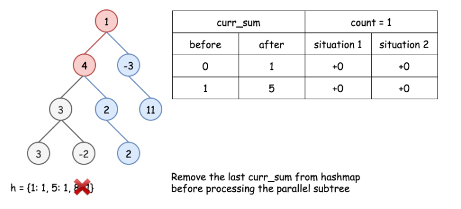
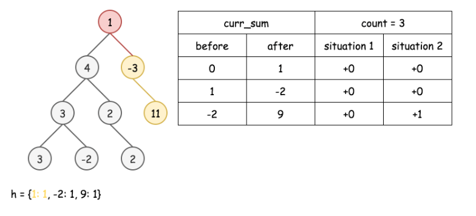

437. Path Sum III

You are given a binary tree in which each node contains an integer value.

Find the number of paths that sum to a given value.

The path does not need to start or end at the root or a leaf, but it must go downwards (traveling only from parent nodes to child nodes).

The tree has no more than 1,000 nodes and the values are in the range -1,000,000 to 1,000,000.

**Example:**
```
root = [10,5,-3,3,2,null,11,3,-2,null,1], sum = 8

      10
     /  \
    5   -3
   / \    \
  3   2   11
 / \   \
3  -2   1

Return 3. The paths that sum to 8 are:

1.  5 -> 3
2.  5 -> 2 -> 1
3. -3 -> 11
```

# Solution
---
## Prefix Sum: What is it
In this article, we're going to discuss simple but powerful prefix sum technique: one pass + linear time complexity.

>Prefix sum is a sum of the current value with all previous elements starting from the beginning of the structure.

It could be defined for 1D arrays (sum the current value with all the previous integers),


Figure 1. Prefix sum for 1D array.

for 2D arrays (sum of the current value with the integers above or on the left)


Figure 2. Prefix sum for 2D array.

or for the binary trees (sum the values of the current node
and all parent nodes),


Figure 3. Prefix sum for the binary tree.

## Prefix Sum: How to Use: Number of Continuous Subarrays that Sum to Target
You might want to use the prefix sum technique for the problems like "Find a number of continuous subarrays/submatrices/tree paths that sum to target".

Before going to the current problem with the tree, let's check the idea on a simpler example Find a number of continuous subarrays that sum to target.

* Use a variable to track the current prefix sum and a hashmap "prefix sum -> how many times was it seen so far".


Figure 4. Find a number of continuous subarrays that sum to target.

* Parse the input structure and count the requested subarrays/submatrices/tree paths along the way with the help of that hashmap. How to count?

There could be two situations. In situation 1, the subarray with the target sum starts from the beginning of the array. That means that the current prefix sum is equal to the target sum, and we increase the counter by 1.


Figure 5. Situation 1: The subarray starts from the beginning of the array.

In situation 2, the subarray with the target sum starts somewhere in the middle. That means we should add to the counter the number of times we have seen the prefix sum `curr_sum - target` so far: `count += h[curr_sum - target]`.

The logic is simple: the current prefix sum is `curr_sum`, and some elements before the prefix sum was `curr_sum - target`. All the elements in between sum up to `curr_sum - (curr_sum - target) = target`.


Figure 6. Situation 2: The subarray starts somewhere in the middle.

Solution for Number of Continuous Subarrays that Sum to Target

Here is an implementation of the solution for Find a number of continuous subarrays that sum to target.

```python
class Solution:
    def subarraySum(self, nums, k):
        count = curr_sum = 0
        h = defaultdict(int)
        
        for num in nums:
            # current prefix sum
            curr_sum += num
            
            # situation 1:
            # continuous subarray starts 
            # from the beginning of the array
            if curr_sum == k:
                count += 1
            
            # situation 2:
            # number of times the curr_sum − k has occurred already, 
            # determines the number of times a subarray with sum k 
            # has occurred up to the current index
            count += h[curr_sum - k]
            
            # add the current sum
            h[curr_sum] += 1
                
        return count
```

## Approach 1: Prefix Sum
Now let's reuse the same algorithm and the same code for the case of the binary tree.

>There is just one thing that is particular for the binary tree. There are two ways to go forward - to the left and to the right. To keep parent->child direction, we shouldn't blend prefix sums from the left and right subtrees in one hashmap.

**Algorithm**

* Let's initialize tree paths counter `count = 0`, and the hashmap `h` "prefix sum -> how many times was it seen so far".

* One could parse the tree using recursive preorder traversal: node -> left -> right: `preorder(node: TreeNode, curr_sum: int) -> None`. This function takes two arguments: a tree node and a prefix sum before that node. To start the recursion chain, one should call `preorder(root, 0)`.

    * The first thing is to update the current prefix sum by adding the value of the current node: `curr_sum += node.val`.

    * Now one could update the counter. One should consider two situations.

    In situation 1, the tree path with the target sum starts from the root. That means the current prefix sum is equal to the target sum `curr_sum == k`, so one should increase the counter by 1: `count += 1`.

    In situation 2, the tree path with the target sum starts somewhere downwards. That means we should add to the counter the number of times we have seen the prefix sum `curr_sum - target` so far: `count += h[curr_sum - target]`.

    The logic is simple: the current prefix sum is `curr_sum`, and several elements before the prefix sum was `curr_sum - target`. All the elements in between sum up to `curr_sum - (curr_sum - target) = target`.

    * Now it's time to update the hashmap: `h[curr_sum] += 1`.

    * Let's parse left and right subtrees: `preorder(node.left, curr_sum)`, `preorder(node.right, curr_sum)`.

    * Now the current subtree is processed. It's time to remove the current prefix sum from the hashmap, in order not to blend the parallel subtrees: `h[curr_sum] -= 1`.

* Now the preorder traversal is done, and the counter is updated. Return it.


Figure 7. Situation 1 vs situation 2.

**Implementation**

On the following example the target sum is equal to 8.








```python
class Solution:
    def pathSum(self, root: TreeNode, sum: int) -> int:
        def preorder(node: TreeNode, curr_sum) -> None:
            nonlocal count
            if not node:
                return 
            
            # current prefix sum
            curr_sum += node.val
            
            # here is the sum we're looking for
            if curr_sum == k:
                count += 1
            
            # number of times the curr_sum − k has occurred already, 
            # determines the number of times a path with sum k 
            # has occurred up to the current node
            count += h[curr_sum - k]
            
            # add the current sum into hashmap
            # to use it during the child nodes processing
            h[curr_sum] += 1
            
            # process left subtree
            preorder(node.left, curr_sum)
            # process right subtree
            preorder(node.right, curr_sum)
            
            # remove the current sum from the hashmap
            # in order not to use it during 
            # the parallel subtree processing
            h[curr_sum] -= 1
            
        count, k = 0, sum
        h = defaultdict(int)
        preorder(root, 0)
        return count
```

**Complexity Analysis**

* Time complexity: $\mathcal{O}(N)$, where $N$ is a number of nodes. During preorder traversal, each node is visited once.

* Space complexity: up to $\mathcal{O}(N)$ to keep the hashmap of prefix sums, where $N$ is a number of nodes.

# Submissions
---
**Solution 1: (Prefix Sum)**
```
Runtime: 40 ms
Memory Usage: 14.9 MB
```
```python
# Definition for a binary tree node.
# class TreeNode:
#     def __init__(self, val=0, left=None, right=None):
#         self.val = val
#         self.left = left
#         self.right = right
class Solution:
    def pathSum(self, root: TreeNode, sum: int) -> int:
        def preorder(node: TreeNode, curr_sum) -> None:
            nonlocal count
            if not node:
                return 
            
            # current prefix sum
            curr_sum += node.val
            
            # here is the sum we're looking for
            if curr_sum == k:
                count += 1
            
            # number of times the curr_sum − k has occurred already, 
            # determines the number of times a path with sum k 
            # has occurred up to the current node
            count += h[curr_sum - k]
            
            # add the current sum into hashmap
            # to use it during the child nodes processing
            h[curr_sum] += 1
            
            # process left subtree
            preorder(node.left, curr_sum)
            # process right subtree
            preorder(node.right, curr_sum)
            
            # remove the current sum from the hashmap
            # in order not to use it during 
            # the parallel subtree processing
            h[curr_sum] -= 1
            
        count, k = 0, sum
        h = defaultdict(int)
        preorder(root, 0)
        return count
```

**Solution 2: (Prefix Sum)**
```
Runtime: 48 ms
Memory Usage: 13.8 MB
```
```python
# Definition for a binary tree node.
# class TreeNode:
#     def __init__(self, x):
#         self.val = x
#         self.left = None
#         self.right = None

class Solution:
    
    def pathSum(self, root: TreeNode, sum: int) -> int:
        target = sum
        prev_sum = collections.defaultdict(int)
        prev_sum[0] = 1
        cnt = 0
        
        def dfs(node, curr_sum):
            nonlocal cnt, prev_sum
            if node is not None:
                curr_sum += node.val
                cnt += prev_sum[curr_sum - target]
                prev_sum[curr_sum] += 1

                dfs(node.left, curr_sum)
                dfs(node.right, curr_sum)
                prev_sum[curr_sum] -= 1

        dfs(root, 0)
        return cnt
```

**Solution 3: (DFS)**
```
Runtime: 800 ms
Memory Usage: 15.2 MB
```
```python
# Definition for a binary tree node.
# class TreeNode:
#     def __init__(self, val=0, left=None, right=None):
#         self.val = val
#         self.left = left
#         self.right = right
class Solution:
    def pathSum(self, root: TreeNode, sum: int) -> int:
        def dfs(node, target):
            if node == None:
                return 0
            if node.val == target:
                return 1 + dfs(node.left, 0) + dfs(node.right, 0)
            return dfs(node.left, target - node.val) + dfs(node.right, target - node.val)
        
        if root == None:
            return 0
        return dfs(root, sum) + self.pathSum(root.left, sum) + self.pathSum(root.right, sum)
```