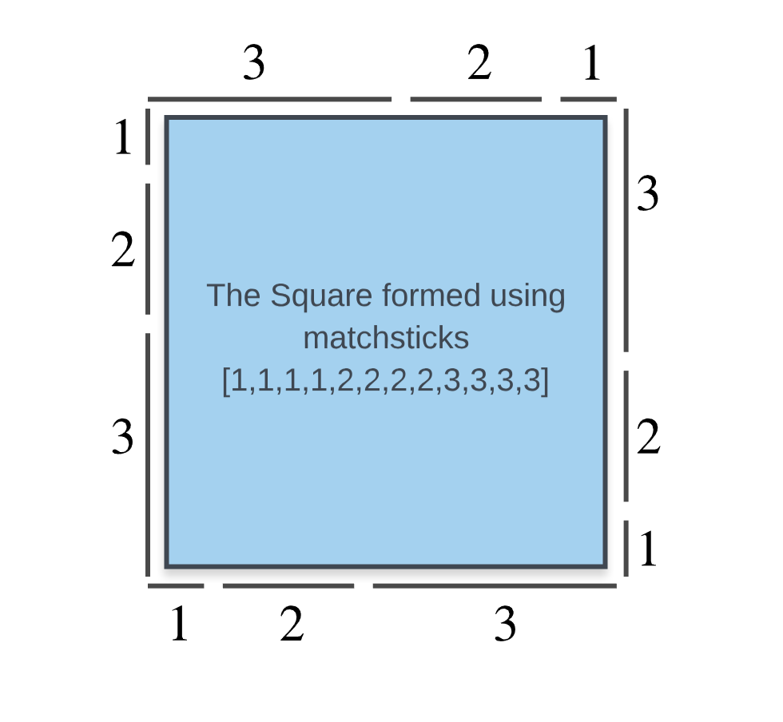
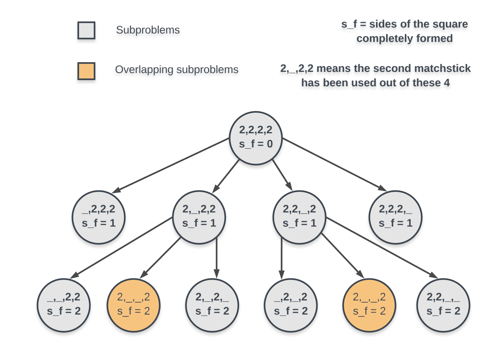

473. Matchsticks to Square

Remember the story of Little Match Girl? By now, you know exactly what matchsticks the little match girl has, please find out a way you can make one square by using up all those matchsticks. You should not break any stick, but you can link them up, and each matchstick must be used exactly one time.

Your input will be several matchsticks the girl has, represented with their stick length. Your output will either be true or false, to represent whether you could make one square using all the matchsticks the little match girl has.

**Example 1:**
```
Input: [1,1,2,2,2]
Output: true

Explanation: You can form a square with length 2, one side of the square came two sticks with length 1.
```

**Example 2:**
```
Input: [3,3,3,3,4]
Output: false

Explanation: You cannot find a way to form a square with all the matchsticks.
```

**Note:**

* The length sum of the given matchsticks is in the range of `0` to `10^9`.
* The length of the given matchstick array will not exceed `15`.

# Solution
---
**Intuition**
Suppose we have `1,1,1,1,2,2,2,2,3,3,3,3` as our set of matchsticks. In this case a square of side 66 can be formed and we have 4 matchsticks each of `1`, `2` and `3` and so we can have each square side formed by `3 + 2 + 1 = 6`.



We can clearly see in the diagram above that the `3` matchsticks of sizes `1`, `2` and `3` combine to give one side of our resulting square.

This problem boils down to splitting an array of integers into $4$ subsets where all of these subsets are:

* mutually exclusive i.e. no specific element of the array is shared by any two of these subsets, and
have the same sum which is equal to the side of our square.
* We know that we will have $4$ different subsets. The sum of elements of these subsets would be $\frac{1}{4}\sum_{}^{} arr$. If the sum if not divisible by $4$, that implies that $4$ subsets of equal value are not possible and we don't need to do any further processing on this.

The only question that remains now for us to solve is:

>what subset a particular element belongs to?

If we are able to figure that out, then there's nothing else left to do. But, since we can't say which of the $4$ subsets would contain a particular element, we try out all the options.

## Approach 1: Depth First Search
It is possible that a matchstick can be a part of any of the `4` sides of the resulting square, but which one of these choices leads to an actual square is something we don't know.

This means that for every matchstick in our given array, we have $4$ different options each representing the side of the square or subset that this matchstick can be a part of.

We try out all of them and keep on doing this recursively until we exhaust all of the possibilities or until we find an arrangement of our matchsticks such that they form the square.

**Algorithm**

As discussed previously, we will follow a recursive, depth first approach to solve this problem. So, we have a function that takes the current matchstick index we are to process and also the number of sides of the square that are completely formed till now.

If all of the matchsticks have been used up and 4 sides have been completely formed, that implies our square is completely formed. This is the base case for the recursion.

For the current matchstick we have `4` different options. This matchstick at $index$ can be a part of any of the sides of the square. We try out the 4 options by recursing on them.

If any of these recursive calls returns $True$, then we return from there, else we return $False$

```python
def makesquare(self, nums):
    """
    :type nums: List[int]
    :rtype: bool
    """

    # If there are no matchsticks, then we can't form any square
    if not nums:
        return False

    # Number of matchsticks we have
    L = len(nums)

    # Perimeter of our square (if one can be formed)
    perimeter = sum(nums)

    # Possible side of our square.
    possible_side =  perimeter // 4

    # If the perimeter can be equally split into 4 parts (and hence 4 sides, then we move on).
    if possible_side * 4 != perimeter:
        return False

    # Reverse sort the matchsticks because we want to consider the biggest one first.
    nums.sort(reverse=True)

    # This array represents the 4 sides and their current lengths
    sums = [0 for _ in range(4)]

    # Our recursive dfs function.
    def dfs(index):

        # If we reach the end of matchsticks array, we check if the square was formed or not
        if index == L:
            # If 3 equal sides were formed, 4th will be the same as these three and answer should be True in that case.
            return sums[0] == sums[1] == sums[2] == possible_side

        # The current matchstick can belong to any of the 4 sides (provided their remaining lenghts are >= the size of the current matchstick)
        for i in range(4):
            # If this matchstick can fir in the space left for the current side
            if sums[i] + nums[index] <= possible_side:
                # Recurse
                sums[i] += nums[index]
                if dfs(index + 1):
                    return True
                # Revert the effects of recursion because we no longer need them for other recursions.
                sums[i] -= nums[index]
        return False        
    return dfs(0)
```

**Implementation Details**

This solution is very slow as is. However, we can speed it up considerably by a small trick and that is to sort our matchsticks sizes in reverse order before processing them recursively.

The reason for this is that if there is no solution, trying a longer matchstick first will get to negative conclusion earlier.

e.g. $[8,4,4,4]$. In this case we can have a square of size `5` but the largest side `8` doesn't fit in anywhere i.e. cannot be a part of any of the sides (because we can't break matchsticks according to the question) and hence we can simply return $False$ without even considering the remaining matchsticks.

**Complexity Analysis**

* Time Complexity : $O(4^N)$ because we have a total of $N$ sticks and for each one of those matchsticks, we have $4$ different possibilities for the subsets they might belong to or the side of the square they might be a part of.

* Space Complexity : $O(N)$. For recursive solutions, the space complexity is the stack space occupied by all the recursive calls. The deepest recursive call here would be of size NN and hence the space complexity is $O(N)$. There is no additional space other than the recursion stack in this solution.

## Approach 2: Dynamic Programming
In any dynamic programming problem, what's important is that our problem must be breakable into smaller subproblems and also, these subproblems show some sort of overlap which we can save upon by caching or memoization.

Suppose we have `3,3,4,4,5,5` as our matchsticks that have been used already to construct some of the sides of our square (Note: not all the sides may be completely constructed at all times.)

If the square side is $8$, then there are many possibilities for how the sides can be constructed using the matchsticks above. We can have
```
  (4, 4), (3, 5), (3, 5) -----------> 3 sides fully constructed.
  (3, 4), (3, 5), (4), (5) ---------> 0 sides completely constructed.
  (3, 3), (4, 4), (5), (5) ---------> 1 side completely constructed.
```
As we can see above, there are multiple ways to use the same set of matchsticks and land up in completely different recursion states.

This means that if we just keep track of what all matchsticks have been used and which all are remaining, it won't properly define the state of recursion we are in or what subproblem we are solving.

A single set of used matchsticks can represent multiple different unrelated subproblems and that is just not right.

We also need to keep track of number of sides of the square that have been completely formed till now.

Also, an important thing to note in the example we just considered was that if the matchsticks being used are $[3,3,4,4,5,5]$ and the side of the square is `8`, then we will always consider that arrangement that forms the most number of complete sides over that arrangement that leads to incomplete sides. Hence, the optimal arrangement here is $(4, 4), (3, 5), (3, 5)$ with `3` complete sides of the square.

Let us take a look at the following recursion tree to see if in-fact we can get overlapping subproblems.



**Note:** Not all subproblems have been shown in this figure. The thing we wanted to point out was overlapping subproblems.

We know that the overall sum of these matchsticks can be split equally into `4` halves. The only thing we don't know is if 4 equal halves can be carved out of the given set of matchsticks. For that also we need to keep track of the number of sides completely formed at any point in time. **If we end up forming 4 equal sides successfully then naturally we would have used up all of the matchsticks each being used exactly once and we would have formed a square.**

Let us first look at the pseudo-code for this problem before looking at the exact implementation details for the same.
```
let square_side = sum(matchsticks) / 4
func recurse(matchsticks_used, sides_formed) {
    if sides_formed == 4, then {
        Square Formed!!
    }
    for match in matchsticks available, do {
          add match to matchsticks_used
          let result = recurse(matchsticks_used, sides_formed)
          if result == True, then {
              return True
          }
          remove match from matchsticks_used
    }
    return False
}
```
This is the overall structure of our dynamic programming solution. Of-course, a lot of implementation details are missing here that we will address now.

**Implementation Details**

It is very clear from the pseudo-code above that the state of a recursion is defined by two variables `matchsticks_used` and `sides_formed`. Hence, these are the two variables that will be used to memoize or cache the results for that specific subproblem.

The question however is how do we actually store all the matchsticks that have been used? We want a memory efficient solution for this.

If we look at the question's constraints, we find that the max number of matchsticks we can have are $15$. That's a pretty small number and we can make use of this constraint.

All we need to store is which of the matchsticks from the original list have been used. We can use a Bit-Map for this

We will use $N$ number of bits, one for each of the matchsticks ($N$ is at max `15` according to the question's constraints). Initially we will start with a bit mask of all `1`s and then as we keep on using the matchsticks, we will keep on setting their corresponding bits to `0`.

This way, we just have to hash an integer value which represents our bit-map and the max value for this mask would be $2^{15}$.

**Do we really need to see if all 4 sides have been completely formed ?**

Another implementation trick that helps optimize this solution is that we don't really need to see if 4 sides have been completely formed.

This is because, we already know that the sum of all the matchsticks is divisible by `4`. So, if 3 equal sides have been formed by using some of the matchsticks, then the remaining matchsticks would definitely form the remaining side of our square.

Hence, we only need to check if 3 sides of our square can be formed or not.

```python
def makesquare(self, nums):
    """
    :type nums: List[int]
    :rtype: bool
    """

    # If there are no matchsticks, then we can't form any square.
    if not nums:
        return False

    # Number of matchsticks
    L = len(nums)

    # Possible perimeter of our square
    perimeter = sum(nums)

    # Possible side of our square from the given matchsticks
    possible_side =  perimeter // 4

    # If the perimeter isn't equally divisible among 4 sides, return False.
    if possible_side * 4 != perimeter:
        return False

    # Memoization cache for the dynamic programming solution.
    memo = {}

    # mask and the sides_done define the state of our recursion.
    def recurse(mask, sides_done):

        # This will calculate the total sum of matchsticks used till now using the bits of the mask.
        total = 0
        for i in range(L - 1, -1, -1):
            if not (mask & (1 << i)):
                total += nums[L - 1 - i]

        # If some of the matchsticks have been used and the sum is divisible by our square's side, then we increment the number of sides completed.
        if total > 0 and total % possible_side == 0:
            sides_done += 1

        # If we were successfully able to form 3 sides, return True
        if sides_done == 3:
            return True

        # If this recursion state has already been calculated, just return the stored value.
        if (mask, sides_done) in memo:
            return memo[(mask, sides_done)]

        # Common variable to store answer from all possible further recursions from this step.
        ans = False

        # rem stores available space in the current side (incomplete).
        c = int(total / possible_side)
        rem = possible_side * (c + 1) - total

        # Iterate over all the matchsticks
        for i in range(L - 1, -1, -1):

            # If the current one can fit in the remaining space of the side and it hasn't already been taken, then try it out
            if nums[L - 1 - i] <= rem and mask&(1 << i):

                # If the recursion after considering this matchstick gives a True result, just break. No need to look any further.
                # mask ^ (1 << i) makes the i^th from the right, 0 making it unavailable in future recursions.
                if recurse(mask ^ (1 << i), sides_done):
                    ans = True
                    break
        # cache the result for the current recursion state.            
        memo[(mask, sides_done)] = ans
        return ans

    # recurse with the initial mask with all matchsticks available.
    return recurse((1 << L) - 1, 0)
```

**Complexity Analysis**

* Time Complexity : $O(N \times 2^N)$. At max $2^N$ unique bit masks are possible and during every recursive call, we iterate our original matchsticks array to sum up the values of matchsticks used to update the `sides_formed` variable.

* Space Complexity : $O(N + 2^N)$ because $N$ is the stack space taken up by recursion and $4 \times 2^N$ = $O(2^N)$ is the max possible size of our cache for memoization.

    * The size of the cache is defined by the two variables `sides_formed` and `mask`. The number of different values that `sides_formed` can take = 4 and number of unique values of mask = $2^N$.
    
# Submissions
---
**Solution 1: (Dynamic Programming)**
```
Runtime: 452 ms
Memory Usage: 16.3 MB
```
```python
class Solution:
    def makesquare(self, matchsticks: List[int]) -> bool:
        
        # If there are no matchsticks, then we can't form any square.
        if not matchsticks:
            return False

        # Number of matchsticks
        L = len(matchsticks)

        # Possible perimeter of our square
        perimeter = sum(matchsticks)

        # Possible side of our square from the given matchsticks
        possible_side =  perimeter // 4

        # If the perimeter isn't equally divisible among 4 sides, return False.
        if possible_side * 4 != perimeter:
            return False

        # Memoization cache for the dynamic programming solution.
        memo = {}

        # mask and the sides_done define the state of our recursion.
        def recurse(mask, sides_done):

            # This will calculate the total sum of matchsticks used till now using the bits of the mask.
            total = 0
            for i in range(L - 1, -1, -1):
                if not (mask & (1 << i)):
                    total += matchsticks[L - 1 - i]

            # If some of the matchsticks have been used and the sum is divisible by our square's side, then we increment the number of sides completed.
            if total > 0 and total % possible_side == 0:
                sides_done += 1

            # If we were successfully able to form 3 sides, return True
            if sides_done == 3:
                return True

            # If this recursion state has already been calculated, just return the stored value.
            if (mask, sides_done) in memo:
                return memo[(mask, sides_done)]

            # Common variable to store answer from all possible further recursions from this step.
            ans = False

            # rem stores available space in the current side (incomplete).
            c = int(total / possible_side)
            rem = possible_side * (c + 1) - total

            # Iterate over all the matchsticks
            for i in range(L - 1, -1, -1):

                # If the current one can fit in the remaining space of the side and it hasn't already been taken, then try it out
                if matchsticks[L - 1 - i] <= rem and mask&(1 << i):

                    # If the recursion after considering this matchstick gives a True result, just break. No need to look any further.
                    # mask ^ (1 << i) makes the i^th from the right, 0 making it unavailable in future recursions.
                    if recurse(mask ^ (1 << i), sides_done):
                        ans = True
                        break
            # cache the result for the current recursion state.            
            memo[(mask, sides_done)] = ans
            return ans

        # recurse with the initial mask with all matchsticks available.
        return recurse((1 << L) - 1, 0)
```

**Solution 2: (Backtracking)**
```
Runtime: 36 ms
Memory Usage: 10.2 MB
```
```c++
class Solution {
    bool canMake ( int index , int bucketsize , vector<int> &matchsticks , vector<int> &bucket){
        // base case 
        if ( index == matchsticks.size()) 
            return bucket[0]==bucket[1] and bucket[1]==bucket[2] and bucket[2]==bucket[3] ;
        
        
        // simple dfs backtrack 
        for ( int i = 0 ; i < 4 ; i ++ ){
            if ( bucket[i] + matchsticks.at(index) > bucketsize) continue ;  
            
            
            // concept of DP in optimization: if I have checked the same length before, 
            //why do I need to bother checking again?
            //Although we only have 4 sides in a square, we can still 
            //check if we have encountered the same length with the current match. 
          
            
            int j = i ;
            while ( --j >= 0) 
                if ( bucket[i] == bucket[j]) break;
            
            if ( j != -1 ) continue ;
            
            // noraml targetsum 
            bucket.at(i) += matchsticks.at(index);
            if ( canMake ( index + 1 , bucketsize , matchsticks , bucket )) return true;
            bucket.at(i) -= matchsticks.at(index);
        }
        
        return false;
    }
public:
    bool makesquare(vector<int>& matchsticks) {
        // base case 
        int sum = 0 ;
        
        for ( int i : matchsticks) sum += i ;
        if ( sum == 0 or sum % 4 ) return false;
        
        // we know that the side of the square will be atleast the max element of the match array
        // sorting the array elements 
        sort( matchsticks.begin() , matchsticks.end() , greater<int>());
        
        // now i will make bucket of size sum / 4 
        // and try all possibility to form that sum
        vector<int> bucket(4, 0 );
        return canMake( 0 , sum / 4 , matchsticks , bucket);
    }
};
```
