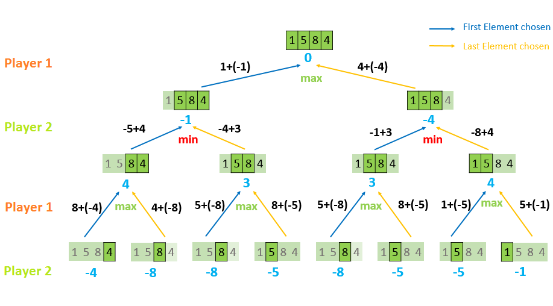
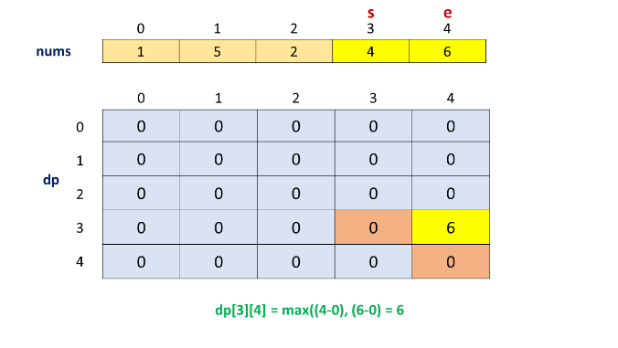
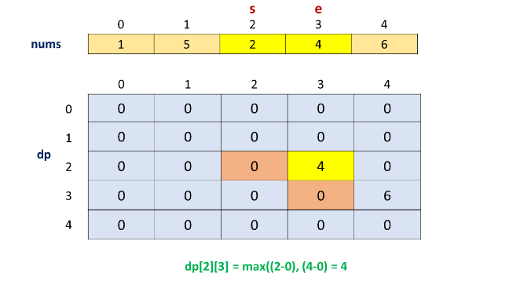
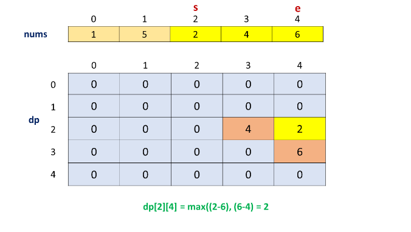
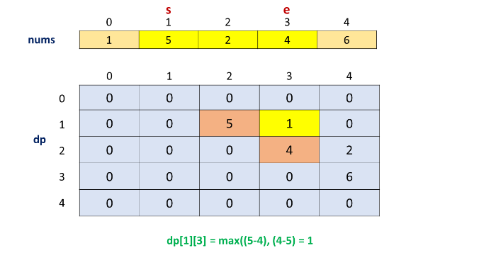
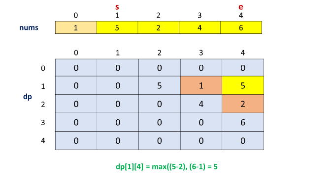
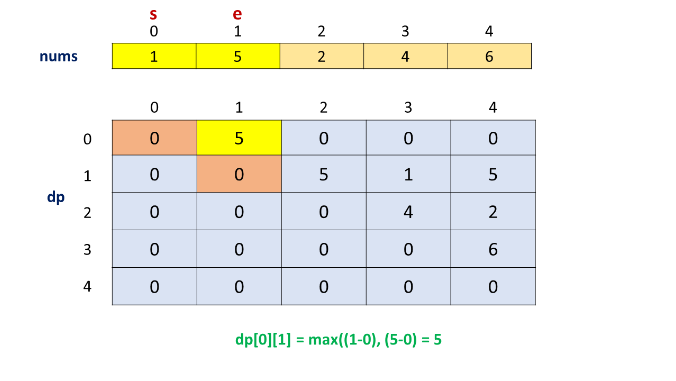
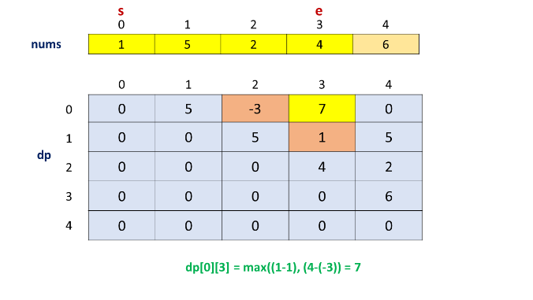
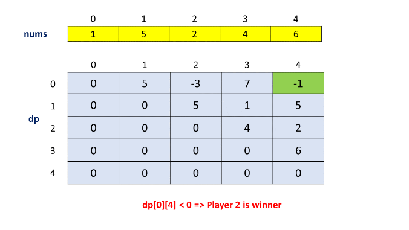

486. Predict the Winner

Given an array of scores that are non-negative integers. Player 1 picks one of the numbers from either end of the array followed by the player 2 and then player 1 and so on. Each time a player picks a number, that number will not be available for the next player. This continues until all the scores have been chosen. The player with the maximum score wins.

Given an array of scores, predict whether player 1 is the winner. You can assume each player plays to maximize his score.

**Example 1:**
```
Input: [1, 5, 2]
Output: False
Explanation: Initially, player 1 can choose between 1 and 2. 
If he chooses 2 (or 1), then player 2 can choose from 1 (or 2) and 5. If player 2 chooses 5, then player 1 will be left with 1 (or 2). 
So, final score of player 1 is 1 + 2 = 3, and player 2 is 5. 
Hence, player 1 will never be the winner and you need to return False.
```

**Example 2:**
```
Input: [1, 5, 233, 7]
Output: True
Explanation: Player 1 first chooses 1. Then player 2 have to choose between 5 and 7. No matter which number player 2 choose, player 1 can choose 233.
Finally, player 1 has more score (234) than player 2 (12), so you need to return True representing player1 can win.
```

**Note:**

1. 1 <= length of the array <= 20.
1. Any scores in the given array are non-negative integers and will not exceed 10,000,000.
1. If the scores of both players are equal, then player 1 is still the winner.

# Solution
---
## Approach #1 Using Recursion [Accepted]
The idea behind the recursive approach is simple. The two players Player 1 and Player 2 will be taking turns alternately. For the Player 1 to be the winner, we need `score_{Player_1} ≥ score_{Player_2}`. Or in other terms, `score_{Player_1} - score_{Player_2} ≥ 0`.

Thus, for the turn of Player 1, we can add its score obtained to the total score and for Player 2's turn, we can substract its score from the total score. At the end, we can check if the total score is greater than or equal to zero(equal score of both players), to predict that Player 1 will be the winner.

Thus, by making use of a recursive function `winner(nums,s,e,turn)` which predicts the winner for the $nums$ array as the score array with the elements in the range of indices $[s,e]$ currently being considered, given a particular player's turn, indicated by $turn=1$ being Player 1's turn and $turn=-1$ being the Player 2's turn, we can predict the winner of the given problem by making the function call `winner(nums,0,n-1,1)`. Here, nn refers to the length of $nums$ array.

In every turn, we can either pick up the first($nums[s]$) or the last($nums[e]$) element of the current subarray. Since both the players are assumed to be playing smartly and making the best move at every step, both will tend to maximize their scores. Thus, we can make use of the same function winner to determine the maximum score possible for any of the players.

Now, at every step of the recursive process, we determine the maximum score possible for the current player. It will be the maximum one possible out of the scores obtained by picking the first or the last element of the current subarray.

To obtain the score possible from the remaining subarray, we can again make use of the same `winner` function and add the score corresponding to the point picked in the current function call. But, we need to take care of whether to add or subtract this score to the total score available. If it is Player 1's turn, we add the current number's score to the total score, otherwise, we need to subtract the same.

Thus, at every step, we need update the search space appropriately based on the element chosen and also invert the $turn$'s value to indicate the `turn` change among the players and either add or subtract the current player's score from the total score available to determine the end result.

Further, note that the value returned at every step is given by $turn *\text{max}(turn * a, turn * b)$. This is equivalent to the statement $max(a,b)$ for Player 1's turn and $min(a,b)$ for Player 2's turn.

This is done because, looking from Player 1's perspective, for any move made by Player 1, it tends to leave the remaining subarray in a situation which minimizes the best score possible for Player 2, even if it plays in the best possible manner. But, when the `turn` passes to Player 1 again, for Player 1 to win, the remaining subarray should be left in a state such that the score obtained from this subarrray is maximum(for Player 1).

This is a general criteria for any arbitrary two player game and is commonly known as the Min-Max algorithm.

The following image shows how the scores are passed to determine the end result for a simple example.



```java
public class Solution {
    public boolean PredictTheWinner(int[] nums) {
        return winner(nums, 0, nums.length - 1, 1) >= 0;
    }
    public int winner(int[] nums, int s, int e, int turn) {
        if (s == e)
            return turn * nums[s];
        int a = turn * nums[s] + winner(nums, s + 1, e, -turn);
        int b = turn * nums[e] + winner(nums, s, e - 1, -turn);
        return turn * Math.max(turn * a, turn * b);
    }
}
```

**Complexity Analysis**

* Time complexity : $O(2^n)$. Size of recursion tree will be $2^n$. Here, $n$ refers to the length of $nums$ array.

* Space complexity : $O(n)$. The depth of the recursion tree can go upto nn.

## Approach #2 Similar Approach [Accepted]
**Algorithm**

We can omit the use of turnturn to keep a track of the player for the current turn. To do so, we can make use of a simple observation. If the current turn belongs to, say Player 1, we pick up an element, say $x$, from either end, and give the turn to Player 2. Thus, if we obtain the score for the remaining elements(leaving $x$), this score, now belongs to Player 2. Thus, since Player 2 is competing against Player 1, this score should be subtracted from Player 1's current(local) score($x$) to obtain the effective score of Player 1 at the current instant.

Similar argument holds true for Player 2's turn as well i.e. we can subtract Player 1's score for the remaining subarray from Player 2's current score to obtain its effective score. By making use of this observation, we can omit the use of turnturn from `winner` to find the required result by making the slight change discussed above in the `winner`'s implementation.

While returning the result from `winner` for the current function call, we return the larger of the effective scores possible by choosing either the first or the last element from the currently available subarray. Rest of the process remains the same as the last approach.

Now, in order to remove the duplicate function calls, we can make use of a 2-D memoization array, $memo$, such that we can store the result obtained for the function call `winner` for a subarray with starting and ending indices being $s$ and $e$ ] at $memo[s][e]$. This helps to prune the search space to a great extent.

This approach is inspired by @chidong

```java
public class Solution {
    public boolean PredictTheWinner(int[] nums) {
        Integer[][] memo = new Integer[nums.length][nums.length];
        return winner(nums, 0, nums.length - 1, memo) >= 0;
    }
    public int winner(int[] nums, int s, int e, Integer[][] memo) {
        if (s == e)
            return nums[s];
        if (memo[s][e] != null)
            return memo[s][e];
        int a = nums[s] - winner(nums, s + 1, e, memo);
        int b = nums[e] - winner(nums, s, e - 1, memo);
        memo[s][e] = Math.max(a, b);
        return memo[s][e];
    }
}
```

**Complexity Analysis**
* Time complexity : $O(n^2)$. The entire $memo$ array of size nnxnn is filled only once. Here, $n$ refers to the size of $nums$ array.

* Space complexity : $O(n^2)$. $memo$ array of size nnxnn is used for memoization.

## Approach #3 Dynamic Programming [Accepted]:
**Algorithm**

We can observe that the effective score for the current player for any given subarray $nums[x:y]$ only depends on the elements within the range $[x,y]$ in the array $nums$. It mainly depends on whether the element $nums[x]$ or $nums[y]$ is chosen in the current turn and also on the maximum score possible for the other player from the remaining subarray left after choosing the current element. Thus, it is certain that the current effective score isn't dependent on the elements outside the range $[x,y]$.

Based on the above observation, we can say that if know the maximum effective score possible for the subarray $nums[x+1,y]$ and $nums[x,y-1]$, we can easily determine the maximum effective score possible for the subarray $nums[x,y]$ as $\text{max}(nums[x]-score_{[x+1,y]}, nums[y]-score_{[x,y-1]})$. These equations are deduced based on the last approach.

From this, we conclude that we can make use of Dynamic Programming to determine the required maximum effective score for the array numsnums. We can make use of a 2-D $dp$ array, such that $dp[i][j]$ is used to store the maximum effective score possible for the subarray $nums[i,j]$. The $dp$ updation equation becomes:

$dp[i,j] = nums[i] - dp[i + 1][j], nums[j] - dp[i][j - 1]$.

We can fill in the $dp$ array starting from the last row. At the end, the value for $dp[0][n-1]$ gives the required result. Here, nn refers to the length of $nums$ array.

Look at the animation below to clearly understand the $dp$ filling process.














```java
public class Solution {
    public boolean PredictTheWinner(int[] nums) {
        int[][] dp = new int[nums.length + 1][nums.length];
        for (int s = nums.length; s >= 0; s--) {
            for (int e = s + 1; e < nums.length; e++) {
                int a = nums[s] - dp[s + 1][e];
                int b = nums[e] - dp[s][e - 1];
                dp[s][e] = Math.max(a, b);
            }
        }
        return dp[0][nums.length - 1] >= 0;
    }
}
```

**Complexity Analysis**

* Time complexity : $O(n^2)$. $((n+1)xn)/2$ entries in $dp$ array of size $(n+1)$x$n$ is filled once. Here, nn refers to the length of $nums$ array.

* Space complexity : $O(n^2)$. $dp$ array of size (n+1)(n+1)xnn is used.

## Approach #4 1-D Dynamic Programming [Accepted]:
**Algorithm**

From the last approach, we see that the $dp$ updation equation is:

$dp[i,j] = nums[i] - dp[i + 1][j], nums[j] - dp[i][j - 1]$.

Thus, for filling in any entry in $dp$ array, only the entries in the next row(same column) and the previous column(same row) are needed.

Instead of making use of a new row in $dp$ array for the current $dp$ row's updations, we can overwrite the values in the previous row itself and consider the values as belonging to the new row's entries, since the older values won't be needed ever in the future again. Thus, instead of making use of a 2-D $dp$ array, we can make use of a 1-D $dp$ array and make the updations appropriately.

```java
public class Solution {
    public boolean PredictTheWinner(int[] nums) {
        int[] dp = new int[nums.length];
        for (int s = nums.length; s >= 0; s--) {
            for (int e = s + 1; e < nums.length; e++) {
                int a = nums[s] - dp[e];
                int b = nums[e] - dp[e - 1];
                dp[e] = Math.max(a, b);
            }
        }
        return dp[nums.length - 1] >= 0;
    }
}
```

**Complexity Analysis**

* Time complexity : $O(n^2)$. The elements of $dp$ array are updated $1+2+3+...+n$ times. Here, $n$ refers to the length of $nums$ array.

* Space complexity : $O(n)$. 1-D $dp$ array of size nn is used.

# Submissions
---
**Solution 1:**
```
Runtime: 40 ms
Memory Usage: 13.9 MB
```
```python
class Solution:
    def PredictTheWinner(self, nums: List[int]) -> bool:
        dp = [0 for _ in range(len(nums))]
        for s in range(len(nums), -1, -1):
            for e in range(s+1, len(nums)):
                a = nums[s] - dp[e]
                b = nums[e] - dp[e-1]
                dp[e] = max(a, b)
        return dp[len(nums) - 1] >= 0
```