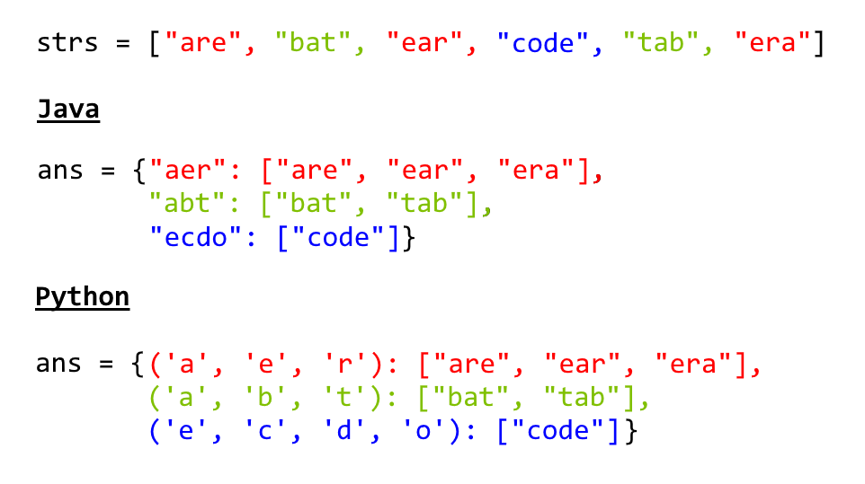
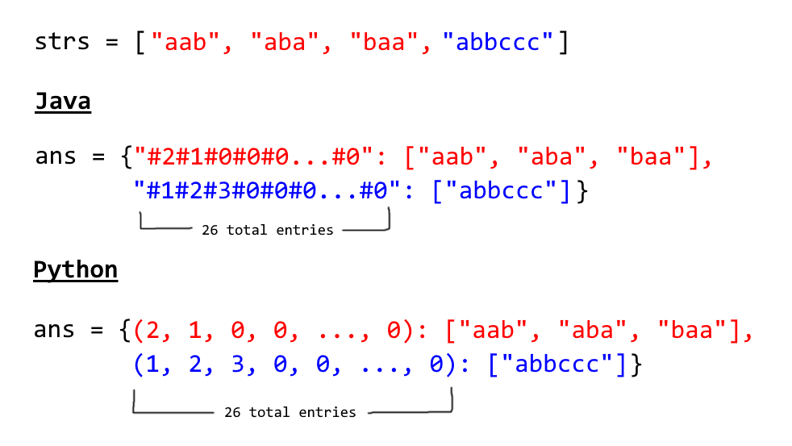

49. Group Anagrams

Given an array of strings, group anagrams together.

**Example:**
```
Input: ["eat", "tea", "tan", "ate", "nat", "bat"],
Output:
[
  ["ate","eat","tea"],
  ["nat","tan"],
  ["bat"]
]
```

**Note:**

* All inputs will be in lowercase.
* The order of your output does not matter.

# Solution
---
## Approach 1: Categorize by Sorted String
**Intuition**

Two strings are anagrams if and only if their sorted strings are equal.

**Algorithm**

Maintain a map `ans : {String -> List}` where each key $\text{K}$ is a sorted string, and each value is the list of strings from the initial input that when sorted, are equal to $\text{K}$.

In Java, we will store the key as a string, eg. code. In Python, we will store the key as a hashable tuple, eg. `('c', 'o', 'd', 'e')`.



```python
class Solution(object):
    def groupAnagrams(self, strs):
        ans = collections.defaultdict(list)
        for s in strs:
            ans[tuple(sorted(s))].append(s)
        return ans.values()
```

**Complexity Analysis**

* Time Complexity: $O(NK \log K)$, where $N$ is the length of strs, and $K$ is the maximum length of a string in `strs`. The outer loop has complexity $O(N)$ as we iterate through each string. Then, we sort each string in $O(K \log K)$ time.

* Space Complexity: $O(NK)$, the total information content stored in `ans`.

## Approach 2: Categorize by Count
**Intuition**

Two strings are anagrams if and only if their character counts (respective number of occurrences of each character) are the same.

**Algorithm**

We can transform each string $\text{s}$ into a character count, $\text{count}$, consisting of 26 non-negative integers representing the number of $\text{a}$'s, $\text{b}$'s, $\text{c}$'s, etc. We use these counts as the basis for our hash map.

In Java, the hashable representation of our count will be a string delimited with `'#'` characters. For example, `abbccc` will be `#1#2#3#0#0#0...#0` where there are 26 entries total. In python, the representation will be a tuple of the counts. For example, `abbccc` will be `(1, 2, 3, 0, 0, ..., 0)`, where again there are 26 entries total.



```python
class Solution:
    def groupAnagrams(strs):
        ans = collections.defaultdict(list)
        for s in strs:
            count = [0] * 26
            for c in s:
                count[ord(c) - ord('a')] += 1
            ans[tuple(count)].append(s)
        return ans.values()
```

**Complexity Analysis**

* Time Complexity: $O(NK)$, where $N$ is the length of strs, and $K$ is the maximum length of a string in strs. Counting each string is linear in the size of the string, and we count every string.

* Space Complexity: $O(NK)$, the total information content stored in `ans`.

# Submissions
---
**Solution:**
```
Runtime: 124 ms
Memory Usage: N/A
```
```python
class Solution:
    def groupAnagrams(self, strs):
        """
        :type strs: List[str]
        :rtype: List[List[str]]
        """
        ans = collections.defaultdict(list)
        for s in strs:
            ans[tuple(sorted(s))].append(s)
        return list(ans.values())
```