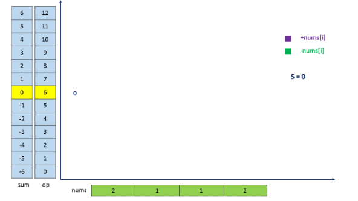

494. Target Sum

You are given a list of non-negative integers, a1, a2, ..., an, and a target, S. Now you have 2 symbols `+` and `-`. For each integer, you should choose one from `+` and `-` as its new symbol.

Find out how many ways to assign symbols to make sum of integers equal to target S.

**Example 1:**
```
Input: nums is [1, 1, 1, 1, 1], S is 3. 
Output: 5
Explanation: 

-1+1+1+1+1 = 3
+1-1+1+1+1 = 3
+1+1-1+1+1 = 3
+1+1+1-1+1 = 3
+1+1+1+1-1 = 3

There are 5 ways to assign symbols to make the sum of nums be target 3.
```

**Note:**

1. The length of the given array is positive and will not exceed 20.
1. The sum of elements in the given array will not exceed 1000.
1. Your output answer is guaranteed to be fitted in a 32-bit integer.

# Solution
---
## Approach 1: Brute Force
**Algorithm**

The brute force approach is based on recursion. We need to try to put both the `+` and `-` symbols at every location in the given $nums$ array and find out the assignments which lead to the required result $S$.

For this, we make use of a recursive function `calculate(nums, i, sum, S)`, which returns the assignments leading to the sum $S$, starting from the $i^{th}$ index onwards, provided the sum of elements upto the $i^{th}$ element is $sum$. This function appends a `+` sign and a `-` sign both to the element at the current index and calls itself with the updated $sum$ as $sum + nums[i]$ and $sum - nums[i]$ repectively along with the updated current index as $i+1$. Whenver, we reach the end of the array, we compare the sum obtained with $S$. If they are equal, we increment the $count$ value to be returned.

Thus, the function call `calculate(nums, 0, 0, S)` retuns the required no. of assignments.

```java
public class Solution {
    int count = 0;
    public int findTargetSumWays(int[] nums, int S) {
        calculate(nums, 0, 0, S);
        return count;
    }
    public void calculate(int[] nums, int i, int sum, int S) {
        if (i == nums.length) {
            if (sum == S)
                count++;
        } else {
            calculate(nums, i + 1, sum + nums[i], S);
            calculate(nums, i + 1, sum - nums[i], S);
        }
    }
}
```

**Complexity Analysis**

* Time complexity : $O(2^n)$. Size of recursion tree will be $2^n$. nn refers to the size of $nums$ array.

* Space complexity : $O(n)$. The depth of the recursion tree can go upto $n$.

## Approach 2: Recursion with Memoization
**Algorithm**

It can be easily observed that in the last approach, a lot of redundant function calls could be made with the same value of $i$ as the current index and the same value of $sum$ as the current sum, since the same values could be obtained through multiple paths in the recursion tree. In order to remove this redundancy, we make use of memoization as well to store the results which have been calculated earlier.

Thus, for every call to `calculate(nums, i, sum, S)`, we store the result obtained in $memo[i][sum + 1000]$. The factor of 1000 has been added as an offset to the $sum$ value to map all the $sums$ possible to positive integer range. By making use of memoization, we can prune the search space to a good extent.

```java
public class Solution {
    int count = 0;
    public int findTargetSumWays(int[] nums, int S) {
        int[][] memo = new int[nums.length][2001];
        for (int[] row: memo)
            Arrays.fill(row, Integer.MIN_VALUE);
        return calculate(nums, 0, 0, S, memo);
    }
    public int calculate(int[] nums, int i, int sum, int S, int[][] memo) {
        if (i == nums.length) {
            if (sum == S)
                return 1;
            else
                return 0;
        } else {
            if (memo[i][sum + 1000] != Integer.MIN_VALUE) {
                return memo[i][sum + 1000];
            }
            int add = calculate(nums, i + 1, sum + nums[i], S, memo);
            int subtract = calculate(nums, i + 1, sum - nums[i], S, memo);
            memo[i][sum + 1000] = add + subtract;
            return memo[i][sum + 1000];
        }
    }
}
```

**Complexity Analysis**

* Time complexity : $O(l*n)$. The $memo$ array of size $l*n$ has been filled just once. Here, ll refers to the range of $sum$ and $n$ refers to the size of $nums$ array.

* Space complexity : $O(n)$. The depth of recursion tree can go upto $n$.

## Approach 3: 2D Dynamic Programming
**Algorithm**

The idea behind this approach is as follows. Suppose we can find out the number of times a particular sum, say $sum_i$ is possible upto a particular index, say $i$, in the given $nums$ array, which is given by say $count_i$. Now, we can find out the number of times the sum $sum_i + nums[i]$ can occur easily as $count_i$. Similarly, the number of times the sum $sum_i - nums[i]$ occurs is also given by $count_i$.

Thus, if we know all the sums $sum_j$'s which are possible upto the $j^{th}$ index by using various assignments, along with the corresponding count of assignments, $count_j$, leading to the same sum, we can determine all the sums possible upto the $(j+1)^{th}($ index along with the corresponding count of assignments leading to the new sums.

Based on this idea, we make use of a $dp$ to determine the number of assignments which can lead to the given sum. $dp[i][j]$ refers to the number of assignments which can lead to a sum of $j$ upto the $i^{th}$ index. To determine the number of assignments which can lead to a sum of $sum + nums[i]$ upto the $(i+1)^{th}$ index, we can use $dp[i][sum + nums[i]] = dp[i][sum + nums[i]] + dp[i-1][sum]$. Similarly, $dp[i][sum - nums[i]] = dp[i][sum + nums[i]] + dp[i-1][sum]$. We iterate over the $dp$ array in a rowwise fashion i.e. Firstly we obtain all the sums which are possible upto a particular index along with the corresponding count of assignments and then proceed for the next element(index) in the $nums$ array.

But, since the $sum$ can range from -1000 to +1000, we need to add an offset of 1000 to the sum indices (column number) to map all the sums obtained to positive range only.

At the end, the value of $dp[n-1][S+1000]$ gives us the required number of assignments. Here, $n$ refers to the number of elements in the $nums$ array.

The animation below shows the way various sums are generated along with the corresponding indices. The example assumes $sum$ values to lie in the range of -6 to +6 just for the purpose of illustration. This animation is inspired by @Chidong





```java
public class Solution {
    public int findTargetSumWays(int[] nums, int S) {
        int[][] dp = new int[nums.length][2001];
        dp[0][nums[0] + 1000] = 1;
        dp[0][-nums[0] + 1000] += 1;
        for (int i = 1; i < nums.length; i++) {
            for (int sum = -1000; sum <= 1000; sum++) {
                if (dp[i - 1][sum + 1000] > 0) {
                    dp[i][sum + nums[i] + 1000] += dp[i - 1][sum + 1000];
                    dp[i][sum - nums[i] + 1000] += dp[i - 1][sum + 1000];
                }
            }
        }
        return S > 1000 ? 0 : dp[nums.length - 1][S + 1000];
    }
}
```

**Complexity Analysis**

* Time complexity : $O(l*n)$. The entire $nums$ array is travesed 2001(constant no.: ll) times. nn refers to the size of $nums$ array. ll refers to the range of $sum$ possible.

* Space complexity : $O(l*n)$. $dp$ array of size $l*n$ is used.

## Approach 4: 1D Dynamic Programming
**Algorithm**

If we look closely at the last solution, we can observe that for the evaluation of the current row of $dp$, only the values of the last row of $dp$ are needed. Thus, we can save some space by using a 1D DP array instead of a 2-D DP array. The only difference that needs to be made is that now the same $dp$ array will be updated for every row traversed.

Below code is inspired by @Chidong

```java
public class Solution {
    public int findTargetSumWays(int[] nums, int S) {
        int[] dp = new int[2001];
        dp[nums[0] + 1000] = 1;
        dp[-nums[0] + 1000] += 1;
        for (int i = 1; i < nums.length; i++) {
            int[] next = new int[2001];
            for (int sum = -1000; sum <= 1000; sum++) {
                if (dp[sum + 1000] > 0) {
                    next[sum + nums[i] + 1000] += dp[sum + 1000];
                    next[sum - nums[i] + 1000] += dp[sum + 1000];
                }
            }
            dp = next;
        }
        return S > 1000 ? 0 : dp[S + 1000];
    }
}
```

**Complexity Analysis**

* Time complexity : $O(l.n)$. The entire $nums$ array is traversed $l$ times. $n$ refers to the size of $nums$ array. $l$ refers to the range of $sum$ possible.

* Space complexity : $O(n)$. $dp$ array of size $n$ is used.

# Submissions
---
**Solution 1:**
```
Runtime: 592 ms
Memory Usage: 14 MB
```
```python
class Solution:
    def findTargetSumWays(self, nums: List[int], S: int) -> int:
        dp = [0 for _ in range(2001)]
        dp[nums[0] + 1000] = 1;
        dp[-nums[0] + 1000] += 1;
        for i in range(1, len(nums)):
            next_ = [0 for _ in range(2001)]
            for sum_ in range(-1000, 1001):
                if dp[sum_ + 1000] > 0:
                    next_[sum_ + nums[i] + 1000] += dp[sum_ + 1000]
                    next_[sum_ - nums[i] + 1000] += dp[sum_ + 1000]
            dp = next_
        return 0 if S > 1000 else dp[S + 1000]
```

**Solution 2:**
```
Runtime: 300 ms
Memory Usage: N/A
```
```python
class Solution:
        
    def findTargetSumWays(self, nums, S):
        """
        :type nums: List[int]
        :type S: int
        :rtype: int
        """
        count = {0: 1}
        for x in nums:
            count2 = {}
            for tmpSum in count:
                count2[tmpSum + x] = count2.get(tmpSum + x, 0) + count[tmpSum]
                count2[tmpSum - x] = count2.get(tmpSum - x, 0) + count[tmpSum]
            count = count2
        return count.get(S, 0)
```