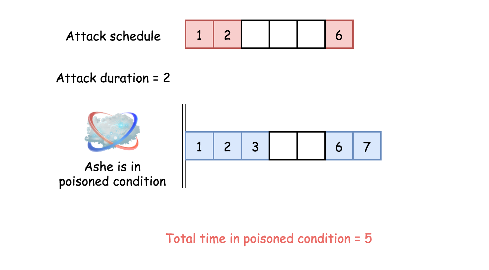

495. Teemo Attacking

In LOL world, there is a hero called Teemo and his attacking can make his enemy Ashe be in poisoned condition. Now, given the Teemo's attacking **ascending** time series towards Ashe and the poisoning time duration per Teemo's attacking, you need to output the total time that Ashe is in poisoned condition.

You may assume that Teemo attacks at the very beginning of a specific time point, and makes Ashe be in poisoned condition immediately.

**Example 1:**
```
Input: [1,4], 2
Output: 4
Explanation: At time point 1, Teemo starts attacking Ashe and makes Ashe be poisoned immediately. 
This poisoned status will last 2 seconds until the end of time point 2. 
And at time point 4, Teemo attacks Ashe again, and causes Ashe to be in poisoned status for another 2 seconds. 
So you finally need to output 4.
```

**Example 2:**
```
Input: [1,2], 2
Output: 3
Explanation: At time point 1, Teemo starts attacking Ashe and makes Ashe be poisoned. 
This poisoned status will last 2 seconds until the end of time point 2. 
However, at the beginning of time point 2, Teemo attacks Ashe again who is already in poisoned status. 
Since the poisoned status won't add up together, though the second poisoning attack will still work at time point 2, it will stop at the end of time point 3. 
So you finally need to output 3.
```

**Note:**

1. You may assume the length of given time series array won't exceed 10000.
1. You may assume the numbers in the Teemo's attacking time series and his poisoning time duration per attacking are non-negative integers, which won't exceed 10,000,000.

# Solution
---
## Approach 1: One pass
**Intuition**

The problem is an example of merge interval questions which are now quite popular in Google.

Typically such problems could be solved in a linear time in the case of sorted input, like here, and in $\mathcal{O}(N \log N)$ time otherwise, here is an example.

Here one deals with a sorted input, and the problem could be solved in one pass with a constant space. The idea is straightforward: consider only the interval between two attacks. Ashe spends in a poisoned condition the whole time interval if this interval is shorter than the poisoning time duration `duration`, and `duration` otherwise.

**Algorithm**

* Initiate total time in poisoned condition `total = 0`.

* Iterate over `timeSeries` list. At each step add to the total time the minimum between interval length and the poisoning time duration `duration`.

* Return `total + duration` to take the last attack into account.



```python
class Solution:
    def findPoisonedDuration(self, timeSeries: List[int], duration: int) -> int:
        n = len(timeSeries)
        if n == 0:
            return 0
        
        total = 0
        for i in range(n - 1):
            total += min(timeSeries[i + 1] - timeSeries[i], duration)
        return total + duration
```

# Submissions
---
**Solution 1: (One pass, Greedy)**
```
Runtime: 308 ms
Memory Usage: 15.2 MB
```
```python
class Solution:
    def findPoisonedDuration(self, timeSeries: List[int], duration: int) -> int:
        n = len(timeSeries)
        if n == 0:
            return 0

        total = 0
        for i in range(n - 1):
            total += min(timeSeries[i + 1] - timeSeries[i], duration)
        return total + duration
```

**Solution 2: (Greedy)**
```
Runtime: 0 ms, Beats 100.00%
Memory: 29.56 MB, Beats 92.98%
```
```c++
class Solution {
public:
    int findPoisonedDuration(vector<int>& timeSeries, int duration) {
        int n = timeSeries.size(), i, a = 0;
        if (n == 0) {
            return 0;
        }
        for (i = 0; i < n - 1; i ++) {
            a += min(timeSeries[i + 1] - timeSeries[i], duration);
        }
        return a + duration;
    }
};
```
