503. Next Greater Element II

Given a circular array (the next element of the last element is the first element of the array), print the Next Greater Number for every element. The Next Greater Number of a number x is the first greater number to its traversing-order next in the array, which means you could search circularly to find its next greater number. If it doesn't exist, output -1 for this number.

**Example 1:**
```
Input: [1,2,1]
Output: [2,-1,2]
Explanation: The first 1's next greater number is 2; 
The number 2 can't find next greater number; 
The second 1's next greater number needs to search circularly, which is also 2.
```

**Note:** The length of given array won't exceed `10000`.

# Solution
---
## Approach #1 Brute Force (using Double Length Array) [Time Limit Exceeded]
In this method, we make use of an array $doublenums$ which is formed by concatenating two copies of the given $nums$ array one after the other. Now, when we need to find out the next greater element for $nums[i]$, we can simply scan all the elements $doublenums[j]$, such that $i < j < length(doublenums)$. The first element found satisfying the given condition is the required result for $nums[i]$. If no such element is found, we put a $\text{-1}$ at the appropriate position in the $res$ array.

```java
public class Solution {

    public int[] nextGreaterElements(int[] nums) {
        int[] res = new int[nums.length];
        int[] doublenums = new int[nums.length * 2];
        System.arraycopy(nums, 0, doublenums, 0, nums.length);
        System.arraycopy(nums, 0, doublenums, nums.length, nums.length);
        for (int i = 0; i < nums.length; i++) {
            res[i]=-1;
            for (int j = i + 1; j < doublenums.length; j++) {
                if (doublenums[j] > doublenums[i]) {
                    res[i] = doublenums[j];
                    break;
                }
            }
        }
        return res;
    }
}
```

**Complexity Analysis**

* Time complexity : $O(n^2)$. The complete $doublenums$ array(of size $\text{2n}$) is scanned for all the elements of $nums$ in the worst case.

* Space complexity : $O(n)$. $doublenums$ array of size $\text{2n}$ is used. resres array of size $\text{n}$ is used.

## Approach #2 Better Brute Force [Accepted]
Instead of making a double length copy of $nums$ array , we can traverse circularly in the $nums$ array by making use of the $\text{%(modulus)}$ operator. For every element $nums[i]$, we start searching in the $nums$ array(of length $n$) from the index $(i+1)%n$ and look at the next(cicularly) $n-1$ elements. For $nums[i]$ we do so by scanning over $nums[j]$, such that $(i+1)%n &leq; j$, and we look for the first greater element found. If no such element is found, we put a $\text{-1}$ at the appropriate position in the $res$ array.

```java
public class Solution {
    public int[] nextGreaterElements(int[] nums) {
        int[] res = new int[nums.length];
        for (int i = 0; i < nums.length; i++) {
            res[i] = -1;
            for (int j = 1; j < nums.length; j++) {
                if (nums[(i + j) % nums.length] > nums[i]) {
                    res[i] = nums[(i + j) % nums.length];
                    break;
                }
            }
        }
        return res;
    }
}
```

**Complexity Analysis**

* Time complexity : $O(n^2)$. The complete $nums$ array of size $n$ is scanned for all the elements of $nums$ in the worst case.

* Space complexity : $O(n)$. resres array of size nn is used.

## Approach #3 Using Stack [Accepted]
This approach makes use of a stack. This stack stores the indices of the appropriate elements from $nums$ array. The top of the stack refers to the index of the Next Greater Element found so far. We store the indices instead of the elements since there could be duplicates in the $nums$ array. The description of the method will make the above statement clearer.

We start traversing the $nums$ array from right towards the left. For an element $nums[i]$ encountered, we pop all the elements $stack[top]$ from the stack such that $nums\big[stack[top]\big] ≤ nums[i]$. We continue the popping till we encounter a $stack[top]$ satisfying $nums\big[stack[top]\big] > nums[i]$. Now, it is obvious that the current $stack[top]$ only can act as the Next Greater Element for $nums[i]$(right now, considering only the elements lying to the right of $nums[i]$).

If no element remains on the top of the stack, it means no larger element than $nums[i]$ exists to its right. Along with this, we also push the index of the element just encountered($nums[i]$), i.e. ii over the top of the stack, so that $nums[i]$(or $stack[top]$ now acts as the Next Greater Element for the elements lying to its left.

We go through two such passes over the complete $nums$ array. This is done so as to complete a circular traversal over the $nums$ array. The first pass could make some wrong entries in the $res$ array since it considers only the elements lying to the right of $nums[i]$, without a circular traversal. But, these entries are corrected in the second pass.

Further, to ensure the correctness of the method, let's look at the following cases.

Assume that $nums[j]$ is the correct Next Greater Element for $nums[i]$, such that i < j ≤ stack[top]. Now, whenever we encounter $nums[j]$, if $nums[j] > nums\big[stack[top]\big]$, it would have already popped the previous $stack[top]$ and $j$ would have become the topmost element. On the other hand, if $nums[j] < nums\big[stack[top]\big]$, it would have become the topmost element by being pushed above the previous $stack[top]$. In both the cases, if $nums[j] > nums[i]$, it will be correctly determined to be the Next Greater Element.

The following example makes the procedure clear:

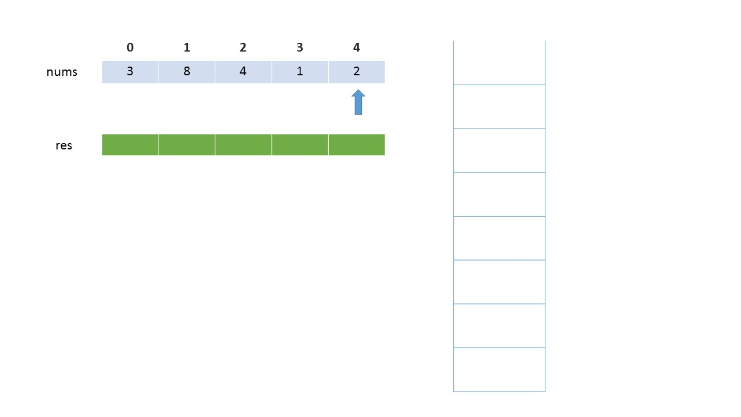
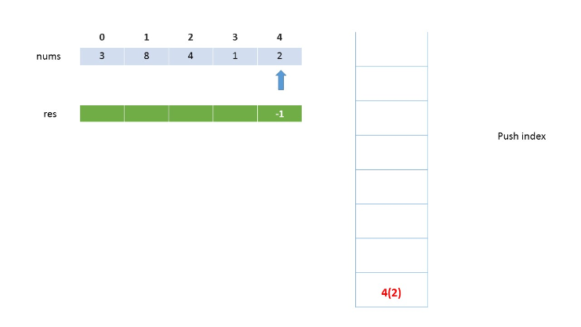
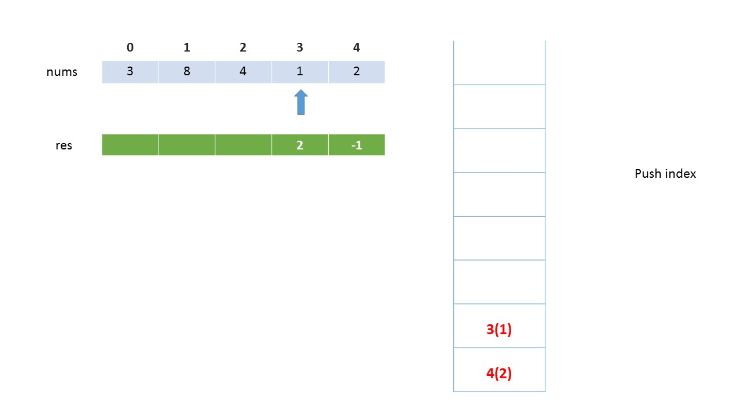
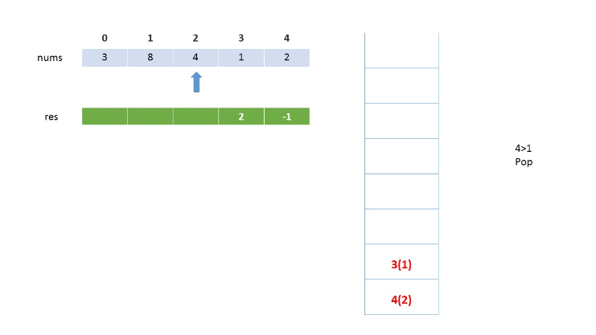
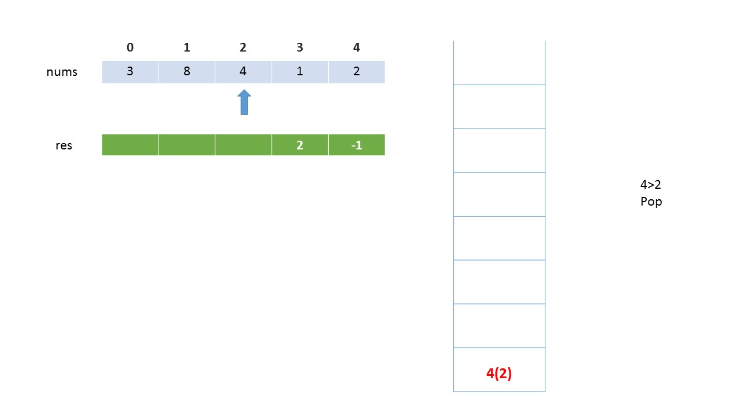
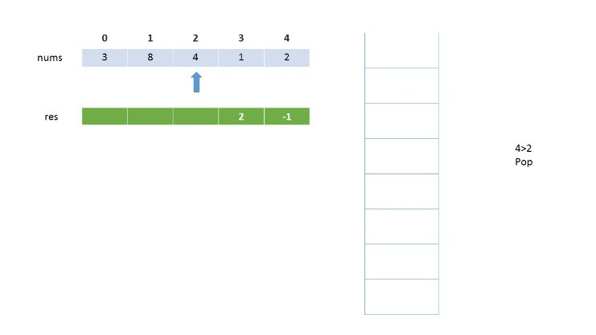
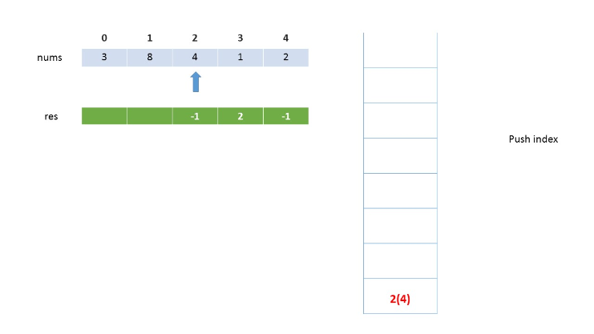
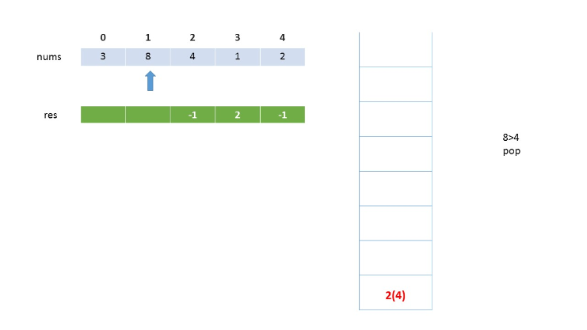
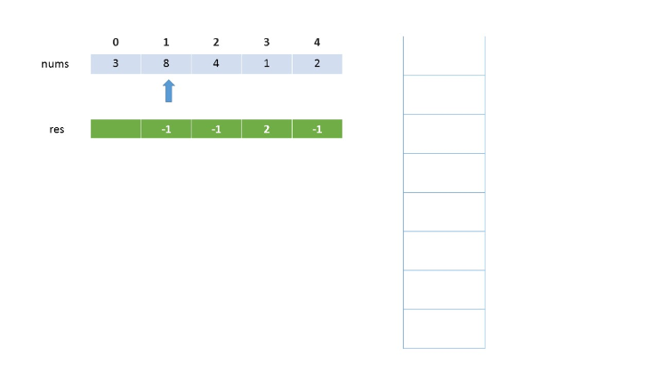

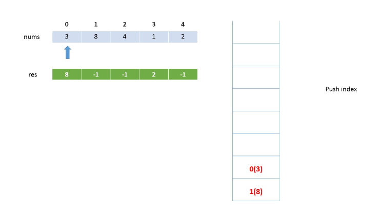
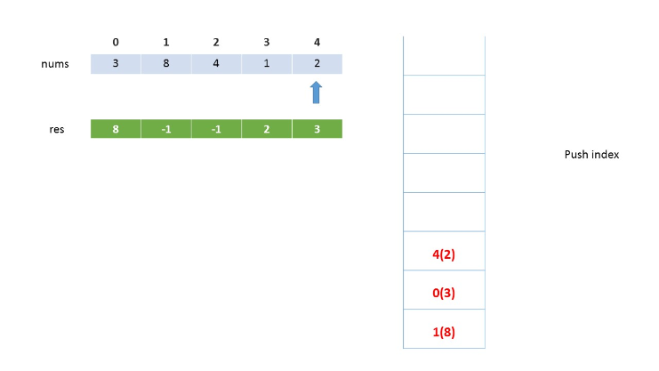
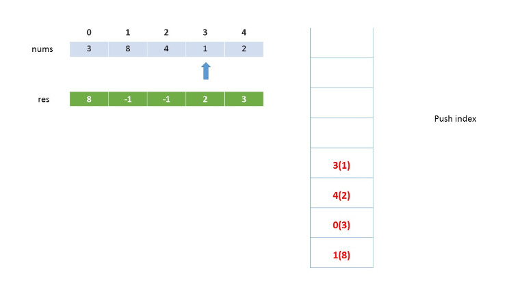
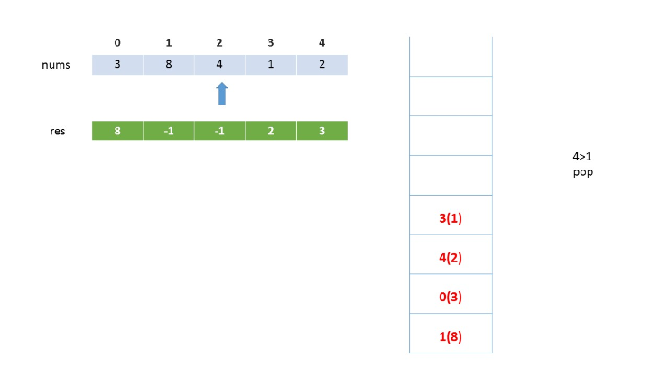
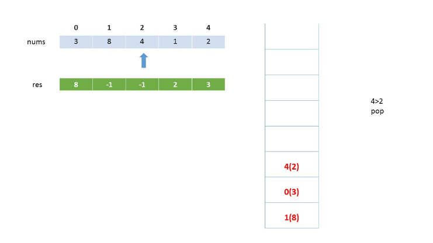
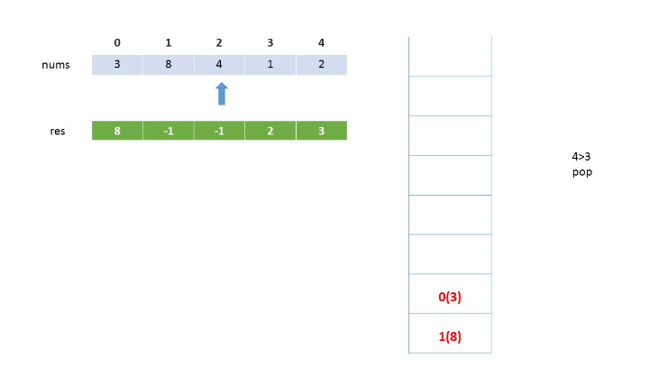
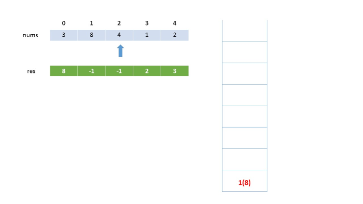
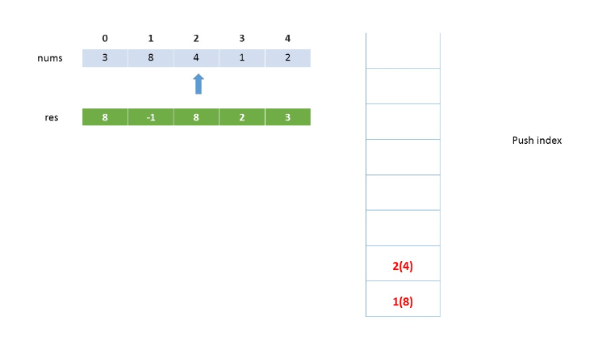
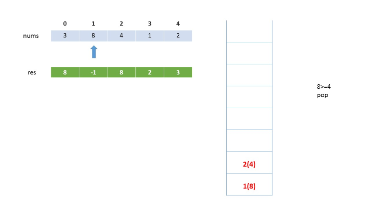
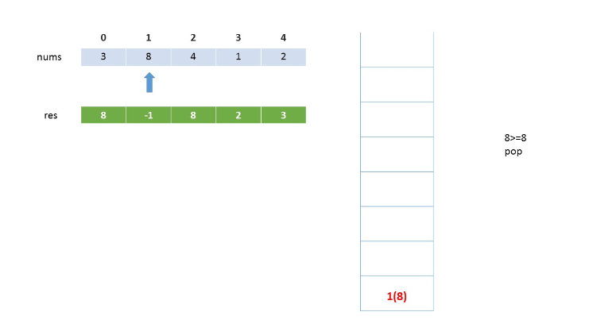

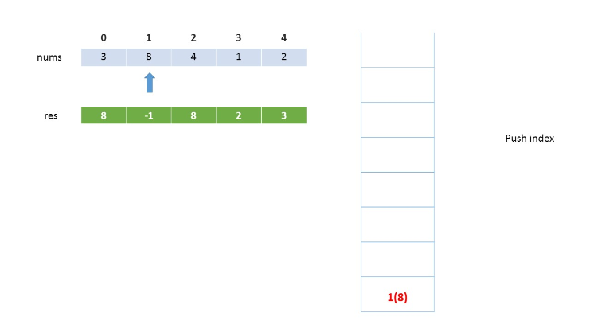

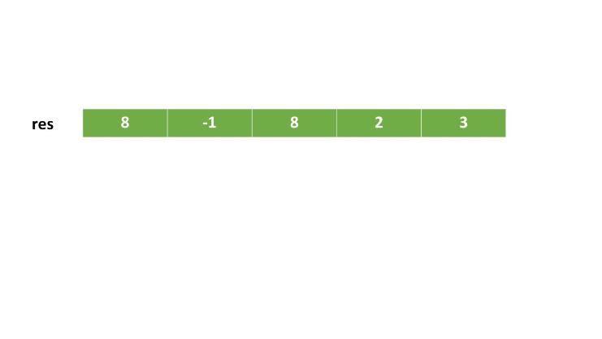


As the animation above depicts, after the first pass, there are a number of wrong entries(marked as $\text{-1}$ in the $res$ array, because only the elements lying to the corresponding right(non-circular) have been considered till now. But, after the second pass, the correct values are substituted.

```java
public class Solution {

    public int[] nextGreaterElements(int[] nums) {
        int[] res = new int[nums.length];
        Stack<Integer> stack = new Stack<>();
        for (int i = 2 * nums.length - 1; i >= 0; --i) {
            while (!stack.empty() && nums[stack.peek()] <= nums[i % nums.length]) {
                stack.pop();
            }
            res[i % nums.length] = stack.empty() ? -1 : nums[stack.peek()];
            stack.push(i % nums.length);
        }
        return res;
    }
}
```

**Complexity Analysis**

* Time complexity : $O(n)$. Only two traversals of the $nums$ array are done. Further, atmost $\text{2n}$ elements are pushed and popped from the stack.

* Space complexity : $O(n)$. A stack of size nn is used. $res$ array of size $n$ is used.

# Submissions
---
**Solution 1: (Stack)**
```
Runtime: 252 ms
Memory Usage: 14.3 MB
```
```python
class Solution:
    def nextGreaterElements(self, nums: List[int]) -> List[int]:
        N = len(nums)
        res = [None] * N
        stack = []
        for i in range(2*N -1, -1, -1):
            while stack and nums[stack[-1]] <= nums[i % N]:
                stack.pop()
            res[i % N] = -1 if not stack else nums[stack[-1]]
            stack.append(i % N)
            
        return res
```

**Solution 2: (Stack)**
```
Runtime: 161 ms
Memory Usage: 16.5 MB
```
```c


/**
 * Note: The returned array must be malloced, assume caller calls free().
 */
int* nextGreaterElements(int* nums, int numsSize, int* returnSize){
    int *ans = malloc(numsSize*sizeof(int));
    int *stack = malloc(numsSize*sizeof(int));
    int sz = 0;
    for (int i = 2*numsSize - 1; i >= 0; i --){
        while ((sz > 0) && (nums[stack[sz-1]] <= nums[i%numsSize]))
            sz -= 1;
        ans[i%numsSize] = (sz == 0 ? -1 : nums[stack[sz-1]]);
        stack[sz] = i%numsSize;
        sz += 1;
    }
    *returnSize = numsSize;
    return ans;
}
```

**Solution 3: (Stack)**
```
Runtime: 32 ms
Memory Usage: 24 MB
```
```c++
class Solution {
public:
    vector<int> nextGreaterElements(vector<int>& nums) {
        vector<int> res(nums.size());
        stack<int> stk;
        for (int i = 2*nums.size(); i >= 0; i --) {
             while (!stk.empty() && nums[stk.top()] <= nums[i % nums.size()]) {
                stk.pop();
            }
            res[i % nums.size()] = stk.empty() ? -1 : nums[stk.top()];
            stk.push(i % nums.size());
        }
        return res;
    }
};
```
