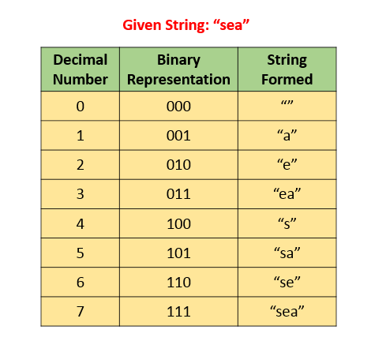
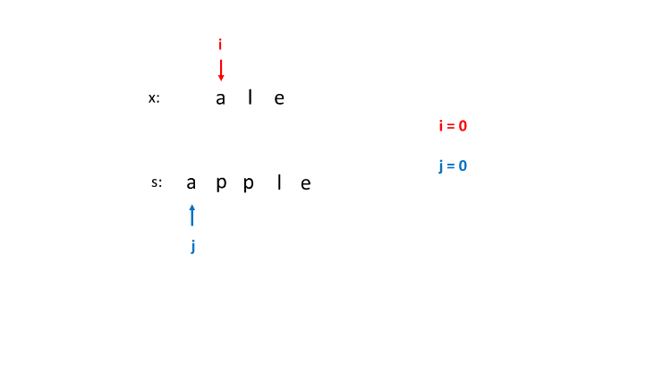
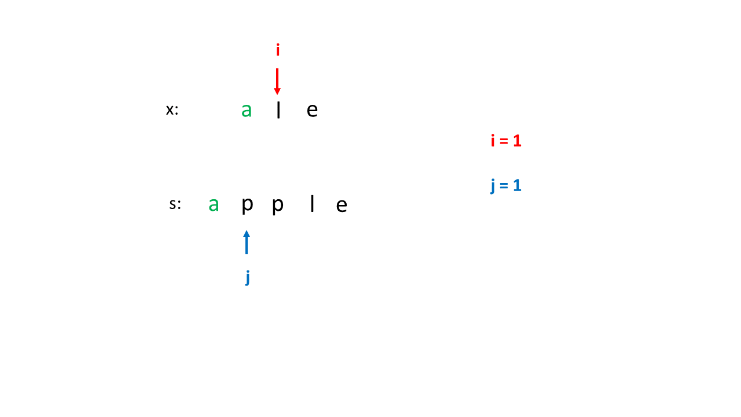
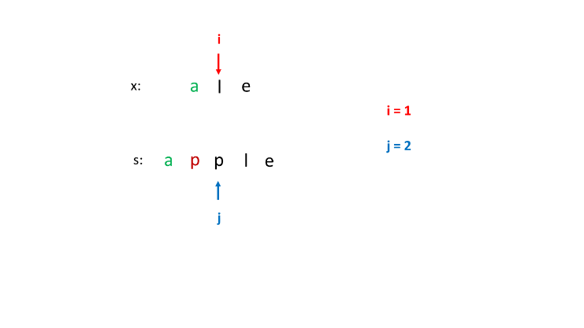
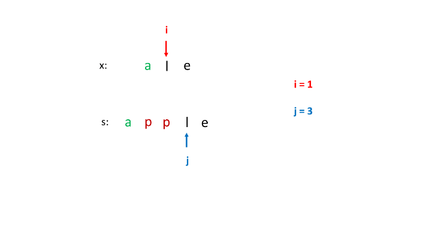
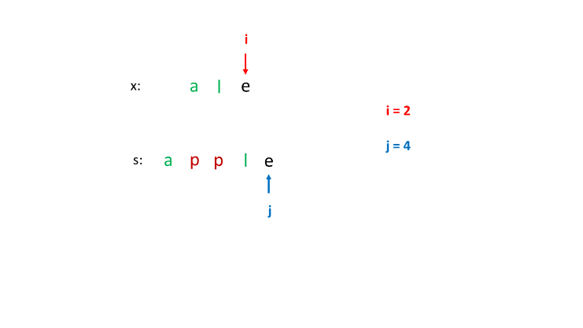
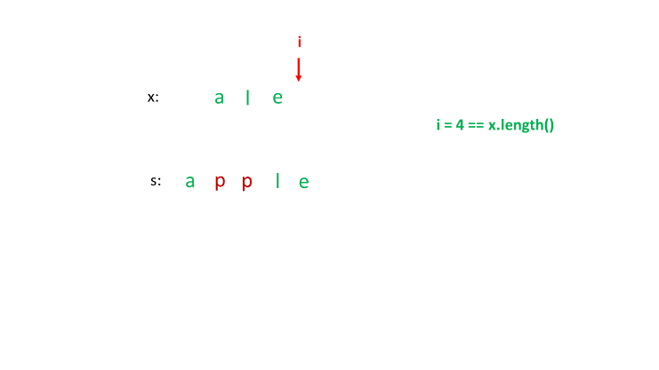

524. Longest Word in Dictionary through Deleting

Given a string and a string dictionary, find the longest string in the dictionary that can be formed by deleting some characters of the given string. If there are more than one possible results, return the longest word with the smallest lexicographical order. If there is no possible result, return the empty string.

**Example 1:**
```
Input:
s = "abpcplea", d = ["ale","apple","monkey","plea"]

Output: 
"apple"
```

**Example 2:**
```
Input:
s = "abpcplea", d = ["a","b","c"]

Output: 
"a"
```

**Note:**

* All the strings in the input will only contain lower-case letters.
* The size of the dictionary won't exceed `1,000`.
* The length of all the strings in the input won't exceed `1,000`.

# Solution
---
## Approach 1: Brute Force
**Algorithm**

The idea behind this approach is as follows. We create a list of all the possible strings that can be formed by deleting one or more characters from the given string $s$. In order to do so, we make use of a recursive function `generate(s, str, i, l)` which creates a string by adding and by removing the current character($i^{th}$) from the string ss to the string strstr formed till the index $i$. Thus, it adds the $i^{th}$ character to $str$ and calls itself as `generate(s, str + s.charAt(i), i + 1, l)`. It also omits the $i^{th}$ character to strstr and calls itself as `generate(s, str, i + 1, l)`.

Thus, at the end the list $l$ contains all the required strings that can be formed using $s$. Then, we look for the strings formed in $l$ into the dictionary available to see if a match is available. Further, in case of a match, we check for the length of the matched string to maximize the length and we also take care to consider the lexicographically smallest string in case of length match as well.

```java
public class Solution {
    public String findLongestWord(String s, List < String > d) {
        HashSet < String > set = new HashSet < > (d);
        List < String > l = new ArrayList < > ();
        generate(s, "", 0, l);
        String max_str = "";
        for (String str: l) {
            if (set.contains(str))
                if (str.length() > max_str.length() || (str.length() == max_str.length() && str.compareTo(max_str) < 0))
                    max_str = str;
        }
        return max_str;
    }
    public void generate(String s, String str, int i, List < String > l) {
        if (i == s.length())
            l.add(str);
        else {
            generate(s, str + s.charAt(i), i + 1, l);
            generate(s, str, i + 1, l);
        }
    }
}
```

**Complexity Analysis**

* Time complexity : $O(2^n)$. generate calls itself $2^n$ times. Here, $n$ refers to the length of string $s$.

* Space complexity : $O(2^n)$. List $l$ contains $2^n$ strings.

## Approach 2: Iterative Brute Force
**Algorithm**

Instead of using recursive `generate` to create the list of possible strings that can be formed using ss by performing delete operations, we can also do the same process iteratively. To do so, we use the concept of binary number generation.

We can treat the given string $s$ along with a binary represenation corresponding to the indices of $s$. The rule is that the character at the position ii has to be added to the newly formed string $str$ only if there is a boolean `1` at the corresponding index in the binary representation of a number currently considered.

We know a total of $2^n$ such binary numbers are possible if there are $n$ positions to be filled(nn also corresponds to the number of characters in ss). Thus, we consider all the numbers from $0$ to $2^n$ in their binary representation in a serial order and generate all the strings possible using the above rule.

The figure below shows an example of the strings generated for the given string ss:"sea".



A problem with this method is that the maximum length of the string can be 32 only, since we make use of an integer and perform the shift operations on it to generate the binary numbers.

```java
public class Solution {
    public String findLongestWord(String s, List < String > d) {
        HashSet < String > set = new HashSet < > (d);
        List < String > l = new ArrayList < > ();
        for (int i = 0; i < (1 << s.length()); i++) {
            String t = "";
            for (int j = 0; j < s.length(); j++) {
                if (((i >> j) & 1) != 0)
                    t += s.charAt(j);
            }
            l.add(t);
        }
        String max_str = "";
        for (String str: l) {
            if (set.contains(str))
                if (str.length() > max_str.length() || (str.length() == max_str.length() && str.compareTo(max_str) < 0))
                    max_str = str;
        }
        return max_str;
    }
}
```

**Complexity Analysis**

* Time complexity : $O(2^n)$. $2^n$ strings are generated.

* Space complexity : $O(2^n)$. List $l$ contains $2^n$ strings.

## Approach 3: Sorting and Checking Subsequence
**Algorithm**

The matching condition in the given problem requires that we need to consider the matching string in the dictionary with the longest length and in case of same length, the string which is smallest lexicographically. To ease the searching process, we can sort the given dictionary's strings based on the same criteria, such that the more favorable string appears earlier in the sorted dictionary.

Now, instead of performing the deletions in $s$, we can directly check if any of the words given in the dictionary(say $x$) is a subsequence of the given string $s$, starting from the beginning of the dictionary. This is because, if $x$ is a subsequence of $s$, we can obtain $x$ by performing delete operations on $s$.

If $x$ is a subsequence of $s$ every character of $x$ will be present in $s$. The following figure shows the way the subsequence check is done for one example:









As soon as we find any such $x$, we can stop the search immediately since we've already processed $d$ to our advantage.

```java
public class Solution {
    public boolean isSubsequence(String x, String y) {
        int j = 0;
        for (int i = 0; i < y.length() && j < x.length(); i++)
            if (x.charAt(j) == y.charAt(i))
                j++;
        return j == x.length();
    }
    public String findLongestWord(String s, List < String > d) {
        Collections.sort(d, new Comparator < String > () {
            public int compare(String s1, String s2) {
                return s2.length() != s1.length() ? s2.length() - s1.length() : s1.compareTo(s2);
            }
        });
        for (String str: d) {
            if (isSubsequence(str, s))
                return str;
        }
        return "";
    }
}
```

**Complexity Analysis**

* Time complexity : $O(n \cdot x \log n + n \cdot x)$. Here $n$ refers to the number of strings in list $d$ and $x$ refers to average string length. Sorting takes $O(n\log n)$ and `isSubsequence` takes $O(x)$ to check whether a string is a subsequence of another string or not.

* Space complexity : $O(\log n)$. Sorting takes $O(\log n)$ space in average case.

## Approach 4: Without Sorting
**Algorithm**

Since sorting the dictionary could lead to a huge amount of extra effort, we can skip the sorting and directly look for the strings $x$ in the unsorted dictionary $d$ such that $x$ is a subsequence in $s$. If such a string $x$ is found, we compare it with the other matching strings found till now based on the required length and lexicographic criteria. Thus, after considering every string in $d$, we can obtain the required result.

```java
public class Solution {
    public boolean isSubsequence(String x, String y) {
        int j = 0;
        for (int i = 0; i < y.length() && j < x.length(); i++)
            if (x.charAt(j) == y.charAt(i))
                j++;
        return j == x.length();
    }
    public String findLongestWord(String s, List < String > d) {
        String max_str = "";
        for (String str: d) {
            if (isSubsequence(str, s)) {
                if (str.length() > max_str.length() || (str.length() == max_str.length() && str.compareTo(max_str) < 0))
                    max_str = str;
            }
        }
        return max_str;
    }
}
```

**Complexity Analysis**

* Time complexity : $O(n \cdot x)$. One iteration over all strings is required. Here $n$ refers to the number of strings in list $d$ and $x$ refers to average string length.

* Space complexity : $O(x)$. $max_str$ variable is used.

# Submissions
---
**Solution 1: (Greedy)**
```
Runtime: 460 ms
Memory Usage: 14.8 MB
```
```python
class Solution:
    def findLongestWord(self, s: str, d: List[str]) -> str:
        def isSubsequence(x, y):
            j = 0
            for i in range(len(y)):
                if x[j] == y[i]:
                    j += 1
                if j == len(x):
                    break
            return j == len(x) 
        max_str = ''
        for word in d:
            if isSubsequence(word, s):
                if len(word) > len(max_str) or len(word) == len(max_str) and word < max_str:
                    max_str = word
                    
        return max_str
```

**Solution 2: (Heap)**
```
Runtime: 188 ms
Memory Usage: 14.7 MB
```
```python
class Solution:
    def findLongestWord(self, s: str, d: List[str]) -> str:
        heap = []
        for word in d:
            heapq.heappush(heap, (-len(word), word))
        while heap:
            _, word = heapq.heappop(heap)
            it = iter(s)
            if all(c in it for c in word):
                return word
        return ""
```