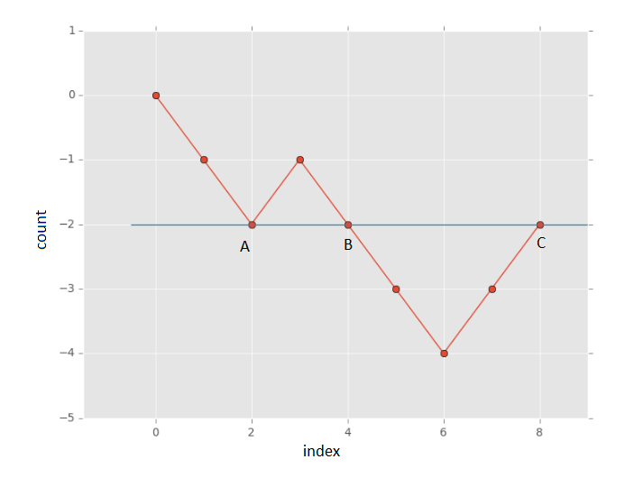
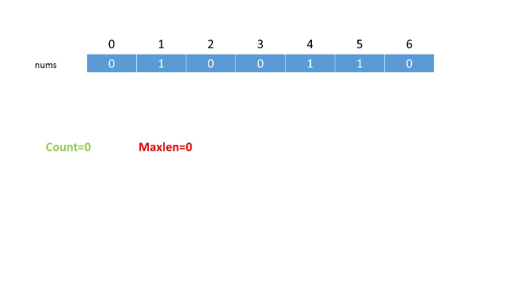
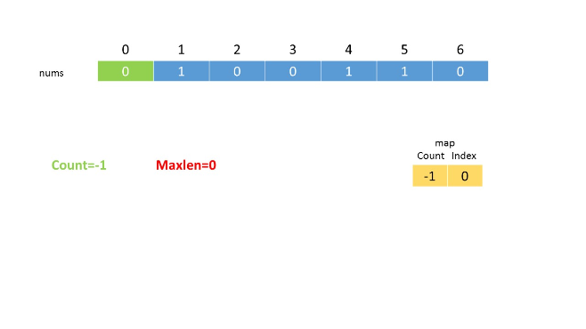
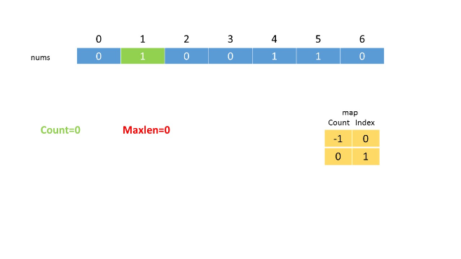
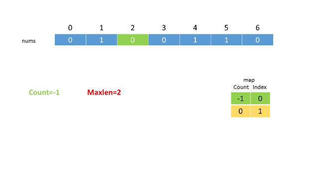
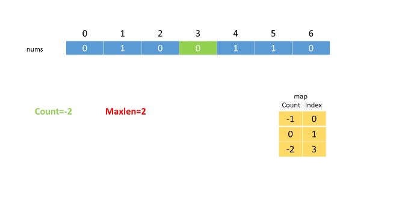
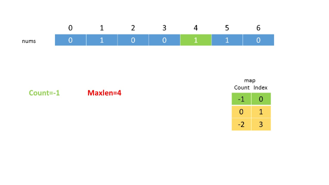

525. Contiguous Array

Given a binary array, find the maximum length of a contiguous subarray with equal number of 0 and 1.

**Example 1:**
```
Input: [0,1]
Output: 2
Explanation: [0, 1] is the longest contiguous subarray with equal number of 0 and 1.
```

**Example 2:**
```
Input: [0,1,0]
Output: 2
Explanation: [0, 1] (or [1, 0]) is a longest contiguous subarray with equal number of 0 and 1.
Note: The length of the given binary array will not exceed 50,000.
```

# Submissions
---
## Approach #1 Brute Force [Time Limit Exceeded]
**Algorithm**

The brute force approach is really simple. We consider every possible subarray within the given array and count the number of zeros and ones in each subarray. Then, we find out the maximum size subarray with equal no. of zeros and ones out of them.

```java
public class Solution {

    public int findMaxLength(int[] nums) {
        int maxlen = 0;
        for (int start = 0; start < nums.length; start++) {
            int zeroes = 0, ones = 0;
            for (int end = start; end < nums.length; end++) {
                if (nums[end] == 0) {
                    zeroes++;
                } else {
                    ones++;
                }
                if (zeroes == ones) {
                    maxlen = Math.max(maxlen, end - start + 1);
                }
            }
        }
        return maxlen;
    }
}
```

**Complexity Analysis**

* Time complexity : $O(n^2)$. We consider every possible subarray by traversing over the complete array for every start point possible.

* Space complexity : $O(1)$. Only two variables $zeroes$ and $ones$ are required.

## Approach #2 Using Extra Array [Accepted]
**Algorithm**

In this approach, we make use of a $count$ variable, which is used to store the relative number of ones and zeros encountered so far while traversing the array. The $count$ variable is incremented by one for every $\text{1}$ encountered and the same is decremented by one for every $\text{0}$ encountered.

We start traversing the array from the beginning. If at any moment, the $count$ becomes zero, it implies that we've encountered equal number of zeros and ones from the beginning till the current index of the array($i$). Not only this, another point to be noted is that if we encounter the same $count$ twice while traversing the array, it means that the number of zeros and ones are equal between the indices corresponding to the equal $count$ values. The following figure illustrates the observation for the sequence `[0 0 1 0 0 0 1 1]`:



In the above figure, the subarrays between `(A,B)`, `(B,C)` and `(A,C)` (lying between indices corresponing to $count = 2$ have equal number of zeros and ones.

Another point to be noted is that the largest subarray is the one between the points `(A, C)`. Thus, if we keep a track of the indices corresponding to the same $count$ values that lie farthest apart, we can determine the size of the largest subarray with equal no. of zeros and ones easily.

Now, the $count$ values can range between $\text{-n}$ to $\text{+n}$, with the extreme points corresponding to the complete array being filled with all 0's and all 1's respectively. Thus, we make use of an array arrarr(of size $\text{2n+1}$ to keep a track of the various $count$'s encountered so far. We make an entry containing the current element's index ($i$) in the $arr$ for a new $count$ encountered everytime. Whenever, we come across the same $count$ value later while traversing the array, we determine the length of the subarray lying between the indices corresponding to the same $count$ values.

```java
public class Solution {

    public int findMaxLength(int[] nums) {
        int[] arr = new int[2 * nums.length + 1];
        Arrays.fill(arr, -2);
        arr[nums.length] = -1;
        int maxlen = 0, count = 0;
        for (int i = 0; i < nums.length; i++) {
            count = count + (nums[i] == 0 ? -1 : 1);
            if (arr[count + nums.length] >= -1) {
                maxlen = Math.max(maxlen, i - arr[count + nums.length]);
            } else {
                arr[count + nums.length] = i;
            }

        }
        return maxlen;
    }
}
```

**Complexity Analysis**

* Time complexity : $O(n)$. The complete array is traversed only once.

* Space complexity : $O(n)$. $arr$ array of size $\text{2n+1}$ is used

## Approach #3 Using HashMap [Accepted]
**Algorithm**

This approach relies on the same premise as the previous approach. But, we need not use an array of size $\text{2n+1}$, since it isn't necessary that we'll encounter all the $count$ values possible. Thus, we make use of a HashMap $map$ to store the entries in the form of $(index, count)$. We make an entry for a $count$ in the $map$ whenever the $count$ is encountered first, and later on use the correspoding index to find the length of the largest subarray with equal no. of zeros and ones when the same $count$ is encountered again.

The following animation depicts the process:








```java
public class Solution {

    public int findMaxLength(int[] nums) {
        Map<Integer, Integer> map = new HashMap<>();
        map.put(0, -1);
        int maxlen = 0, count = 0;
        for (int i = 0; i < nums.length; i++) {
            count = count + (nums[i] == 1 ? 1 : -1);
            if (map.containsKey(count)) {
                maxlen = Math.max(maxlen, i - map.get(count));
            } else {
                map.put(count, i);
            }
        }
        return maxlen;
    }
}
```

**Complexity Analysis**
* Time complexity : $O(n)$. The entire array is traversed only once.

* Space complexity : $O(n)$. Maximum size of the HashMap $map$ will be $\text{n}$, if all the elements are either `1` or `0`.

# Submissions
---
**Solution 1: (Using HashMap)**
```
Runtime: 888 ms
Memory Usage: 17.2 MB
```
```python
class Solution:
    def findMaxLength(self, nums: List[int]) -> int:
        d = {0: -1}  # count of 1: index
        ans, count = 0, 0
        for i in range(len(nums)):
            count += 1 if nums[i] == 1 else -1
            if count in d:
                ans = max(ans, i - d[count])
            else:
                d[count] = i
        return ans
```

**Solution 2: (Using HashMap)**
```
Runtime: 254 ms
Memory Usage: 83.9 MB
```
```c++
class Solution {
public:
    int findMaxLength(vector<int>& nums) {
        int max_len = 0;
        unordered_map<int, int> sum_pos;
        sum_pos[0] = -1;
        for(int i = 0, sum = 0; i < nums.size(); ++i) {
            sum += 2*nums[i] - 1;
            if(auto it = sum_pos.find(sum); it != sum_pos.end())
                max_len = max(max_len, i - it->second);
            else
                sum_pos[sum] = i;
        }
        return max_len;
    }
};
```
