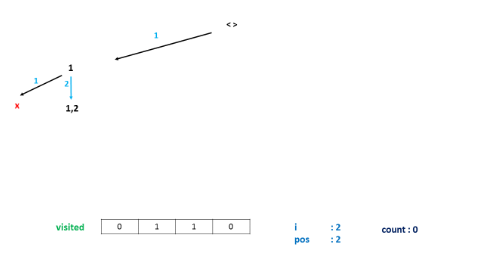
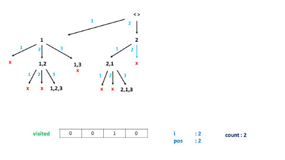

526. Beautiful Arrangement

Suppose you have **N** integers from 1 to N. We define a beautiful arrangement as an array that is constructed by these **N** numbers successfully if one of the following is true for the $i$th position (1 <= i <= N) in this array:

* The number at the $i$th position is divisible by `i`.
* `i` is divisible by the number at the $i$th position.
 

Now given `N`, how many beautiful arrangements can you construct?

**Example 1:**
```
Input: 2
Output: 2
Explanation: 

The first beautiful arrangement is [1, 2]:

Number at the 1st position (i=1) is 1, and 1 is divisible by i (i=1).

Number at the 2nd position (i=2) is 2, and 2 is divisible by i (i=2).

The second beautiful arrangement is [2, 1]:

Number at the 1st position (i=1) is 2, and 2 is divisible by i (i=1).

Number at the 2nd position (i=2) is 1, and i (i=2) is divisible by 1.
```

**Note:**

* **N** is a positive integer and will not exceed `15`.

# Solution
---
## Approach #1 Brute Force [Time Limit Exceeded]
**Algorithm**

In the brute force method, we can find out all the arrays that can be formed using the numbers from `1` to `N`(by creating every possible permutation of the given elements). Then, we iterate over all the elements of every permutation generated and check for the required conditions of divisibility.

In order to generate all the possible pairings, we make use of a function `permute(nums, current_index)`. This function creates all the possible permutations of the elements of the given array.

To do so, permute takes the index of the current element $current_index$ as one of the arguments. Then, it swaps the current element with every other element in the array, lying towards its right, so as to generate a new ordering of the array elements. After the swapping has been done, it makes another call to permute but this time with the index of the next element in the array. While returning back, we reverse the swapping done in the current function call.

Thus, when we reach the end of the array, a new ordering of the array's elements is generated. The following animation depicts the process of generating the permutations.


```java

public class Solution {
    int count = 0;
    public int countArrangement(int N) {
        int[] nums = new int[N];
        for (int i = 1; i <= N; i++)
            nums[i - 1] = i;
        permute(nums, 0);
        return count;
    }
    public void permute(int[] nums, int l) {
        if (l == nums.length - 1) {
            int i;
            for (i = 1; i <= nums.length; i++) {
                if (nums[i - 1] % i != 0 && i % nums[i - 1] != 0)
                    break;
            }
            if (i == nums.length + 1) {
                count++;
            }
        }
        for (int i = l; i < nums.length; i++) {
            swap(nums, i, l);
            permute(nums, l + 1);
            swap(nums, i, l);
        }
    }
    public void swap(int[] nums, int x, int y) {
        int temp = nums[x];
        nums[x] = nums[y];
        nums[y] = temp;
    }
}
```

**Complexity Analysis**

* Time complexity : $O(n!)$. A total of n!n! permutations will be generated for an array of length $n$.

* Space complexity : $O(n)$. The depth of the recursion tree can go upto $n$. numsnums array of size nn is used.

## Approach #2 Better Brute Force [Accepted]
**Algorithm**

In the brute force approach, we create the full array for every permutation and then check the array for the given divisibilty conditions. But this method can be optimized to a great extent. To do so, we can keep checking the elements while being added to the permutation array at every step for the divisibility condition and can stop creating it any further as soon as we find out the element just added to the permutation violates the divisiblity condition.

```java

public class Solution {
    int count = 0;
    public int countArrangement(int N) {
        int[] nums = new int[N];
        for (int i = 1; i <= N; i++)
            nums[i - 1] = i;
        permute(nums, 0);
        return count;
    }
    public void permute(int[] nums, int l) {
        if (l == nums.length) {
            count++;
        }
        for (int i = l; i < nums.length; i++) {
            swap(nums, i, l);
            if (nums[l] % (l + 1) == 0 || (l + 1) % nums[l] == 0)
                permute(nums, l + 1);
            swap(nums, i, l);
        }
    }
    public void swap(int[] nums, int x, int y) {
        int temp = nums[x];
        nums[x] = nums[y];
        nums[y] = temp;
    }
}
```

**Complexity Analysis**

* Time complexity : $O(k)$. $k$ refers to the number of valid permutations.

* Space complexity : $O(n)$. The depth of recursion tree can go upto $n$. Further, $nums$ array of size $n$ is used, where, $n$ is the given number.

## Approach #3 Backtracking [Accepted]
**Algorithm**

The idea behind this approach is simple. We try to create all the permutations of numbers from `1` to `N`. We can fix one number at a particular position and check for the divisibility criteria of that number at the particular position. But, we need to keep a track of the numbers which have already been considered earlier so that they aren't reconsidered while generating the permutations. If the current number doesn't satisfy the divisibility criteria, we can leave all the permutations that can be generated with that number at the particular position. This helps to prune the search space of the permutations to a great extent. We do so by trying to place each of the numbers at each position.

We make use of a `visited` array of size $N$. Here, $visited[i]$ refers to the $i^{th}$ number being already placed/not placed in the array being formed till now(`True` indicates that the number has already been placed).

We make use of a `calculate` function, which puts all the numbers pending numbers from `1` to `N`(i.e. not placed till now in the array), indicated by a $False$ at the corresponding $visited[i]$ position, and tries to create all the permutations with those numbers starting from the $pos$ index onwards in the current array. While putting the $pos^{th}$ number, we check whether the $i^{th}$ number satisfies the divisibility criteria on the go i.e. we continue forward with creating the permutations with the number $i$ at the $pos^{th}$ position only if the number $i$ and $pos$ satisfy the given criteria. Otherwise, we continue with putting the next numbers at the same position and keep on generating the permutations.

Look at the animation below for a better understanding of the methodology:








Below code is inspired by @shawngao

```java
public class Solution {
    int count = 0;
    public int countArrangement(int N) {
        boolean[] visited = new boolean[N + 1];
        calculate(N, 1, visited);
        return count;
    }
    public void calculate(int N, int pos, boolean[] visited) {
        if (pos > N)
            count++;
        for (int i = 1; i <= N; i++) {
            if (!visited[i] && (pos % i == 0 || i % pos == 0)) {
                visited[i] = true;
                calculate(N, pos + 1, visited);
                visited[i] = false;
            }
        }
    }
}
```

**Complexity Analysis**
* Time complexity : $O(k)$. kk refers to the number of valid permutations.

* Space complexity : $O(n)$. $visited$ array of size $n$ is used. The depth of recursion tree will also go upto $n$. Here, $n$ refers to the given integer $n$.

# Submissions
---
**Solution 1: (Backtracking)**
```
Runtime: 1392 ms
Memory Usage: 12.7 MB
```
```python
class Solution:
    def countArrangement(self, N: int) -> int:
        def calculate(pos):
            nonlocal count
            if pos > N:
                count += 1
            for i in range(1, N+1):
                if not visited[i] and (pos % i == 0 or i % pos == 0):
                    visited[i] = True
                    calculate(pos + 1)
                    visited[i] = False
        count = 0
        visited = [False] * (N+1)
        calculate(1)
        
        return count
```