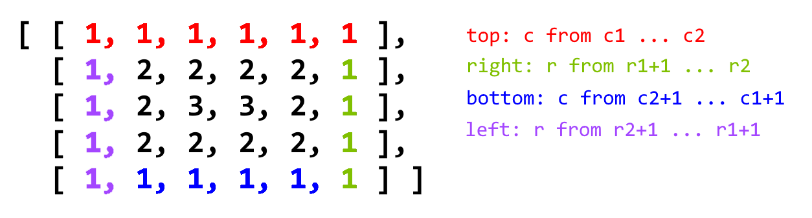

54. Spiral Matrix

Given a matrix of m x n elements (m rows, n columns), return all elements of the matrix in spiral order.

**Example 1:**
```
Input:
[
 [ 1, 2, 3 ],
 [ 4, 5, 6 ],
 [ 7, 8, 9 ]
]
Output: [1,2,3,6,9,8,7,4,5]
```

**Example 2:**
```
Input:
[
  [1, 2, 3, 4],
  [5, 6, 7, 8],
  [9,10,11,12]
]
Output: [1,2,3,4,8,12,11,10,9,5,6,7]
```

# Solution
---
## Approach 1: Simulation
**Intuition**

Draw the path that the spiral makes. We know that the path should turn clockwise whenever it would go out of bounds or into a cell that was previously visited.

**Algorithm**

Let the array have $\text{R}$ rows and $\text{C}$ columns. $\text{seen[r][c]}$ denotes that the cell on the $\text{r}$-th row and $\text{c}$-th column was previously visited. Our current position is $\text{(r, c)}$, facing direction $\text{di}$, and we want to visit $\text{R} x \text{C}$ total cells.

As we move through the matrix, our candidate next position is $\text{(cr, cc)}$. If the candidate is in the bounds of the matrix and unseen, then it becomes our next position; otherwise, our next position is the one after performing a clockwise turn.

```python
class Solution(object):
    def spiralOrder(self, matrix):
        if not matrix: return []
        R, C = len(matrix), len(matrix[0])
        seen = [[False] * C for _ in matrix]
        ans = []
        dr = [0, 1, 0, -1]
        dc = [1, 0, -1, 0]
        r = c = di = 0
        for _ in range(R * C):
            ans.append(matrix[r][c])
            seen[r][c] = True
            cr, cc = r + dr[di], c + dc[di]
            if 0 <= cr < R and 0 <= cc < C and not seen[cr][cc]:
                r, c = cr, cc
            else:
                di = (di + 1) % 4
                r, c = r + dr[di], c + dc[di]
        return ans
```

**Complexity Analysis**

* Time Complexity: $O(N)$, where $N$ is the total number of elements in the input matrix. We add every element in the matrix to our final answer.

* Space Complexity: $O(N)$, the information stored in `seen` and in `ans`.

## Approach 2: Layer-by-Layer
**Intuition**

The answer will be all the elements in clockwise order from the first-outer layer, followed by the elements from the second-outer layer, and so on.

**Algorithm**

We define the $\text{k}$-th outer layer of a matrix as all elements that have minimum distance to some border equal to $\text{k}$. For example, the following matrix has all elements in the first-outer layer equal to 1, all elements in the second-outer layer equal to 2, and all elements in the third-outer layer equal to 3.

```
[[1, 1, 1, 1, 1, 1, 1],
 [1, 2, 2, 2, 2, 2, 1],
 [1, 2, 3, 3, 3, 2, 1],
 [1, 2, 2, 2, 2, 2, 1],
 [1, 1, 1, 1, 1, 1, 1]]
```

For each outer layer, we want to iterate through its elements in clockwise order starting from the top left corner. Suppose the current outer layer has top-left coordinates $\text{(r1, c1)}$ and bottom-right coordinates $\text{(r2, c2)}$.

Then, the top row is the set of elements $\text{(r1, c)}$ for $\text{c = c1,...,c2}$, in that order. The rest of the right side is the set of elements $\text{(r, c2)}$ for $\text{r = r1+1,...,r2}$, in that order. Then, if there are four sides to this layer (ie., $\text{r1 < r2}$ and $\text{c1 < c2}$, we iterate through the bottom side and left side as shown in the solutions below.



```python
class Solution(object):
    def spiralOrder(self, matrix):
        def spiral_coords(r1, c1, r2, c2):
            for c in range(c1, c2 + 1):
                yield r1, c
            for r in range(r1 + 1, r2 + 1):
                yield r, c2
            if r1 < r2 and c1 < c2:
                for c in range(c2 - 1, c1, -1):
                    yield r2, c
                for r in range(r2, r1, -1):
                    yield r, c1

        if not matrix: return []
        ans = []
        r1, r2 = 0, len(matrix) - 1
        c1, c2 = 0, len(matrix[0]) - 1
        while r1 <= r2 and c1 <= c2:
            for r, c in spiral_coords(r1, c1, r2, c2):
                ans.append(matrix[r][c])
            r1 += 1; r2 -= 1
            c1 += 1; c2 -= 1
        return ans
```

**Complexity Analysis**

* Time Complexity: $O(N)$, where $N$ is the total number of elements in the input matrix. We add every element in the matrix to our final answer.

* Space Complexity: $O(N)$, the information stored in `ans`.

# Submissions
---
**Solution: (Simulation)**
```
Runtime: 32 ms
Memory Usage: 13.7 MB
```
```python
class Solution:
    def spiralOrder(self, matrix: List[List[int]]) -> List[int]:
        if not matrix: return []
        R, C = len(matrix), len(matrix[0])
        seen = [[False] * C for _ in matrix]
        ans = []
        dr = [0, 1, 0, -1]
        dc = [1, 0, -1, 0]
        r = c = di = 0
        for _ in range(R * C):
            ans.append(matrix[r][c])
            seen[r][c] = True
            cr, cc = r + dr[di], c + dc[di]
            if 0 <= cr < R and 0 <= cc < C and not seen[cr][cc]:
                r, c = cr, cc
            else:
                di = (di + 1) % 4
                r, c = r + dr[di], c + dc[di]
        return ans
```
