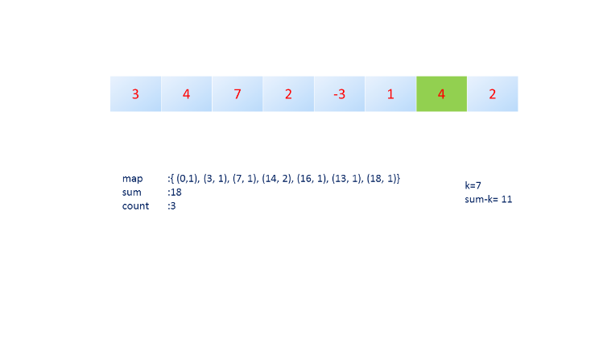

560. Subarray Sum Equals K

Given an array of integers and an integer **k**, you need to find the total number of continuous subarrays whose sum equals to **k**.

**Example 1:**
```
Input:nums = [1,1,1], k = 2
Output: 2
```

**Note:**
1. The length of the array is in range [1, 20,000].
1. The range of numbers in the array is [-1000, 1000] and the range of the integer **k** is [-1e7, 1e7].

**Solution 1:**
```
Runtime: 88 ms
Memory Usage: N/A
```
```python
class Solution:
    def subarraySum(self, nums, k):
        """
        :type nums: List[int]
        :type k: int
        :rtype: int
        """
        sums = dict()
        sums[0] = 1
        sm = 0
        res = 0
        for num in nums:
            sm += num
            if sm-k in sums:
                res += sums[sm-k]
                
            if sm in sums:
                sums[sm] += 1
            else:
                sums[sm] = 1
        return res 
```

**Solution 2:**
```
Runtime: 72 ms
Memory Usage: N/A
```
```python
class Solution:
    def subarraySum(self, nums, k):
        """
        :type nums: List[int]
        :type k: int
        :rtype: int
        """
        sum_cnt = collections.defaultdict(int)
        sum_cnt[0] = 1
        cur_sum = 0
        cnt = 0
        
        for i in range(len(nums)):
            cur_sum += nums[i]                        
            
            if cur_sum-k in sum_cnt:
                cnt += sum_cnt[cur_sum-k]
            
            sum_cnt[cur_sum] += 1    
        
        return cnt
```

# Solution
---
## Approach #1 Brute Force [Time Limit Exceeded]
**Algorithm**

The simplest method is to consider every possible subarray of the given numsnums array, find the sum of the elements of each of those subarrays and check for the equality of the sum obtained with the given kk. Whenver the sum equals $k$, we can increment the countcount used to store the required result.

```java
public class Solution {
    public int subarraySum(int[] nums, int k) {
        int count = 0;
        for (int start = 0; start < nums.length; start++) {
            for (int end = start + 1; end <= nums.length; end++) {
                int sum = 0;
                for (int i = start; i < end; i++)
                    sum += nums[i];
                if (sum == k)
                    count++;
            }
        }
        return count;
    }
}
```
**Complexity Analysis**

* Time complexity : $O(n^3)$. Considering every possible subarray takes $O(n^2)$ time. For each of the subarray we calculate the sum taking $O(n)$ time in the worst case, taking a total of $O(n^3)$ time.
* Space complexity : $O(1)$. Constant space is used.

## Approach #2 Using Cummulative sum [Accepted]
**Algorithm**

Instead of determining the sum of elements everytime for every new subarray considered, we can make use of a cumulative sum array , $sum$. Then, in order to calculate the sum of elements lying between two indices, we can subtract the cumulative sum corresponding to the two indices to obtain the sum directly, instead of iterating over the subarray to obtain the sum.

In this implementation, we make use of a cumulative sum array, $sum$, such that $sum[i]$ is used to store the cumulative sum of numsnums array upto the element corresponding to the $(i-1)^{th}$ index. Thus, to determine the sum of elements for the subarray $nums[i:j]$, we can directly use $sum[j+1] - sum[i]$.

```java
public class Solution {
    public int subarraySum(int[] nums, int k) {
        int count = 0;
        int[] sum = new int[nums.length + 1];
        sum[0] = 0;
        for (int i = 1; i <= nums.length; i++)
            sum[i] = sum[i - 1] + nums[i - 1];
        for (int start = 0; start < nums.length; start++) {
            for (int end = start + 1; end <= nums.length; end++) {
                if (sum[end] - sum[start] == k)
                    count++;
            }
        }
        return count;
    }
}
```

**Complexity Analysis**

* Time complexity : $O(n^2)$. Considering every possible subarray takes $O(n^2)$ time. Finding out the sum of any subarray takes $O(1)$ time after the initial processing of $O(n)$ for creating the cumulative sum array.

* Space complexity : $O(n)$. Cumulative sum array sumsum of size n+1n+1 is used.

## Approach #3 Without space [Accepted]
**Algorithm**

Instead of considering all the $start$ and $end$ points and then finding the sum for each subarray corresponding to those points, we can directly find the sum on the go while considering different $end$ points. i.e. We can choose a particular $start$ point and while iterating over the $end$ points, we can add the element corresponding to the $end$ point to the sum formed till now. Whenver the $sum$ equals the required $k$ value, we can update the $count$ value. We do so while iterating over all the $end$ indices possible for every $start$ index. Whenver, we update the $start$ index, we need to reset the $sum$ value to 0.

```java
public class Solution {
    public int subarraySum(int[] nums, int k) {
        int count = 0;
        for (int start = 0; start < nums.length; start++) {
            int sum = 0;
            for (int end = start; end < nums.length; end++) {
                sum+ = nums[end];
                if (sum == k)
                    count++;
            }
        }
        return count;
    }
}
```

***Complexity Analysis***
* Time complexity : $O(n^2)$. We need to consider every subarray possible.

* Space complexity : $O(1)$. Constant space is used.

## Approach #4 Using hashmap [Accepted]
**Algorithm**

The idea behind this approach is as follows: If the cumulative sum(repreesnted by $sum[i]$ for sum upto $i^{th}$ index) upto two indices is the same, the sum of the elements lying in between those indices is zero. Extending the same thought further, if the cumulative sum upto two indices, say $i$ and $j$ is at a difference of $k$ i.e. if $sum[i] − sum[j] = k$, the sum of elements lying between indices $i$ and $j$ is $k$.

Based on these thoughts, we make use of a hashmap $map$ which is used to store the cumulative sum upto all the indices possible along with the number of times the same sum occurs. We store the data in the form: $(sum_i, no. of occurences of sum_i)$. We traverse over the array $nums$ and keep on finding the cumulative sum. Every time we encounter a new sum, we make a new entry in the hashmap corresponding to that sum. If the same sum occurs again, we increment the count corresponding to that sum in the hashmap. Further, for every sum encountered, we also determine the number of times the sum $sum-k$ has occured already, since it will determine the number of times a subarray with sum $k$ has occured upto the current index. We increment the $count$ by the same amount.

After the complete array has been traversed, the $count$ gives the required result.

The animation below depicts the process.





```java
public class Solution {
    public int subarraySum(int[] nums, int k) {
        int count = 0, sum = 0;
        HashMap < Integer, Integer > map = new HashMap < > ();
        map.put(0, 1);
        for (int i = 0; i < nums.length; i++) {
            sum += nums[i];
            if (map.containsKey(sum - k))
                count += map.get(sum - k);
            map.put(sum, map.getOrDefault(sum, 0) + 1);
        }
        return count;
    }
}
```

**Complexity Analysis**
* Time complexity : $O(n)$. The entire numsnums array is traversed only once.

* Space complexity : $O(n)$. Hashmap mapmap can contain upto nn distinct entries in the worst case.

