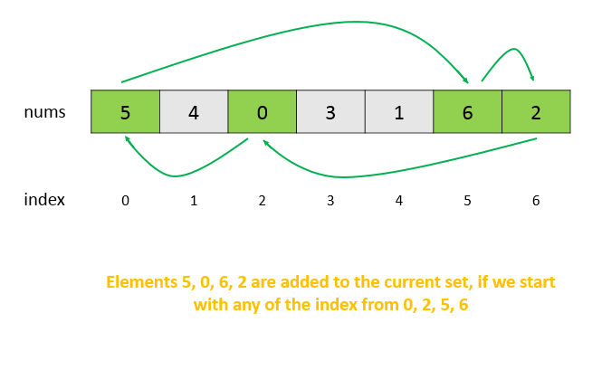

565. Array Nesting

A zero-indexed array A of length N contains all integers from 0 to N-1. Find and return the longest length of set S, where S[i] = {A[i], A[A[i]], A[A[A[i]]], ... } subjected to the rule below.

Suppose the first element in S starts with the selection of element A[i] of index = i, the next element in S should be A[A[i]], and then A[A[A[i]]]… By that analogy, we stop adding right before a duplicate element occurs in S.

 

**Example 1:**
```
Input: A = [5,4,0,3,1,6,2]
Output: 4
Explanation: 
A[0] = 5, A[1] = 4, A[2] = 0, A[3] = 3, A[4] = 1, A[5] = 6, A[6] = 2.

One of the longest S[K]:
S[0] = {A[0], A[5], A[6], A[2]} = {5, 6, 2, 0}
``` 

**Note:**

1. N is an integer within the range [1, 20,000].
1. The elements of A are all distinct.
1. Each element of A is an integer within the range [0, N-1].

# Solution
---

## Approach #1 Brute Force [Time Limit Exceeded]
The simplest method is to iterate over all the indices of the given $nums$ array. For every index $i$ chosen, we find the element $nums[i]$ and increment the $count$ for a new element added for the current index $i$. Since $nums[i]$ has to act as the new index for finding the next element belonging to the set corresponding to the index $i$, the new index is $j=nums[i]$.

We continue this process of index updation and keep on incrementing the $count$ for new elements added to the set corresponding to the index $i$. Now, since all the elements in $nums$ lie in the range $(0,..., N-1)$, the new indices generated will never lie outside the array size limits. But, we'll always reach a point where the current element becomes equal to the element $nums[i]$ with which we started the nestings in the first place. Thus, after this, the new indices generated will be just the repetitions of the previously generated ones, and thus would not lead to an increase in the size of the current set. Thus, this condition of the current number being equal to the starting number acts as the terminating condition for $count$ incrementation for a particular index.

We do the same process for every index chosen as the starting index. At the end, the maximum value of $count$ obtained gives the size of the largest set.

```java
public class Solution {
    public int arrayNesting(int[] nums) {
        int res = 0;
        for (int i = 0; i < nums.length; i++) {
            int start = nums[i], count = 0;
            do {
                start = nums[start];
                count++;
            }
            while (start != nums[i]);
            res = Math.max(res, count);

        }
        return res;
    }
}
```

**Complexity Analysis**

* Time complexity : $O(n^2)$. In worst case, for example- [1,2,3,4,5,0], loop body will be executed $n^2$ times.

* Space complexity : $O(1)$. Constant space is used.

## Approach #2 Using Visited Array [Accepted]
**Algorithm**

In the last approach, we observed that in the worst case, all the elements of the $nums$ array are added to the sets corresponding to all the starting indices. But, all these sets correspond to the same set of elements only, leading to redundant calculations.

We consider a simple example and see how this problem can be resolved. From the figure below, we can see that the elements in the current nesting shown by arrows form a cycle. Thus, the same elements will be added to the current set irrespective of the first element chosen to be added to the set out of these marked elements.



Thus, when we add an element $nums[j]$ to a set corresponding to any of the indices, we mark its position as visited in a $visited$ array. This is done so that whenever this index is chosen as the starting index in the future, we do not go for redundant $count$ calculations, since we've already considered the elements linked with this index, which will be added to a new(duplicate) set.

By doing so, we ensure that the duplicate sets aren't considered again and again.

Further, we can also observe that no two elements at indices $i$ and $j$ will lead to a jump to the same index $k$, since it would require $nums[i] = nums[j] = k$, which isn't possible since all the elements are distinct. Also, because of the same reasoning, no element outside any cycle could lead to an element inside the cycle. Because of this, the use of $visited$ array goes correctly.

```java
public class Solution {
    public int arrayNesting(int[] nums) {
        boolean[] visited = new boolean[nums.length];
        int res = 0;
        for (int i = 0; i < nums.length; i++) {
            if (!visited[i]) {
                int start = nums[i], count = 0;
                do {
                    start = nums[start];
                    count++;
                    visited[start] = true;
                }
                while (start != nums[i]);
                res = Math.max(res, count);
            }
        }
        return res;
    }
}
```

**Complexity Analysis**

* Time complexity : $O(n)$. Every element of the $nums$ array will be considered atmost once.

* Space complexity : $O(n)$. $visited$ array of size $n$ is used.

## Approach #3 Without Using Extra Space [Accepted]
**Algorithm**

In the last approach, the $visited$ array is used just to keep a track of the elements of the array which have already been visited. Instead of making use of a separate array to keep track of the same, we can mark the visited elements in the original array $nums$ itself. Since, the range of the elements can only be between 1 to 20,000, we can put a very large integer value $\text{Integer.MAX_VALUE}$ at the position which has been visited. The rest process of traversals remains the same as in the last approach.

```java

public class Solution {
    public int arrayNesting(int[] nums) {
        int res = 0;
        for (int i = 0; i < nums.length; i++) {
            if (nums[i] != Integer.MAX_VALUE) {
                int start = nums[i], count = 0;
                while (nums[start] != Integer.MAX_VALUE) {
                    int temp = start;
                    start = nums[start];
                    count++;
                    nums[temp] = Integer.MAX_VALUE;
                }
                res = Math.max(res, count);
            }
        }
        return res;
    }
}
```

**Complexity Analysis**

* Time complexity : $O(n)$. Every element of the $nums$ array will be considered atmost once.

* Space complexity : $O(1)$. Constant Space is used.

# Submissions
---
**Solution 1:**
```
Runtime: 156 ms
Memory Usage: 16.2 MB
```
```python
class Solution:
    def arrayNesting(self, nums: List[int]) -> int:
        ans = 0
        for i in range(len(nums)):
            if nums[i] != float('inf'):
                start = nums[i]
                count = 0
                while nums[start] != float('inf'):
                    tmp = start
                    start = nums[start]
                    count += 1
                    nums[tmp] = float('inf')
            ans = max(ans, count)
        return ans
```

**Solution 2:**
```
Runtime: 136 ms
Memory Usage: 16.5 MB
```
```python
class Solution:
    def arrayNesting(self, nums: List[int]) -> int:
        ans = 0
        visited = set()

        for i in nums:
            if i in visited:
                continue
            seen = set()
            while i not in seen:
                seen.add(i)
                visited.add(i)
                i = nums[i]
       	    ans = max(ans, len(seen))

        return ans
```