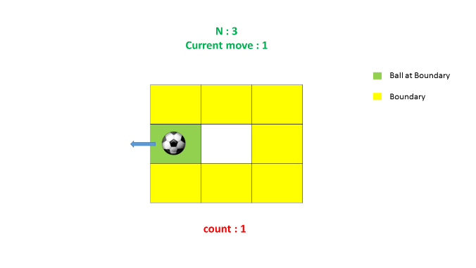
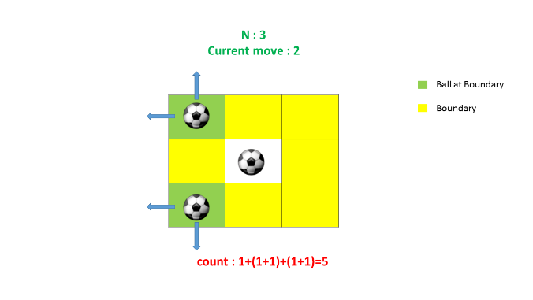
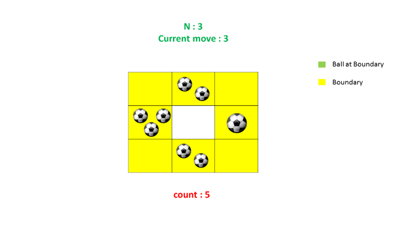
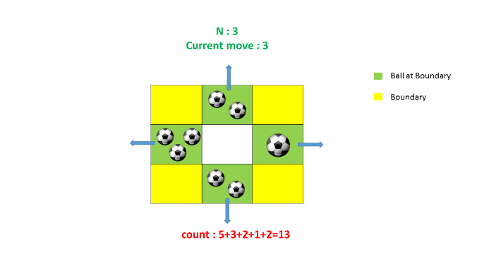

576. Out of Boundary Paths

There is an **m** by **n** grid with a ball. Given the start coordinate **(i,j)** of the ball, you can move the ball to **adjacent** cell or cross the grid boundary in four directions (up, down, left, right). However, you can **at most** move **N** times. Find out the number of paths to move the ball out of grid boundary. The answer may be very large, return it after mod 109 + 7.

 

**Example 1:**
```
Input: m = 2, n = 2, N = 2, i = 0, j = 0
Output: 6
Explanation:
```

**Example 2:**
```
Input: m = 1, n = 3, N = 3, i = 0, j = 1
Output: 12
Explanation:
```
 

**Note:**

1. Once you move the ball out of boundary, you cannot move it back.
1. The length and height of the grid is in range [1,50].
1. N is in range [0,50].


# Solution
---
## Approach #1 Brute Force [Time Limit Exceeded]
**Algorithm**

In the brute force approach, we try to take one step in every direction and decrement the number of pending moves for each step taken. Whenever we reach out of the boundary while taking the steps, we deduce that one extra path is available to take the ball out.

In order to implement the same, we make use of a recursive function `findPaths(m,n,N,i,j)` which takes the current number of moves($N$) along with the current position($i,j$) as some of the parameters and returns the number of moves possible to take the ball out with the current pending moves from the current position. Now, we take a step in every direction and update the corresponding indices involved along with the current number of pending moves.

Further, if we run out of moves at any moment, we return a 0 indicating that the current set of moves doesn't take the ball out of boundary.

```java

public class Solution {
    public int findPaths(int m, int n, int N, int i, int j) {
        if(i==m || j==n || i<0 ||j<0)
            return 1;
        if(N==0)
            return 0;
        return findPaths(m,n,N-1,i-1,j)+findPaths(m,n,N-1,i+1,j)+findPaths(m,n,N-1,i,j-1)+findPaths(m,n,N-1,i,j+1);
    }
}
```

**Complexity Analysis**

* Time complexity : $O(4^n)$. Size of recursion tree will be $4^n$. Here, $n$ refers to the number of moves allowed.

* Space complexity : $O(n)$. The depth of the recursion tree can go upto $n$.

## Approach #2 Recursion with memoization [Accepted]
**Algorithm**

In the brute force approach, while going through the various branches of the recursion tree, we could reach the same position with the same number of moves left.

Thus, a lot of redundant function calls are made with the same set of parameters leading to a useless increase in runtime. We can remove this redundancy by making use of a memoization array, $memo$. $memo[i][j][k]$ is used to store the number of possible moves leading to a path out of the boundary if the current position is given by the indices $(i, j)$ and number of moves left is $k$.

Thus, now if a function call with some parameters is repeated, the $memo$ array will already contain valid values corresponding to that function call resulting in pruning of the search space.

```java

public class Solution {
    int M=1000000007;
    public int findPaths(int m, int n, int N, int i, int j) {
        int[][][] memo=new int[m][n][N+1];
        for(int[][] l:memo)
            for(int[] sl:l)
                Arrays.fill(sl,-1);
        return findPaths(m,n,N,i,j,memo);
    }
    public int findPaths(int m, int n, int N, int i, int j,int[][][] memo) {
        if(i==m || j==n || i<0 ||j<0)
            return 1;
        if(N==0)
            return 0;
        if(memo[i][j][N]>=0)
            return memo[i][j][N];
        memo[i][j][N]=((findPaths(m,n,N-1,i-1,j,memo)+findPaths(m,n,N-1,i+1,j,memo))%M+(findPaths(m,n,N-1,i,j-1,memo)+findPaths(m,n,N-1,i,j+1,memo))%M)%M;
        return memo[i][j][N];
    }
}
```

**Complexity Analysis**

* Time complexity : $O(m*n*N)$. We need to fill the $memo$ array once with dimensions $m$x$n$x$N$. Here, $m$, $n$ refer to the number of rows and columns of the given grid respectively. $N$ refers to the total number of allowed moves.

* Space complexity : $O(m*n*N)$. $memo$ array of size m*n*Nm∗n∗N is used.

## Approach #3 Dynamic Programming [Accepted]
**Algorithm**

The idea behind this approach is that if we can reach some position in $x$ moves, we can reach all its adjacent positions in $x+1$ moves. Based on this idea, we make use of a 2-D $dp$ array to store the number of ways in which a particular position can be reached. $dp[i][j]$ refers to the number of ways the position corresponding to the indices $(i,j)$ can be reached given some particular number of moves.

Now, if the current $dp$ array stores the number of ways the various positions can be reached by making use of $x-1$ moves, in order to determine the number of ways the position $(i,j)$ can be reached by making use of $x$ moves, we need to update the corresponding $dp$ entry as $dp[i][j] = dp[i-1][j] + dp[i+1][j] + dp[i][j-1] + dp[i][j+1]$ taking care of boundary conditions. This happens because we can reach the index $(i,j)$ from any of the four adjacent positions and the total number of ways of reaching the index $(i,j)$ in $x$ moves is the sum of the ways of reaching the adjacent positions in $x-1$ moves.

But, if we alter the $dp$ array, now some of the entries will correspond to $x-1$ moves and the updated ones will correspond to $x$ moves. Thus, we need to find a way to tackle this issue. So, instead of updating the $dp$ array for the current($x$) moves, we make use of a temporary 2-D array $temp$ to store the updated results for $x$ moves, making use of the results obtained for $dp$ array corresponding to $x-1$ moves. After all the entries for all the positions have been considered for $x$ moves, we update the $dp$ array based on $temp$. Thus, $dp$ now contains the entries corresponding to $x$ moves.

Thus, we start off by considering zero move available for which we make an initial entry of $dp[x][y] = 1$($(x,y)$ is the initial position), since we can reach only this position in zero move. Then, we increase the number of moves to 1 and update all the $dp$ entries appropriately. We do so for all the moves possible from 1 to N.

In order to update $count$, which indicates the total number of possible moves which lead an out of boundary path, we need to perform the update only when we reach the boundary. We update the count as $count = count + dp[i][j]$, where $(i,j)$ corresponds to one of the boundaries. But, if $(i,j)$ is simultaneously a part of multiple boundaries, we need to add the $dp[i][j]$ factor multiple times(same as the number of boundaries to which $(i,j)$ belongs).

After we are done with all the $N$ moves, $count$ gives the required result.

The following animation illustrates the process:









```java
public class Solution {
    public int findPaths(int m, int n, int N, int x, int y) {
        int M = 1000000000 + 7;
        int dp[][] = new int[m][n];
        dp[x][y] = 1;
        int count = 0;
        for (int moves = 1; moves <= N; moves++) {
            int[][] temp = new int[m][n];
            for (int i = 0; i < m; i++) {
                for (int j = 0; j < n; j++) {
                    if (i == m - 1)
                        count = (count + dp[i][j]) % M;
                    if (j == n - 1)
                        count = (count + dp[i][j]) % M;
                    if (i == 0)
                        count = (count + dp[i][j]) % M;
                    if (j == 0)
                        count = (count + dp[i][j]) % M;
                    temp[i][j] = (((i > 0 ? dp[i - 1][j] : 0) + (i < m - 1 ? dp[i + 1][j] : 0)) % M + ((j > 0 ? dp[i][j - 1] : 0) + (j < n - 1 ? dp[i][j + 1] : 0)) % M) % M;
                }
            }
            dp = temp;
        }
        return count;
    }
}
```

**Complexity Analysis**
* Time complexity : $O(N*m*n)$. We need to fill the $dp$ array with dimensions array with dimensions $m$x$n$x$N$times. Heretimes.Here $m$x$n$ refers to the size of the grid and refers to the size of the grid and $N$ refers to the number of moves available.
* Space complexity: $O(m*n)$..$dp$ and $temp$ array of size array of size $m$x$n$ are used.

# Submissions
---
**Solution**
```
Runtime: 224 ms
Memory Usage: 13.8 MB
```
```python
class Solution:
    def findPaths(self, m: int, n: int, N: int, i: int, j: int) -> int:
        M = 1000000000 + 7;
        dp= [[0 for _ in range(n)] for _ in range(m)]
        dp[i][j] = 1
        count = 0
        for moves in range(1, N+1):
            temp = [[0 for _ in range(n)] for _ in range(m)]
            for i in range(m):
                for j in range(n):
                    if i == m-1:
                        count = (count + dp[i][j]) % M
                    if j == n-1:
                        count = (count + dp[i][j]) % M
                    if i == 0:
                        count = (count + dp[i][j]) % M
                    if j == 0:
                        count = (count + dp[i][j]) % M;
                    temp[i][j] = (((dp[i - 1][j] if i > 0 else 0) + (dp[i + 1][j] if i < m - 1 else 0)) % M + ((dp[i][j - 1] if j > 0 else 0) + (dp[i][j + 1] if j < n - 1 else 0)) % M) % M;
            dp = temp
        return count
```