583. Delete Operation for Two Strings

Given two words word1 and word2, find the minimum number of steps required to make word1 and word2 the same, where in each step you can delete one character in either string.

**Example 1:**
```
Input: "sea", "eat"
Output: 2
Explanation: You need one step to make "sea" to "ea" and another step to make "eat" to "ea".
```

**Note:**
* The length of given words won't exceed `500`.
* Characters in given words can only be lower-case letters.

# Solution
---
## Approach #1 Using Longest Common Subsequence [Time Limit Exceeded]
**Algorithm**

In order to determine the minimum number of delete operations needed, we can make use of the length of the longest common sequence among the two given strings $s1$ and $s2$, say given by $lcs$. If we can find this $lcs$ value, we can easily determine the required result as $m + n - 2*lcs$. Here, $m$ and $n$ refer to the length of the two given strings $s1$ and $s2$.

The above equation works because in case of complete mismatch(i.e. if the two strings can't be equalized at all), the total number of delete operations required will be $m + n$. Now, if there is a common sequence among the two strings of length $lcs$, we need to do $lcs$ lesser deletions in both the strings leading to a total of $2lcs$ lesser deletions, which then leads to the above equation.

In order to find the length of the longest common sequence, we make use of a recursive function `lcs(s1,s2,i,j)` which returns the length of the longest common sequence among the strings $s1$ and $s2$ considering their lengths upto $i$ and $j$ respectively. For evaluating the function, we check if the characters $s1[m-1]$ and $s2[n-1]$ for equality. If they match, we can consider the corresponding strings upto 1 lesser lengths since the last characters have already been considered and add 1 to the result to be returned for strings of 1 lesser lengths. Thus, we make the function call `lcs(s1, s2, i-1, j-1)`.

If the last characters don't match, we have two options, either we can consider the second last character of $s1$ and the last character of $s2$, or we can consider the second last character of $s2$ and the last character of $s1$. We need to consider the larger result obtained out of the two considerations for getting the required length.

Thus, the function call `lcs(s1,s2,m,n)` returns the required $lcs$ value.

```java

public class Solution {
    public int minDistance(String s1, String s2) {
        return s1.length() + s2.length() - 2 * lcs(s1, s2, s1.length(), s2.length());
    }
    public int lcs(String s1, String s2, int m, int n) {
        if (m == 0 || n == 0)
            return 0;
        if (s1.charAt(m - 1) == s2.charAt(n - 1))
            return 1 + lcs(s1, s2, m - 1, n - 1);
        else
            return Math.max(lcs(s1, s2, m, n - 1), lcs(s1, s2, m - 1, n));
    }
}
```

**Complexity Analysis**

* Time complexity : $O(2^{max(m,n)})$. Size of recursion tree will be $2^(m+n)$. Here, $m$ and $n$ refer to the lengths of $s1$ and $s2$ respectively.

* Space complexity : $O(\text{max}(m,n))$. The depth of the recursion tree will go upto $\text{max}(m,n)$.

## Approach #2 Longest Common Subsequence with Memoization [Accepted]
**Algorithm**

We can observe that in the last approach, while determining the $lcs$ value, a lot of redundant function calls are made, since the same $m$ and $n$ values to be used for the function calls could be obtained going through many different paths. We can remove this redundancy by making use of a $memo$ array to store the value to be returned for these function calls if they have been called once with the corresponding parameters. Thus, $memo[i][j]$ is used to store the result for the function call `lcs(s1,s2,i,j)`.

Thus, by returning the already stored values from the $memo$ array, we can prune the search space to a great extent.

```java

public class Solution {
    public int minDistance(String s1, String s2) {
        int[][] memo = new int[s1.length() + 1][s2.length() + 1];
        return s1.length() + s2.length() - 2 * lcs(s1, s2, s1.length(), s2.length(), memo);
    }
    public int lcs(String s1, String s2, int m, int n, int[][] memo) {
        if (m == 0 || n == 0)
            return 0;
        if (memo[m][n] > 0)
            return memo[m][n];
        if (s1.charAt(m - 1) == s2.charAt(n - 1))
            memo[m][n] = 1 + lcs(s1, s2, m - 1, n - 1, memo);
        else
            memo[m][n] = Math.max(lcs(s1, s2, m, n - 1, memo), lcs(s1, s2, m - 1, n, memo));
        return memo[m][n];
    }
}
```

**Complexity Analysis**

* Time complexity : $O(m*n)$. $memo$ array of size $m$x$n$ needs to be filled once. Here, $m$ and $n$ refer to the length of the strings $s1$ and $s2$ respectively.

* Space complexity : $O(m*n)$. $memo$ array of size $m$x$n$ is used. Also, The depth of the recursion tree will go upto $\text{max}(m,n)$.

## Approach #3 Using Longest Common Subsequence- Dynamic Programming [Accepted]
**Algorithm**

Another method to obtain the value of $lcs$ is to make use of Dynamic Programming. We'll look at the implemenation and carry-on alongside the idea behind it.

We make use of a 2-D $dp$, in which $dp[i][j]$ represents the length of the longest common subsequence among the strings $s1$ and $s2$ considering their lengths upto $(i-1)^{th}$ index and $(j-1)^{th}$ index only respectively. We fill the $dp$ array in row-by-row order.

In order to fill the entry for $dp[i][j]$, we can have two cases:

1. The characters $s1[i-1]$ and $s2[j-1]$ match with each other. In this case, the entry for $dp[i][j]$ will be one more than the entry obtained for the strings considering their lengths upto one lesser index, since the matched character adds one to the length of LCS formed till the current indices. Thus, the $dp[i][j]$ entry is updated as $dp[i][j] = 1 + dp[i-1][j-1]$. Note that $dp[i-1][j-1]$ has been used because the matched character belongs to both $s1$ and $s2$.

1. The characters $s1[i-1]$ and $s2[j-1]$ don't match with each other. In this case, we can't increment the current entry as compared to entries corresponding to the previous indices, but we need to replicate the previous entry again to indicate that the length of LCS upto the current indices also remains the same. But, which entry to pick up? Now, since the current character hasn't matched, we have got two options. We can remove the current character from consideration from either $s1$ or $s2$ and use the corresponding $dp$ entries given by $dp[i-1][j]$ and $dp[i][j-1]$ respectively. Since we are considering the length of LCS upto the current indices we need to pick up the larger entry out of these two to update the current $dp$ entry.

At the end, again, we obtain the number of deletions required as $m + n - 2*dp[m][n]$, where $m$ and $n$ refer to the lengths of $s1$ and $s2$. $dp[m][n]$ now refers to the length of LCS among the two given strings.

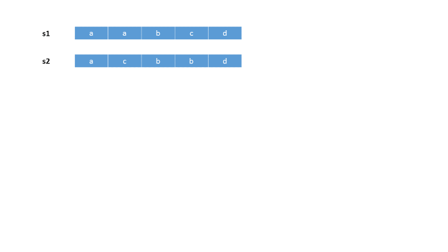
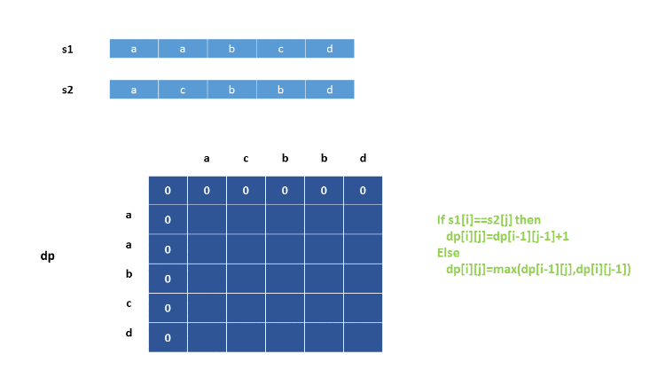
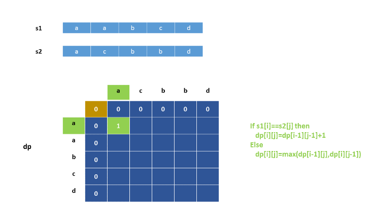
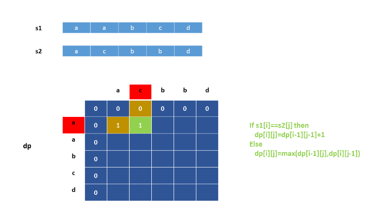


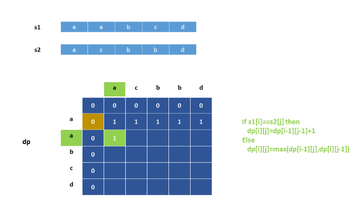
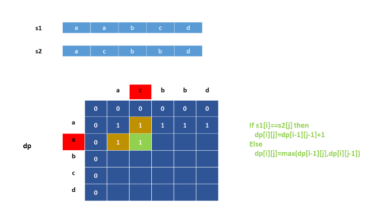


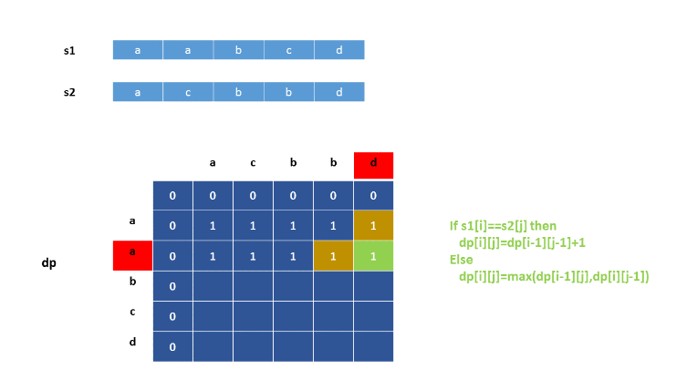
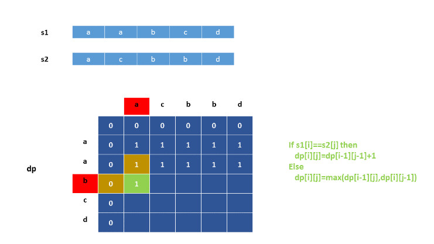

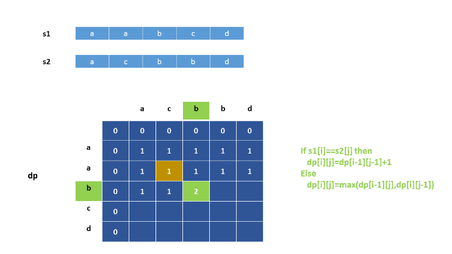
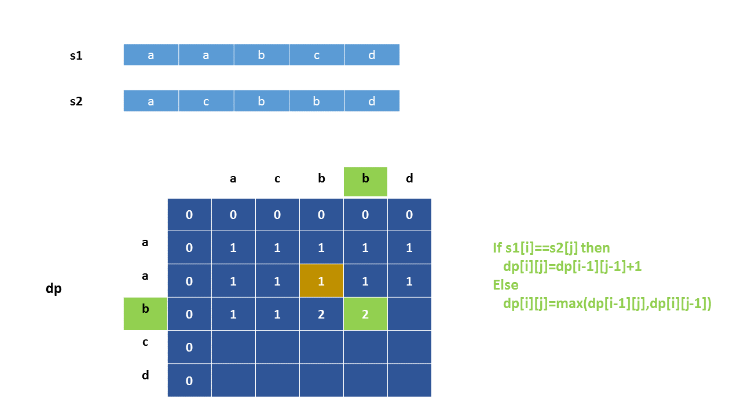
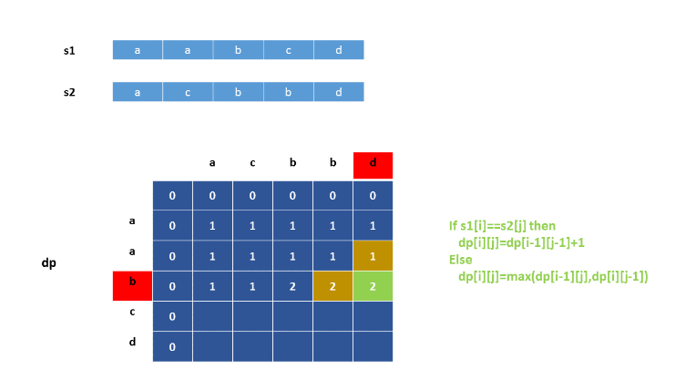
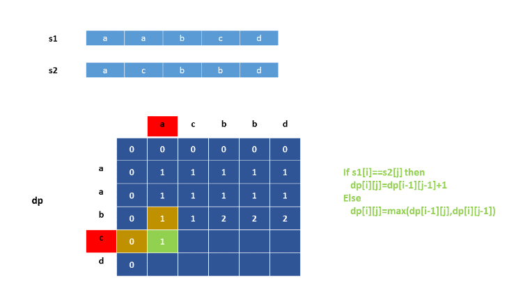
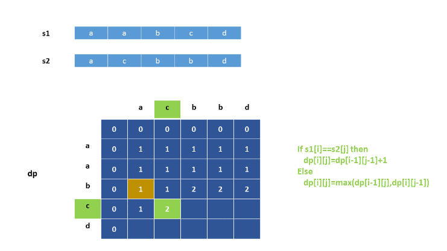
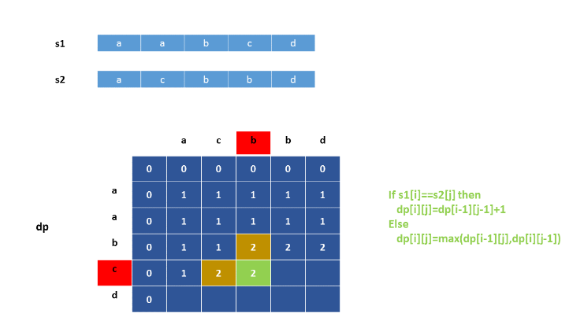
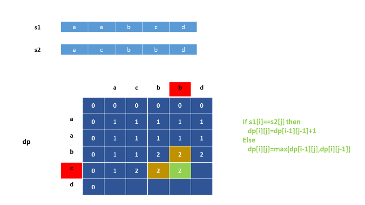


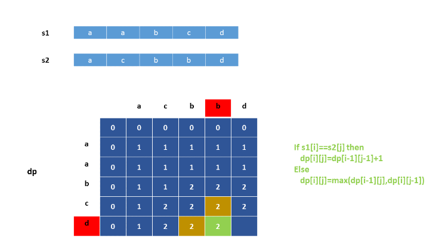
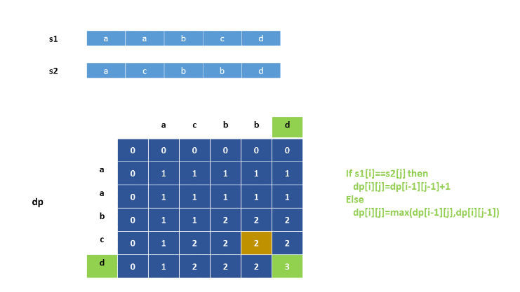
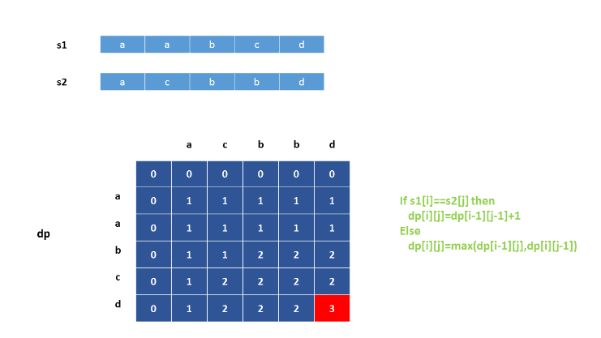

```java
public class Solution {
    public int minDistance(String s1, String s2) {
        int[][] dp = new int[s1.length() + 1][s2.length() + 1];
        for (int i = 0; i <= s1.length(); i++) {
            for (int j = 0; j <= s2.length(); j++) {
                if (i == 0 || j == 0)
                    continue;
                if (s1.charAt(i - 1) == s2.charAt(j - 1))
                    dp[i][j] = 1 + dp[i - 1][j - 1];
                else
                    dp[i][j] = Math.max(dp[i - 1][j], dp[i][j - 1]);
            }
        }
        return s1.length() + s2.length() - 2 * dp[s1.length()][s2.length()];
    }
}
```

**Complexity Analysis**

* Time complexity : $O(m*n)$. We need to fill in the $dp$ array of size $m$x$n$. Here, $m$ and $n$ refer to the lengths of $s1$ and $s2$.

* Space complexity : $O(m*n)$. $dp$ array of size $m$x$n$ is used.


## Approach #4 Without using LCS Dynamic Programmming [Accepted]:
**Algorithm**

Instead of finding the length of LCS and then determining the number of deletions required, we can make use of Dynamic Programming to directly determine the number of deletions required till the current indices of the strings.

In order to do so, we make use of a 2-D $dp$ array. Now, $dp[i][j]$ refers to the number of deletions required to equalize the two strings if we consider the strings' length upto $(i-1)^{th}$ index and $(j-1)^{th}$ index for $s1$ and $s2$ respectively. Again, we fill in the $dp$ array in a row-by-row order. Now, in order to fill the entry for $dp[i][j]$, we need to consider two cases only:

1. The characters $s1[i-1]$ and $s2[j-1]$ match with each other. In this case, we need to replicate the entry corresponding to $dp[i-1][j-1]$ itself. This is because, the matched character doesn't need to be deleted from any of the strings.

1. The characters $s1[i-1]$ and $s2[j-1]$ don't match with each other. In this case, we need to delete either the current character of $s1$ or $s2$. Thus, an increment of 1 needs to be done relative to the entries corresponding to the previous indices. The two options available at this moment are $dp[i-1][j]$ and $dp[i][j-1]$. Since, we are keeping track of the minimum number of deletions required, we pick up the minimum out of these two values.

At the end, $dp[m][n]$ gives the required minimum number of deletions. Here, $m$ and $n$ refer to the lengths of $s1$ and $s2$.


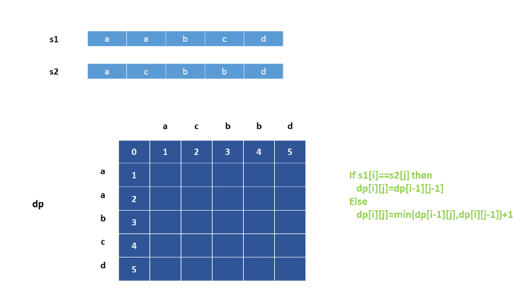
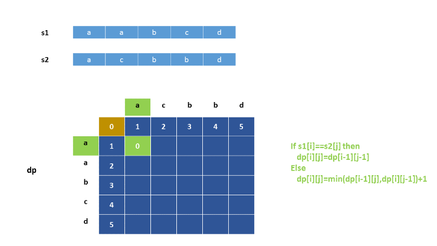

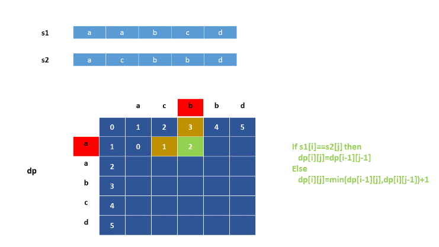
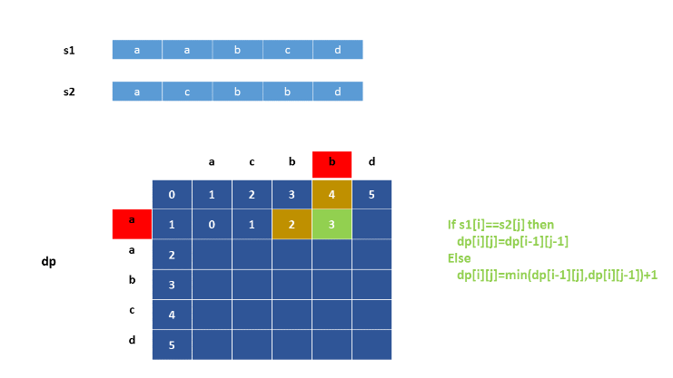
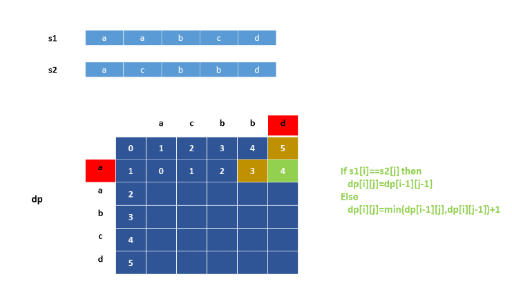


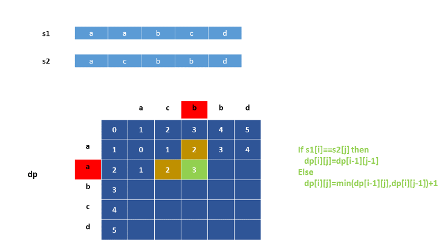
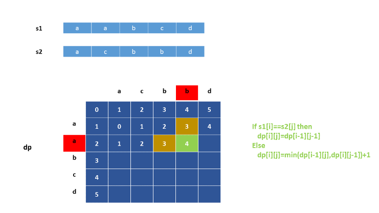

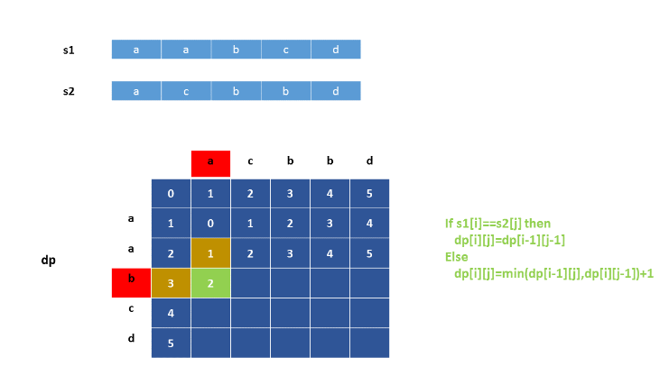
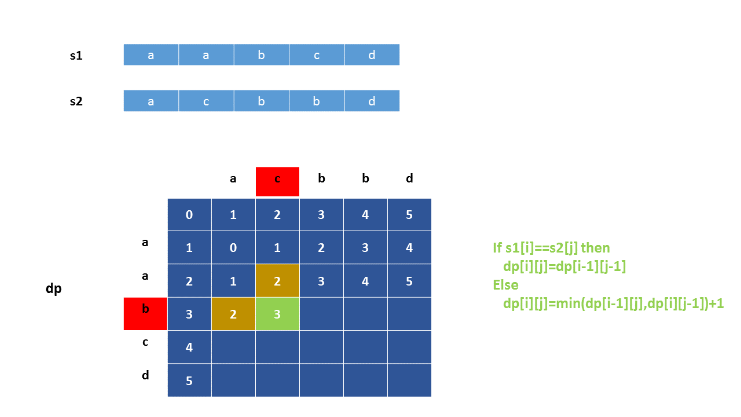


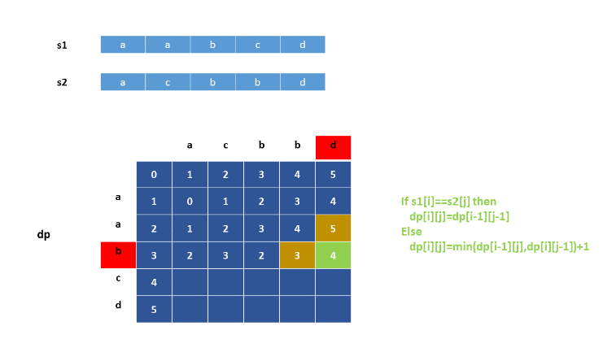


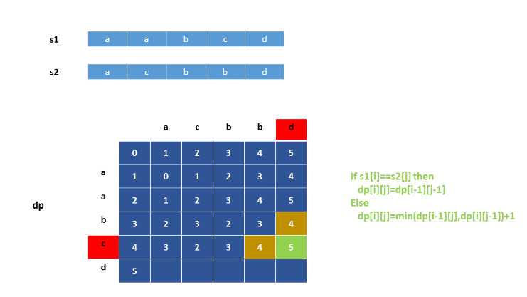
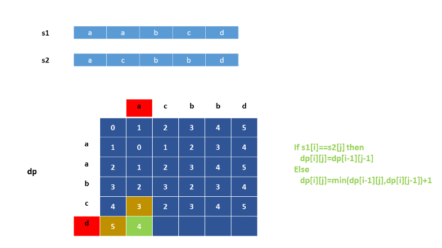
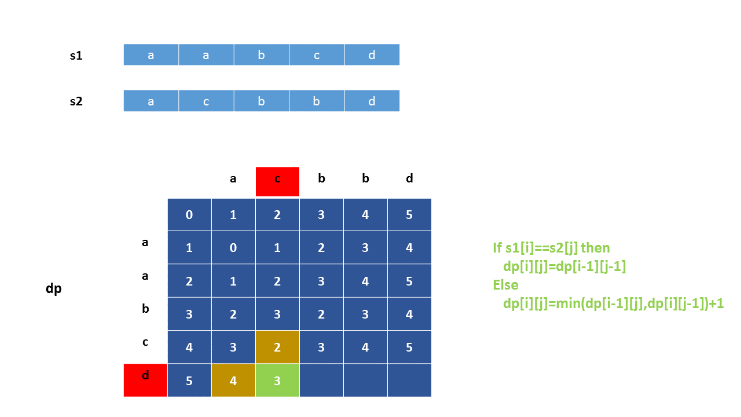
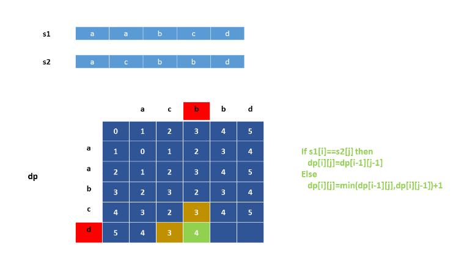


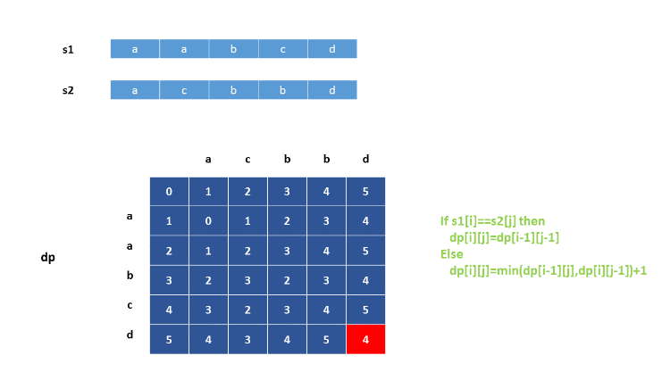

```java
public class Solution {
    public int minDistance(String s1, String s2) {
        int[][] dp = new int[s1.length() + 1][s2.length() + 1];
        for (int i = 0; i <= s1.length(); i++) {
            for (int j = 0; j <= s2.length(); j++) {
                if (i == 0 || j == 0)
                    dp[i][j] = i + j;
                else if (s1.charAt(i - 1) == s2.charAt(j - 1))
                    dp[i][j] = dp[i - 1][j - 1];
                else
                    dp[i][j] = 1 + Math.min(dp[i - 1][j], dp[i][j - 1]);
            }
        }
        return dp[s1.length()][s2.length()];
    }
}
```

**Complexity Analysis**

* Time complexity : $O(m*n)$. We need to fill in the $dp$ array of size $m$x$n$. Here, $m$ and $n$ refer to the lengths of $s1$ and $s2$.

* Space complexity : $O(m*n)$. $dp$ array of size $m$x$n$ is used.

## Approach #5 1-D Dynamic Programming [Accepted]:
**Algorithm**

We can observe that in the last approach, in order to update the current $dp$ entries, we need only the values of the previous row of $dp$. Thus, rather than using a 2-D array, we can do the same job by making use of a 1-D $dp$ array.

Thus, now, $dp[i]$ refers to the number of deletions that need to be made in order to equalize the strings $s1$ and $s2$ if we consider string $s1$ upto the $(i-1)^{th}$ index and string $s2$ upto the last to current index of $s2$.

Now, we make the updations for the current row in an array $temp$ of the same size as $dp$, and use the $dp$ entries as if they correspond to the previous row's entries. When, the whole $temp$ array has been filled, we copy it the $dp$ array so that $dp$ array now reflects the new row's entries.

```java
public class Solution {
    public int minDistance(String s1, String s2) {
        int[] dp = new int[s2.length() + 1];
        for (int i = 0; i <= s1.length(); i++) {
            int[] temp=new int[s2.length()+1];
            for (int j = 0; j <= s2.length(); j++) {
                if (i == 0 || j == 0)
                    temp[j] = i + j;
                else if (s1.charAt(i - 1) == s2.charAt(j - 1))
                    temp[j] = dp[j - 1];
                else
                    temp[j] = 1 + Math.min(dp[j], temp[j - 1]);
            }
            dp=temp;
        }
        return dp[s2.length()];
    }
}
```

**Complexity Analysis**

* Time complexity : $O(m*n)$. We need to fill in the $dp$ array of size $n$, $m$ times. Here, $m$ and $n$ refer to the lengths of $s1$ and $s2$.

* Space complexity : $O(n)$. $dp$ array of size $n$ is used.

# Submissions
---
**Solution 1:**
```
Runtime: 260 ms
Memory Usage: 29.8 MB
```
```python
import functools
class Solution:
    def minDistance(self, word1: str, word2: str) -> int:
        M = len(word1)
        N = len(word2)
        
        @functools.lru_cache(None)
        def lcs(m, n):
            if m == 0 or n == 0:
                return 0
            if word1[m-1] == word2[n-1]:
                return 1 + lcs(m-1, n-1)
            else:
                return max(lcs(m-1, n), lcs(m, n-1))
        
        return M + N - 2*lcs(M, N)
```