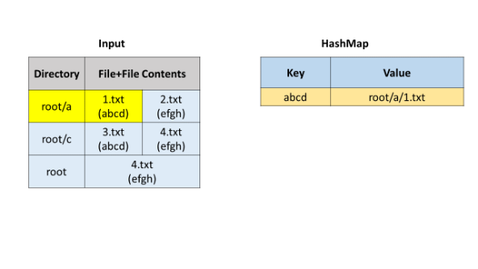
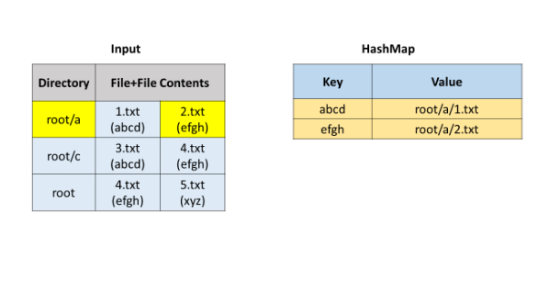
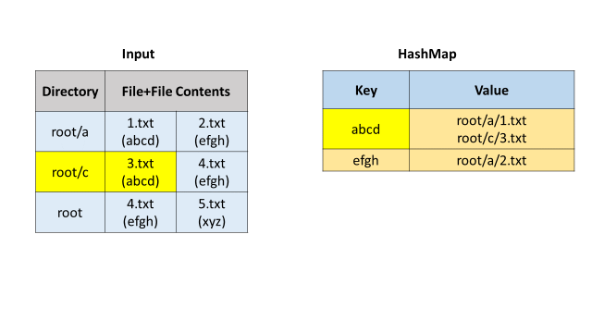
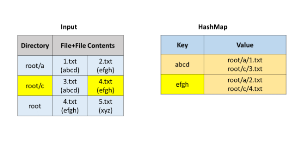
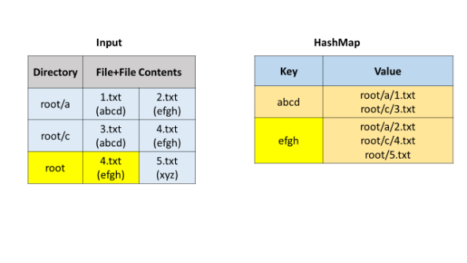
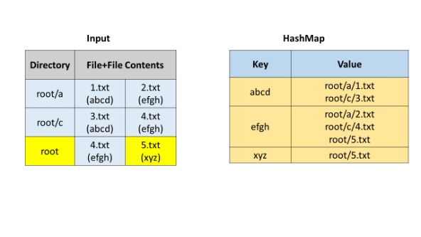
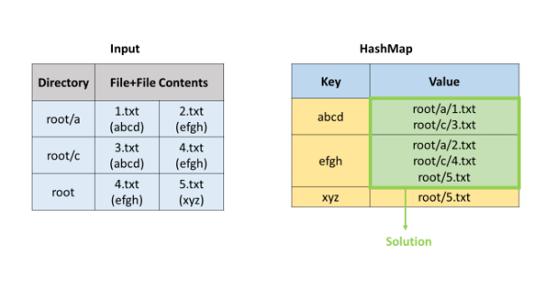

609. Find Duplicate File in System

Given a list of directory info including directory path, and all the files with contents in this directory, you need to find out all the groups of duplicate files in the file system in terms of their paths.

A group of duplicate files consists of at least **two** files that have exactly the same content.

A single directory info string in the **input** list has the following format:

`"root/d1/d2/.../dm f1.txt(f1_content) f2.txt(f2_content) ... fn.txt(fn_content)"`

It means there are **n** files (`f1.txt`, `f2.txt` ... `fn.txt` with content `f1_content`, `f2_content` ... `fn_content`, respectively) in directory `root/d1/d2/.../dm`. Note that `n >= 1` and `m >= 0`. If `m = 0`, it means the directory is just the root directory.

The **output** is a list of group of duplicate file paths. For each group, it contains all the file paths of the files that have the same content. A file path is a string that has the following format:

`"directory_path/file_name.txt"`

**Example 1:**
```
Input:
["root/a 1.txt(abcd) 2.txt(efgh)", "root/c 3.txt(abcd)", "root/c/d 4.txt(efgh)", "root 4.txt(efgh)"]
Output:  
[["root/a/2.txt","root/c/d/4.txt","root/4.txt"],["root/a/1.txt","root/c/3.txt"]]
```

**Note:**

1. No order is required for the final output.
1. You may assume the directory name, file name and file content only has letters and digits, and the length of file content is in the range of `[1,50]`.
1. The number of files given is in the range of `[1,20000]`.
1. You may assume no files or directories share the same name in the same directory.
1. You may assume each given directory info represents a unique directory. Directory path and file info are separated by a single blank space.
 

**Follow-up beyond contest:**

1. Imagine you are given a real file system, how will you search files? DFS or BFS?
1. If the file content is very large (GB level), how will you modify your solution?
1. If you can only read the file by 1kb each time, how will you modify your solution?
1. What is the time complexity of your modified solution? What is the most time-consuming part and memory consuming part of it? How to optimize?
1. How to make sure the duplicated files you find are not false positive?

# Solution
---
## Approach #1 Brute Force [Time Limit Exceeded]
**Algorithm**

For the brute force solution, firstly we obtain the directory paths, the filenames and file contents separately by appropriately splitting the elements of the $paths$ list. While doing so, we keep on creating a $list$ which contains the full path of every file along with the contents of the file. The $list$ contains data in the form $[ [file_1\_full\_path, file_1\_contents], [file_2\_full\_path, file_2\_contents]..., [file_n\_full\_path, file_n\_contents] ]$.

Once this is done, we iterate over this $list$. For every element $i$ chosen from the list, we iterate over the whole $list$ to find another element $j$ whose file contents are the same as the $i^{th}$ element. For every such element found, we put the $j^{th}$ element's file path in a temporary list $l$ and we also mark the $j^{th}$ element as visited so that this element isn't considered again in the future. Thus, when we reach the end of the array for every $i^{th}$ element, we obtain a list of file paths in $l$, which have the same contents as the file corresponding to the $i^{th}$ element. If this list isn't empty, it indicates that there exists content duplicate to the $i^{th}$ element. Thus, we also need to put the $i^{th}$ element's file path in the $l$.

At the end of each iteration, we put this list $l$ obtained in the resultant list $res$ and reset the list $l$ for finding the duplicates of the next element.

```java
public class Solution {
    public List < List < String >> findDuplicate(String[] paths) {
        List < String[] > list = new ArrayList < > ();
        for (String path: paths) {
            String[] values = path.split(" ");
            for (int i = 1; i < values.length; i++) {
                String[] name_cont = values[i].split("\\(");
                name_cont[1] = name_cont[1].replace(")", "");
                list.add(new String[] {
                    values[0] + "/" + name_cont[0], name_cont[1]
                });
            }
        }
        boolean[] visited = new boolean[list.size()];
        List < List < String >> res = new ArrayList < > ();
        for (int i = 0; i < list.size() - 1; i++) {
            if (visited[i])
                continue;
            List < String > l = new ArrayList < > ();
            for (int j = i + 1; j < list.size(); j++) {
                if (list.get(i)[1].equals(list.get(j)[1])) {
                    l.add(list.get(j)[0]);
                    visited[j] = true;
                }
            }
            if (l.size() > 0) {
                l.add(list.get(i)[0]);
                res.add(l);
            }
        }
        return res;
    }
}
```

**Complexity Analysis**

* Time complexity : $O(n*x + f^2*s)$. Creation of $list$ will take $O(n*x)$, where `n` is the number of directories and `x` is the average string length. Every file is compared with every other file. Let $f$ files are there with average size of $s$, then files comparision will take $O(f^2*s)$, equals can take $O(s)$. Here, Worst case will be when all files are unique.

* Space complexity : $O(n*x)$. Size of lists $res$ and $list$ can grow upto $n*x$.

## Approach #2 Using HashMap [Accepted

In this approach, firstly we obtain the directory paths, the file names and their contents separately by appropriately splitting each string in the given $paths$ list. In order to find the files with duplicate contents, we make use of a HashMap $map$, which stores the data in the form $(contents, list\_of\_file\_paths\_with\_this\_content)$. Thus, for every file's contents, we check if the same content already exist in the hashmap. If so, we add the current file's path to the list of files corresponding to the current contents. Otherwise, we create a new entry in the $map$, with the current contents as the key and the value being a list with only one entry(the current file's path).

At the end, we find out the contents corresponding to which at least two file paths exist. We obtain the resultant list $res$, which is a list of lists containing these file paths corresponding to the same contents.

The following animation illustrates the process for a clearer understanding.










```java
public class Solution {
    public List < List < String >> findDuplicate(String[] paths) {
        HashMap < String, List < String >> map = new HashMap < > ();
        for (String path: paths) {
            String[] values = path.split(" ");
            for (int i = 1; i < values.length; i++) {
                String[] name_cont = values[i].split("\\(");
                name_cont[1] = name_cont[1].replace(")", "");
                List < String > list = map.getOrDefault(name_cont[1], new ArrayList < String > ());
                list.add(values[0] + "/" + name_cont[0]);
                map.put(name_cont[1], list);
            }
        }
        List < List < String >> res = new ArrayList < > ();
        for (String key: map.keySet()) {
            if (map.get(key).size() > 1)
                res.add(map.get(key));
        }
        return res;
    }
}
```

**Complexity Analysis**

* Time complexity : $O(n*x)$. $n$ strings of average length $x$ is parsed.

* Space complexity : $O(n*x)$. $map$ and $res$ size grows upto $n*x$.

# Submissions
---
**Solution 1: (Using HashMap)**
```
Runtime: 96 ms
Memory Usage: 22.5 MB
```
```python
class Solution:
    def findDuplicate(self, paths: List[str]) -> List[List[str]]:
        d = collections.defaultdict(list)
        for path in paths:
            values = path.split(' ')
            for i in range(1, len(values)):
                name_cont = values[i].split('(')
                name_cont[1] = name_cont[1].replace(')', '')
                d[name_cont[1]].append(values[0] + '/' + name_cont[0])
        res = []
        for k in d.keys():
            if len(d[k]) > 1:
                res.append(d[k])
        return res
```