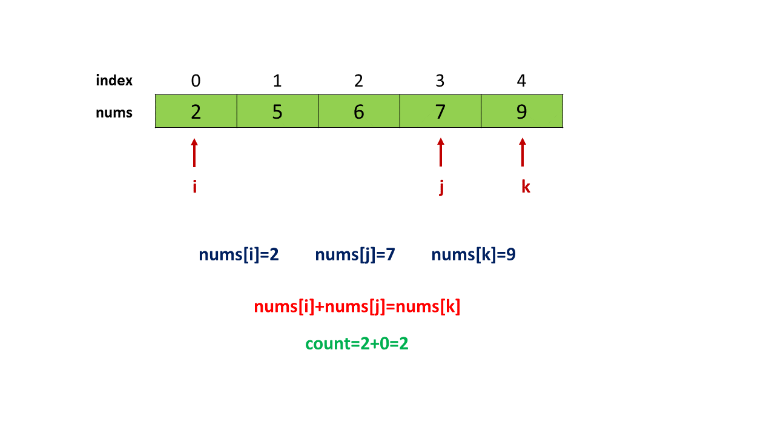
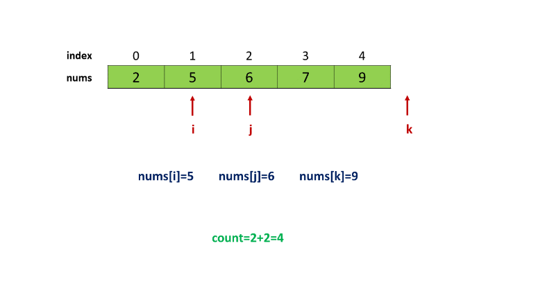

611. Valid Triangle Number

Given an array consists of non-negative integers, your task is to count the number of triplets chosen from the array that can make triangles if we take them as side lengths of a triangle.

**Example 1:**
```
Input: [2,2,3,4]
Output: 3
Explanation:
Valid combinations are: 
2,3,4 (using the first 2)
2,3,4 (using the second 2)
2,2,3
```
**Note:**
1. The length of the given array won't exceed 1000.
1. The integers in the given array are in the range of [0, 1000].

# Solution
---
## Approach 1: Brute Force
The condition for the triplets $(a, b, c)$ representing the lengths of the sides of a triangle, to form a valid triangle, is that the sum of any two sides should always be greater than the third side alone. i.e. $a + b > c$, $b + c > a$, $a + c > b$.

The simplest method to check this is to consider every possible triplet in the given $nums$ array and checking if the triplet satisfies the three inequalities mentioned above. Thus, we can keep a track of the $count$ of the number of triplets satisfying these inequalities. When all the triplets have been considered, the $count$ gives the required result.

```java
public class Solution {
    public int triangleNumber(int[] nums) {
        int count = 0;
        for (int i = 0; i < nums.length - 2; i++) {
            for (int j = i + 1; j < nums.length - 1; j++) {
                for (int k = j + 1; k < nums.length; k++) {
                    if (nums[i] + nums[j] > nums[k] && nums[i] + nums[k] > nums[j] && nums[j] + nums[k] > nums[i])
                        count++;
                }
            }
        } I
        return count;
    }
}
```

**Complexity Analysis**

* Time complexity : $O(n^3)$. Three nested loops are there to check every triplet.

* Space complexity : $O(1)$. Constant space is used.

## Approach 2: Using Binary Search
**Algorithm**

If we sort the given $nums$ array once, we can solve the given problem in a better way. This is because, if we consider a triplet $(a, b, c)$ such that a ≤ b ≤ c, we need not check all the three inequalities for checking the validity of the triangle formed by them. But, only one condition $a + b > c$ would suffice. This happens because c ≥ b and c ≥ a. Thus, adding any number to $c$ will always produce a sum which is greater than either $a$ or $b$ considered alone. Thus, the inequalities $c + a > b$ and $c + b > a$ are satisfied implicitly by virtue of the property $a < b < c$.

From this, we get the idea that we can sort the given $nums$ array. Then, for every pair $(nums[i], nums[j])$ considered starting from the beginning of the array, such that $j > i$(leading to nums[j] ≥ nums[i]), we can find out the count of elements $nums[k]$($k > j$), which satisfy the inequality $nums[k] > nums[i] + nums[j]$. We can do so for every pair $(i, j)$ considered and get the required result.

We can also observe that, since we've sorted the $nums$ array, as we traverse towards the right for choosing the index $k$(for number $nums[k]$), the value of $nums[k]$ could increase or remain the same(doesn't decrease relative to the previous value). Thus, there will exist a right limit on the value of index $k$, such that the elements satisfy $nums[k] > nums[i] + nums[j]$. Any elements beyond this value of $k$ won't satisfy this inequality as well, which is obvious.

Thus, if we are able to find this right limit value of $k$(indicating the element just greater than $nums[i] + nums[j]$), we can conclude that all the elements in $nums$ array in the range $(j+1, k-1)$(both included) satisfy the required inequality. Thus, the $count$ of elements satisfying the inequality will be given by $(k-1) - (j+1) + 1 = k - j - 1$.

Since the $nums$ array has been sorted now, we can make use of Binary Search to find this right limit of $k$. The following animation shows how Binary Search can be used to find the right limit for a simple example.


Another point to be observed is that once we find a right limit index $k_{(i,j)}$ for a particular pair $(i, j)$ chosen, when we choose a higher value of $j$ for the same value of $i$, we need not start searching for the right limit $k_{(i,j+1)}$ from the index $j+2$. Instead, we can start off from the index $k_{(i,j)}$ directly where we left off for the last $j$ chosen.

This holds correct because when we choose a higher value of $j$(higher or equal $nums[j]$ than the previous one), all the $nums[k]$, such that $k < k_{(i,j)}$ will obviously satisfy $nums[i] + nums[j] > nums[k]$ for the new value of $j$ chosen.

By taking advantage of this observation, we can limit the range of Binary Search for $k$ to shorter values for increasing values of $j$ considered while choosing the pairs $(i, j)$.

```java
public class Solution {
    int binarySearch(int nums[], int l, int r, int x) {
        while (r >= l && r < nums.length) {
            int mid = (l + r) / 2;
            if (nums[mid] >= x)
                r = mid - 1;
            else
                l = mid + 1;
        }
        return l;
    }
    public int triangleNumber(int[] nums) {
        int count = 0;
        Arrays.sort(nums);
        for (int i = 0; i < nums.length - 2; i++) {
            int k = i + 2;
            for (int j = i + 1; j < nums.length - 1 && nums[i] != 0; j++) {
                k = binarySearch(nums, k, nums.length - 1, nums[i] + nums[j]);
                count += k - j - 1;
            }
        }
        return count;
    }
}
```

**Complexity Analysis**

* Time complexity : $O(n^2 \log n)$. In worst case inner loop will take $n\log n$ (binary search applied $n$ times).

* Space complexity : $O(\log n)$. Sorting takes $O(\log n)$ space.


## Approach 3: Linear Scan
**Algorithm**

As discussed in the last approach, once we sort the given $nums$ array, we need to find the right limit of the index $k$ for a pair of indices $(i, j)$ chosen to find the $count$ of elements satisfying $nums[i] + nums[j] > nums[k]$ for the triplet $(nums[i], nums[j], nums[k])$ to form a valid triangle.

We can find this right limit by simply traversing the index $k$'s values starting from the index $k=j+1$ for a pair $(i, j)$ chosen and stopping at the first value of $k$ not satisfying the above inequality. Again, the $count$ of elements $nums[k]$ satisfying $nums[i] + nums[j] > nums[k]$ for the pair of indices $(i, j)$ chosen is given by $k - j - 1$ as discussed in the last approach.

Further, as discussed in the last approach, when we choose a higher value of index $j$ for a particular $i$ chosen, we need not start from the index $j + 1$. Instead, we can start off directly from the value of $k$ where we left for the last index $j$. This helps to save redundant computations.

The following animation depicts the process:








```java
public class Solution {
    public int triangleNumber(int[] nums) {
        int count = 0;
        Arrays.sort(nums);
        for (int i = 0; i < nums.length - 2; i++) {
            int k = i + 2;
            for (int j = i + 1; j < nums.length - 1 && nums[i] != 0; j++) {
                while (k < nums.length && nums[i] + nums[j] > nums[k])
                    k++;
                count += k - j - 1;
            }
        }
        return count;
    }
}
```

**Complexity Analysis**

* Time complexity : $O(n^2)$. Loop of $k$ and $j$ will be executed $O(n^2)$ times in total, because, we do not reinitialize the value of $k$ for a new value of $j$ chosen(for the same $i$). Thus the complexity will be $O(n^2+n^2)=O(n^2)$.

* Space complexity : $O(\log n)$. Sorting takes $O(\log n)$ space.

# Submissions
---

**Solution**
```
Runtime: 524 ms
Memory Usage: 13.8 MB
```
```python
class Solution:
    def triangleNumber(self, nums: List[int]) -> int:
        count = 0
        nums.sort()
        for i in range(len(nums)-2):
            k = i + 2
            if nums[i] != 0:
                for j in range(i+1, len(nums)- 1):
                    while (k < len(nums)) and (nums[i]+nums[j] > nums[k]):
                        k += 1
                    count += k - j - 1
        return count
```
