623. Add One Row to Tree

Given the root of a binary tree, then value `v` and depth `d`, you need to add a row of nodes with value `v` at the given depth `d`. The root node is at depth 1.

The adding rule is: given a positive integer depth `d`, for each NOT null tree nodes `N` in depth `d-1`, create two tree nodes with value `v` as `N`'s left subtree root and right subtree root. And `N`'s **original left subtree** should be the left subtree of the new left subtree root, its **original right subtree** should be the right subtree of the new right subtree root. If depth `d` is 1 that means there is no depth d-1 at all, then create a tree node with value **v** as the new root of the whole original tree, and the original tree is the new root's left subtree.

**Example 1:**
```
Input: 
A binary tree as following:
       4
     /   \
    2     6
   / \   / 
  3   1 5   

v = 1

d = 2

Output: 
       4
      / \
     1   1
    /     \
   2       6
  / \     / 
 3   1   5   
```

**Example 2:**
```
Input: 
A binary tree as following:
      4
     /   
    2    
   / \   
  3   1    

v = 1

d = 3

Output: 
      4
     /   
    2
   / \    
  1   1
 /     \  
3       1
```

**Note:**

* The given `d` is in range `[1, maximum depth of the given tree + 1]`.

* The given binary tree has at least one tree node.

# Solution
---
## Approach #1 Using Recursion(DFS) [Accepted]
If the given depth $d$ happens to be equal to 1, we can directly put the whole current tree as a left child of the newly added node. Otherwise, we need to put the new node at appropriate levels.

To do so, we make use of a recursive function `insert(val,node,depth,n)`. Here, $val$ refers to the value of the new node to be inserted, $depth$ refers to the depth of the node currently considered, $node$ refers to the node calling the current function for its child subtrees and $n$ refers to the height at which the new node needs to be inserted.

For inserting the new node at appropriate level, we can start by making a call to `insert` with the root node and `1` as the current level. Inside every such call, we check if we've reached one level prior to the level where the new node needs to be inserted.

From this level, we can store the roots of the left and right subtrees of the current node temporarily, and insert the new node as the new left and right subchild of the current node, with the temporarily stored left and right subtrees as the left and right subtrees of the newly inserted left or right subchildren appropriately.

But, if we haven't reached the destined level, we keep on continuing the recursive calling process with the left and right children of the current node respectively. At every such call, we also incrmenet the depth of the current level to reflect the depth change appropriately.

The animation below illustrates the process:

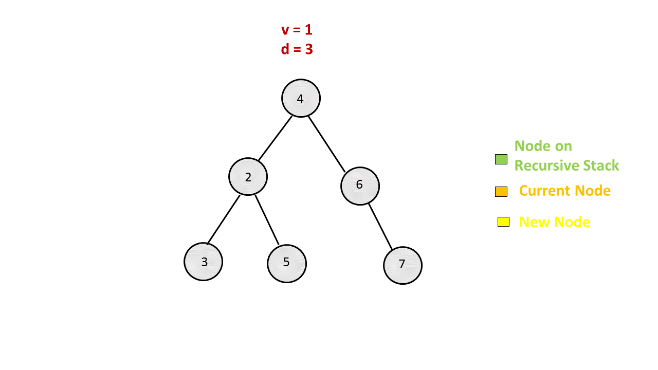
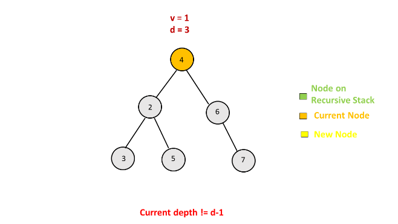
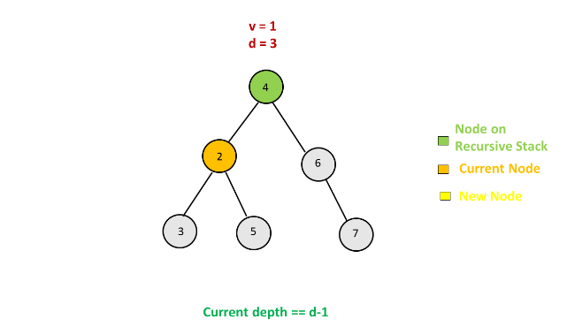
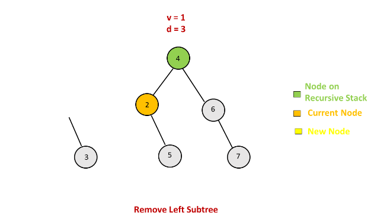
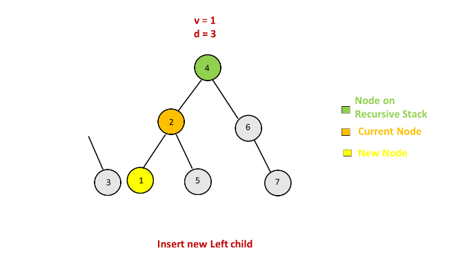
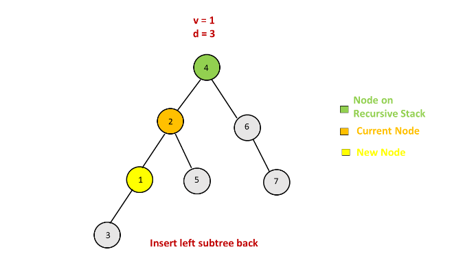
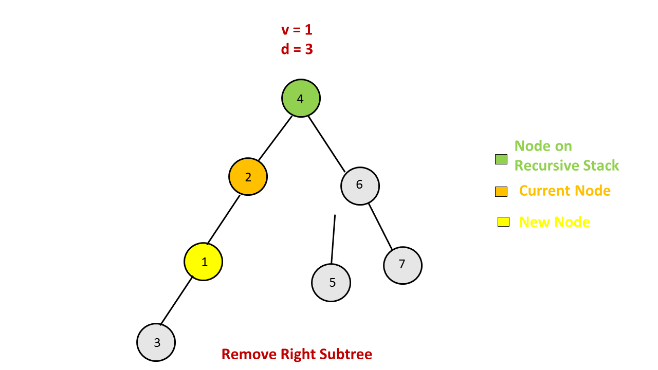
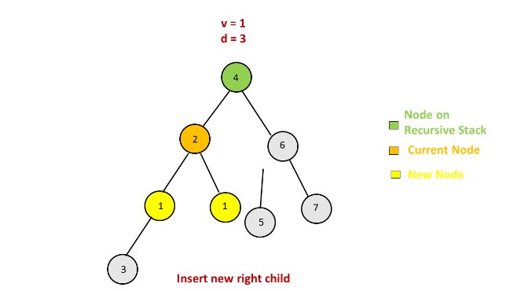
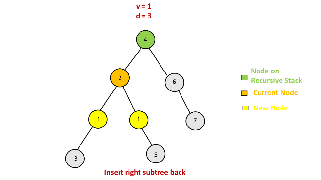
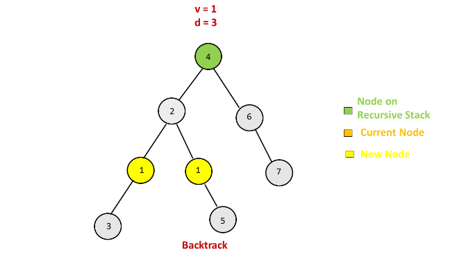
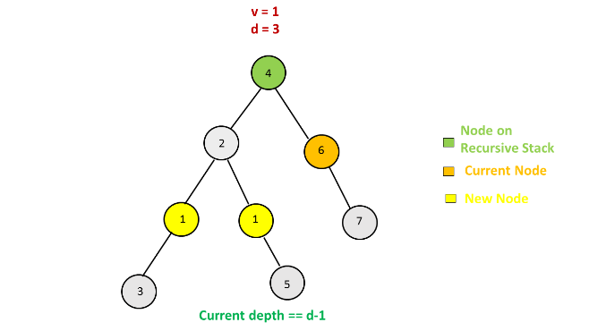
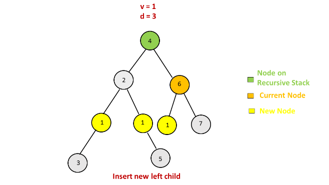
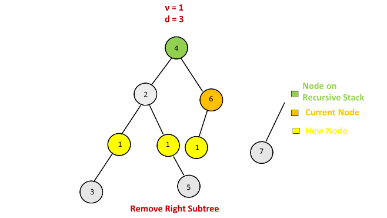
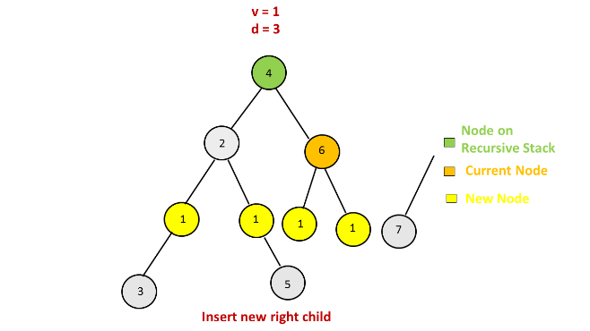
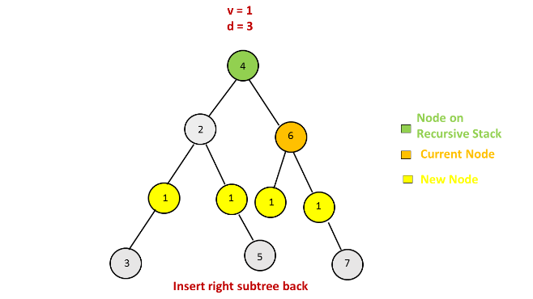
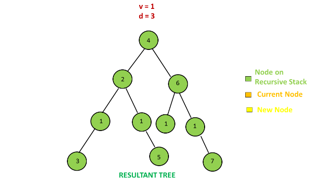

```java
/**
 * Definition for a binary tree node.
 * public class TreeNode {
 *     int val;
 *     TreeNode left;
 *     TreeNode right;
 *     TreeNode(int x) { val = x; }
 * }
 */
public class Solution {
    public TreeNode addOneRow(TreeNode t, int v, int d) {
        if (d == 1) {
            TreeNode n = new TreeNode(v);
            n.left = t;
            return n;
        }
        insert(v, t, 1, d);
        return t;
    }

    public void insert(int val, TreeNode node, int depth, int n) {
        if (node == null)
            return;
        if (depth == n - 1) {
            TreeNode t = node.left;
            node.left = new TreeNode(val);
            node.left.left = t;
            t = node.right;
            node.right = new TreeNode(val);
            node.right.right = t;
        } else {
            insert(val, node.left, depth + 1, n);
            insert(val, node.right, depth + 1, n);
        }
    }
}
```

**Complexity Analysis**

* Time complexity : $O(n)$. A total of $n$ nodes of the given tree will be considered.

* Space complexity : $O(n)$. The depth of the recursion tree can go upto $n$ in the worst case(skewed tree).

## Approach #2 Using stack(DFS) [Accepted]
**Algorithm**

We can do the same task as discussed in the last approach by making use of a $stack$ as well. But, we need to make use of a new data structure, $Node$ here, to keep a track of the depth of the current node along with its value.

* We start by pushing the root $Node$ onto the $stack$. Then, at every step we do as follows:

* Pop an element from the $stack$.

* For every Node popped, check if its depth corresponds to one prior to the depth at which the new node needs to be inserted.

* If yes, insert the new nodes appropriately as in the last approach.

* If no, we push both the left and the right child Node(value+depth) of the current node onto the $stack$.

Continue the popping and pushing process till the $stack$ becomes empty.

Look at the animation below for a better understanding.

```java
/**
 * Definition for a binary tree node.
 * public class TreeNode {
 *     int val;
 *     TreeNode left;
 *     TreeNode right;
 *     TreeNode(int x) { val = x; }
 * }
 */
public class Solution {
    class Node{
        Node(TreeNode n,int d){
            node=n;
            depth=d;
        }
        TreeNode node;
        int depth;
    }
    public TreeNode addOneRow(TreeNode t, int v, int d) {
        if (d == 1) {
            TreeNode n = new TreeNode(v);
            n.left = t;
            return n;
        } 
        Stack<Node> stack=new Stack<>();
        stack.push(new Node(t,1));
        while(!stack.isEmpty())
        {
            Node n=stack.pop();
            if(n.node==null)
                continue;
            if (n.depth == d - 1 ) {
                TreeNode temp = n.node.left;
                n.node.left = new TreeNode(v);
                n.node.left.left = temp;
                temp = n.node.right;
                n.node.right = new TreeNode(v);
                n.node.right.right = temp;
                
            } else{
                stack.push(new Node(n.node.left, n.depth + 1));
                stack.push(new Node(n.node.right, n.depth + 1));
            }
        }
        return t;
    }
}
```

**Complexity Analysis**

* Time complexity : $O(n)$. A total of $n$ nodes of the given tree will be considered.

* Space complexity : $O(n)$. The depth of the $stack$ can go upto $n$ in the worst case(skewed tree).

## Approach #3 Using queue(BFS) [Accepted]
**Algorithm**

The idea of traversal in the last approach is similar to Depth First Search. In that case, we need to traverse through all the nodes of the given tree in the order of branches. Firstly we explored one branch to as much depth as possible and then continued with the other ones.

If, instead, we go for Breadth First Search, along with keeping track of the depth of the nodes being considered at any moment during the Breadth First Search, we can stop the search process as soon as all the nodes at the depth d - 1d−1 have been considered once.

To implement this BFS, we make use of a $queue$. We start off by pushing the root node of the given tree at the back of the $queue$ and with the depth of the current level set as 1. Then, at every step, we do the following:

* Remove an element from the front of the $queue$ and add all its children to the back of another temporary queue, $temp$.

* Keep on adding the elements to the back of the $temp$ till $queue$ becomes empty. (Once $queue$ becomes empty, it indicates that all the nodes at the current level have been considered and now $temp$ contains all the nodes lying at the next level).

* Reinitialize $queue$ with its value as $temp$. Update the current value of the $depth$ to reflect the level of nodes currently being considered.

* Repeat the process till we reach the depth d - 1d−1.

* On hitting this depth level(d-1d−1), add the new nodes appropriately to all the nodes in the $queue$ currently, as done in the previous approaches.

The following animation illustrates the process.

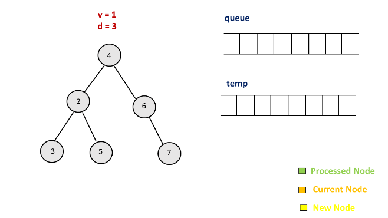
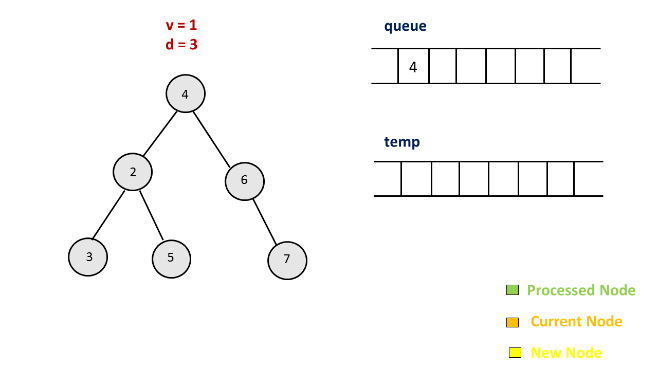
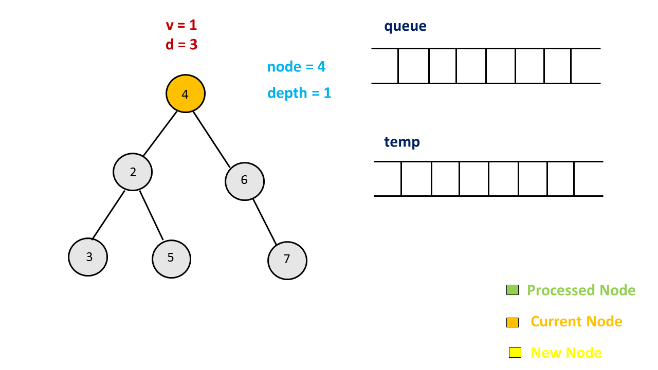
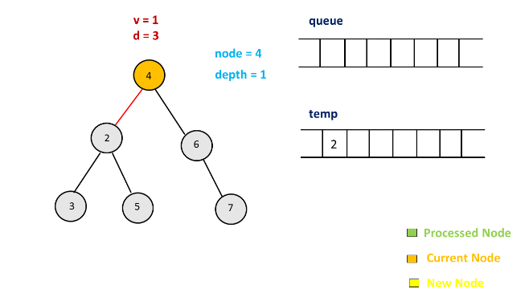
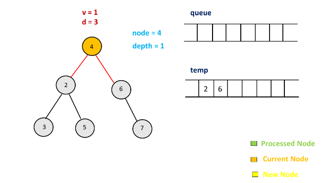
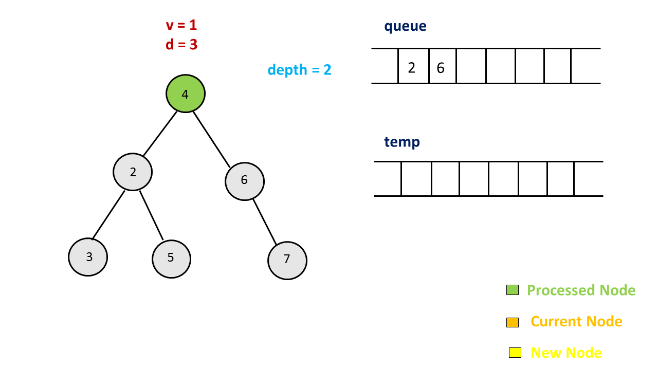
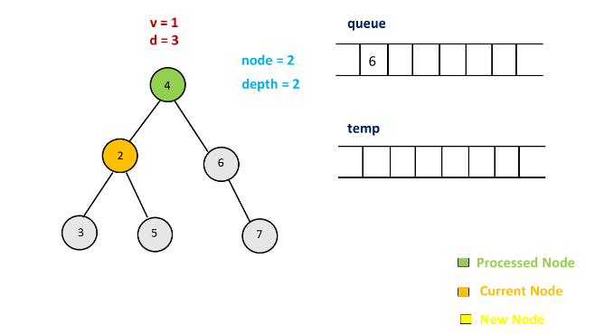
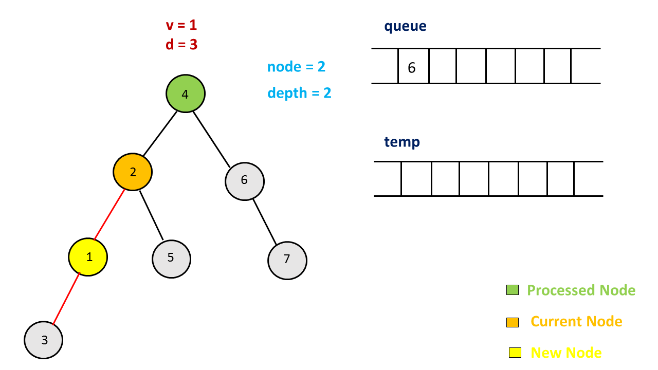
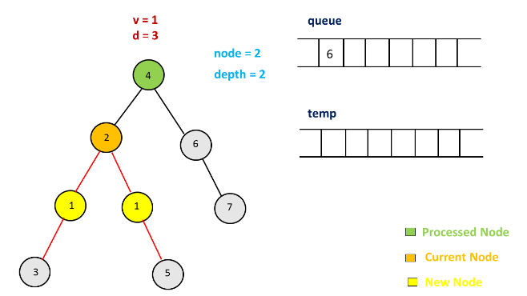
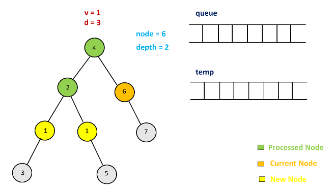
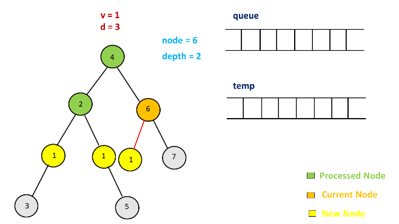
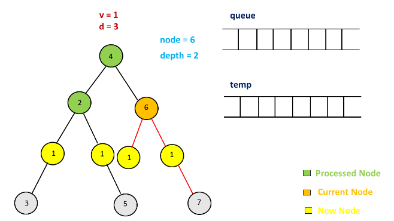
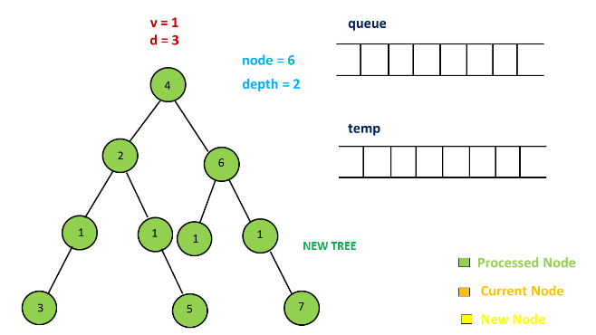

```java
/**
 * Definition for a binary tree node.
 * public class TreeNode {
 *     int val;
 *     TreeNode left;
 *     TreeNode right;
 *     TreeNode(int x) { val = x; }
 * }
 */
public class Solution {
    public TreeNode addOneRow(TreeNode t, int v, int d) {
        if (d == 1) {
            TreeNode n = new TreeNode(v);
            n.left = t;
            return n;
        }
        Queue < TreeNode > queue = new LinkedList < > ();
        queue.add(t);
        int depth = 1;
        while (depth < d - 1) {
            Queue < TreeNode > temp = new LinkedList < > ();
            while (!queue.isEmpty()) {
                TreeNode node = queue.remove();
                if (node.left != null) temp.add(node.left);
                if (node.right != null) temp.add(node.right);
            }
            queue = temp;
            depth++;
        }
        while (!queue.isEmpty()) {
            TreeNode node = queue.remove();
            TreeNode temp = node.left;
            node.left = new TreeNode(v);
            node.left.left = temp;
            temp = node.right;
            node.right = new TreeNode(v);
            node.right.right = temp;
        }
        return t;
    }
}
```

**Complexity Analysis**

* Time complexity : $O(n)$. A total of $n$ nodes of the given tree will be considered in the worst case.

* Space complexity : $O(x)$. The size of the $queue$ or $temp$ queue can grow upto $x$ only. Here, $x$ refers to the number of maximum number of nodes at any level in the given tree.

# Submissions
--
**Solution 1: (BFS)**
```
Runtime: 48 ms
Memory Usage: 13.9 MB
```
```python
# Definition for a binary tree node.
# class TreeNode:
#     def __init__(self, x):
#         self.val = x
#         self.left = None
#         self.right = None

class Solution:
    def addOneRow(self, root: TreeNode, v: int, d: int) -> TreeNode:
        depth = 1
        level = [root] if root else []
        if d == 1:
            new_node = TreeNode(v)
            new_node.left = root
            root = new_node
        else:
            while level:
                if depth + 1 == d:
                    for node in level:
                        if node:
                            new_node = TreeNode(v)
                            if node.left:
                                new_node.left = node.left
                            node.left = new_node
                            
                            new_node = TreeNode(v)
                            if node.right:
                                new_node.right = node.right
                            node.right = new_node
                    break
                else:
                    next_level = [c for node in level if node for c in [node.left , node.right]]
                level = next_level
                depth += 1
            
        return root
```

**Solution 2: (BFS)**
```
Runtime: 35 ms
Memory Usage: 25.2 MB
```
```c++
/**
 * Definition for a binary tree node.
 * struct TreeNode {
 *     int val;
 *     TreeNode *left;
 *     TreeNode *right;
 *     TreeNode() : val(0), left(nullptr), right(nullptr) {}
 *     TreeNode(int x) : val(x), left(nullptr), right(nullptr) {}
 *     TreeNode(int x, TreeNode *left, TreeNode *right) : val(x), left(left), right(right) {}
 * };
 */
class Solution {
public:
    TreeNode* addOneRow(TreeNode* root, int val, int depth) {
        TreeNode *cur, *tmp;
        if (depth == 1) {
            tmp = new TreeNode(val);
            tmp->left = root;
            root = tmp;
        } else {
            queue<TreeNode*> q;
            q.push(root);
            int d = 1;
            TreeNode *cur, *tmp;
            while (!q.empty()) {
                int sz = q.size();
                for (int i = 0; i < sz; i ++) {
                    cur = q.front();
                    q.pop();
                    if (d == depth-1) {
                        tmp = new TreeNode(val);
                        tmp->left = cur->left;
                        cur->left = tmp;
                        tmp = new TreeNode(val);
                        tmp->right = cur->right;
                        cur->right = tmp;
                    } else {
                        if (cur->left)
                            q.push(cur->left);
                        if (cur->right)
                            q.push(cur->right);
                    }
                }
                if (d == depth-1)
                    break;
                d += 1;
            }
        }
        return root;
    }
};
```

**Solution 3: (DFS)**
```
Runtime: 16 ms
Memory Usage: 24.9 MB
```
```c++
/**
 * Definition for a binary tree node.
 * struct TreeNode {
 *     int val;
 *     TreeNode *left;
 *     TreeNode *right;
 *     TreeNode() : val(0), left(nullptr), right(nullptr) {}
 *     TreeNode(int x) : val(x), left(nullptr), right(nullptr) {}
 *     TreeNode(int x, TreeNode *left, TreeNode *right) : val(x), left(left), right(right) {}
 * };
 */
class Solution {
public:
    void dfs(TreeNode* root, int val, int depth, int lvl)
    {
        if(!root)
            return;
        if(lvl==depth-1)
        {
            TreeNode* leftTree = root->left;
            TreeNode* rightTree = root->right;
            TreeNode* addNodeLeft = new TreeNode(val);
            TreeNode* addNodeRight = new TreeNode(val);
            root->left = addNodeLeft;
            addNodeLeft->left = leftTree;
            root->right =  addNodeRight;
            addNodeRight->right = rightTree;
            return;
        }
        dfs(root->left,val,depth,lvl+1);
        dfs(root->right,val,depth,lvl+1);
    }
    TreeNode* addOneRow(TreeNode* root, int val, int depth) {
        if(depth==1)
        {
            TreeNode* newNode = new TreeNode(val);
            newNode->left = root;
            return newNode;
        }
        dfs(root,val,depth,1);
        return root;
    }
};
```

**Solution 4: (BFS)**
```
Runtime: 12 ms
Memory: 24.54 MB
```
```c++
/**
 * Definition for a binary tree node.
 * struct TreeNode {
 *     int val;
 *     TreeNode *left;
 *     TreeNode *right;
 *     TreeNode() : val(0), left(nullptr), right(nullptr) {}
 *     TreeNode(int x) : val(x), left(nullptr), right(nullptr) {}
 *     TreeNode(int x, TreeNode *left, TreeNode *right) : val(x), left(left), right(right) {}
 * };
 */
class Solution {
public:
    TreeNode* addOneRow(TreeNode* root, int val, int depth) {
        TreeNode *cur, *node;
        if (depth == 1) {
            cur = new TreeNode(val);
            cur->left = root;
            return cur;
        }
        int sz;
        queue<TreeNode*> q;
        q.push(root);
        while (depth > 2) {
            sz = q.size();
            for (int i = 0; i < sz; i ++) {
                cur = q.front();
                q.pop();
                if (cur->left) {
                    q.push(cur->left);
                }
                if (cur->right) {
                    q.push(cur->right);
                }
            }
            depth -= 1;
        }
        while (q.size()) {
            cur = q.front();
            q.pop();
            node = cur->left;
            cur->left = new TreeNode(val);
            if (node) {
                cur->left->left = node;
            }
            node = cur->right;
            cur->right = new TreeNode(val);
            if (node) {
                cur->right->right = node;
            }
        }
        return root;
    }
};
```
