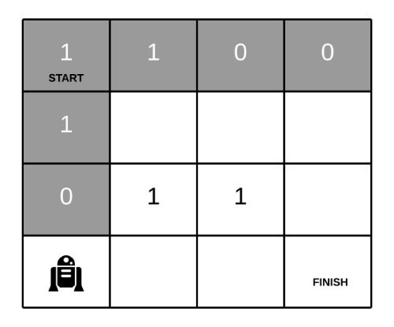

63. Unique Paths II

A robot is located at the top-left corner of a m x n grid (marked 'Start' in the diagram below).

The robot can only move either down or right at any point in time. The robot is trying to reach the bottom-right corner of the grid (marked 'Finish' in the diagram below).

Now consider if some obstacles are added to the grids. How many unique paths would there be?


An obstacle and empty space is marked as `1` and `0` respectively in the grid.

**Note:** m and n will be at most 100.
```
Input:
[
  [0,0,0],
  [0,1,0],
  [0,0,0]
]
Output: 2
Explanation:
There is one obstacle in the middle of the 3x3 grid above.
There are two ways to reach the bottom-right corner:
1. Right -> Right -> Down -> Down
2. Down -> Down -> Right -> Right
```

# Solution
---
## Approach 1: Dynamic Programming
**Intuition**

The robot can only move either down or right. Hence any cell in the first row can only be reached from the cell left to it.


And, any cell in the first column can only be reached from the cell above it.


For any other cell in the grid, we can reach it either from the cell to left of it or the cell above it.

If any cell has an obstacle, we won't let that cell contribute to any path.

We will be iterating the array from left-to-right and top-to-bottom. Thus, before reaching any cell we would have the number of ways of reaching the predecessor cells. This is what makes it a Dynamic Programming problem. We will be using the `obstacleGrid` array as the DP array thus not utilizing any additional space.

Note: As per the question, cell with an obstacle has a value 1. We would use this value to make sure if a cell needs to be included in the path or not. After that we can use the same cell to store the number of ways to reach that cell.

**Algorithm**
1. If the first cell i.e. `obstacleGrid[0,0]` contains `1`, this means there is an obstacle in the first cell. Hence the robot won't be able to make any move and we would return the number of ways as 0.
1. Otherwise, if `obstacleGrid[0,0]` has a 0 originally we set it to 1 and move ahead.
1. Iterate the first row. If a cell originally contains a 1, this means the current cell has an obstacle and shouldn't contribute to any path. Hence, set the value of that cell to 0. Otherwise, set it to the value of previous cell i.e. `obstacleGrid[i,j] = obstacleGrid[i,j-1]`
1. Iterate the first column. If a cell originally contains a 1, this means the current cell has an obstacle and shouldn't contribute to any path. Hence, set the value of that cell to 0. Otherwise, set it to the value of previous cell i.e. `obstacleGrid[i,j] = obstacleGrid[i-1,j]`
1. Now, iterate through the array starting from cell `obstacleGrid[1,1]`. If a cell originally doesn't contain any obstacle then the number of ways of reaching that cell would be the sum of number of ways of reaching the cell above it and number of ways of reaching the cell to the left of it.
`obstacleGrid[i,j] = obstacleGrid[i-1,j] + obstacleGrid[i,j-1]`
1. If a cell contains an obstacle set it to 0 and continue. This is done to make sure it doesn't contribute to any other path.

Following is the animation to explain the algorithm's steps:





```python
class Solution(object):
    def uniquePathsWithObstacles(self, obstacleGrid):
        """
        :type obstacleGrid: List[List[int]]
        :rtype: int
        """

        m = len(obstacleGrid)
        n = len(obstacleGrid[0])

        # If the starting cell has an obstacle, then simply return as there would be
        # no paths to the destination.
        if obstacleGrid[0][0] == 1:
            return 0

        # Number of ways of reaching the starting cell = 1.
        obstacleGrid[0][0] = 1

        # Filling the values for the first column
        for i in range(1,m):
            obstacleGrid[i][0] = int(obstacleGrid[i][0] == 0 and obstacleGrid[i-1][0] == 1)

        # Filling the values for the first row        
        for j in range(1, n):
            obstacleGrid[0][j] = int(obstacleGrid[0][j] == 0 and obstacleGrid[0][j-1] == 1)

        # Starting from cell(1,1) fill up the values
        # No. of ways of reaching cell[i][j] = cell[i - 1][j] + cell[i][j - 1]
        # i.e. From above and left.
        for i in range(1,m):
            for j in range(1,n):
                if obstacleGrid[i][j] == 0:
                    obstacleGrid[i][j] = obstacleGrid[i-1][j] + obstacleGrid[i][j-1]
                else:
                    obstacleGrid[i][j] = 0

        # Return value stored in rightmost bottommost cell. That is the destination.            
        return obstacleGrid[m-1][n-1]
```

**Complexity Analysis**

* Time Complexity: $O(M \times N)$. The rectangular grid given to us is of size $M \times N$ and we process each cell just once.
* Space Complexity: $O(1)$. We are utilizing the obstacleGrid as the DP array. Hence, no extra space.

# Submissions
---
**Solution 1: (DP Bottom-Up)**
```
Runtime: 48 ms
Memory Usage: 14 
```
```python
class Solution(object):
    def uniquePathsWithObstacles(self, obstacleGrid):
        """
        :type obstacleGrid: List[List[int]]
        :rtype: int
        """

        m = len(obstacleGrid)
        n = len(obstacleGrid[0])

        # If the starting cell has an obstacle, then simply return as there would be
        # no paths to the destination.
        if obstacleGrid[0][0] == 1:
            return 0

        # Number of ways of reaching the starting cell = 1.
        obstacleGrid[0][0] = 1

        # Filling the values for the first column
        for i in range(1,m):
            obstacleGrid[i][0] = int(obstacleGrid[i][0] == 0 and obstacleGrid[i-1][0] == 1)

        # Filling the values for the first row        
        for j in range(1, n):
            obstacleGrid[0][j] = int(obstacleGrid[0][j] == 0 and obstacleGrid[0][j-1] == 1)

        # Starting from cell(1,1) fill up the values
        # No. of ways of reaching cell[i][j] = cell[i - 1][j] + cell[i][j - 1]
        # i.e. From above and left.
        for i in range(1,m):
            for j in range(1,n):
                if obstacleGrid[i][j] == 0:
                    obstacleGrid[i][j] = obstacleGrid[i-1][j] + obstacleGrid[i][j-1]
                else:
                    obstacleGrid[i][j] = 0

        # Return value stored in rightmost bottommost cell. That is the destination.            
        return obstacleGrid[m-1][n-1]
```

**Solution 2: (DP Top-Down, DFS, Post-Order)**
```
Runtime: 40 ms
Memory Usage: 13.1 MB
```
```python
import functools
class Solution:
    def uniquePathsWithObstacles(self, obstacleGrid: List[List[int]]) -> int:
        M, N = len(obstacleGrid), len(obstacleGrid[0])
        
        @functools.lru_cache(None)
        def dfs(i, j):
            if obstacleGrid[i][j]:      # hit an obstacle
                return 0
            if i == M-1 and j == N-1:   # reach the end
                return 1
            count = 0
            if i < M-1:
                count += dfs(i+1, j)    # go down
            if j < N-1:
                count += dfs(i, j+1)    # go right
            return count
        
        return dfs(0, 0)
```

**Solution 3: (DP Top-Down, DFS, Post-Order)**
```
Runtime: 48 ms
Memory Usage: 13.1 MB
```
```python
import functools
class Solution(object):
    def uniquePathsWithObstacles(self, obstacleGrid):
        """
        :type obstacleGrid: List[List[int]]
        :rtype: int
        """

        m = len(obstacleGrid)
        n = len(obstacleGrid[0])

        @functools.lru_cache
        def dfs(i, j):
            if obstacleGrid[i][j] == 1:
                return 0
            elif i == 0 and j == 0:
                return 1
            count = 0
            if i >= 1:
                count += dfs(i-1, j)    # go down
            if j >= 1:
                count += dfs(i, j-1)    # go right
            return count
        return dfs(m-1, n-1)
```

**Solution 4: (DP Bottom-Up)**
```
Runtime: 4 ms
Memory Usage: 7.9 MB
```
```c++
class Solution {
public:
    int uniquePathsWithObstacles(vector<vector<int>>& obstacleGrid) {
        int R = obstacleGrid.size(), C = obstacleGrid[0].size();
        vector<vector<int>> dp(R, vector<int>(C));
        for (int r = 0; r < R; r ++) {
            for (int c = 0; c < C; c ++) {
                if (obstacleGrid[r][c] == 0) {
                    if (r == 0 && c == 0)
                        dp[r][c] = 1;
                    else if (r == 0)
                        dp[r][c] = dp[r][c-1];
                    else if (c == 0)
                        dp[r][c] = dp[r-1][c];
                    else
                        dp[r][c] = dp[r-1][c] + dp[r][c-1];
                }
            }
        }
        return dp[R-1][C-1];
    }
};
```

**Solution 5: (DP Bottom-Up 1D)**
```
Runtime: 0 ms
Memory: 7.8 MB
```
```c++
class Solution {
public:
    int uniquePathsWithObstacles(vector<vector<int>>& obstacleGrid) {
        if (obstacleGrid.empty() || obstacleGrid[0].empty() || obstacleGrid[0][0] == 1) {
            return 0;
        }
        int m = obstacleGrid.size(), n = obstacleGrid[0].size();
        vector<int> pre(n), dp(n);
        pre[0] = 1;
        for (int i = 0; i < m; i ++) {
            dp[0] = obstacleGrid[i][0] == 1 ? 0 : pre[0];
            for (int j = 1; j < n; j ++) {
                dp[j] = obstacleGrid[i][j] == 1 ? 0 : dp[j-1] + pre[j];
            }
            pre = dp;
        }
        return dp[n-1];
    }
};
```
