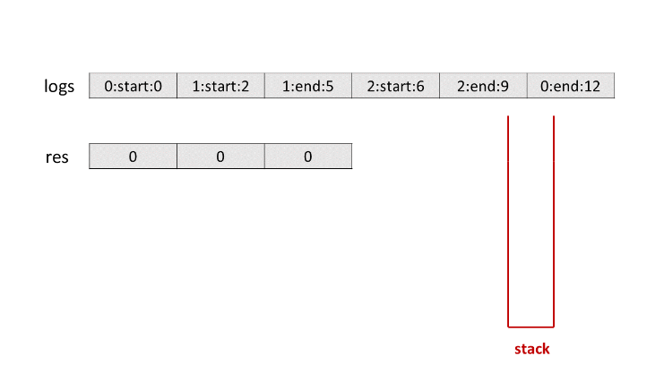
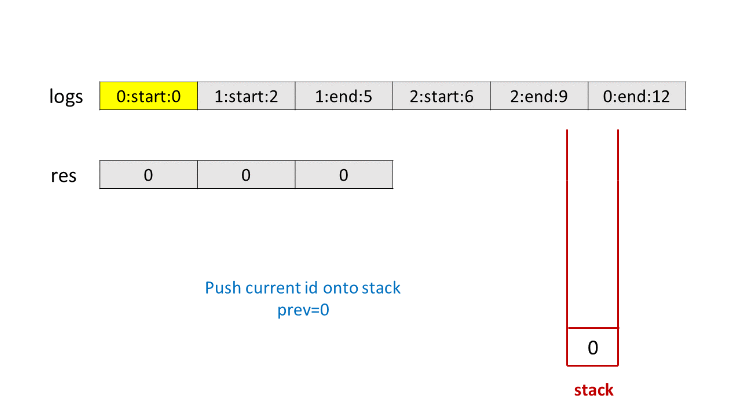
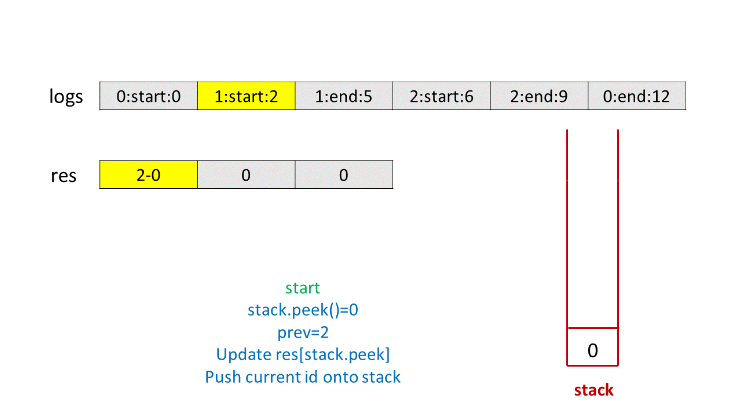
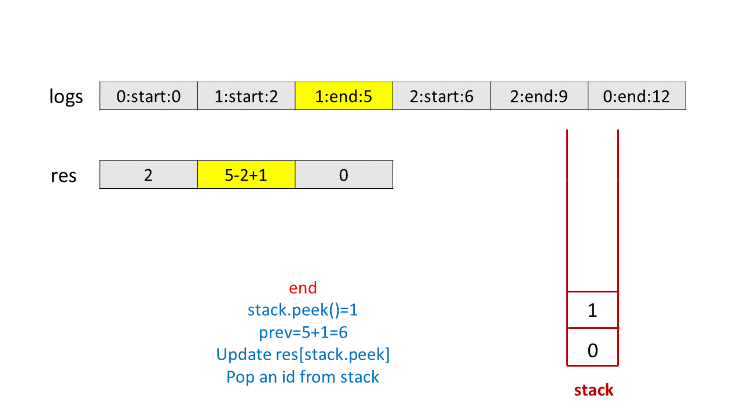
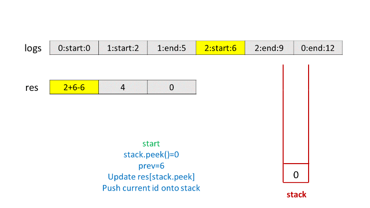
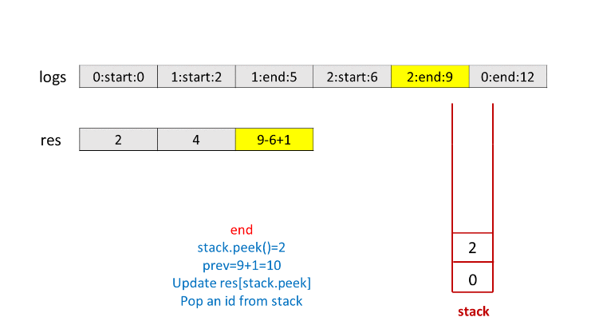
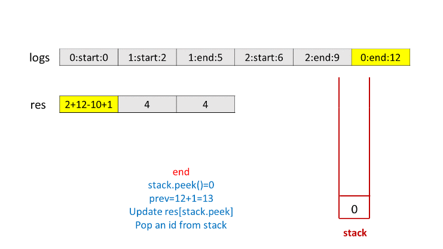
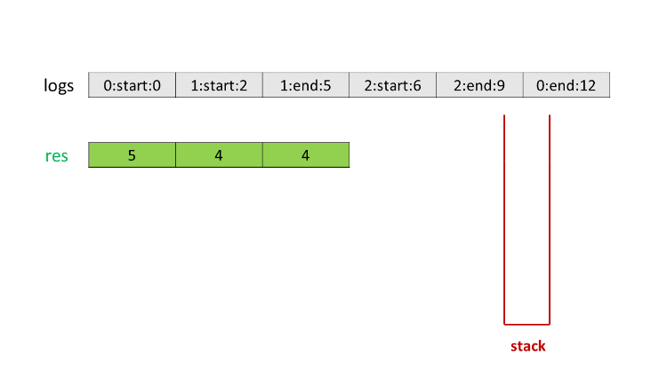

636. Exclusive Time of Functions

On a **single threaded** CPU, we execute some functions.  Each function has a unique id between `0` and `N-1`.

We store `logs` in timestamp order that describe when a function is entered or exited.

Each log is a string with this format: `"{function_id}:{"start" | "end"}:{timestamp}"`.  For example, `"0:start:3"` means the function with id `0` **started at the beginning** of timestamp `3`.  `"1:end:2"` means the function with id `1` **ended at the end** of timestamp `2`.

A function's exclusive time is the number of units of time spent in this function.  Note that this does not include any recursive calls to child functions.

The CPU is **single threaded** which means that only one function is being executed at a given time unit.

Return the exclusive time of each function, sorted by their function id.

 

**Example 1:**


```
Input:
n = 2
logs = ["0:start:0","1:start:2","1:end:5","0:end:6"]
Output: [3, 4]
Explanation:
Function 0 starts at the beginning of time 0, then it executes 2 units of time and reaches the end of time 1.
Now function 1 starts at the beginning of time 2, executes 4 units of time and ends at time 5.
Function 0 is running again at the beginning of time 6, and also ends at the end of time 6, thus executing for 1 unit of time. 
So function 0 spends 2 + 1 = 3 units of total time executing, and function 1 spends 4 units of total time executing.
```

**Note:**

* `1 <= n <= 100`
* Two functions won't start or end at the same time.
* Functions will always log when they exit.

# Solution
---
## Approach #1 Using Stack [Time Limit Exceeded]
Before starting off with the solution, let's discuss a simple idea. Suppose we have three functions $func_1$, $func_2$ and $func_3$ such that $func_1$ calls $func_2$ and then $func_2$ calls $func_3$. In this case, $func_3$ starts at the end and ends first, $func_2$ starts at 2nd position and ends at the 2nd last step. Similarly, $func_1$ starts first and ends at the last position. Thus, we can conclude that the function which is entered at the end finishes first and the one which is entered first ends at the last position.

From the above discussion, we can conclude that we can make use of a $stack$to solve the given problem. We can start by pushing the first function's id from the given $logs$ list onto the array. We also keep a track of the current timetime. We also make use of a $res$ array, such that $res[i]$ is to keep a track of the exclusive time spent by the Fucntion with function id $i$ till the current time.

Now, we can move on to the next function in $logs$. The start/end time of the next function will obviously be larger than the start time of the function on the $stack$. We keep on incrementing the current timetime and the exclusive time for the function on the top of the $stack$ till the current time becomes equal to the start/end time of the next function in the $logs$ list.

Thus, now, we've reached a point, where the control shifts from the last function to a new function, due to a function call(indicated by a start label for the next function), or the last function could exit(indicated by the end label for the next function). Thus, we can no longer continue with the same old function.

If the next function includes a start label, we push this function on the top of the $stack$, since the last function would need to be revisited again in the future. On the other hand, if the next function includes an end label, it means the last function on the top of the stackstack is terminating.

We also know that an end label indicates that this function executes till the end of the given time. Thus, we need to increment the current $time$ and the exclusive time of the last function as well to account for this fact. Now, we can remove(pop) this function from the $stack$. We can continue this process for every function in the $logs$ list.

At the end, the resres array gives the exclusive times for each function.

Summarizing the above process, we need to do the following:

1. Push the function id of the first function in the $logs$ list on the $stack$.

1. Keep incrementing the exlusive time(along with the current time) corresponding to the function on the top of the $stack$(in the $res$ array), till the current time equals the start/end time corresponding to the next function in the $logs$ list.

1. If the next function has a 'start' label, push this function's id onto the stack. Otherwise, increment the last function's exclusive time(along with the current time), and pop the function id from the top of the stack.

1. Repeat steps 2 and 3 till all the functions in the $logs$ list have been considered.

1. Return the resultant exlcusive time($res$).

```java
public class Solution {
    public int[] exclusiveTime(int n, List < String > logs) {
        Stack < Integer > stack = new Stack < > ();
        int[] res = new int[n];
        String[] s = logs.get(0).split(":");
        stack.push(Integer.parseInt(s[0]));
        int i = 1, time = Integer.parseInt(s[2]);
        while (i < logs.size()) {
            s = logs.get(i).split(":");
            while (time < Integer.parseInt(s[2])) {
                res[stack.peek()]++;
                time++;
            }
            if (s[1].equals("start"))
                stack.push(Integer.parseInt(s[0]));
            else {
                res[stack.peek()]++;
                time++;
                stack.pop();
            }
            i++;
        }
        return res;
    }
}
```

**Complexity Analysis**

* Time complexity : $O(t)$. We increment the time till all the functions are done with the execution. Here, $t$ refers to the end time of the last function in the $logs$ list.

* Space complexity : $O(n)$. The $stack$ can grow upto a depth of atmost $n/2$. Here, $n$ refers to the number of elements in the given $logs$ list.

## Approach #2 Better Approach [Accepted]
**Algorithm**

In the last approach, for every function on the top of the $stack$, we incremented the current time and the exclusive time of this same function till the current time became equal to the start/end time of the next function.

Instead of doing this incrementing step by step, we can directly use the difference between the next function's start/stop time and the current function's start/stop time. The rest of the process remains the same as in the last approach.

The following animation illustrates the process.










```java
public class Solution {
    public int[] exclusiveTime(int n, List < String > logs) {
        Stack < Integer > stack = new Stack < > ();
        int[] res = new int[n];
        String[] s = logs.get(0).split(":");
        stack.push(Integer.parseInt(s[0]));
        int i = 1, prev = Integer.parseInt(s[2]);
        while (i < logs.size()) {
            s = logs.get(i).split(":");
            if (s[1].equals("start")) {
                if (!stack.isEmpty())
                    res[stack.peek()] += Integer.parseInt(s[2]) - prev;
                stack.push(Integer.parseInt(s[0]));
                prev = Integer.parseInt(s[2]);
            } else {
                res[stack.peek()] += Integer.parseInt(s[2]) - prev + 1;
                stack.pop();
                prev = Integer.parseInt(s[2]) + 1;
            }
            i++;
        }
        return res;
    }
}
```

**Complexity Analysis**

* Time complexity : $O(n)$. We iterate over the entire $logs$ array just once. Here, $n$ refers to the number of elements in the $logs$ list.

* Space complexity : The $stack$ can grow upto a depth of atmost $n/2$. Here, $n$ refers to the number of elements in the given $logs$ list.

# Submissions
---
**Solution 1: (Stack)**
```
Runtime: 76 ms
Memory Usage: 12.8 MB
```
```python
class Solution:
    def exclusiveTime(self, n: int, logs: List[str]) -> List[int]:
        stack = []
        res = [0] * n
        s = logs[0].split(":")
        stack.append(int(s[0]))
        i, prev = 1, int(s[2])
        while i < len(logs):
            s = logs[i].split(":")
            if s[1] == 'start':
                if stack:
                    res[stack[-1]] += int(s[2]) - prev
                stack.append(int(s[0]))
                prev = int(s[2])
            else:
                res[stack[-1]] += int(s[2]) - prev + 1
                stack.pop()
                prev = int(s[2]) + 1
            i += 1
            
        return res
```

**Solution 2: (Stack)**
```
Runtime: 29 ms
Memory Usage: 7.6 MB
```
```c


/**
 * Note: The returned array must be malloced, assume caller calls free().
 */

void paser(char* log, int* newId, int*flag, int* timeStamp)
{
    int idx = 0;
    
    *newId = 0;
    *flag = 0;
    *timeStamp = 0;
    
    while(log[idx]!=':')
    {
        (*newId) = (*newId) * 10 + log[idx] - '0';
        idx++;
    }
    idx++;
    
    if(log[idx] == 's')
    {
        *flag = 0;
        idx += 6;
    }
    else
    {
        *flag = 1;
        idx += 4;
    }
    
    while(log[idx]!='\0')
    {
        (*timeStamp) = (*timeStamp) * 10 + log[idx] - '0';
        idx++;
    }
}

int* exclusiveTime(int n, char ** logs, int logsSize, int* returnSize){
    int i;
    int newId, flag, timeStamp, startTime;
    int runningId = -1;
    int* duration = (int*)calloc(n,sizeof(int));
    int* stack = (int*)calloc(logsSize/2,sizeof(int));
    int stackDepth = 0;
    
    for(i=0;i<logsSize;i++)
    {
        paser(logs[i],&newId, &flag, &timeStamp);
        // check start/end, if start, pause running id, push into stack, update duration, update running id
        if(flag == 0) // start
        {
            if(runningId >= 0)
            {
                stack[stackDepth] = runningId;
                stackDepth++;
                duration[runningId] += timeStamp - startTime;
            }
            
            runningId = newId;
            startTime = timeStamp;
        }
        // else if end, update duration, pop start next one from stack
        else // end
        {
            duration[newId] += timeStamp - startTime + 1;
            
            if(stackDepth)
            {
                runningId = stack[stackDepth-1];
                startTime = timeStamp + 1;
                stackDepth--;
            }
            else
            {
                runningId = -1;
            }
        }
    }

    free(stack);
    *returnSize = n;
    return duration;
}
```

**Solution 3: (Stack)**

    n = 2, logs = ["0:start:0","1:start:2","1:end:5","0:end:6"]

function
1           [------]
0       [----]      []
        0 1 2 3 4 5 6
        ^p  ^cur
        ===
        cur - pre
            ^p    ^cur
            =======
            cur - pre + 1
stk                             // id, start, exec
1           1,2,0 1,2,4x
0       0,0,0          
            2     0,0,3x
pre     0   2     6 7
cur     0   2     5 6
ans
0                   3
1                 4 
----------------------------------------------------------------------------------------
    n = 1, logs = ["0:start:0","0:start:2","0:end:5","0:start:6","0:end:6","0:end:7"]

function
0                   []
            [------]
        [--]          [] 
        0 1 2 3 4 5 6 7 
stk
            0,2,0 0,2.4x
                    0,6,1x
0       0,0,0         
            2         0,0,3x
pre     0   2     6 7 8
cur     0   2     5 6 7
ans
0                 4 5 8  
    
----------------------------------------------------------------------------------------
    Input: n = 2, logs = ["0:start:0","0:start:2","0:end:5","1:start:6","1:end:6","0:end:7"]

function
1                   []
0           [------]
        [--]          []
        0 1 2 3 4 5 6 7
stk
1           1,2,0 1,2,4x
0       0,0,0         0,0,3x
            2
pre     0   2     6 7 8
cur     0   2     5 6 7
ans
0                 4   7
1                   1

```
Runtime: 4 ms, Beats 55.87%
Memory: 18.54 MB, Beats 25.19%
```
```c++
class Solution {
public:
    vector<int> exclusiveTime(int n, vector<string>& logs) {
        int m = logs.size(), i, id, cur, pre;
        string s, typ;
        stack<array<int, 3>> stk;   // id, start, exec
        vector<int> ans(n); 
        for (i = 0; i < m; i ++) {
            stringstream ss(logs[i]);
            getline(ss, s, ':');
            id = stoi(s);
            getline(ss, s, ':');
            typ = s;
            getline(ss, s);
            cur = stoi(s);
            if (typ == "start") {
                if (stk.size()) {
                    stk.top()[2] += cur - pre;
                }
                stk.push({id, cur, 0});
                pre = cur;
            } else {
                stk.top()[2] += cur - pre + 1;
                ans[stk.top()[0]] += stk.top()[2];
                stk.pop();
                pre = cur + 1;
            }
        }
        return ans;
    }
};
```
