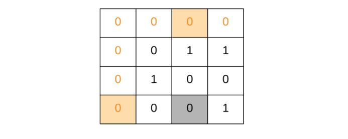

73. Set Matrix Zeroes

Given a m x n matrix, if an element is 0, set its entire row and column to 0. Do it in-place.

**Example 1:**
```
Input: 
[
  [1,1,1],
  [1,0,1],
  [1,1,1]
]
Output: 
[
  [1,0,1],
  [0,0,0],
  [1,0,1]
]
```

**Example 2:**
```
Input: 
[
  [0,1,2,0],
  [3,4,5,2],
  [1,3,1,5]
]
Output: 
[
  [0,0,0,0],
  [0,4,5,0],
  [0,3,1,0]
]
```

**Follow up:**

* A straight forward solution using $O(mn)$ space is probably a bad idea.
* A simple improvement uses $O(m + n)$ space, but still not the best solution.
* Could you devise a constant space solution?

# Solution
---
The question seems to be pretty simple but the trick here is that we need to modify the given matrix in place i.e. our space complexity needs to $O(1)$.

We will go through three different approaches to the question. The first approach makes use of additional memory while the other two don't.

## Approach 1: Additional Memory Approach
Intuition

If any cell of the matrix has a zero we can record its row and column number. All the cells of this recorded row and column can be marked zero in the next iteration.

**Algorithm**
1. We make a pass over our original array and look for zero entries.

1. If we find that an entry at `[i, j]` is 0, then we need to record somewhere the row `i` and column `j`.

1. So, we use two sets, one for the rows and one for the columns.

```
if cell[i][j] == 0 {
     row_set.add(i)
     column_set.add(j)
 }
```

1. Finally, we iterate over the original matrix. For every cell we check if the row `r` or column `c` had been marked earlier. If any of them was marked, we set the value in the cell to 0.

```
 if r in row_set or c in column_set {
     cell[r][c] = 0
 }
```

```python
class Solution(object):
    def setZeroes(self, matrix):
        """
        :type matrix: List[List[int]]
        :rtype: void Do not return anything, modify matrix in-place instead.
        """
        R = len(matrix)
        C = len(matrix[0])
        rows, cols = set(), set()

        # Essentially, we mark the rows and columns that are to be made zero
        for i in range(R):
            for j in range(C):
                if matrix[i][j] == 0:
                    rows.add(i)
                    cols.add(j)

        # Iterate over the array once again and using the rows and cols sets, update the elements
        for i in range(R):
            for j in range(C):
                if i in rows or j in cols:
                    matrix[i][j] = 0
```

**Complexity Analysis**

* Time Complexity: $O(M \times N)$ where M and N are the number of rows and columns respectively.

* Space Complexity: $O(M + N)$.

## Approach 2: Brute O(1) space.
**Intuition**

In the above approach we use additional memory to keep a track of rows and columns which need to be set to zero. This additional use of space can be avoided by manipulating the original array instead.

**Algorithm**
1. Iterate over the original array and if we find an entry, say `cell[i][j]` to be 0, then we iterate over row `i` and column `j` separately and set all the non zero elements to some high negative dummy value (say -1000000). Note, choosing the right dummy value for your solution is dependent on the constraints of the problem. Any value outside the range of permissible values in the matrix will work as a dummy value.
1. Finally, we iterate over the original matrix and if we find an entry to be equal to the high negative value (constant defined initially in the code as `MODIFIED`), then we set the value in the cell to 0.

```python
class Solution(object):
    def setZeroes(self, matrix):
        """
        :type matrix: List[List[int]]
        :rtype: void Do not return anything, modify matrix in-place instead.
        """
        MODIFIED = -1000000
        R = len(matrix)
        C = len(matrix[0])
        for r in range(R):
            for c in range(C):
                if matrix[r][c] == 0:
                    # We modify the elements in place. Note, we only change the non zeros to MODIFIED
                    for k in range(C):
                        matrix[r][k] = MODIFIED if matrix[r][k] != 0 else 0
                    for k in range(R):
                        matrix[k][c] = MODIFIED if matrix[k][c] != 0 else 0
        for r in range(R):
            for c in range(C):
                # Make a second pass and change all MODIFIED elements to 0 """
                if matrix[r][c] == MODIFIED:
                    matrix[r][c] = 0
```

**Complexity Analysis**

* Time Complexity : $O((M \times N) \times (M + N))$ where M and N are the number of rows and columns respectively. Even though this solution avoids using space, but is very inefficient since in worst case for every cell we might have to zero out its corresponding row and column. Thus for all $(M \times N)$ cells zeroing out $(M + N)$ cells.
* Space Complexity : $O(1)$

## Approach 3: O(1) Space, Efficient Solution
**Intuition**

The inefficiency in the second approach is that we might be repeatedly setting a row or column even if it was set to zero already. We can avoid this by postponing the step of setting a row or a column to zeroes.

>We can rather use the first cell of every row and column as a flag. This flag would determine whether a row or column has been set to zero. This means for every cell instead of going to $M+N$ cells and setting it to zero we just set the flag in two cells.

```
if cell[i][j] == 0 {
    cell[i][0] = 0
    cell[0][j] = 0
}
```

These flags are used later to update the matrix. If the first cell of a row is set to zero this means the row should be marked zero. If the first cell of a column is set to zero this means the column should be marked zero.

**Algorithm**
1. We iterate over the matrix and we mark the first cell of a row `i` and first cell of a column `j`, if the condition in the pseudo code above is satisfied. i.e. if `cell[i][j] == 0`.

1. The first cell of row and column for the first row and first column is the same i.e. `cell[0][0]`. Hence, we use an additional variable to tell us if the first column had been marked or not and the `cell[0][0]` would be used to tell the same for the first row.

1. Now, we iterate over the original matrix starting from second row and second column i.e. `matrix[1][1]` onwards. For every cell we check if the row `r` or column `c` had been marked earlier by checking the respective first row cell or first column cell. If any of them was marked, we set the value in the cell to 0. Note the first row and first column serve as the row_set and column_set that we used in the first approach.

1. We then check if `cell[0][0] == 0`, if this is the case, we mark the first row as zero.

1. And finally, we check if the first column was marked, we make all entries in it as zeros.





In the above animation we iterate all the cells and mark the corresponding first row/column cell incase of a cell with zero value.


We iterate the matrix we got from the above steps and mark respective cells zeroes.


```python
class Solution(object):
    def setZeroes(self, matrix):
        """
        :type matrix: List[List[int]]
        :rtype: void Do not return anything, modify matrix in-place instead.
        """
        is_col = False
        R = len(matrix)
        C = len(matrix[0])
        for i in range(R):
            # Since first cell for both first row and first column is the same i.e. matrix[0][0]
            # We can use an additional variable for either the first row/column.
            # For this solution we are using an additional variable for the first column
            # and using matrix[0][0] for the first row.
            if matrix[i][0] == 0:
                is_col = True
            for j in range(1, C):
                # If an element is zero, we set the first element of the corresponding row and column to 0
                if matrix[i][j]  == 0:
                    matrix[0][j] = 0
                    matrix[i][0] = 0

        # Iterate over the array once again and using the first row and first column, update the elements.
        for i in range(1, R):
            for j in range(1, C):
                if not matrix[i][0] or not matrix[0][j]:
                    matrix[i][j] = 0

        # See if the first row needs to be set to zero as well
        if matrix[0][0] == 0:
            for j in range(C):
                matrix[0][j] = 0

        # See if the first column needs to be set to zero as well        
        if is_col:
            for i in range(R):
                matrix[i][0] = 0
```

**Complexity Analysis**

* Time Complexity : $O(M \times N)$
* Space Complexity : $O(1)$

# Submissions
---
**Solution: (O(1) Space, Efficient Solution)**
```
Runtime: 164 ms
Memory Usage: 14.6 MB
```
```python
class Solution:
    def setZeroes(self, matrix: List[List[int]]) -> None:
        """
        Do not return anything, modify matrix in-place instead.
        """
        is_col = False
        R = len(matrix)
        C = len(matrix[0])
        for i in range(R):
            # Since first cell for both first row and first column is the same i.e. matrix[0][0]
            # We can use an additional variable for either the first row/column.
            # For this solution we are using an additional variable for the first column
            # and using matrix[0][0] for the first row.
            if matrix[i][0] == 0:
                is_col = True
            for j in range(1, C):
                # If an element is zero, we set the first element of the corresponding row and column to 0
                if matrix[i][j]  == 0:
                    matrix[0][j] = 0
                    matrix[i][0] = 0

        # Iterate over the array once again and using the first row and first column, update the elements.
        for i in range(1, R):
            for j in range(1, C):
                if not matrix[i][0] or not matrix[0][j]:
                    matrix[i][j] = 0

        # See if the first row needs to be set to zero as well
        if matrix[0][0] == 0:
            for j in range(C):
                matrix[0][j] = 0

        # See if the first column needs to be set to zero as well        
        if is_col:
            for i in range(R):
                matrix[i][0] = 0
```

**Solution 1: (Brute Force)**
```
Runtime: 12 ms
Memory Usage: 13.1 MB
```
```c++
class Solution {
public:
    void setZeroes(vector<vector<int>>& matrix) {
        int m = matrix.size();
        int n = matrix[0].size();
        if(m==1 && n==1)
        {
            return;
        }
        
        bool row_flag = false;
        bool col_flag = false;
        
        //check for any zero in 1st row                
        for(int i=0;i<n;i++)
        {
            if(matrix[0][i]==0)
            {
                row_flag = true;
            }
           
        }
        
        //check for any zero in 1st col               
         for(int i=0;i<m;i++)
        {
             if(matrix[i][0]==0)
            {
                col_flag = true;
            }
        }
        
        for(int i=1;i<m;i++)
        {
            for(int j=1;j<n;j++)
            {
                //set only 1st row and 1st col to zero
                if(matrix[i][j]==0)
                {
                    matrix[0][j] = 0;
                    matrix[i][0] = 0;
                }
            }
        }
        
		//using inspace auxillary space as first row and first column, make submatrix values to be zero
        for(int i=1;i<m;i++)
        {
            for(int j=1;j<n;j++)
            {
                if(matrix[0][j]==0 || matrix[i][0]==0)
                {
                    matrix[i][j] =0;
                }
            }
        }
        
        if(row_flag)
        {
            for(int i=0;i<n;i++)
            {
                matrix[0][i] = 0;
            }
        }
        
        if(col_flag)
        {
            for(int i=0;i<m;i++)
            {
                matrix[i][0] = 0;
            }
        }
    }
};
```
