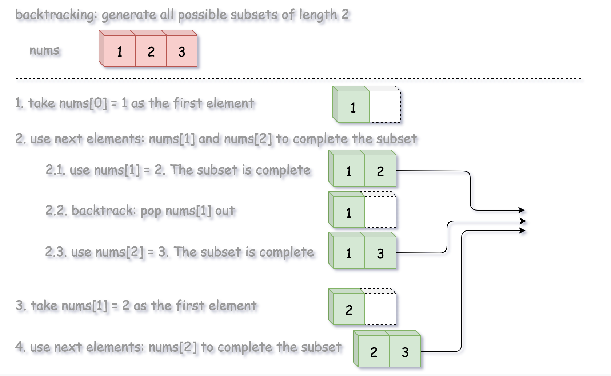

78. Subsets

Given a set of **distinct** integers, `nums`, return all possible subsets (the power set).

**Note:** The solution set must not contain duplicate subsets.

**Example:**
```
Input: nums = [1,2,3]
Output:
[
  [3],
  [1],
  [2],
  [1,2,3],
  [1,3],
  [2,3],
  [1,2],
  []
]
```

# Solution
---
## Solution Pattern
Let us first review the problems of Permutations / Combinations / Subsets, since they are quite similar to each other and there are some common strategies to solve them.

First, their solution space is often quite large:

* Permutations: $N!$.

* Combinations: $C_N^k = \frac{N!}{(N - k)! k!}$
 
* Subsets: $2^N$, since each element could be absent or present.

Given their exponential solution space, it is tricky to ensure that the generated solutions are **complete** and **non-redundant**. It is essential to have a clear and easy-to-reason strategy.

There are generally three strategies to do it:

* Recursion

* Backtracking

* Lexicographic generation based on the mapping between binary bitmasks and the corresponding
permutations / combinations / subsets.

As one would see later, the third method could be a good candidate for the interview because it simplifies the problem to the generation of binary numbers, therefore it is easy to implement and verify that no solution is missing.

Besides, this method has the best time complexity, and as a bonus, it generates lexicographically sorted output for the sorted inputs.

## Approach 1: Recursion
**Intuition**

Let's start from empty subset in output list. At each step one takes new integer into consideration and generates new subsets from the existing ones.


```python
class Solution:
    def subsets(self, nums: List[int]) -> List[List[int]]:
        n = len(nums)
        output = [[]]
        
        for num in nums:
            output += [curr + [num] for curr in output]
        
        return output
```

**Complexity Analysis**

* Time complexity: $\mathcal{O}(N \times 2^N)$ to generate all subsets and then copy them into output list.

* Space complexity: $\mathcal{O}(2^N)$. This is exactly the number of solutions for subsets.

    * For a given number, it could be present or absent (i.e. binary choice) in a subset solution. As as result, for $N$ numbers, we would have in total $2^N$ choices (solutions).

## Approach 2: Backtracking
**Algorithm**

>Power set is all possible combinations of all possible lengths, from `0` to `n`.

Given the definition, the problem can also be interpreted as finding the power set from a sequence.

So, this time let us loop over the length of combination, rather than the candidate numbers, and generate all combinations for a given length with the help of backtracking technique.


>**Backtracking** is an algorithm for finding all solutions by exploring all potential candidates. If the solution candidate turns to be not a solution (or at least not the last one), backtracking algorithm discards it by making some changes on the previous step, i.e. backtracks and then try again.



**Algorithm**

We define a backtrack function named `backtrack(first, curr)` which takes the index of first element to add and a current combination as arguments.

* If the current combination is done, we add the combination to the final output.

* Otherwise, we iterate over the indexes `i` from first to the length of the entire sequence n.

    * Add integer `nums[i]` into the current combination curr.

    * Proceed to add more integers into the combination : `backtrack(i + 1, curr)`.

    * Backtrack by removing `nums[i]` from `curr`.

**Implementation**
```python
class Solution:
    def subsets(self, nums: List[int]) -> List[List[int]]:
        def backtrack(first = 0, curr = []):
            # if the combination is done
            if len(curr) == k:  
                output.append(curr[:])
            for i in range(first, n):
                # add nums[i] into the current combination
                curr.append(nums[i])
                # use next integers to complete the combination
                backtrack(i + 1, curr)
                # backtrack
                curr.pop()
        
        output = []
        n = len(nums)
        for k in range(n + 1):
            backtrack()
        return output
```

**Complexity Analysis**

* Time complexity: $\mathcal{O}(N \times 2^N)$ to generate all subsets and then copy them into output list.

* Space complexity: $\mathcal{O}(2^N)$ to keep all the subsets, since each of n elements could be present or absent.

## Approach 3: Lexicographic (Binary Sorted) Subsets
**Intuition**

The idea of this solution is originated from Donald E. Knuth.

>The idea is that we map each subset to a bitmask of length `n`, where `1` on the `i`th position in bitmask means the presence of `nums[i]` in the subset, and `0` means its absence.


For instance, the bitmask `0..00` (all zeros) corresponds to an empty subset, and the bitmask `1..11` (all ones) corresponds to the entire input array nums.

Hence to solve the initial problem, we just need to generate n bitmasks from `0..00` to `1..11`.

It might seem simple at first glance to generate binary numbers, but the real problem here is how to deal with zero left padding, because one has to generate bitmasks of fixed length, i.e. `001` and not just `1`. For that one could use standard bit manipulation trick:

```python
nth_bit = 1 << n
for i in range(2**n):
    # generate bitmask, from 0..00 to 1..11
    bitmask = bin(i | nth_bit)[3:]
```

or keep it simple stupid and shift iteration limits:

```python
for i in range(2**n, 2**(n + 1)):
    # generate bitmask, from 0..00 to 1..11
    bitmask = bin(i)[3:]
```

**Algorithm**

* Generate all possible binary bitmasks of length `n`.

* Map a subset to each bitmask: `1` on the `i`th position in bitmask means the presence of `nums[i]` in the subset, and `0` means its absence.

* Return output list.

**Implementation**
```python
class Solution:
    def subsets(self, nums: List[int]) -> List[List[int]]:
        n = len(nums)
        output = []
        
        for i in range(2**n, 2**(n + 1)):
            # generate bitmask, from 0..00 to 1..11
            bitmask = bin(i)[3:]
            
            # append subset corresponding to that bitmask
            output.append([nums[j] for j in range(n) if bitmask[j] == '1'])
        
        return output
```

**Complexity Analysis**

* Time complexity: $\mathcal{O}(N \times 2^N)$ to generate all subsets and then copy them into output list.

* Space complexity: $\mathcal{O}(2^N)$ to keep all the subsets, since each of n elements could be present or absent.

# Submissions
---
**Solution 1: (Cascading)**
```
Runtime: 28 ms
Memory Usage: 12.8 MB
```
```python
class Solution:
    def subsets(self, nums):
        """
        :type nums: List[int]
        :rtype: List[List[int]]
        """
        n = len(nums)
        output = [[]]
        
        for num in nums:
            output += [curr + [num] for curr in output]
        
        return output
```

**Solution 2: (Backtracking)**
```
Runtime: 40 ms
Memory Usage: 12.9 MB
```
```python
class Solution:
    def subsets(self, nums):
        """
        :type nums: List[int]
        :rtype: List[List[int]]
        """
        def backtrack(first = 0, curr = []):
            # if the combination is done
            if len(curr) == k:  
                output.append(curr[:])
            for i in range(first, n):
                # add nums[i] into the current combination
                curr.append(nums[i])
                # use next integers to complete the combination
                backtrack(i + 1, curr)
                # backtrack
                curr.pop()
        
        output = []
        n = len(nums)
        for k in range(n + 1):
            backtrack()
        return output
```

**Solution 3: (Lexicographic (Binary Sorted) Subsets)**
```
Runtime: 36 ms
Memory Usage: 13 MB
```
```python
class Solution:
    def subsets(self, nums):
        """
        :type nums: List[int]
        :rtype: List[List[int]]
        """
        n = len(nums)
        output = []
        
        for i in range(2**n, 2**(n + 1)):
            # generate bitmask, from 0..00 to 1..11
            bitmask = bin(i)[3:]
            
            # append subset corresponding to that bitmask
            output.append([nums[j] for j in range(n) if bitmask[j] == '1'])
        
        return output
```

**Solution 4: (Bit Manipulations)**
```
Runtime: 4 ms
Memory Usage: 7.3 MB
```
```c++
class Solution {
public:
    vector<vector<int>> subsets(vector<int>& nums) {
        vector<vector<int>> op;
        int n = nums.size();
        for(int mask=0;mask<(1<<n);mask++){
            vector<int> dum;
            for(int i=0;i<n;i++){
                if(mask&(1<<i)){
                    dum.push_back(nums[i]);
                }
            }
            op.push_back(dum);
        }
        return op;
    }
};
```

**Solution 5: (Backtracking)**
```
Runtime: 2 ms Beats 41.58%
Memory: 12.58 MB, Beats 32.14%
```
```c++
class Solution {
    void bt(int i, int n, vector<int> &nums, vector<int> &p, vector<vector<int>> &ans) {
        if (i == n) {
            ans.push_back(p);
            return;
        }
        bt(i+1, n, nums, p, ans);
        p.push_back(nums[i]);
        bt(i+1, n, nums, p, ans);
        p.pop_back();
    }
public:
    vector<vector<int>> subsets(vector<int>& nums) {
        int n = nums.size();
        vector<vector<int>> ans;
        vector<int> p;
        bt(0, n, nums, p, ans);
        return ans;
    }
};
```

**Solution 6: (DP Bottom-Up)**
```
Runtime: 0 ms
Memory Usage: 7.1 MB
```
```c++
class Solution {
public:
    vector<vector<int>> subsets(vector<int>& nums) {
        vector<vector<int>> res;
		res.push_back(vector<int>());
        for (int i = 0; i < nums.size(); ++i) {
		    // Number of the existing combinations.
            int k = res.size();
			// Generate new combinations 
			// by adding the next element to existing ones.
            for (int j = 0; j < k; ++j) {
                vector<int> temp = res[j];
                temp.push_back(nums[i]);
                res.push_back(temp);
            }
        }
        return res;
    }
};
```

**Solution 7: (bitmask)**
```
Runtime: 0 ms, Beats 100.00%
Memory: 9.58 MB, Beats 99.96%
```
```c++
class Solution {
public:
    vector<vector<int>> subsets(vector<int>& nums) {
        int n = nums.size(), i, a;
        vector<vector<int>> ans;
        vector<int> p;
        for (a = 0; a < 1<<n; a ++) {
            for (i = 0; (1<<i) <= a; i++) {
                if ((1<<i)&a) {
                    p.push_back(nums[i]);
                }
            }
            ans.push_back(p);
            p.clear();
        }
        return ans;
    }
};
```
