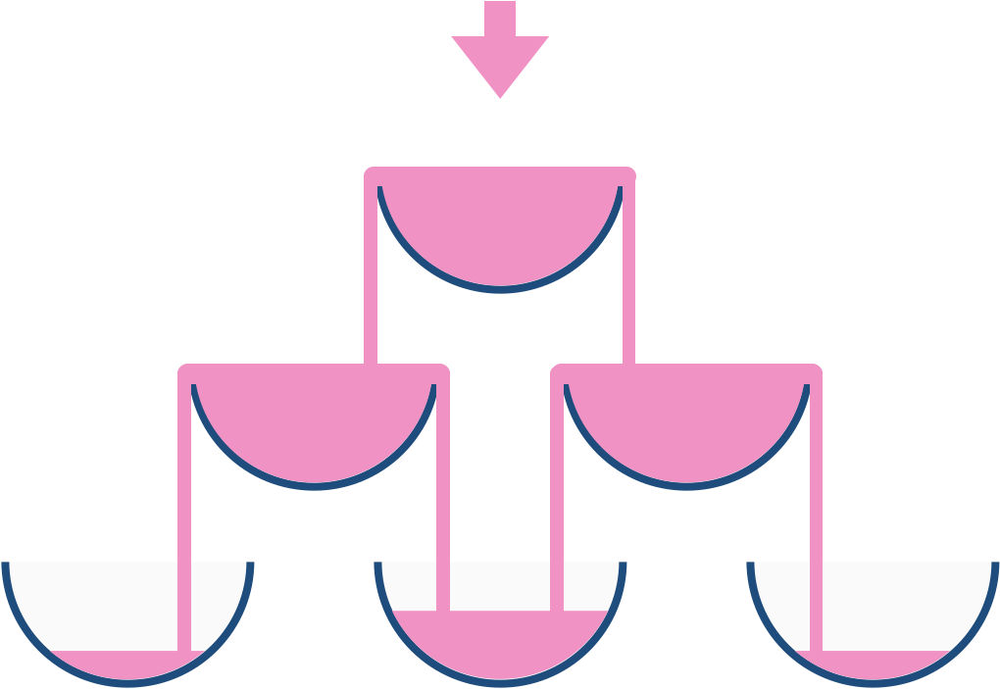

799. Champagne Tower

We stack glasses in a pyramid, where the first row has 1 glass, the second row has 2 glasses, and so on until the 100th row.  Each glass holds one cup (250ml) of champagne.

Then, some champagne is poured in the first glass at the top.  When the top most glass is full, any excess liquid poured will fall equally to the glass immediately to the left and right of it.  When those glasses become full, any excess champagne will fall equally to the left and right of those glasses, and so on.  (A glass at the bottom row has it's excess champagne fall on the floor.)

For example, after one cup of champagne is poured, the top most glass is full.  After two cups of champagne are poured, the two glasses on the second row are half full.  After three cups of champagne are poured, those two cups become full - there are 3 full glasses total now.  After four cups of champagne are poured, the third row has the middle glass half full, and the two outside glasses are a quarter full, as pictured below.



Now after pouring some non-negative integer cups of champagne, return how full the j-th glass in the i-th row is (both i and j are 0 indexed.)


**Example 1:**
```
Input: poured = 1, query_glass = 1, query_row = 1
Output: 0.0
Explanation: We poured 1 cup of champange to the top glass of the tower (which is indexed as (0, 0)). There will be no excess liquid so all the glasses under the top glass will remain 
empty.
```

**Example 2:**
```
Input: poured = 2, query_glass = 1, query_row = 1
Output: 0.5
Explanation: We poured 2 cups of champange to the top glass of the tower (which is indexed as (0, 0)). There is one cup of excess liquid. The glass indexed as (1, 0) and the glass indexed as (1, 1) will share the excess liquid equally, and each will get half cup of champange.
```

**Note:**

* `poured` will be in the range of `[0, 10 ^ 9]`.
* `query_glass` and `query_row` will be in the range of `[0, 99]`.

# Solution
---
## Approach #1: Simulation [Accepted]
**Intuition**

Instead of keeping track of how much champagne should end up in a glass, keep track of the total amount of champagne that flows through a glass. For example, if `poured = 10` cups are poured at the top, then the total flow-through of the top glass is `10`; the total flow-through of each glass in the second row is `4.5`, and so on.

**Algorithm**

In general, if a glass has flow-through `X`, then `Q = (X - 1.0) / 2.0` quantity of champagne will equally flow left and right. We can simulate the entire pour for `100` rows of glasses. A glass at `(r, c)` will have excess champagne flow towards `(r+1, c)` and `(r+1, c+1)`.

```python
class Solution(object):
    def champagneTower(self, poured, query_row, query_glass):
        A = [[0] * k for k in xrange(1, 102)]
        A[0][0] = poured
        for r in xrange(query_row + 1):
            for c in xrange(r+1):
                q = (A[r][c] - 1.0) / 2.0
                if q > 0:
                    A[r+1][c] += q
                    A[r+1][c+1] += q

        return min(1, A[query_row][query_glass])
```

**Complexity Analysis**

* Time Complexity: $O(R^2)$, where $R$ is the number of rows. As this is fixed, we can consider this complexity to be $O(1)$.

* Space Complexity: $O(R^2)$, or $O(1)$ by the reasoning above.

# Submissions
---
**Solution 1: (Simulation, DP Bottom-Up)**
```
Runtime: 172 ms
Memory Usage: 13.8 MB
```
```python
class Solution:
    def champagneTower(self, poured: int, query_row: int, query_glass: int) -> float:
        A = [[0] * k for k in range(1, 102)]
        A[0][0] = poured
        for r in range(query_row + 1):
            for c in range(r+1):
                q = (A[r][c] - 1.0) / 2.0
                if q > 0:
                    A[r+1][c] += q
                    A[r+1][c+1] += q

        return min(1, A[query_row][query_glass])
```

**Solution 2: (DP Top-Down)**
```
Runtime: 124 ms
Memory Usage: 16.7 MB
```
```python
class Solution:
    def champagneTower(self, poured: int, query_row: int, query_glass: int) -> float:
        excess = lambda x: max(0, x-1)
        
        @lru_cache(None)
        def f(i,j):
            if (i,j) == (0,0): return poured
            if j < 0 or j > i: return 0
            return (excess(f(i-1, j-1)) + excess(f(i-1, j))) / 2
        
        return min(f(query_row, query_glass),1)
```

**Solution 3: (DP Bottom-Up)**
```
Runtime: 20 ms
Memory Usage: 42.5 MB
```
```c++
class Solution {
public:
    double champagneTower(int poured, int query_row, int query_glass) {
        if(poured < 0 || query_row < 0 || query_glass < 0)
            return 0;
        vector<vector<double>> mp(query_row+1, vector<double>(query_row+1));
        mp[0][0] = poured;
        for(int i=0; i<query_row; i++){
            for(int j=0; j<=i; j++){
                if(mp[i][j] > 1){
                    double rem = mp[i][j] - 1;
                    mp[i+1][j] += rem/2.0;
                    mp[i+1][j+1] += rem/2.0;
                }
            }
        }
        return mp[query_row][query_glass] > 1 ? 1 : mp[query_row][query_glass];
    }
};
```