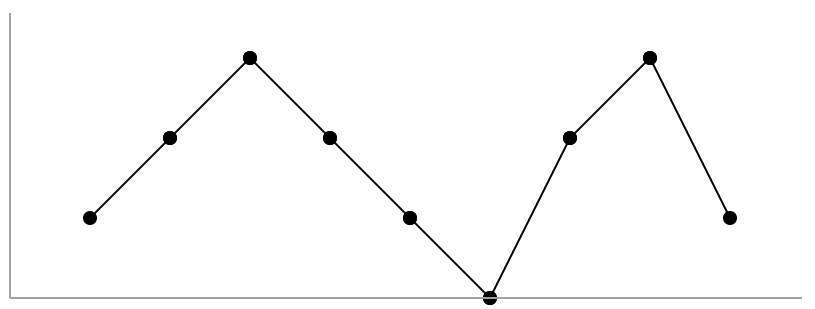

845. Longest Mountain in Array

Let's call any (contiguous) subarray B (of A) a mountain if the following properties hold:

* `B.length >= 3`
* There exists some `0 < i < B.length - 1` such that `B[0] < B[1] < ... B[i-1] < B[i] > B[i+1] > ... > B[B.length - 1]`

(Note that B could be any subarray of A, including the entire array A.)

Given an array A of integers, return the length of the longest mountain. 

Return `0` if there is no mountain.

**Example 1:**
```
Input: [2,1,4,7,3,2,5]
Output: 5
Explanation: The largest mountain is [1,4,7,3,2] which has length 5.
```

**Example 2:**
```
Input: [2,2,2]
Output: 0
Explanation: There is no mountain.
```

**Note:**

* `0 <= A.length <= 10000`
* `0 <= A[i] <= 10000`

**Follow up:**

* Can you solve it using only one pass?
* Can you solve it in O(1) space?

# Solutions
---
## Approach #1: Two Pointer [Accepted]
**Intuition**

Without loss of generality, a mountain can only start after the previous one ends.

This is because if it starts before the peak, it will be smaller than a mountain starting previous; and it is impossible to start after the peak.

**Algorithm**

For a starting index base, let's calculate the length of the longest mountain `A[base], A[base+1], ..., A[end]`.

If such a mountain existed, the next possible mountain will start at `base = end`; if it didn't, then either we reached the `end`, or we have `A[base] > A[base+1]` and we can start at `base + 1`.

**Example**

Here is a worked example on the array `A = [1, 2, 3, 2, 1, 0, 2, 3, 1]`:



`base` starts at `0`, and end travels using the first while loop to `end = 2 (A[end] = 3)`, the potential peak of this mountain. After, it travels to `end = 5 (A[end] = 0)` during the second while loop, and a candidate answer of `6 (base = 0, end = 5`) is recorded.

Afterwards, `base` is set to `5` and the process starts over again, with `end = 7` the peak of the mountain, and `end = 8` the right boundary, and the candidate answer of `4 (base = 5, end = 8)` being recorded.

```python
class Solution(object):
    def longestMountain(self, A):
        N = len(A)
        ans = base = 0

        while base < N:
            end = base
            if end + 1 < N and A[end] < A[end + 1]: #if base is a left-boundary
                #set end to the peak of this potential mountain
                while end+1 < N and A[end] < A[end+1]:
                    end += 1

                if end + 1 < N and A[end] > A[end + 1]: #if end is really a peak..
                    #set 'end' to right-boundary of mountain
                    while end+1 < N and A[end] > A[end+1]:
                        end += 1
                    #record candidate answer
                    ans = max(ans, end - base + 1)

            base = max(end, base + 1)

        return ans
```

**Complexity Analysis**

* Time Complexity: $O(N)$, where $N$ is the length of `A`.

* Space Complexity: $O(1)$.

# Submissions
---
**Solution: (Two Pointers, step by step sliding and check max)**
```
Runtime: 260 ms
Memory Usage: 13.6 MB
```
```python
class Solution:
    def longestMountain(self, A: List[int]) -> int:
        N = len(A)
        ans = base = 0

        while base < N:
            end = base
            if end + 1 < N and A[end] < A[end + 1]: #if base is a left-boundary
                #set end to the peak of this potential mountain
                while end+1 < N and A[end] < A[end+1]:
                    end += 1

                if end + 1 < N and A[end] > A[end + 1]: #if end is really a peak..
                    #set 'end' to right-boundary of mountain
                    while end+1 < N and A[end] > A[end+1]:
                        end += 1
                    #record candidate answer
                    ans = max(ans, end - base + 1)

            base = max(end, base + 1)

        return ans
```

**Solution 2: (Case study)**
```
Runtime: 144 ms
Memory Usage: 15 MB
```
```python
class Solution:
    def longestMountain(self, A: List[int]) -> int:
        sub, state = 0, 0
        ans = 0
        for j in range(1, len(A)):
            if A[j] > A[j-1]:
                if state == 0:
                    state = 1
                    sub = 2
                elif state == 1:
                    sub += 1
                elif state == 2:
                    ans = max(ans, sub)
                    state = 1
                    sub = 2
            elif A[j] < A[j-1]:
                if state > 0:
                    state = 2
                    sub += 1
            else:
                if state == 2:
                    ans = max(ans, sub)
                state = 0
        if state == 2:
            ans = max(ans, sub)
        
        return ans
```