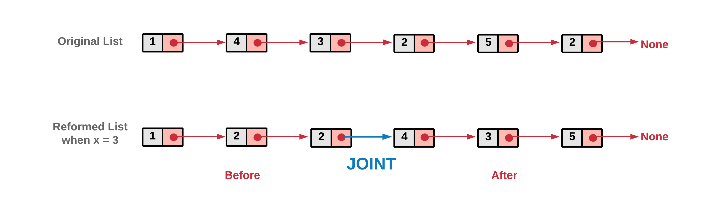
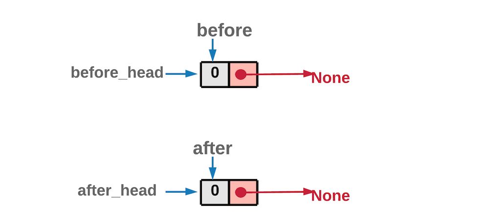
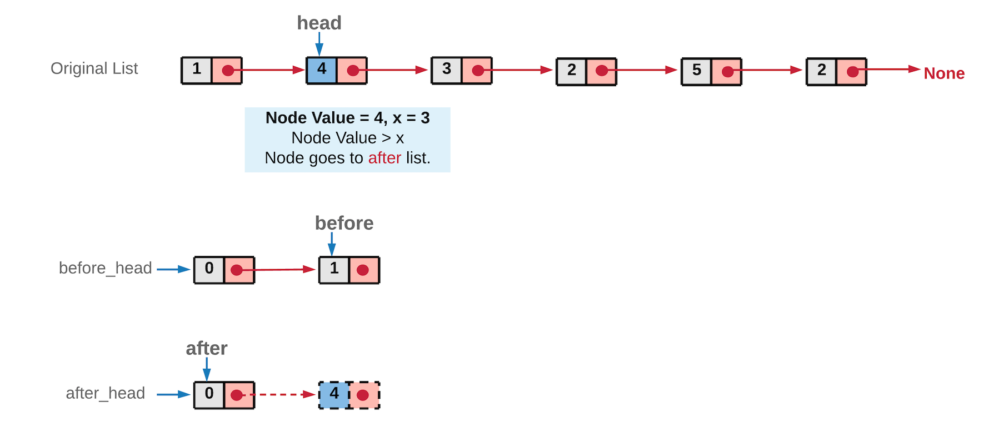
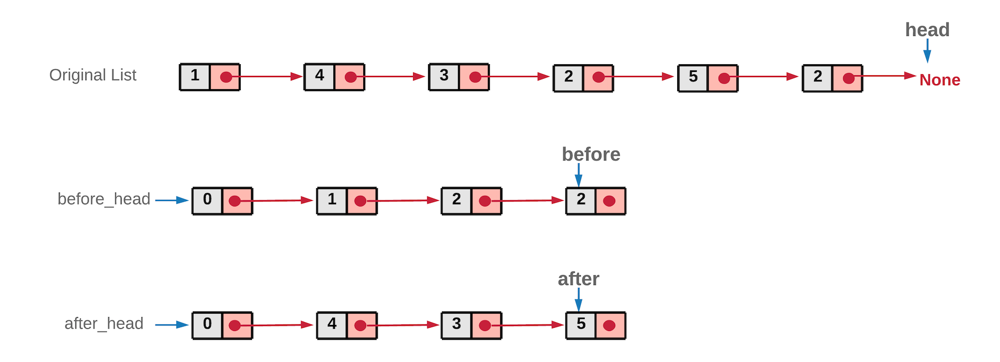

86. Partition List

Given a linked list and a value x, partition it such that all nodes less than x come before nodes greater than or equal to x.

You should preserve the original relative order of the nodes in each of the two partitions.

**Example:**
```
Input: head = 1->4->3->2->5->2, x = 3
Output: 1->2->2->4->3->5
```

# Solution
---
The problem wants us to reform the linked list structure, such that the elements lesser that a certain value x, come before the elements greater or equal to x. This essentially means in this reformed list, there would be a point in the linked list before which all the elements would be smaller than x and after which all the elements would be greater or equal to x. Let's call this point as the JOINT.



Reverse engineering the question tells us that if we break the reformed list at the JOINT, we will get two smaller linked lists, one with lesser elements and the other with elements greater or equal to x. In the solution, our main aim is to create these two linked lists and join them.

## Approach 1: Two Pointer Approach, 44 ms, 13.6 MB

**Intuition**

We can take two pointers before and after to keep track of the two linked lists as described above. These two pointers could be used two create two separate lists and then these lists could be combined to form the desired reformed list.

**Algorithm**

1. Initialize two pointers before and after. In the implementation we have initialized these two with a dummy ListNode. This helps to reduce the number of conditional checks we would need otherwise. You can try an implementation where you don't initialize with a dummy node and see it yourself!

1. Iterate the original linked list, using the head pointer.
1. If the node's value pointed by head is lesser than x, the node should be part of the before list. So we move it to before list.

1. Else, the node should be part of after list. So we move it to after list.

1. Once we are done with all the nodes in the original linked list, we would have two list before and after. The original list nodes are either part of before list or after list, depending on its value.

Note: Since we traverse the original linked list from left to right, at no point would the order of nodes change relatively in the two lists. Another important thing to note here is that we show the original linked list intact in the above diagrams. However, in the implementation, we remove the nodes from the original linked list and attach them in the before or after list. We don't utilize any additional space. We simply move the nodes from the original list around.
1. Now, these two lists before and after can be combined to form the reformed list.


We did a dummy node initialization at the start to make implementation easier, you don't want that to be part of the returned list, hence just move ahead one node in both the lists while combining the two list. Since both before and after have an extra node at the front.

```python
# Definition for singly-linked list.
# class ListNode:
#     def __init__(self, x):
#         self.val = x
#         self.next = None

class Solution:
    def partition(self, head: ListNode, x: int) -> ListNode:
        # before and after are the two pointers used to create two list
        # before_head and after_head are used to save the heads of the two lists.
        # All of these are initialized with the dummy nodes created.
        before = before_head = ListNode(0)
        after = after_head = ListNode(0)

        while head:
            # If the original list node is lesser than the given x,
            # assign it to the before list.
            if head.val < x:
                before.next = head
                before = before.next
            else:
                # If the original list node is greater or equal to the given x,
                # assign it to the after list.
                after.next = head
                after = after.next

            # move ahead in the original list
            head = head.next

        # Last node of "after" list would also be ending node of the reformed list
        after.next = None
        # Once all the nodes are correctly assigned to the two lists,
        # combine them to form a single list which would be returned.
        before.next = after_head.next

        return before_head.next
```

**Complexity Analysis**

* Time Complexity: $O(N)$, where $N$ is the number of nodes in the original linked list and we iterate the original list.
* Space Complexity: $O(1)$, we have not utilized any extra space, the point to note is that we are reforming the original list, by moving the original nodes, we have not used any extra space as such.

# Submissions
---
**Solution 1: (Two Pointer)**
```
Runtime: 52 ms
Memory Usage: 12.6 MB
```
```python
# Definition for singly-linked list.
# class ListNode:
#     def __init__(self, x):
#         self.val = x
#         self.next = None

class Solution:
    def partition(self, head: ListNode, x: int) -> ListNode:
        
        # before and after are the two pointers used to create two list
        # before_head and after_head are used to save the heads of the two lists.
        # All of these are initialized with the dummy nodes created.
        before = before_head = ListNode(0)
        after = after_head = ListNode(0)

        while head:
            # If the original list node is lesser than the given x,
            # assign it to the before list.
            if head.val < x:
                before.next = head
                before = before.next
            else:
                # If the original list node is greater or equal to the given x,
                # assign it to the after list.
                after.next = head
                after = after.next

            # move ahead in the original list
            head = head.next

        # Last node of "after" list would also be ending node of the reformed list
        after.next = None
        # Once all the nodes are correctly assigned to the two lists,
        # combine them to form a single list which would be returned.
        before.next = after_head.next

        return before_head.next
```