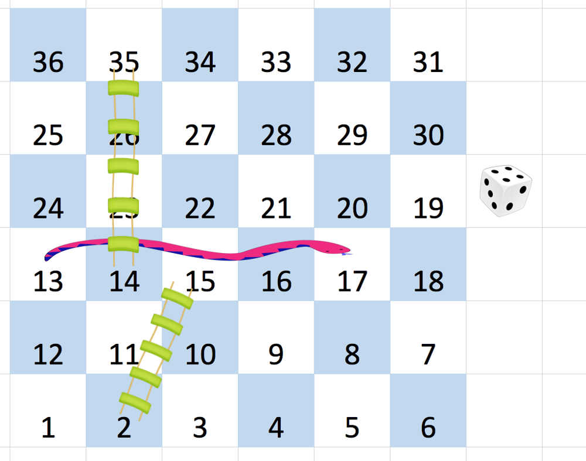

909. Snakes and Ladders

On an N x N `board`, the numbers from `1` to N*N are written boustrophedonically **starting from the bottom left of the board**, and alternating direction each row.  For example, for a 6 x 6 board, the numbers are written as follows:



You start on square `1` of the board (which is always in the last row and first column).  Each move, starting from square `x`, consists of the following:

* You choose a destination square `S` with number `x+1`, `x+2`, `x+3`, `x+4`, `x+5`, or `x+6`, provided this number is `<= N*N`.
    * (This choice simulates the result of a standard 6-sided die roll: ie., there are always **at most 6 destinations, regardless of the size of the board.**)
* If `S` has a snake or ladder, you move to the destination of that snake or ladder.  Otherwise, you move to `S`.

A board square on row `r` and column `c` has a "snake or ladder" if `board[r][c] != -1`.  The destination of that snake or ladder is `board[r][c]`.

Note that you only take a snake or ladder at most once per move: if the destination to a snake or ladder is the start of another snake or ladder, you do **not** continue moving.  (For example, if the board is `[[4,-1],[-1,3]]`, and on the first move your destination square is `2`, then you finish your first move at `3`, because you do **not** continue moving to `4`.)

Return the least number of moves required to reach square N*N.  If it is not possible, return `-1`.

**Example 1:**
```
Input: [
[-1,-1,-1,-1,-1,-1],
[-1,-1,-1,-1,-1,-1],
[-1,-1,-1,-1,-1,-1],
[-1,35,-1,-1,13,-1],
[-1,-1,-1,-1,-1,-1],
[-1,15,-1,-1,-1,-1]]
Output: 4
Explanation: 
At the beginning, you start at square 1 [at row 5, column 0].
You decide to move to square 2, and must take the ladder to square 15.
You then decide to move to square 17 (row 3, column 5), and must take the snake to square 13.
You then decide to move to square 14, and must take the ladder to square 35.
You then decide to move to square 36, ending the game.
It can be shown that you need at least 4 moves to reach the N*N-th square, so the answer is 4.
```

**Note:**

* `2 <= board.length = board[0].length <= 20`
* `board[i][j]` is between `1` and `N*N` or is equal to `-1`.
* The board square with number `1` has no snake or ladder.
* The board square with number `N*N` has no snake or ladder.

# Solution
---
## Approach 1: Breadth-First Search
**Intuition**

As we are looking for a shortest path, a breadth-first search is ideal. The main difficulty is to handle enumerating all possible moves from each square.

**Algorithm**

Suppose we are on a square with number `s`. We would like to know all final destinations with number `s2` after making one move.

This requires knowing the coordinates `get(s2)` of square `s2`. This is a small puzzle in itself: we know that the row changes every `N` squares, and so is only based on `quot = (s2-1) / N`; also the column is only based on `rem = (s2-1) % N` and what row we are on (forwards or backwards.)

From there, we perform a breadth first search, where the nodes are the square numbers s.

```python
class Solution(object):
    def snakesAndLadders(self, board):
        N = len(board)

        def get(s):
            # Given a square num s, return board coordinates (r, c)
            quot, rem = divmod(s-1, N)
            row = N - 1 - quot
            col = rem if row%2 != N%2 else N - 1 - rem
            return row, col

        dist = {1: 0}
        queue = collections.deque([1])
        while queue:
            s = queue.popleft()
            if s == N*N: return dist[s]
            for s2 in xrange(s+1, min(s+6, N*N) + 1):
                r, c = get(s2)
                if board[r][c] != -1:
                    s2 = board[r][c]
                if s2 not in dist:
                    dist[s2] = dist[s] + 1
                    queue.append(s2)
        return -1
```

**Complexity Analysis**

* Time Complexity: $O(N^2)$, where $N$ is the length of the `board`.

* Space Complexity: $O(N^2)$.

# Submissions
---
**Solution 1: (BFS)**
```
Runtime: 144 ms
Memory Usage: 12.8 MB
```
```python
class Solution:
    def snakesAndLadders(self, board: List[List[int]]) -> int:
        N = len(board)

        def get(s):
            # Given a square num s, return board coordinates (r, c)
            quot, rem = divmod(s-1, N)
            row = N - 1 - quot
            col = rem if row%2 != N%2 else N - 1 - rem
            return row, col

        dist = {1: 0}
        queue = collections.deque([1])
        while queue:
            s = queue.popleft()
            if s == N*N: return dist[s]
            for s2 in range(s+1, min(s+6, N*N) + 1):
                r, c = get(s2)
                if board[r][c] != -1:
                    s2 = board[r][c]
                if s2 not in dist:
                    dist[s2] = dist[s] + 1
                    queue.append(s2)
        return -1
```

**Solution 2: (BFS)**
```
Runtime: 31 ms
Memory Usage: 13.9 MB
```
```c++
class Solution {
public:
    int snakesAndLadders(vector<vector<int>>& board) {
        int sz = board.size(); int target = sz * sz ;
        unordered_map<int, int> moves; 
        moves[1] = 0; // Zero(No) moves when we are in square 1
        queue<int> q ; q.push(1); //BFS method
        
        while(!q.empty())
        {
            int current_sq = q.front(); q.pop();
            
            for(int i=1; i<=6; i++)
            {
                int next_sq = current_sq + i ; 
                if(next_sq > target){break;}
                
                int row = (next_sq - 1)/sz ;
                int col = (row % 2 == 0) ? (next_sq - 1) % sz : sz - 1 - ((next_sq-1) % sz)  ;
                
                if(board[sz-1-row][col] != -1)
                {
                    next_sq = board[sz-1-row][col] ;
                }
                if(moves.count(next_sq) == 0)
                {
                    moves[next_sq] = moves[current_sq] + 1;
                    if(next_sq == target){return moves[next_sq];}
                    q.push(next_sq);
                }
            }
        }
        
        return -1 ;
    }
};
```

**Solution 3: (Breadth-first search, Time: O(N^2), Space: O(N^2))**
```
Runtime: 130 ms
Memory: 13.8 MB
```
```python
class Solution:
    def snakesAndLadders(self, board: List[List[int]]) -> int:
        n = len(board)
        cells = [None] * (n**2 + 1)
        label = 1
        columns = list(range(0, n))
        for row in range(n - 1, -1, -1):
            for column in columns:
                cells[label] = (row, column)
                label += 1
            columns.reverse()
        dist = [-1] * (n * n + 1)
        q = deque([1])
        dist[1] = 0
        while q:
            curr = q.popleft()
            for next in range(curr + 1, min(curr + 6, n**2) + 1):
                row, column = cells[next]
                destination = (board[row][column] if board[row][column] != -1
                               else next)
                if dist[destination] == -1:
                    dist[destination] = dist[curr] + 1
                    q.append(destination)
        return dist[n * n]
```

**Solution 4: (Dijkstra's algorithm, Time: O(N^2 * log(N)), Space: O(N^2))**
```
Runtime: 349 ms
Memory: 14 MB
```
```python
class Solution:
    def snakesAndLadders(self, board: List[List[int]]) -> int:
        n = len(board)
        cells = [None] * (n**2 + 1)
        label = 1
        columns = list(range(0, n))
        for row in range(n - 1, -1, -1):
            for column in columns:
                cells[label] = (row, column)
                label += 1
            columns.reverse()
        dist = [-1] * (n * n + 1)
        dist[1] = 0
        q = [(0, 1)]
        while q:
            d, curr = heapq.heappop(q)
            if d != dist[curr]:
                continue
            for next in range(curr + 1, min(curr + 6, n**2) + 1):
                row, column = cells[next]
                destination = (board[row][column] if board[row][column] != -1
                               else next)
                if dist[destination] == -1 or dist[curr] + 1 < dist[destination]:
                    dist[destination] = dist[curr] + 1
                    heapq.heappush(q, (dist[destination], destination))
        return dist[n * n]
```

**Solution 5: (BFS)**
```
Runtime: 144 ms
Memory: 13.9 MB
```
```python
class Solution:
    def snakesAndLadders(self, board: List[List[int]]) -> int:
        N = len(board)
        q = collections.deque([1])
        board[N-1][0] = -2
        ans = 0
        while q:
            sz = len(q)
            for _ in range(sz):
                cur = q.popleft()
                if cur == N**2:
                    return ans
                for ncur in range(cur+1, min(cur+7, N**2+1)):
                    nr, nc = divmod(ncur-1, N)
                    nr = N-1-nr
                    if (N-1-nr)%2:
                        nc = N-1-nc
                    if board[nr][nc] > 0:
                        ncur = board[nr][nc]
                    if board[nr][nc] != -2:
                        q += [ncur]
                        board[nr][nc] = -2
            ans += 1
        return -1
```

**Solution 6: (BFS)**

    22 
    r = 6 - 1 - (22-1)/6 = 2
    d = (6 - 1 - r)%2 = 1
    c = 6-1 - ((22-1)%6 = 3)

```
Runtime: 0 ms, Beats 100.00%
Memory: 16.84 MB, Beats 70.36%
```
```c++
class Solution {
    pair<int,int> getrc(int ncur, int n) {
        int nr, nc, nd;
        nr = n - 1 - (ncur - 1)/n;
        nd = (n - 1 - nr)%2;
        if (nd) {
            nc = n - 1 - (ncur - 1)%n;
        } else {
            nc = (ncur - 1)%n;
        }
        return {nr, nc};
    }
public:
    int snakesAndLadders(vector<vector<int>>& board) {
        int n = board.size(), a, ncur;
        queue<pair<int,int>> q;
        vector<int> visited(n*n);
        q.push({1, 0});
        visited[0] = 1;
        while (q.size()) {
            auto [cur, s] = q.front();
            q.pop();
            if (cur == n*n) {
                return s;
            }
            auto [r, c] = getrc(cur, n);
            for (a = 1; a <= 6; a ++) {
                ncur = cur + a;
                if (ncur > n*n) {
                    break;
                }
                auto [nr, nc] = getrc(ncur, n);
                if (board[nr][nc] != -1) {
                    ncur = board[nr][nc];
                }
                if (!visited[ncur - 1]) {
                    visited[ncur - 1] = 1;
                    q.push({ncur, s+1});
                }
            }
        }
        return -1;
    }
};
```
