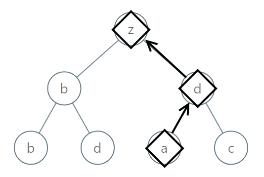

988. Smallest String Starting From Leaf

Given the root of a binary tree, each node has a value from `0` to `25` representing the letters `'a'` to `'z'`: a value of `0` represents `'a'`, a value of `1` represents `'b'`, and so on.

Find the lexicographically smallest string that starts at a leaf of this tree and ends at the root.

(As a reminder, any shorter prefix of a string is lexicographically smaller: for example, `"ab"` is lexicographically smaller than `"aba"`.  A leaf of a node is a node that has no children.)

 

**Example 1:**


```
Input: [0,1,2,3,4,3,4]
Output: "dba"
```

**Example 2:**


```
Input: [25,1,3,1,3,0,2]
Output: "adz"
```

**Example 3:**


```
Input: [2,2,1,null,1,0,null,0]
Output: "abc"
```

**Note:**

* The number of nodes in the given tree will be between `1` and `8500`.
* Each node in the tree will have a value between `0` and `25`.

# Solution
---
## Approach 1: Brute Force
**Intuition**

Let's create every possible string - then we can compare them and choose the best one.

**Algorithm**

In our depth first search, we will maintain `sb` (or `A` in Python), the contents of a path from the root to this node.

When we reach a leaf, we will reverse this path to create a candidate answer. If it is better than our current answer, we'll update our answer.

```python
class Solution(object):
    def smallestFromLeaf(self, root):
        self.ans = "~"

        def dfs(node, A):
            if node:
                A.append(chr(node.val + ord('a')))
                if not node.left and not node.right:
                    self.ans = min(self.ans, "".join(reversed(A)))

                dfs(node.left, A)
                dfs(node.right, A)
                A.pop()

        dfs(root, [])
        return self.ans
```

**Complexity Analysis**

* Time Complexity: We use $O(N)$ to traverse the array and maintain `A` [Python] or `sb`. Then, our reversal and comparison with the previous answer is $O(L)$, where $L$ is the size of the string we have when at the leaf. For example, for a perfectly balanced tree, $L = \log N$ and the time complexity would be $O(N \log N)$.

* Space Complexity: $O(N)$.

# Submissions
---
**Solution 1:**
```
Runtime: 44 ms
Memory Usage: 14.2 MB
```
```python
# Definition for a binary tree node.
# class TreeNode:
#     def __init__(self, x):
#         self.val = x
#         self.left = None
#         self.right = None

class Solution:
    def smallestFromLeaf(self, root: TreeNode) -> str:
        self.ans = []
        def dfs(node, path):
            if not node:
                return
            if not node.left and not node.right:
                self.ans.append((path + [node.val])[::-1])
                return
            dfs(node.left, path + [node.val])
            dfs(node.right, path + [node.val])
            
        dfs(root,[])
        self.ans = sorted(self.ans)[0]
        self.ans = ''.join(map(lambda x: chr(ord('a') + x), self.ans))
        return self.ans
```

**Solution 2: (DFS)**
```
Runtime: 11 ms
Memory: 20.35 MB
```
```c++
/**
 * Definition for a binary tree node.
 * struct TreeNode {
 *     int val;
 *     TreeNode *left;
 *     TreeNode *right;
 *     TreeNode() : val(0), left(nullptr), right(nullptr) {}
 *     TreeNode(int x) : val(x), left(nullptr), right(nullptr) {}
 *     TreeNode(int x, TreeNode *left, TreeNode *right) : val(x), left(left), right(right) {}
 * };
 */
class Solution {
     string smallestString;

    // Helper function to find the lexicographically smallest string
    void dfs(TreeNode* root, string currentString) {

        // If the current node is NULL, return
        if (!root) {
            return;
        }

        // Construct the current string by appending 
        // the character corresponding to the node's value
        currentString = char(root->val + 'a') + currentString; 

        // If the current node is a leaf node
        if (!root->left && !root->right) { 
            
            // If the current string is smaller than the result 
            // or if the result is empty
            if (smallestString == "" || smallestString > currentString) { 
                smallestString = currentString;
            }
        }

        // Recursively traverse the left subtree
        if (root->left) {
            dfs(root->left, currentString);
        }

        // Recursively traverse the right subtree
        if (root->right) {
            dfs(root->right, currentString);
        }
    }
public:
    string smallestFromLeaf(TreeNode* root) {
        dfs(root, "");
        return smallestString;
    }
};
```

**Solution 3: (BFS)**
```
Runtime: 8 ms
Memory: 20.31 MB
```
```c++
/**
 * Definition for a binary tree node.
 * struct TreeNode {
 *     int val;
 *     TreeNode *left;
 *     TreeNode *right;
 *     TreeNode() : val(0), left(nullptr), right(nullptr) {}
 *     TreeNode(int x) : val(x), left(nullptr), right(nullptr) {}
 *     TreeNode(int x, TreeNode *left, TreeNode *right) : val(x), left(left), right(right) {}
 * };
 */
class Solution {
public:
    string smallestFromLeaf(TreeNode* root) {
        string smallestString = "";
        queue<pair<TreeNode*, string>> nodeQueue;

        // Add root node to queue along with its value converted to a character
        nodeQueue.push({root, string(1, root->val + 'a')});

        // Perform BFS traversal until queue is empty
        while (!nodeQueue.empty()) {

            // Pop the leftmost node and its corresponding string from queue
            auto[node, currentString] = nodeQueue.front();
            nodeQueue.pop();

            // If current node is a leaf node
            if (!node->left && !node->right) {

                // Update smallest_string if it's empty or current string is smaller
                if (smallestString.empty()) {
                    smallestString = currentString;
                } else {
                    smallestString = min(smallestString, currentString);
                }
            }

            // If current node has a left child, append it to queue
            if (node->left) {
                nodeQueue.push({node->left, char(node->left->val + 'a') + currentString});
            }

            // If current node has a right child, append it to queue
            if (node->right) {
                nodeQueue.push({node->right, char(node->right->val + 'a') + currentString});
            }
        }

        return smallestString;
    }
};
```
